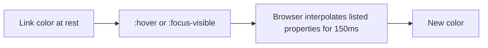

# Month 2 · Week 4 · Day 5
# Motion, Tests, Documentation

**Month index:** [../../README.md](../../README.md)  
**Week 4:** [1](day-01.md) · [2](day-02.md) · [3](day-03.md) · [4](day-04.md) · Day 5 (today) · [6](day-06.md) · [7](day-07.md)  
**Week rhythm today:** Tests + refactor + documentation  
**Study time:** 3–4 focused hours  
**Student state:** You have Flex, Grid, and mobile-first media queries. Today you add a **motion policy**, then prove the layout at four widths with claims that can fail — the same family of claims Project 1 will face.

This textbook will not give you the portfolio source.

---

## How to read this chapter

Motion is optional decoration. Tests are not. Read the transition / reduced-motion theory until you can explain why `transition: all` and a looping bounce are refused. Then fill `TESTS.md` from a **real page** (gallery + Day 4 responsive work, or whichever page you will keep). Then write a README that tells a stranger how to set 375px in DevTools.

If you do not animate, R6 still has an answer: “no animation; reduced-motion block still present / not applicable — I chose none.” Honesty is a pass. A bounce with no query is a fail.



Serve over **HTTP**, not `file://`. Device mode on `file://` is not this course’s workflow. On Windows: `python -m http.server 5500` from `~\fullstack-lab`.

---

## Theory (complete) — transitions, animation, reduced motion

Motion on a page is CSS changing a property over time. It is optional decoration. Project 1 does not need a bouncing logo. If you animate, you must respect people who asked the OS for **less motion** (vestibular disorders, migraine, preference).

### Transitions

A **transition** interpolates a property when it **changes** (hover, focus, a class toggle later in JS).

```css
a {
  color: var(--accent);
  transition: color 150ms ease, background-color 150ms ease;
}

a:hover {
  color: var(--accent-dark);
}
```

- **What:** list the properties. `transition: all` is lazy and can animate layout accidentally.
- **How long:** 100–200ms for color/opacity; longer feels sluggish for UI chrome.
- **Easing:** `ease`, `ease-in-out`, `linear`. You do not need custom cubic-beziers this month.

**Do not transition `width`, `height`, `top`, or `left` if `transform` or `opacity` will do.** Layout properties force the browser to recalculate layout every frame (expensive and janky). `transform: translateY(-2px)` on hover is the honest “lift.”

### Keyframe animations

`@keyframes` names a sequence; `animation` applies it.

```css
@keyframes fade-in {
  from { opacity: 0; }
  to { opacity: 1; }
}

.hero-title {
  animation: fade-in 400ms ease both;
}
```

One simple fade or a modest `translateY` is enough. **Do not** autoplay large motion on page load (sliding entire pages, looping zooms). That fails reduced-motion and looks amateur.

### `prefers-reduced-motion`

This is a **media query** about an OS setting, not about viewport width.

```css
@media (prefers-reduced-motion: reduce) {
  *,
  *::before,
  *::after {
    animation-duration: 0.01ms !important;
    animation-iteration-count: 1 !important;
    transition-duration: 0.01ms !important;
  }
}
```

`!important` here is a **known exception**: you are protecting users even if some component set a long animation. You still do not use `!important` to win color fights.

How to test: in Windows, Settings → Accessibility → Visual effects → Animation effects off (wording varies), or in DevTools Rendering → emulate `prefers-reduced-motion: reduce`. Your motion should collapse to essentially instant.

**Wrong belief:** “A little bounce is fine for everyone.”  
**Correct:** you cannot see other people’s vestibular systems. Query the preference.

The next sections unpack motion so you can write a policy in the README, then treat R1–R8 as science.

### What a transition is, in one picture

If you did not list `color` in `transition`, the color still **changes** — instantly. The transition only affects properties you named. That is why `transition: all` is lazy: it also interpolates `margin`, `font-size`, and anything else that changed, which can make the page crawl.

**Worked example — allowed vs refused**

Allowed:

```css
.card:hover {
  transform: translateY(-2px);
}
.card {
  transition: transform 150ms ease;
}
```

Refused:

```css
.card:hover {
  height: 28rem; /* animating layout */
}
.logo {
  animation: bounce 800ms infinite; /* looping motion, no reduced-motion path */
}
```

If you add the card lift, you **must** add the `prefers-reduced-motion` block so that lift becomes instant (or you set `transform: none` inside the query). Instant is fine. Looping bounce is not.

### How reduced-motion joins the cascade

`(prefers-reduced-motion: reduce)` is true when the user (or DevTools emulation) asked for less motion. Its rules **join** the cascade like any other media query. Specificity still applies — that is why the course snippet uses `!important` on durations: to beat a component that set `animation: 2s`. This is the **only** `!important` habit this month, alongside that exception. It is not permission to `!important` your nav color.

On Windows you can also turn animation effects off at the OS level. DevTools is faster for a lab: Rendering (or “Show rendering”) → emulate CSS `prefers-reduced-motion: reduce`. Reload or re-hover. Motion should die.

**Wrong belief:** “`transition: all 0.3s` is professional.”  
**Correct:** list the properties. `all` animates layout by accident.

---

## What we are testing (responsive + motion)

A responsive page **fails** if any of these are true:

- Horizontal scroll at **375px** (a child wider than the viewport: fixed px, image without `max-width: 100%`, flex `min-width: auto` overflow).
- Overlap or unreadable columns at 768 / 1024 / ~1400.
- Nav links unreachable by keyboard (hidden with `display: none` and no replacement).
- Images blowing the layout.
- Flex used for a 2D card grid, or Grid used only to space a 1D nav — wrong tool.
- Animation with no reduced-motion path.
- Missing focus rings.
- A CSS framework (Bootstrap/Tailwind/utility paste) doing the layout for you.

README: how to test viewports (DevTools device mode, or drag the window). List the four widths.

### How to run a viewport test (Windows, Chrome or Edge)

1. Serve the folder over **HTTP**. Device mode is unreliable on `file://` for some checks; this course already forbade `file://`.
2. Open DevTools (`F12`). Toggle device toolbar (`Ctrl+Shift+M`).
3. Set width to **375**, reload, look for a **horizontal** scrollbar on the page (not inside a small `overflow: auto` box you meant to have).
4. Repeat **768**, **1024**, **1400** (or ~1400 by dragging).
5. Tab the nav at 375. Every link must be reachable. `flex-wrap` is the course pattern. `display: none` on the nav without a real `button` menu is a fail.

If you see horizontal scroll, the usual culprits are:

| Symptom | Likely cause |
|---|---|
| Image sticks out | missing `max-width: 100%; height: auto; display: block` |
| Card grid sticks out | three `1fr` columns with min-content too wide; need fewer columns in the default CSS |
| Nav sticks out | `nowrap` flex; add `flex-wrap` or let links wrap |
| Random wide box | fixed `width: 900px` or a preformatted line |

**Wrong belief:** “It looks fine on my maximized window, so it is responsive.”  
**Correct:** responsive is a **checklist of widths**. R1 is 375px, not “whatever my laptop is.”

### R5 — the tool test

Open the CSS. The **nav** (or header row) should contain `display: flex`. The **card catalog** should contain `display: grid` (and `grid-template-columns` that change with `min-width` queries if you already did Day 4). If the six cards are `display: flex; flex-wrap: wrap` on the parent, R5 fails — that is a 2D problem wearing a 1D tool.

### R8 — no framework

Search for `bootstrap`, `tailwind`, `cdn.jsdelivr`, `@apply`, a pasted utility soup. If the layout exists only because of a framework, the page fails this course even if it looks expensive.

### Motion policy in the README (even if you chose none)

Write three sentences:

1. Whether the page animates anything (hover color, card lift, none).
2. How a classmate emulates `prefers-reduced-motion: reduce` in DevTools.
3. What they should observe (instant color change / no bounce).

That is R6’s documentation. A missing paragraph plus a looping logo is a fail.

---

## Office hours — overflow hunts, `transition: all`, missing reduced motion

### R1 FAIL and you cannot find the child

In DevTools, inspect `body`, then walk children watching the box-model width. A width larger than 375 is the offender. Also try: delete images temporarily; if scroll dies, it was an image. Try `min-width: 0` on `.card`. Try changing the default grid to `1fr` only (one column) and putting two/three columns **inside** `min-width` queries — that is Day 4’s mobile-first fix, and it is allowed as a test repair today.

Do not “pass” R1 with `overflow-x: hidden` on `body`. That clips focus and hides the bug. Project 1 will still overflow on a real phone.

### You animated height

```css
/* WRONG */
.card { transition: all 300ms ease; }
.card:hover { height: 24rem; }
```

Layout animation plus `all`. Replace with `transform` and listed properties, or remove the motion. Then add the reduced-motion block if anything still interpolates.

### Reduced-motion block missing

Grep `prefers-reduced-motion`. If you have `@keyframes` or `transition` and no query, R6 fails. Paste the course snippet. Emulate reduce. Hover again. Duration should be ~0.

On Windows DevTools: `F12` → more tools → **Rendering** → emulate CSS media `prefers-reduced-motion: reduce`. The OS path (Settings → Accessibility → Visual effects) is slower but proves the real preference.

### Focus vanished while you “cleaned up”

Search `outline`. If you see `outline: none` without a `:focus-visible` replacement, R7 fails. Restore:

```css
a:focus-visible,
button:focus-visible {
  outline: 2px solid var(--accent);
  outline-offset: 2px;
}
```

Tab from the address bar. You must see the ring on links and on the submit control if the page has a form.

**Wrong belief:** “I’ll test 375 later on my phone.”  
**Correct:** device mode today is the claim. A phone later is extra. R1 is 375 in DevTools over HTTP.

### Image rule you can type once

```css
img {
  max-width: 100%;
  height: auto;
  display: block;
}
```

R4 is this rule **and** no huge fixed `width` on a wrapper that still overflows. HTML `width`/`height` attributes remain for aspect-ratio hints. Decorative `alt=""` did not expire.

### README viewport section (shape, fill with your URL)

```markdown
## How to test viewports (Windows)

1. `cd ~\fullstack-lab` then `python -m http.server 5500`
2. Open http://127.0.0.1:5500/month-02/week-04/... (your file)
3. Edge or Chrome: F12, Ctrl+Shift+M
4. Widths: 375, 768, 1024, 1400 — look for horizontal scroll
5. At 375, Tab every nav link (flex-wrap; no display:none)

## Motion
(none / link color 150ms). Emulate prefers-reduced-motion: reduce in Rendering. Observe instant change.
```

A classmate should pass R1–R3 from that README without asking you. If you wrote “open the HTML file,” F10 from Week 2’s honesty habit still applies: you documented `file://`.

### What a FAIL write-up looks like

`R1 FAIL — 375px, `.gallery` three columns, min-content wider than viewport. Fixed by default `grid-template-columns: 1fr` and two columns at min-width 768px.` Then re-run. Change FAIL to PASS. Do not delete the FAIL line; history is the science.

---

## Today's contract

A motion policy you can explain, and `TESTS.md` filled from a real responsive page.

**Today's gate.** At 375px the page does not horizontally scroll, or I can name the overflowing child and I am staying here until it is gone. If I animate, reduced-motion is honored.

---

## Time box

| Block | Minutes | Work |
|---|---|---|
| A | 35 | Motion theory; optional tiny transition |
| B | 70 | Fill `week-04/TESTS.md` at four widths |
| C | 40 | Fix FAILs (overflow, wrap, images) |
| D | 30 | README: viewport + reduced-motion how-to |
| E | 15 | Git |

---

`~\fullstack-lab\month-02\week-04\TESTS.md`:

| ID | Claim |
|---|---|
| R1 | 375px: no horizontal scroll |
| R2 | 768 / 1024 / 1400: layout holds, no overlap |
| R3 | All nav links keyboard-reachable |
| R4 | Images `max-width: 100%` |
| R5 | Flex used for a 1D problem; Grid for a 2D problem |
| R6 | `prefers-reduced-motion` respected if you animate |
| R7 | Focus visible |
| R8 | No CSS framework |

If you add a transition or animation today, add the reduced-motion block and tick R6.

Name the file under test at the top. Write PASS/FAIL from the device toolbar, not from memory of yesterday. A FAIL is a gift: it names the width.

Optional tiny transition: link `color` 150ms, plus the reduced-motion block. Do not bounce the logo.

```powershell
cd ~\fullstack-lab
git add month-02/week-04
git commit -m "Add motion policy and responsive test checklist."
```

---

## Definition of done

- [ ] TESTS.md filled from a real page at four widths
- [ ] Motion policy exists if you animate (or honest “none”)
- [ ] README explains viewport testing over HTTP
- [ ] 375px has no accidental horizontal scroll
- [ ] Commit exists

---

## Optional review links

Transitions, keyframes, and reduced motion are explained above.

- [MDN: `transition`](https://developer.mozilla.org/en-US/docs/Web/CSS/transition)
- [MDN: `prefers-reduced-motion`](https://developer.mozilla.org/en-US/docs/Web/CSS/@media/prefers-reduced-motion)
- [MDN: Using media queries](https://developer.mozilla.org/en-US/docs/Web/CSS/CSS_media_queries/Using_media_queries)

---

## Tomorrow

Independent landing page, then **start** Project 1 as its own Git repo (README + PLAN only if time is short). No template paste. Day 7’s exam layout is Northline Studio — not today’s test page and not the portfolio.
