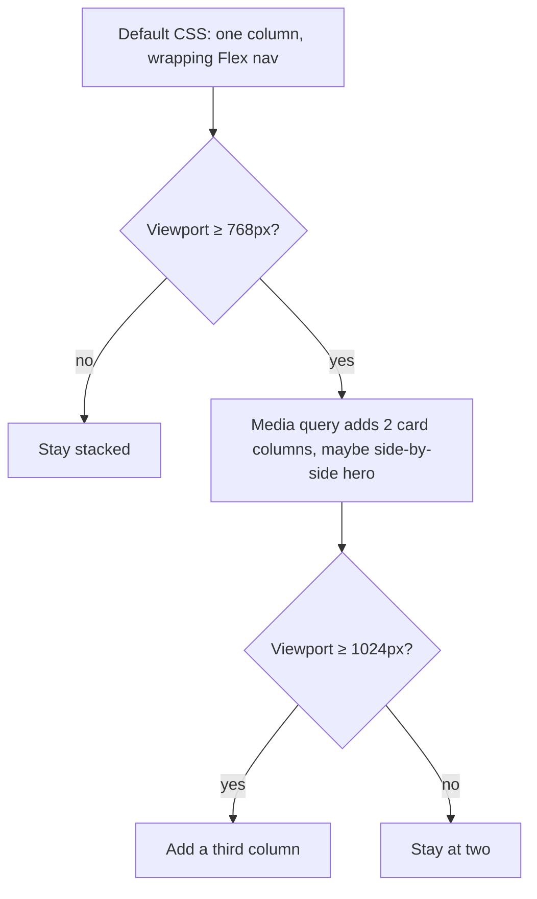

# Month 2 · Week 4 · Day 6
# Independent Layout + Start Project 1

**Month index:** [../../README.md](../../README.md)  
**Week 4:** [1](day-01.md) · [2](day-02.md) · [3](day-03.md) · [4](day-04.md) · [5](day-05.md) · Day 6 (today) · [7](day-07.md)  
**Week rhythm today:** Independent project work  
**Study time:** 3–4 focused hours  
**Student state:** You can Flex a nav, Grid a catalog, and add columns with `min-width` queries. Today you prove that on a **new** landing page, then open a **separate** Git repo for Project 1 — plan only, no copied lab HTML.

Two jobs today. Neither is “copy a portfolio template.” This textbook will not give you the portfolio source.

---

## How to read this chapter

The complete explanation is the lesson. Challenge 1: Days 1–5 stay closed; repair from **this recap** or Week 4 Days 1–2 and 4 in this book. Challenge 2: read the **project requirements file**, not a GitHub theme.

You will not finish Project 1 today. You will finish the independent landing’s viewport notes. If time is short, a honest `PLAN.md` beats a fake-complete `index.html` pasted from the gallery lab.



Serve Challenge 1 over **HTTP**, not `file://`. On Windows: `python -m http.server 5500` from `~\fullstack-lab`.

Tomorrow’s exam layout is **Northline Studio**, specified in Day 7. Today’s landing is a **different** fictional tool or studio. Do not name it Northline. Do not treat the exam layout as your brand. Project 1 is your own portfolio, typed later from skills — not cloned from `landing.html` and not cloned from Northline.

---

## Complete explanation (layout + deploy)

**Mobile-first:** default CSS is the small layout (one column). `@media (min-width: 768px)` and `(min-width: 1024px)` **add** columns. Do not write desktop CSS and then shrink it with `max-width` queries unless you enjoy fighting yourself.

**Media query:** a CSS condition. When true, its rules join the cascade. `(min-width: 768px)` is about **viewport** width, not “is a phone.” A narrow desktop window is small.

**Images:** `max-width: 100%; height: auto; display: block;` plus HTML `width`/`height` to reduce layout jump. Decorative `alt=""`. Informative alt describes what the image conveys.

**Nav at 375px:** `flex-wrap` so every link stays visible and keyboard-reachable. Do not `display: none` the nav. A hamburger needs a real `button` and usually JS — not this course’s first pattern.

**Flex vs Grid:** Flex = one axis (nav, card innards). Grid = two axes (card gallery, page areas). Nested: Grid of cards, Flex inside each card.

**Overflow:** horizontal scroll is a bug. Causes: fixed pixel widths, huge images, flex `min-width: auto`. Fixes: `min-width: 0`, `max-width: 100%`, fewer columns on small viewports.

**Motion:** optional short color/opacity/`transform` transitions. If you animate, wrap a `prefers-reduced-motion: reduce` query that collapses durations. Do not autoplay large motion.

**Focus and forms** still apply: labels, skip link, `:focus-visible`, no `outline: none`.

### Deploy (explained here — you will do it when the site is ready)

**Static hosting** means: files (`index.html`, CSS, images) are copied to a server that only **serves files**. There is no FastAPI. HTTPS is provided by the host’s certificate.

Common choices (pick one later; all are HTTPS if you use the host’s domain):

- **GitHub Pages** — the host reads a branch (often `main`) or a `/docs` folder from your GitHub repo and serves it at `https://USERNAME.github.io/REPO/`. Relative URLs must work from that **base path** (a repo Pages site is not the domain root). If CSS 404s, your `href="/styles.css"` was an absolute path from the domain root — use `href="styles.css"` or `./styles.css`.
- **Cloudflare Pages / Netlify** — you connect the Git repo; they build (for a plain HTML site, “build” is just publishing the folder) and give you `https://....pages.dev` or similar.

You do **not** need a custom domain this month. You **do** need HTTPS (the host gives it). You **do** need the public URL written in the **project** README.

Deploy when the site is keyboard-usable and responsive — not today if Challenge 2 is only a PLAN. Document “not deployed yet” until then.

**Forbidden:** copying a GitHub portfolio, Tailwind/Bootstrap/React, generating the whole page with AI. The skills are in this month’s day files.

The rest of this explanation is the same lesson with pictures, so Challenge 1 is possible from this file alone.

### Mobile-first is a default, not a slogan

You write the **small** layout with no query. One column Grid (`grid-template-columns: 1fr`) or a single column that is just flow. At `min-width: 768px` you **add** `grid-template-columns: 1fr 1fr`. At `1024px` you add a third track if the design earns it.

Desktop-first (`max-width: 767px { make it a column }`) works on a good day and fights you on every later rule: you keep undoing a three-column default. This course does not do that.

**Wrong belief:** “Media queries detect iPhones.”  
**Correct:** they test the **viewport**. DevTools 375px is the same idea as a phone, and a dragged-narrow laptop window is too.

### The query joins the cascade

```css
.cards {
  display: grid;
  gap: 1rem;
  grid-template-columns: 1fr;
}

@media (min-width: 768px) {
  .cards {
    grid-template-columns: 1fr 1fr;
  }
}
```

When the viewport is 800px wide, **both** rules apply. Same selector, same specificity: the one **inside the query** wins if it comes later (source order), which it does if you put queries at the bottom of the file — a good habit. Importance and specificity still apply. A more specific rule *outside* the query can still beat a weaker rule inside it. Count if you get surprised. Computed still tells the truth.

### Images and nav — two overflow factories

```css
img {
  max-width: 100%;
  height: auto;
  display: block;
}
```

`height: auto` keeps aspect ratio when width shrinks. HTML `width` and `height` attributes still help the browser reserve space (less layout jump). `alt` rules from Week 1 did not expire.

Nav: `display: flex; flex-wrap: wrap; gap: 1rem`. Every link stays in the Tab order. A hamburger at 375px that is only a CSS `display: none` on the list **fails** keyboard users unless you built a real control. You have no JS menu today. Wrap.

### Overflow hunt (you will need this on the landing)

Horizontal scroll at 375px is a **bug**. Walk the tree:

1. Images without `max-width: 100%`.
2. Flex item with a long unbreakable string (`min-width: auto`) — set `min-width: 0` on the item.
3. Grid tracks that cannot shrink (`minmax(16rem, 1fr)` × 3 on a 375px viewport).
4. A `width: 960px` leftover from a tutorial.

**Wrong belief:** “A little horizontal scroll is OK if the hero looks cinematic.”  
**Correct:** accidental horizontal scroll fails R1 and fails Project 1. Cinematic is `object-fit` on an image that still fits the column.

### Forms and focus on a “marketing” page

The landing still has name, email, message, submit. Week 2 did not end. Visible `<label>`, skip link, `:focus-visible`, no `outline: none`, honest footer: this form does not send. `autocomplete` on name and email. No `mailto:`. Placeholders are not labels.

### Worked example — nested tools on a landing

```css
.site-header { display: flex; flex-wrap: wrap; justify-content: space-between; gap: 1rem; }
.cards { display: grid; grid-template-columns: 1fr; gap: 1.5rem; }
.card { display: flex; flex-direction: column; gap: 0.75rem; }

@media (min-width: 768px) {
  .cards { grid-template-columns: 1fr 1fr; }
}

@media (min-width: 1024px) {
  .cards { grid-template-columns: 1fr 1fr 1fr; }
}
```

Header = Flex (1D). Cards = Grid (2D). Card body = Flex column (1D). Default = one column. Queries **add** tracks. That is the independent landing in CSS English.

### Deploy paths — why `/styles.css` 404s

GitHub Pages for `https://you.github.io/portfolio/` serves the repo **under** `/portfolio/`. A link `href="/styles.css"` asks `https://you.github.io/styles.css` — the wrong place. `href="styles.css"` asks the same folder as the HTML. Learn that **today** in the PLAN, even if you deploy next week.

Static hosts speak **HTTPS**. `http://127.0.0.1` is your lab. The public URL must be `https://`. The Month 2 gate includes deploy; Challenge 2 today only requires you to **plan** it.

**Wrong belief:** “I’ll paste the gallery lab and change the title to my name.”  
**Correct:** that is a template. Challenge 1 is a new studio. Challenge 2 is a plan you wrote. The portfolio HTML is typed later from skills, not cloned from `landing.html`.

---

## Office hours — overflow, hamburgers, and unlabeled marketing fields

### Horizontal scroll at 375

Open DevTools (`F12`), device toolbar (`Ctrl+Shift+M`), width **375**. If the page scrolls sideways, inspect the widest child. Usual landing culprits: a hero image, a Grid still at three columns in the default CSS, a nav with `nowrap`, a `pre` or long URL. Fix the child. Do not hide overflow on `html`.

```css
.card { min-width: 0; }
```

That line is often the flex overflow trap. Put it on the item that refuses to shrink.

### Hamburger you did not build

`display: none` on `.site-nav` below 768px, with a decorative `☰` `div`, is not a menu. Keyboard users lose every link. Wrap the Flex nav. It can sit on two lines. That is correct.

### Contact form on a pretty page

Marketing pages still fail Week 2:

```html
<label for="land-name">Name *</label>
<input id="land-name" name="name" type="text" autocomplete="name" required>
```

A `placeholder="Name"` with no `<label>` fails. A `div` that looks like Send fails. `action="mailto:…"` fails. The instruction paragraph still sits **above** the form.

### `VIEWPORTS.md` is evidence, not vibes

Write what you **saw** at 375, 768, 1024, and **1400**. “Looks fine” is not a note. “375: one column, nav wrapped to two lines, no horizontal scroll. 768: two card columns. 1024: three. 1400: still three, max-width held, no stretchy hero overflow” is a note. If you then fixed overflow, write the cause in one sentence.

### Labeled landing form (type this; change ids to yours)

```html
<p>Required fields are marked * in the label.</p>
<form action="#" method="get">
  <label for="land-name">Name *</label>
  <input id="land-name" name="name" type="text" autocomplete="name" required>

  <label for="land-email">Email *</label>
  <input id="land-email" name="email" type="email" autocomplete="email" required>

  <label for="land-message">Message *</label>
  <textarea id="land-message" name="message" rows="5" required></textarea>

  <button type="submit">Send message</button>
</form>
<p>This form does not send data to a server yet.</p>
```

Same Week 2 rules on a “marketing” page. Optional CSS later may put name and email on one Grid row at `min-width: 768px`. Default remains one column. Labels stay visible. No `mailto:`.

### Reduced-motion if you add a hover lift

```css
.card { transition: transform 150ms ease; }
.card:hover { transform: translateY(-2px); }

@media (prefers-reduced-motion: reduce) {
  *,
  *::before,
  *::after {
    animation-duration: 0.01ms !important;
    animation-iteration-count: 1 !important;
    transition-duration: 0.01ms !important;
  }
}
```

If you add no motion, skip the lift. Still write in VIEWPORTS.md or a README line: “No animation.” Honesty passes. A bounce without the query fails Day 5’s R6 and will fail Project 1.

**Wrong belief:** “Project 1 README can wait until the site looks done.”  
**Correct:** Challenge 2 today is README + PLAN in a **separate** repo. Looks-done HTML pasted from this landing is a template, not a start.

---

## Today's contract

A fictional studio/tool landing that hits the required list, plus a Project 1 repo that contains README + PLAN and no stolen template.

**Today's gate.** I can explain mobile-first in one sentence, and Project 1 exists as its own Git repo with a plan I wrote.

---

## Time box

| Block | Minutes | Work |
|---|---|---|
| A | 15 | Speak mobile-first, Flex vs Grid, overflow |
| B | 100 | Challenge 1 — independent landing |
| C | 30 | `VIEWPORTS.md` at four widths |
| D | 45 | Challenge 2 — Project 1 repo, README, PLAN |
| E | 15 | Two git commits (lab + portfolio) |

---

# Challenge 1 — Independent landing (required)

Days 1–5 closed for this challenge. Repair from this recap or Week 4 Days 1–2 and 4 in this book.

`~\fullstack-lab\month-02\week-04\independent\landing.html` — a fictional **tool or studio**, not your personal brand (save that for Project 1).

Must include: skip link, semantic landmarks, Flex nav, Grid cards (min 3), mobile-first breakpoints, fluid image, labeled form (name, email, message), visible focus, reduced-motion if you animate, 375–1024 test notes in `VIEWPORTS.md`.

Also include, from this month’s standing bar:

- Full skeleton; unique title and description
- One `h1`; heading ranks without skips
- Custom properties; global `border-box`
- No framework; relative CSS path
- Serve over HTTP
- `VIEWPORTS.md` should mention **1400** as well as 375 / 768 / 1024 (Day 5’s four widths). Write what you **saw**, including any remaining overflow you then fixed.

Do not paste `day-03/gallery.html`. Retype structure from the spec. A studio named differently with the same class soup is still a paste — change the content **and** type the CSS.

Do not reuse **Northline Studio** as this landing’s brand. That name is reserved for the Day 7 exam layout.

---

# Challenge 2 — Start Project 1 (required, no textbook HTML)

Read:

`full_stack_project_requirements_2026/project_01_accessible_responsive_portfolio.md`

Create a **new Git repository** (not inside `fullstack-lab` as a dump of the whole lab — its own folder, e.g. `~/portfolio/`).

Today you may only:

1. `git init`, `.gitignore` (`.DS_Store`, `Thumbs.db`, `.env`)
2. Write `README.md` with purpose and “not deployed yet”
3. Write `PLAN.md`: section list (nav, hero, about, skills, projects ×3, contact, footer), heading outline, Flex vs Grid choices, breakpoints, form strategy (no backend)
4. Optional: empty `index.html` skeleton **you** type — do not paste from labs. Empty sections with comments are OK.

You will **not** finish Project 1 in one day. You will finish it using Month 2 skills **before** you claim the Month 2 gate. Continue building after Day 7’s exam if needed — the gate includes “rebuild the supplied layout” **and** Project 1’s own Definition of Done. The supplied exam layout is Northline Studio on Day 7. Your portfolio is not Northline.

`PLAN.md` is the design document. Example shape (fill with **your** choices, not this paragraph as a paste):

- Nav: Flex, wrap at 375, no hamburger
- Hero: flow or a simple Flex column; Grid only if two-dimensional
- Project cards: Grid 1 → 2 → 3 columns at 1 / 768 / 1024
- Contact: Week 2 pattern — labels, skip already at page level, `action="#"` honest
- Tokens: `--text`, `--bg`, `--accent`; contrast AA when you pick colors
- Deploy target: GitHub Pages **or** Netlify — decide, write the base-path relative URL rule

```powershell
# lab
cd ~\fullstack-lab
git add month-02/week-04/independent
git commit -m "Add independent responsive landing page."

# portfolio repo is separate — commit there
```

In the portfolio folder, after `git init` and files exist:

```powershell
cd ~\portfolio
git add README.md PLAN.md .gitignore
git commit -m "Start Project 1: README and layout plan."
```

If you typed an empty skeleton, add it in that commit or the next. Do not add `node_modules`, secrets, or a downloaded theme.

---

## Definition of done

- [ ] Independent landing hits the required list
- [ ] VIEWPORTS.md has four widths
- [ ] Project 1 repo exists with README + PLAN
- [ ] No framework, no copied template
- [ ] Landing served over HTTP
- [ ] Two commits (lab + portfolio) as appropriate

---

## Tomorrow

Week 4 Day 7 is the Month 2 **exam** plus a layout rebuild from a spec (Block G). The exam layout is **Northline Studio** — this textbook will not give you that layout’s source as a finished page. Closed-book HTML/CSS you already learned. Do not start Month 3 until the gate is true. Do not paste today’s landing into the exam folder.

---

## Optional review links

Mobile-first, Flex, Grid, and static deploy are explained in this chapter. Recheck later if you need a host’s current UI.

- [MDN: Using media queries](https://developer.mozilla.org/en-US/docs/Web/CSS/CSS_media_queries/Using_media_queries)
- [GitHub Pages docs](https://docs.github.com/pages)
- [MDN: Responsive images](https://developer.mozilla.org/en-US/docs/Learn_web_development/Core/Structuring_content/Responsive_images)
