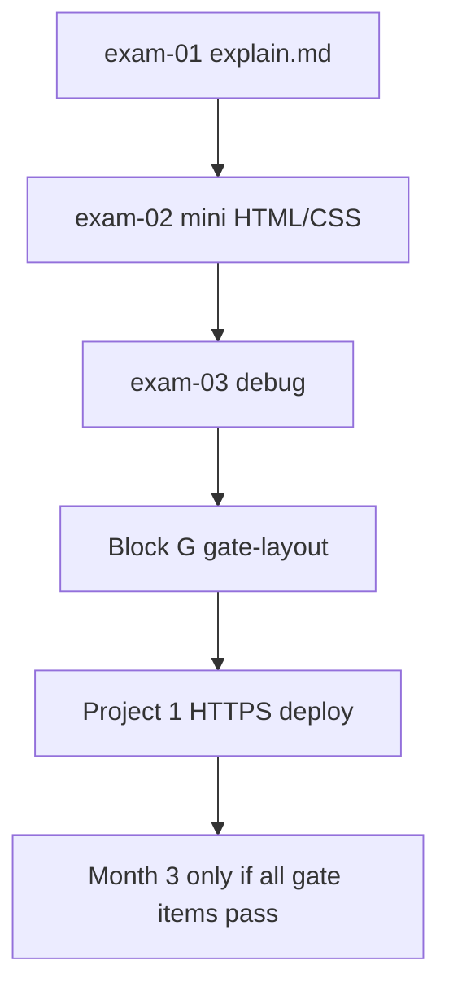

# Month 2 · Week 4 · Day 7
# Month 2 Exam + Gate Layout

**Month index:** [../../README.md](../../README.md)  
**Week 4:** [1](day-01.md) · [2](day-02.md) · [3](day-03.md) · [4](day-04.md) · [5](day-05.md) · [6](day-06.md) · Day 7 (today)  
**Next month:** [Month 3 README](../../month-03/README.md) — only after this gate is true  
**Week rhythm today:** Monthly exam  
**Study time:** 3–4 focused hours (the gate layout may take a further session — finish it before Month 3)

Textbook files stay **closed** except **Block G (the layout spec)** when you reach that block, and the self-mark table at the end. This file may stay open: it **is** the exam paper.

Work in `~\fullstack-lab\month-02-exam\` for exam evidence. The gate layout is a **new folder** `~\fullstack-lab\month-02-exam\gate-layout\` (or `~/gate-layout/` — your choice). Do **not** put the gate layout inside the Project 1 portfolio repo.

This textbook will not give you Project 1’s source. Do not paste a lab gallery into the gate folder and rename the heading.

---

## How to read this chapter

Today is a **closed-book teaching exam**. Blocks 1–6 prove you still own Weeks 1–4 from memory. Block G is the roadmap’s “rebuild a supplied layout from a screenshot.” There is no PNG in the repo. The spec **is** the screenshot. Implement only what Block G names.



During Blocks 1–6, do not open Week 1–4 day files. If you go blank, write “weak” in the exam file and keep going — then repair **after** you finish Block 6, from this month’s day files, before you claim the gate. Block G stays open because it is the assignment, not a tutorial.

Serve every HTML page over **HTTP**, not `file://`.

**Wrong belief:** “The exam is ceremonial if Project 1 looks pretty.”  
**Correct:** the month gate is seven items. A pretty portfolio with a mushy box model and no gate layout is a fail.

**Wrong belief:** “I can paste `landing.html` into `gate-layout/` and tweak colors.”  
**Correct:** Block G is a **new** page from the spec. Paste is not a rebuild.

---

## Month 2 Gate (roadmap)

You pass only when all are true **without a tutorial**:

1. Rebuild the **supplied layout** (Block G) from the spec alone — no tutorial, no other day’s HTML/CSS open.
2. Explain semantic HTML and heading hierarchy.
3. Explain cascade, specificity, and the box model with an example.
4. Explain Flexbox vs Grid and when you choose each.
5. Keyboard-navigate a form you built; visible focus; real labels.
6. Layout works at ~375, 768, 1024, and wide desktop with no accidental horizontal scroll.
7. Project 1: Git from the first commit; **deployed publicly with HTTPS** when you claim the month (if deploy is unfinished at exam hour, the month is not passed yet — finish deploy before Month 3).

If any item is false, do not start [Month 3](../../month-03/README.md).

---

## Time box

| Block | Minutes | Work |
|---|---|---|
| 1 | 35 | Closed-book explanation (`exam-01-explain.md`) |
| 2 | 30 | Independent mini-build |
| 3 | 20 | Debugging A–F |
| 4 | 15 | Code review one lab defect |
| 5 | 15 | Viewport tests on the mini |
| 6 | 20 | Architecture / design |
| 7 | 15 | Retrospective |
| G | extra session as needed | Gate layout from the spec |
| Deploy | when the portfolio is ready | Project 1 HTTPS URL in README |

The 3–4 hour window covers 1–7. Block G is the gate layout; it may continue after the clock if the page is honest unfinished work — finish it before Month 3. Do not skip 1–7 to “just build G.”

---

## Closed-book truths you must still own (read once, then write exam-01 from memory)

This is not a cheat sheet to copy into `exam-01-explain.md`. It is the week’s synthesis so the exam is a teaching day, not a vocabulary quiz against a ghost month. After you skim it, **close this section in your head** and write the explanation file in your own sentences.

**Week 1.** HTML labels meaning. Doctype, `lang`, charset, viewport, unique `title`. Landmarks: `header` / `nav` / one `main` / `footer`. Headings are outline rank — one `h1`, no skips. `alt` describes or is empty for decorative; missing `alt` is an error. Lists are `ul`/`ol`/`dl`. Tables are tabular data with `caption` and `th scope`. Metadata is for humans and machines.

**Week 2.** A form is named controls. Visible `<label>` (`for`/`id` or wrap). Placeholder is not a label. Radios share `name` inside `fieldset`/`legend`. Buttons have `type`. Tab order is DOM order. Skip link first. Accessibility Name comes from the label. First rule of ARIA: native HTML first; wrong ARIA is worse than none. HTML does not send email.

**Week 3.** Cascade: importance → specificity → source order. Count IDs vs classes vs types. Style with classes. `color` inherits; `margin` does not. `border-box` on `*`. Vertical margins collapse. Blocks stack; inlines sit in lines. `display: none` leaves the accessibility tree. `absolute` is out of flow, tied to a positioned ancestor; sticky stays in flow then pins.

**Week 4.** Flex is 1D; Grid is 2D. Nest them. Mobile-first: default one column, `min-width` queries **add** tracks. Images `max-width: 100%`. Horizontal scroll is a bug. If you animate, `prefers-reduced-motion`. No framework.

**Wrong belief:** “I will remember Flex and skip the box model on the exam.”  
**Correct:** Block G still overflows if `content-box` + padding meets `width: 100%`. Write both.

---

# 1. Closed-book explanation (35 min)

`exam-01-explain.md` — teach a beginner. Must cover:

Week 1: document skeleton, landmarks, headings, text, links, images, lists, tables, metadata  
Week 2: labels, controls, keyboard, focus, accessibility tree, ARIA first rule  
Week 3: selectors, cascade, specificity, inheritance, units, box model, flow, display, positioning  
Week 4: Flexbox, Grid, mobile-first media queries, responsive images, reduced motion  

Prose. A bullet dump of tag names is not teaching. Include **one worked specificity count** (`p` vs `.note` vs `#special`) and **one sentence** on containing block. You may not paste this chapter.

---

# 2. Independent mini-build (30 min)

Textbook closed. `exam-02-mini.html` + `exam-02-mini.css`: skip link, Flex nav, one Grid of two cards, one labeled email field + submit, `border-box`, `:focus-visible`, one `min-width` media query. Serve over HTTP.

Relative `href`. One `h1`. Honest footer if the form does not send. No framework. No Project 1 files.

---

# 3. Debugging (20 min)

`exam-03-debug.md`

Write **cause, what you would observe, fix** in full sentences.

**A.** Horizontal scroll at 375px — first three DevTools checks.  
**B.** `width: 100%` + padding without border-box.  
**C.** Flex item overflowing because of `min-width: auto`.  
**D.** Grid of three columns on a phone — what did they forget?  
**E.** `outline: none` and a keyboard user.  
**F.** Table used to position a sidebar.

Hints you may use (still write your own paragraphs): A is a child wider than the viewport (image, fixed px, min-content). B is content-box arithmetic. C is the flex overflow trap (`min-width: 0`). D is mobile-first missing — three `1fr` columns in the default CSS. E is focus not visible. F is a layout table; data tables stay.

---

# 4. Code review (15 min)

Review your independent landing or contact pattern. One defect you fix in that lab (not in the gate folder). Commit it in `fullstack-lab`.

---

# 5. Testing (15 min)

Run a viewport checklist on exam-02-mini: 375 / 768 / 1024. Record pass/fail. Break a media query on purpose; show R1 fail; restore.

Device toolbar (`Ctrl+Shift+M`). HTTP. Write the overflowing child’s selector if R1 fails before the restore.

---

# 6. Architecture / design (20 min)

`exam-06-design.md`

- Flex vs Grid for: nav, project cards, form stacked fields  
- Why Project 1 forbids Tailwind  
- Why the contact form needs labels with no backend  

A framework can paint a `div` as a button; the accessibility tree still says `div`. Labels are for humans and the Name in the tree, not for a server that does not exist yet.

---

# 7. Retrospective (15 min)

`exam-07-retro.md` — hours, solid/weak, Project 1 URL (or “not deployed yet”), honest Month 3 readiness.

If you write “ready” while cascade is weak, you will stall in JavaScript with a page you cannot debug.

---

# Block G — Gate layout (the “screenshot”)

This is the roadmap’s **rebuild a supplied layout from a screenshot**. There is no PNG in the repo. This spec **is** the screenshot. Implement it in `gate-layout/index.html` and `gate-layout/styles.css` only. No framework. No looking at Project 1 or earlier labs while building.

When you finish, a TA should be able to overlay this spec on your page and match structure, spacing, and color.

## G.1 Canvas and type

| Token | Value |
|---|---|
| Page background | `#f6f4ef` |
| Text | `#1a1a1a` |
| Muted text | `#5c5c5c` |
| Accent | `#0b5fff` |
| Header / footer background | `#ffffff` |
| Card background | `#ffffff` |
| Border | `1px solid #e2ddd4` |
| Radius | `8px` |
| Font | `system-ui, "Segoe UI", Roboto, sans-serif` |
| Body size | `1rem`, line-height `1.5` |
| `h1` | `2rem` (1.5rem at 375px) |
| `h2` | `1.25rem` |
| Space scale | 8px base: 8, 16, 24, 32, 48 (`0.5rem` … `3rem`) |
| Max content width | `1100px`, centered, horizontal padding `1rem` |
| Header height | `64px` (content vertically centered) |

`box-sizing: border-box` on all elements. `:root` custom properties for the colors and accent.

## G.2 Header (64px)

- White bar, bottom border `#e2ddd4`.
- Inside max width: **Flex** row, `justify-content: space-between`, `align-items: center`, `gap: 1rem`, `flex-wrap: wrap`.
- Left: wordmark text **Northline Studio** (not a second `h1`; use a `p` or `a` to `#main`).
- Right: `nav` links **Work**, **About**, **Contact** (in-page hashes). Accent color; underline on hover; `:focus-visible` 3px accent outline, 2px offset.
- Skip link first in `body`: “Skip to content” → `#main`.

## G.3 Hero

- `main` starts here. One page `h1`: **Quiet software for busy operators.**
- Subtext `p` (muted): **We design internal tools that do not shout.**
- **Desktop (≥768px):** two columns, **Grid** `1fr 1fr`, `gap: 2rem`, `align-items: center`.
  - Left: `h1`, `p`, then a Flex row of two controls: primary **See work** (`a` styled as button, background accent, white text, padding `0.75rem 1.25rem`, radius 8px) and secondary **About us** (`a`, transparent, accent text, 1px accent border).
  - Right: a **placeholder panel** 100% width of its column, **min-height 220px**, background `#e8e4db`, border radius 8px, **no** fake photo required. `role` not needed; it is a `div` with `aria-hidden="true"` if it has no meaning, or a `p` visually hidden — simplest: empty `div` decorative, no ARIA.
- **Mobile (<768px):** one column; placeholder **below** the text; buttons full-width stack (`flex-direction: column`).

## G.4 About band

- `h2` **About**
- Two short paragraphs (you invent the studio copy). `max-width: 40rem`.

## G.5 Work cards

- `h2` **Selected work**
- **Grid** of **three** `article` cards.
- Columns: 1 (default), 2 at `min-width: 768px`, 3 at `min-width: 1024px`. `gap: 1.5rem`.
- Each card: white, border, radius 8px, padding `1.5rem`, Flex column, `gap: 0.75rem`.
  - Decorative block `min-height: 120px`, background `#e8e4db`, radius 4px
  - `h3` project name (you invent three names)
  - `p` one sentence
  - `a` **View case notes** (descriptive; `href="#"`)
- Card heading rank: `h3` under the `h2`. Do not skip.

## G.6 Contact

- `h2` **Contact**
- Form: **Name**, **Email**, **Message**, submit **Send** (`button type="submit"`).
- Visible labels; `id`/`for`; email type; textarea 5 rows; `autocomplete` on name and email.
- `action="#"`; paragraph: **This form does not send yet.**
- On viewports ≥768px, name and email on one Grid row `1fr 1fr`; message full width. On small screens, one column.

## G.7 Footer

- White, top border, padding `1.5rem 0`.
- Flex wrap; muted small text **© Northline Studio**; link **MDN HTML** (external, `noopener` if new tab).

## G.8 Motion

If you transition button background, wrap with `prefers-reduced-motion: reduce`. No looping animation.

## G.9 Forbidden

React, Tailwind, Bootstrap, layout tables, `outline: none` without replacement, `tabindex` > 0, ARIA on labeled inputs, horizontal scroll at 375.

## G.10 Evidence

`gate-layout/EVIDENCE.md`: screenshots or notes at 375, 768, 1024, 1400; keyboard pass; one `h1`.

**Wrong belief:** “Close enough if the hero is two columns on my laptop.”  
**Correct:** G.5 columns are 1 / 2 / 3 at the named breakpoints. Measure in device mode.

---

# Deploy Project 1 (required to pass the month)

When the portfolio meets the project spec, follow the [Project 1 workshop — ship](../../../../project_guidance/project-01-accessible-responsive-portfolio/08-ship.md) for the typed GitHub Pages steps, then:

1. Push the **portfolio** repo to GitHub.
2. Enable **GitHub Pages** (Settings → Pages → Deploy from `main` / `/` or `/docs`) **or** Cloudflare Pages / Netlify drop-in. Follow the host’s current docs.
3. Confirm **https://** in the address bar, no mixed-content broken images, mobile viewport.
4. Put the live URL in the portfolio README.

This textbook cannot click the GitHub UI for you. The Month 1 Git remote lesson applies. Relative `href="styles.css"` — a Pages site under `/repo/` will 404 `/styles.css` at the domain root.

Do not paste this textbook’s Block G markup into the portfolio. Northline Studio is the **exam layout**, not your brand.

---

# Self-mark

| Gate item | Evidence | Pass? |
|---|---|---|
| Gate layout matches Block G | `gate-layout/` | |
| Semantics + headings | exam-01 + layout | |
| Cascade / box model | exam-01 + exam-03 | |
| Flex vs Grid | exam-06 + layout | |
| Keyboard form | layout contact + Project 1 | |
| 375–1024 | EVIDENCE.md | |
| Project 1 Git + HTTPS deploy | portfolio README URL | |

All must be pass before Month 3.

```powershell
cd ~\fullstack-lab
git add month-02-exam
git commit -m "Complete Month 2 exam evidence and gate layout."
```

---

## Definition of done

- [ ] exam-01 through exam-07 exist and are honest
- [ ] Mini-build served over HTTP; viewport notes recorded
- [ ] Block G matches the spec at 375 / 768 / 1024 / 1400 with no accidental horizontal scroll
- [ ] Keyboard pass on the gate-layout form
- [ ] Project 1 is its own repo with Git history and a public **https://** URL when I claim the month
- [ ] I did not paste Project 1 or a lab into `gate-layout/`
- [ ] I did not start [Month 3](../../month-03/README.md) early

---

## If you passed

Month 3 is JavaScript. You will write every line of Project 2 yourself. Do not start it until this gate is true. Open [../../month-03/README.md](../../month-03/README.md) when every self-mark row is pass.

## Optional review links

Repair from this month’s day files, not from a layout tutorial. These pages are for later checking after the exam.

- [MDN: CSS layout](https://developer.mozilla.org/en-US/docs/Learn_web_development/Core/CSS_layout)
- [GitHub Pages](https://docs.github.com/en/pages)
- [Project 1 workshop](../../../../project_guidance/project-01-accessible-responsive-portfolio/README.md)
- [Month 3 README](../../month-03/README.md)
