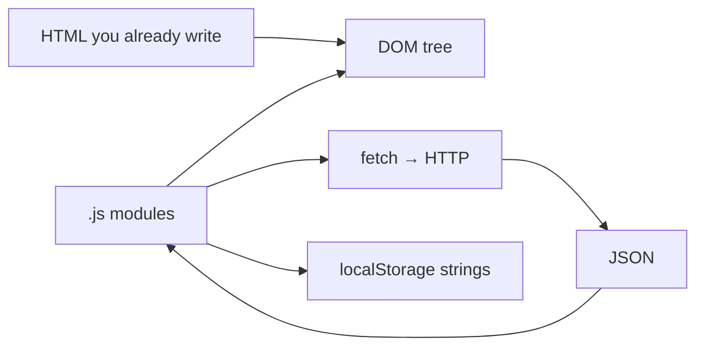

# Month 3 — JavaScript Fundamentals

**Program:** Full-Stack Mastery Textbook  
**Phase:** 1 — Foundations  
**Length:** 4 weeks · 7 days each · 3–4 focused hours/day  
**Prereq:** Month 2 gate passed  
**This month’s job:** Make the language of the browser *yours* — values, functions, data, the DOM, events, and asynchronous HTTP — so you can build **Project 2** without a tutorial.

**Project 2:** `full_stack_project_requirements_2026/project_02_vanilla_javascript_application.md`. This textbook will **not** give you the app source.

**This textbook is the lesson.** JavaScript, the DOM, events, `fetch`, and tests are explained in the day files the same way Month 1 explained the machine: slowly, in full sentences, with pictures, then labs. If a day ever feels like a checklist, that day is incomplete — stay on it until you can teach the idea out loud.

MDN and Node docs links are for **later rechecking**, not for first learning.

These files are written to render as **web pages**: relative links, tables, and **Mermaid** diagrams.

---

## How this textbook is organized

```
month-03/
  README.md     ← you are here
  week-01/      variables, primitives, operators, conditions, loops, conversion, equality, truthy/falsy
  week-02/      functions, scope, arrays, objects, destructuring, spread/rest, array methods, Map/Set, Big-O
  week-03/      DOM, create/update, events, propagation, forms, validation, localStorage
  week-04/      JSON, fetch, promises, async/await, try/catch, UI states, AbortController
                + Project 2 (you build) + Month 3 exam
```

Labs: `~\fullstack-lab\month-03\`.  
Project 2: **its own Git repository**, not a dump inside the lab folder.

---

## How JavaScript fits (picture)



HTML is meaning. CSS is appearance. **JavaScript computes** and **changes the tree**. A 404 from `fetch` is still a successful HTTP conversation — you must check `response.ok` (Week 4). User strings are **text** (`textContent`), never markup (`innerHTML`).

---

## Month 3 Gate

True **without a tutorial**:

1. Build the **main application logic** of a small CRUD + filter + persist + fetch app (Project 2) without copying a tutorial.
2. Explain primitive vs reference, `==` vs `===`, truthy/falsy.
3. Explain functions, scope, and the array methods you used (`map`, `filter`, `find`, `some`, `sort`).
4. Explain event bubbling and `preventDefault`.
5. Explain `fetch` + `async/await` + `try/catch` and what a non-2xx response means.
6. Persist data in `localStorage` with malformed-data handling.
7. Show loading, empty, and error UI states.
8. Have **tests** for non-DOM logic (filter/sort/validate) — `node --test` or equivalent.

If any item is false, do not start Month 4.

---

## What this month must teach (complete list)

| Week | Must learn | Must practice |
|---|---|---|
| 1 | variables, primitive types, operators, conditions, loops, type conversion, equality, truthy/falsy | `node` scripts; `===` only; `isBlank` via `trim` |
| 2 | functions, parameters, returns, scope, arrays, objects, destructuring, spread/rest, array methods, Map, Set; Big-O intuition | `map`/`filter`/`find`/`some`/`sort` (copy before sort) |
| 3 | DOM, select/create/update, events, bubbling, forms, localStorage | `textContent`; delegation; JSON.parse try/catch |
| 4 | JSON, fetch, promises, async/await, try/catch, loading/error/empty, AbortController | Check `ok`; abort races; Project 2 |

**Project 2:** vanilla JS explorer + collection. No React, no jQuery.

Horizontal:

- **Debugging:** Console, breakpoints, Network tab.
- **Security:** XSS — `textContent` vs `innerHTML`.
- **Tests:** non-DOM helpers first; Project 2 requires them.
- **Modules:** `api.js`, `storage.js`, `ui.js`, `main.js` as the project asks. Serve over **HTTP**.
- **Git:** Project 2 from commit one.

---

## Weekly rhythm and daily time box

Same as Month 1. Day 1 learn. Day 2 exercises. Day 3 from memory. Day 4 lab feature. Day 5 tests/docs. Day 6 independent. Day 7 review. Week 4 Day 7 is the Month 3 exam + gate.

| Minutes | Block |
|---|---|
| 30–45 | Concepts from **this textbook** |
| 45–60 | Focused exercises |
| 60–90 | Independent work |
| 30–60 | Lab / Project 2 |
| 15 | Notes / recall |

---

## Tools this month

| Tool | Why |
|---|---|
| Browser | DOM, DevTools, Network |
| Node.js LTS | `node file.js`, `node --test` |
| Git | Lab + Project 2 history |
| HTTP server | Vite later; this month a simple static server — **not** `file://` for modules |

Windows: PowerShell. `curl.exe` if you inspect HTTP by hand.

---

## Start

Open [week-01/day-01.md](week-01/day-01.md).

When Month 3’s gate is true, continue with [Month 4](../month-04/README.md).
