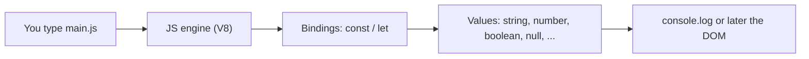

# Month 3 · Week 1 · Day 1
# Values: Variables, Types, Operators, Conversion

**Program:** Full-Stack Mastery · 18 months  
**Phase:** 1 — Foundations  
**Month index:** [../../README.md](../../README.md)  
**Week 1:** Day 1 (today) · [2](day-02.md) · [3](day-03.md) · [4](day-04.md) · [5](day-05.md) · [6](day-06.md) · [7](day-07.md)  
**Week rhythm today:** Learn + type-along  
**Student state:** Month 2 gate passed. Total beginner at JavaScript.  
**Study time:** 3–4 focused hours

**This week covers:** variables, primitive types, operators, conditions, loops, type conversion, equality, truthy/falsy.

Today: how data exists in JS and how you name it. Conditions, loops, equality, and truthy/falsy deepen on Day 2. Do not skip them.

Project 2 is **not** this week. Labs live in `~\fullstack-lab\month-03\`. This textbook will not give you the Project 2 app.

---

## How to read this chapter

HTML labeled the page. CSS painted it. **JavaScript** is the first language in this program that **computes**: it names values, converts them, and (from tomorrow) decides and repeats.

If you have never programmed, use this picture. A **variable** is a labeled box. `const title = "Harbor clinic"` means: put this string in a box named `title`, and do not replace the box with a different box. The paper inside an object-box can still be edited — that surprise is today’s gate.



Read each section. Close it. Say it in one sentence. Type the lab. When `typeof null` prints `"object"`, that is a historic bug, not a mystery you are too junior to understand.

---

## How to run JavaScript this month

Two places:

1. **Browser** — an HTML file with `<script type="module" src="./main.js"></script>` served over **HTTP** (Month 2). `type="module"` gives you strict mode and later `import`/`export`.
2. **Node.js** — `node file.js` in PowerShell. Used for drills and, from Week 2 onward, tests.

Install Node.js LTS from [nodejs.org](https://nodejs.org) if `node --version` fails. Reopen the terminal after install (PATH).

**Do not paste labs.** Type them. Read errors. The red text is the lesson.

---

## Today's contract

1. Explain what JavaScript is in the browser vs on a server (Node).
2. Declare bindings with `const` and `let` — and explain why not `var`.
3. Name the primitive types and inspect them with `typeof` (including the `typeof null` quirk).
4. Use arithmetic, assignment, and template strings.
5. Convert between string and number **on purpose**, not by accident.

**Today's gate**

> `const` does not mean “the object cannot change.” It means the **binding** cannot be reassigned. `typeof null` is `"object"` — a historic bug you must remember, not a truth about types.

---

## Time box

| Block | Minutes | Work |
|---|---|---|
| A | 50 | Theory |
| B | 50 | Type-along in Node and the browser |
| C | 70 | Independent drills |
| D | 25 | Git |
| E | 15 | Recall |

---

# Block A — Theory

## 1. What JavaScript is

**JavaScript** is a programming language. Unlike HTML, it **does** compute, branch, loop, and call functions.

In this program:

- In the **browser**, JS can read and change the DOM (Week 3), listen to events, and call `fetch` (Week 4).
- On the **server**, later, you will use **Python** for the API. Node is a JS runtime you use now for tests and tooling (npm in Month 5). Do not confuse “I ran `node`” with “I built FastAPI.”

The engine (V8 in Chrome/Node) compiles JS. You still write source a human can read.

**Wrong belief:** “JavaScript is Java.”  
**Correct:** Different languages. The name is marketing history.

## 2. A program is statements

```js
const title = "Harbor clinic";
console.log(title);
```

- `const title = "Harbor clinic"` — a **statement** that creates a binding.
- `console.log(...)` — a **call** that prints (browser DevTools Console, or the terminal in Node).
- Semicolons: ASI (automatic semicolon insertion) exists. This course **uses semicolons**. Fewer surprises.

Comments: `// one line` and `/* block */`.

## 3. `const` and `let` (not `var`)

| Keyword | Reassign? | Scope | Use |
|---|---|---|---|
| `const` | No | Block `{ }` | Default |
| `let` | Yes | Block | When the value must change (counters, accumulators) |
| `var` | Yes | Function (and hoisting traps) | Do **not** use in this program |

```js
const pi = 3.14159;
// pi = 3; // TypeError

let count = 0;
count = count + 1;

const user = { name: "Ada" };
user.name = "Grace"; // allowed — the object mutated; the binding `user` still points to the same object
```

**Wrong belief:** “`const` means immutable data.”  
**Correct:** `const` means immutable **binding**. Arrays and objects behind `const` can still be mutated. Month 4 treats immutability as a *practice*.

If you never reassign, use `const`. That documents intent.

## 4. Primitive types

A **primitive** is a single value, not a collection.

| Type | Examples | `typeof` |
|---|---|---|
| string | `"hi"`, `'hi'`, `` `hi` `` | `"string"` |
| number | `42`, `3.14`, `NaN`, `Infinity` | `"number"` |
| boolean | `true`, `false` | `"boolean"` |
| undefined | `undefined` — declared, not assigned | `"undefined"` |
| null | `null` — intentional empty | `"object"` ← quirk |
| bigint | `10n` | `"bigint"` (recognize) |
| symbol | `Symbol("id")` | `"symbol"` (recognize; later) |

```js
typeof "lab";        // "string"
typeof 3;            // "number"
typeof true;         // "boolean"
typeof undefined;    // "undefined"
typeof null;         // "object"  // BUG. Check with === null
Number.isNaN(NaN);   // true — use this, not equality to NaN
```

`NaN` means “not a number” and is still type `"number"`. `NaN === NaN` is **false**. Always `Number.isNaN(x)`.

There are no separate integer vs float types for ordinary math. `10 / 4` is `2.5`.

## 5. Strings

```js
const role = "student";
const line = `Month 3, role: ${role}`;
```

Template literals (backticks) interpolate `${expression}` and can span lines.

Length: `role.length`. Indexing: `role[0]` is `"s"`. Strings are **immutable**; `role[0] = "S"` does not change `role`.

## 6. Operators (today’s set)

Arithmetic: `+ - * / % **`  
Assignment: `= += -= *= /=`  
`+` on strings **concatenates**: `"3" + 1` is `"31"`. That is conversion by accident. Prefer `` `${n}` `` or `Number(...)`.

```js
const a = 10;
const b = 3;
a % b;  // 1 remainder
a ** 2; // 100
```

## 7. Conversion on purpose

```js
Number("42");      // 42
Number("42px");    // NaN
Number("");        // 0  — surprise; do not use for form validation
Number(undefined); // NaN
String(42);        // "42"
Boolean(0);        // false
Boolean("0");      // true — non-empty string
parseInt("42px", 10); // 42 — always pass radix 10
```

Form inputs are **always strings**. Project 2 search boxes are strings. Convert only when you mean to do math.

**Wrong belief:** “The language will just know.”  
**Correct:** you convert. `==` will convert *for* you in confusing ways — Day 2 forbids it for comparison.

---

# Block B — Guided lab

### B1 — Node

Create `~\fullstack-lab\month-03\week-01\day-01\values.js`. Type:

```js
const course = "Full-stack";
let week = 1;
week += 1;

const types = [
  typeof course,
  typeof week,
  typeof true,
  typeof undefined,
  typeof null,
];

console.log(course, week);
console.log(types);
console.log(Number.isNaN(Number("nope")));
console.log(`Week ${week} of ${course}`);
```

```powershell
cd ~\fullstack-lab\month-03\week-01\day-01
node values.js
```

**Write** in `OUTPUT.txt` what printed, especially `typeof null`.

### B2 — Browser

`index.html` (Month 2 skeleton: doctype, lang, charset, viewport, title) plus:

```html
<script type="module" src="./main.js"></script>
```

`main.js`:

```js
const title = document.title;
console.log(`This page title is ${title}`);
```

Serve over HTTP. Open DevTools **Console**. If you double-click `file://`, modules may be blocked — use HTTP.

### B3 — Break it

In `values.js`, add `course = "other";` after `const course`. Run. Read the **TypeError**. Delete that line. That is `const`.

---

# Block C — Independent

`drills.js` — print answers with `console.log` and labels:

1. Three `const` primitives of different types.
2. One `let` counter you increment three times in a loop **you write with comments only** if you have not learned `for` yet — or wait, they need loops tomorrow. For today: increment three times with three statements.
3. `typeof` of: `"8"`, `8`, `null`, `NaN`, `Number("8")`.
4. `Number("08")` vs `parseInt("08", 10)` vs `parseInt("08")` — write a comment predicting; then run. (Missing radix can become octal in old engines; always pass `10`.)
5. A template string that includes your `node --version` **typed by you** after you run `node --version` in the shell (not from JS).

`ANSWERS.txt`: `const` vs `let` in four sentences. Why `var` is banned in this course (one sentence: function scope + hoisting surprises; Month 4 will show hoisting).

---

# Block D

```powershell
cd ~\fullstack-lab
git add month-03
git commit -m "Month 3 Day 1: values, types, and conversions."
```

---

# Block E — Recall

1. Primitive types.  
2. `typeof null`.  
3. `const` vs mutation of objects.  
4. Why form input is a string.  
5. Why we use `type="module"`.

---

## Definition of done

- [ ] `node values.js` runs
- [ ] Browser console shows the title via a module script over HTTP
- [ ] I can explain `const` without saying “immutable object”
- [ ] I converted a string to a number **explicitly**

---

## Optional review links

Variables, types, `typeof`, and template strings are explained in this chapter. These pages are for later checking, not for first learning.

- [MDN: Grammar and types](https://developer.mozilla.org/en-US/docs/Web/JavaScript/Guide/Grammar_and_types)
- [MDN: Data types](https://developer.mozilla.org/en-US/docs/Web/JavaScript/Data_structures)
- [MDN: `typeof`](https://developer.mozilla.org/en-US/docs/Web/JavaScript/Reference/Operators/typeof)
- [MDN: Template literals](https://developer.mozilla.org/en-US/docs/Web/JavaScript/Reference/Template_literals)

---

## Tomorrow

Conditions, loops, `===`, truthy/falsy — the bugs that hide in `if (query)`.
