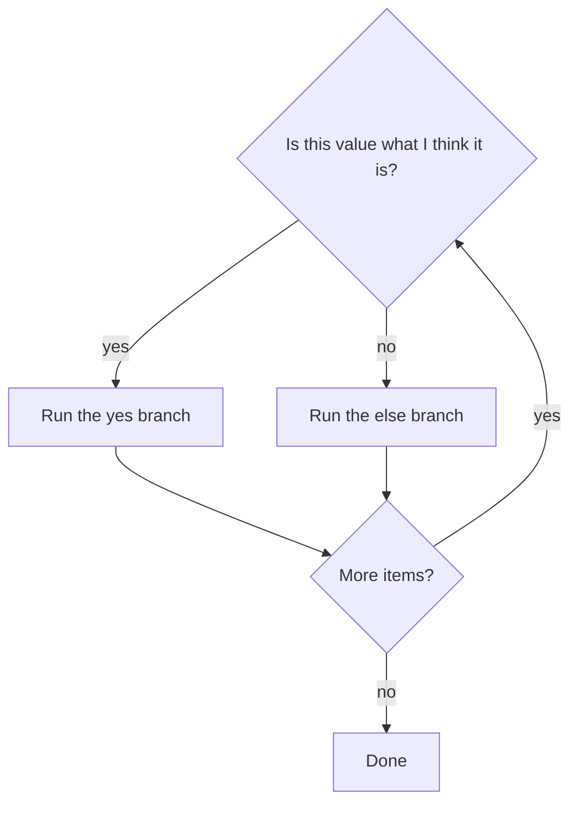

# Month 3 · Week 1 · Day 2
# Conditions, Loops, Equality, Truthy and Falsy

**Month index:** [../../README.md](../../README.md)  
**Week 1:** [1](day-01.md) · Day 2 (today) · [3](day-03.md) · [4](day-04.md) · [5](day-05.md) · [6](day-06.md) · [7](day-07.md)  
**Week rhythm today:** Exercises + debugging  
**Study time:** 3–4 focused hours  
**Prereq:** Day 1 gate. You can declare `const`/`let`, name primitives, and convert strings to numbers on purpose.

Yesterday values *existed*. Today the program **chooses** and **repeats**. Almost every Project 2 bug in week 1 of a student’s app is one of these: `==` instead of `===`, `if (query)` treating whitespace as a search, or a loop that never ends.

---

## How to read this chapter

A **condition** is a yes/no question the program asks. A **loop** is “do this again until the question becomes no.”



The dangerous part is not the `if` keyword. It is **what JavaScript considers yes**. Empty string is no. A string of spaces is **yes**. `"0"` is yes. `0` is no. Those four facts will save your search box.

Read. Predict. Run. Write PREDICT before ACTUAL. Science, not hope.

---

## Today's contract

By the end of this day you will be able to:

1. Write `if` / `else if` / `else` with braces every time.
2. Loop with `for`, `while`, and `for...of`.
3. Compare with `===` and `!==` only (never `==` in your code).
4. List the **falsy** values from memory.
5. Explain why `if (query)` is a trap for `"0"` vs `""` vs `"   "`.
6. Use `??` vs `||` without mixing them up.

**Today's gate.** Closed-book:

> `==` coerces. `===` does not. Search boxes: empty and whitespace are invalid; `"0"` is a real query. Falsy is not the same as “the user typed nothing useful.”

---

## Time box

| Block | Minutes | Work |
|---|---|---|
| A | 50 | Theory |
| B | 50 | Guided: predict equality, then run |
| C | 70 | Independent: FizzBuzz + blank checks |
| D | 20 | Git |
| E | 15 | Recall |

---

# Block A — Theory

## 1. Conditions — asking a yes/no question

```js
const status = 404;

if (status === 200) {
  console.log("ok");
} else if (status === 404) {
  console.log("missing");
} else {
  console.log("other");
}
```

**Always use braces `{ }`**, even for one line. You will add a second line later and accidentally attach it to the wrong branch.

`switch (status) { case 200: ... break; default: ... }` — use when you have several **discrete** values. Forget `break` and you **fall through** into the next case. Prefer `if` until you are sure.

Ternary: `const label = status === 200 ? "ok" : "fail";` — only for **simple values**, not nested logic. Nested ternaries are unreadable. Use `if`.

**Wrong belief:** “I can skip braces to look professional.”  
**Correct:** professionals keep braces. Style is not cleverness.

---

## 2. Logical operators — combining questions

| Operator | Meaning | Note |
|---|---|---|
| `&&` | and | Both must be truthy |
| `||` | or | First truthy wins |
| `!` | not | Flips truthiness |
| `??` | nullish coalescing | Right side only if left is `null` or `undefined` |

They **short-circuit**. `true || doWork()` never calls `doWork`. `false && doWork()` never calls `doWork`. That is a feature (cheap checks) and a bug source (you thought `doWork` ran).

```js
const port = 0;
port || 3000; // 3000 — probably wrong: 0 is falsy
port ?? 3000; // 0 — correct if 0 is an allowed port
```

**`||` is not a default for numbers.** Use `??` when `0` or `""` are real values.

---

## 3. Equality — the rule of this course

| Operator | Coerce (change types to compare)? | Use |
|---|---|---|
| `===` / `!==` | No | **Always** in this course |
| `==` / `!=` | Yes | **Forbidden** in your code |

```js
0 == "";     // true  — madness
0 === "";    // false
null == undefined; // true
null === undefined; // false
"1" == 1;    // true
"1" === 1;   // false
```

`==` tries to be helpful and lies. Form values are strings. HTTP statuses are numbers. Compare with `===` after you convert **on purpose**.

`NaN === NaN` is **false**. Use `Number.isNaN(x)`. `Object.is(NaN, NaN)` is true; still prefer `Number.isNaN` for “is this the invalid number.”

**Wrong belief:** “I’ll use `==` because the types might differ.”  
**Correct:** if types might differ, **convert**, then `===`. Do not outsource conversion to `==`.

---

## 4. Truthy and falsy — what `if (x)` actually tests

When JS needs a boolean, it coerces. **Falsy** values (exactly these):

`false`, `0`, `-0`, `0n`, `""`, `null`, `undefined`, `NaN`

Everything else is **truthy**, including `"0"`, `"false"`, `" "` (a space), `[]`, `{}`.

```js
const query = "";
if (query) {
  // skipped — empty string is falsy
}

const q2 = "  ";
if (q2) {
  // RUNS — whitespace is truthy
}

const q3 = "0";
if (q3) {
  // RUNS — non-empty string
}
```

Project 2 search box:

```js
function isBlank(s) {
  return String(s).trim() === "";
}
```

Blank means **trim, then compare to `""`**. Not `if (query)`. Not `if (!query)`.

**Wrong belief:** “If the `if` failed, the value is `null`.”  
**Correct:** it might be `0`, `""`, `NaN`, `undefined`, or `false`. **Log the value.**

Worked example you must be able to teach:

| Value | `if (value)` | `isBlank(value)` | `Number(value)` |
|---|---|---|---|
| `""` | skip | true | `0` (surprise) |
| `"  "` | run | true | `0` |
| `"0"` | run | false | `0` (falsy number, truthy string) |
| `"ada"` | run | false | `NaN` |

Three different questions. Do not mix them.

---

## 5. Loops — doing work more than once

```js
for (let i = 0; i < 3; i += 1) {
  console.log(i); // 0, 1, 2
}

let n = 3;
while (n > 0) {
  n -= 1;
}

const names = ["Ada", "Grace"];
for (const name of names) {
  console.log(name);
}
```

- `for (let i = 0; i < n; i += 1)` — you need the **index**.
- `for...of` — you need the **values**. Prefer this for arrays.
- `while` — “until a condition,” when the count is not a simple `i < n`.

`for...in` is for **keys** of objects and is easy to get wrong (inherited keys). **Do not use `for...in` on arrays** in this course.

`break` exits the loop. `continue` skips to the next iteration.

Infinite `while (true)` without `break`, or `for (let i = 0; i < 3; i -= 1)`, **freezes** the tab or the Node process. That is a bug, not “the computer is slow” (Month 1: CPU is busy in your loop). Kill with Ctrl+C in the terminal.

**Wrong belief:** “Loops are advanced.”  
**Correct:** loops are how you walk an array of books. You need them this week.

---

# Block B — Guided debugging

Create `~\fullstack-lab\month-03\week-01\day-02\equality.js`.

**Before** running, write `PREDICT.txt` with true/false for each line:

```js
console.log("1" === 1);
console.log("1" == 1);
console.log(0 === false);
console.log(0 == false);
console.log("" === false);
console.log("" == false);
console.log(null === undefined);
console.log(Number.isNaN(NaN), NaN === NaN);
```

Then `node equality.js`. Write `ACTUAL.txt`. If you missed, write which coercion you forgot.

Cause a loop bug on purpose in `spin.js`:

```js
for (let i = 0; i < 3; i -= 1) {
  console.log(i);
}
```

Run it. Kill with Ctrl+C. Write one sentence: why `i` never reached a value that made `i < 3` false.

---

# Block C — Independent

`control.js`:

1. Print FizzBuzz for 1..20 (multiples of 15 `"FizzBuzz"`, of 3 `"Fizz"`, of 5 `"Buzz"`, else the number). Use `===` and `%`. Braces on every `if`.
2. Given `const samples = ["", "  ", "hello", "0"]`, print whether each is blank after trim.
3. Loop `for...of` over `[200, 404, 500]` and print a message per code (`===` only).

`TRAPS.txt` (paragraphs, not bullets): why Project 2 must not use `if (query)` alone; why `"0"` is a real query; why `==` is banned.

```powershell
git add month-03/week-01
git commit -m "Week 1 Day 2: control flow, ===, truthy/falsy."
```

---

# Block E — Recall

Close the file.

1. The falsy list.
2. `===` vs `==` in one sentence.
3. `??` vs `||` with `0`.
4. Why `"   "` is not blank until you trim.
5. Why `for...in` is banned on arrays here.

---

## Definition of done

- [ ] PREDICT written before ACTUAL
- [ ] I can list falsy values without looking
- [ ] FizzBuzz uses `===` and braces
- [ ] TRAPS.txt explains search-box `if (query)`
- [ ] I killed an infinite loop on purpose and know why it spun
- [ ] Commit exists

---

## Optional review links

Control flow, `===`, and truthy/falsy are explained in this chapter. These pages are for later checking, not for first learning.

- [MDN: Control flow](https://developer.mozilla.org/en-US/docs/Web/JavaScript/Guide/Control_flow_and_error_handling)
- [MDN: Equality comparisons](https://developer.mozilla.org/en-US/docs/Web/JavaScript/Equality_comparisons_and_sameness)
- [MDN: Truthy](https://developer.mozilla.org/en-US/docs/Glossary/Truthy) / [Falsy](https://developer.mozilla.org/en-US/docs/Glossary/Falsy)

---

## Tomorrow

From memory: grade a list of scores and classify blank queries. Days 1–2 closed during the drills. Repair from **those files in this book**.
