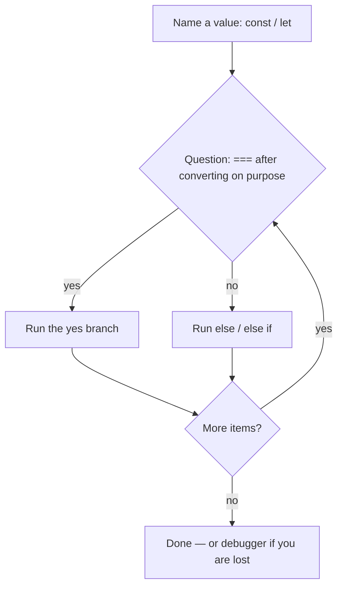

# Month 3 · Week 1 · Day 3
# From Memory: Values and Control Flow

**Month index:** [../../README.md](../../README.md)  
**Week 1:** [1](day-01.md) · [2](day-02.md) · Day 3 (today) · [4](day-04.md) · [5](day-05.md) · [6](day-06.md) · [7](day-07.md)  
**Week rhythm today:** Implement from memory  
**Study time:** 3–4 focused hours  
**Student state:** You named values on Day 1 and made the program choose and repeat on Day 2. Today those ideas must live in your fingers.  
**Days 1–2 of this week:** closed during the drills. Repair from **those day files in this textbook**, not from MDN.

---

## How to read this chapter

Day 1 and Day 2 had type-along scripts. During the drills they stay **closed**. This file contains a recap so you are not sent to another site to learn.

A JavaScript program is a sequence of **named values**, **yes/no questions**, and **repeats**. Today you rebuild that from this page.



Allowed:

- The complete explanation in this file
- Your own notes in `fullstack-lab`
- The error in front of you (`TypeError`, infinite loop, `NaN`)

Not allowed:

- Pasting a finished `grade.js` from AI
- Copying Day 1–2 lab files
- Browsing MDN or a tutorial as the teacher

If you are stuck **more than 25 minutes** on one task, open **only** the matching Day 1 or Day 2 section **in this textbook**, read it, close it, continue from memory. Record what you had to look up in `lookups.txt`. That list is tomorrow’s repair list.

There is **no complete solution** in this file. The scripts are specified. You write them.

---

## Complete explanation (values + control flow)

This section **is** the lesson. Read a paragraph. Close it. Say it in one honest sentence. Then type the spec.

### Where JavaScript runs

**JavaScript** computes. You run it in two places this month:

1. **Browser** — an HTML file with `<script type="module" src="./main.js"></script>`, served over **HTTP** (Month 2). `type="module"` gives you strict mode and later `import`/`export`. Double-clicking `file://` often blocks modules.
2. **Node.js** — `node file.js` in PowerShell. Used for drills and, from Day 5, tests.

The engine (V8 in Chrome and Node) compiles what you type. You still write source a human can read. “I ran `node`” is not “I built FastAPI.” Node is a JS runtime for drills and tests. The API later is Python.

**Wrong belief:** “JavaScript is Java.”  
**Correct:** Different languages. The name is marketing history.

### Bindings — named boxes

A **binding** is a name attached to a value.

| Keyword | Reassign the name? | Scope | Use |
|---|---|---|---|
| `const` | No | Block `{ }` | Default |
| `let` | Yes | Block | Counters, accumulators |
| `var` | Yes | Function (plus hoisting traps) | **Banned** in this course |

```js
const title = "Harbor clinic";
// title = "other"; // TypeError

const user = { name: "Ada" };
user.name = "Grace"; // allowed — the object changed; the name `user` still points at the same object
```

**Wrong belief:** “`const` means the object cannot change.”  
**Correct:** `const` means the **binding** cannot be reassigned. The paper inside an object-box can still be edited. That is today’s Week 1 gate from Day 1, and it is still true.

If you never reassign, use `const`. That documents intent. Counters use `let`. Do not use `var`.

### Primitives — single values, not collections

A **primitive** is a single value:

| Type | Examples | `typeof` |
|---|---|---|
| string | `"hi"`, `'hi'`, `` `hi` `` | `"string"` |
| number | `42`, `3.14`, `NaN`, `Infinity` | `"number"` |
| boolean | `true`, `false` | `"boolean"` |
| undefined | declared, not assigned | `"undefined"` |
| null | intentional empty | `"object"` — historic bug |
| bigint | `10n` | `"bigint"` (recognize) |
| symbol | `Symbol("id")` | `"symbol"` (recognize) |

`typeof null` is `"object"`. That is a bug older than this course. `null` is still a primitive. Check emptiness with `=== null`, not with `typeof`.

`NaN` means “not a number” and is still type `"number"`. `NaN === NaN` is **false**. Test with `Number.isNaN(x)`.

Strings are **immutable**. `role[0] = "S"` does not change `role`. Template strings interpolate: `` `Hello, ${name}` ``.

There are no separate integer vs float types for ordinary math. `10 / 4` is `2.5`.

### Operators and conversion on purpose

Arithmetic: `+ - * / % **`. Assignment: `= += -= *= /=`. Remainder `%` is how FizzBuzz asks “multiple of 3?”

`+` concatenates if **either** side is a string: `"3" + 1` is `"31"`. That is conversion by accident. Convert **on purpose**:

```js
Number("42");       // 42
Number("  ");       // 0  — surprise; do not use this as “is this a score?”
Number("ada");      // NaN
String(42);         // "42"
Boolean(0);         // false
Boolean("0");       // true — non-empty string
parseInt("42px", 10); // 42 — always pass radix 10
```

Form inputs and search boxes are **always strings**. `"42"` is not `42`. Convert when you mean to do math, then compare with `===`.

**Wrong belief:** “The language will just know.”  
**Correct:** you convert. `==` will convert *for* you in confusing ways. This course forbids `==`.

### Equality — the rule of this course

| Operator | Coerce types? | Use |
|---|---|---|
| `===` / `!==` | No | **Always** in your code |
| `==` / `!=` | Yes | **Forbidden** |

```js
0 == "";      // true  — madness
0 === "";     // false
"1" == 1;     // true
"1" === 1;    // false
null == undefined;  // true
null === undefined; // false
```

If types might differ, **convert**, then `===`. Do not outsource conversion to `==`.

### Truthy, falsy, and blank

When JS needs a boolean, it coerces. **Falsy** values are exactly:

`false`, `0`, `-0`, `0n`, `""`, `null`, `undefined`, `NaN`

Everything else is **truthy**, including `"0"`, `"false"`, `" "` (a space), `[]`, `{}`.

Worked example you must be able to teach:

| Value | `if (value)` | `trim() === ""` | `Number(value)` |
|---|---|---|---|
| `""` | skip | blank | `0` |
| `"  "` | run | blank | `0` |
| `"0"` | run | not blank | `0` (falsy number, truthy string) |
| `"ada"` | run | not blank | `NaN` |

Three different questions. Do not mix them.

**Wrong belief:** “`if (q)` means the user typed something useful.”  
**Correct:** `if (q)` is false for `""` but true for `"   "`. Blank means `String(s).trim() === ""` (and, when you write helpers, also “not a string”). `"0"` is a real query.

`||` is not a default for numbers: `0 || 3000` is `3000`. Use `??` when `0` or `""` are real values (`??` only treats `null` and `undefined` as missing).

### Conditions and loops

Always use braces `{ }` on `if` / `else if` / `else`, even for one line. You will add a second line later and accidentally attach it to the wrong branch.

```js
if (status === 200) {
  console.log("ok");
} else if (status === 404) {
  console.log("missing");
} else {
  console.log("other");
}
```

`switch` exists for discrete values; forget `break` and you fall through. Prefer `if` until you are sure. Ternary (`a ? b : c`) is for **simple values**, not nested logic.

**Loops:**

- `for (let i = 0; i < n; i += 1)` — you need the **index**.
- `for...of` — you need the **values**. Prefer this for arrays.
- `while` — until a condition, when the count is not a simple `i < n`.

`for...in` is for **keys** of objects and is easy to get wrong. **Do not use `for...in` on arrays** in this course.

`break` exits the loop. `continue` skips to the next iteration.

Infinite `while (true)` without `break`, or `for (let i = 0; i < 3; i -= 1)`, **freezes** the tab or the Node process. That is a bug, not “the computer is slow” (Month 1: CPU is busy in your loop). Kill with Ctrl+C in the terminal.

**Wrong belief:** “Loops are advanced.”  
**Correct:** loops are how you walk an array of scores. You need them today.

### Logical operators (short-circuit)

`&&` (and), `||` (or), `!` (not). They **short-circuit**: `true || doWork()` never calls `doWork`. That is a feature and a bug source.

---

## The debugger — pausing a running program

A **debugger** is not a second language. It is a way to **stop** the engine between statements and look at the boxes.

In a browser module, you can put the statement `debugger;` in your source. When DevTools is open and you reload, the engine **pauses** on that line. The page is still there; your function has not finished.

What you do with the pause:

| Control | Meaning |
|---|---|
| **Resume** | Keep running until the next pause (or the end). |
| **Step over** | Run the current line, including a whole function call as one step. |
| **Step into** | Enter the function on this line. |
| **Step out** | Finish the current function and pause in the caller. |

The **Scope** pane (often labeled Local) shows bindings **in this function right now**. If you expected `score` to be `95` and the pane shows `"95"` (a string) or `NaN`, you found the bug without guessing.

`console.log` is a flashlight. The debugger is a freeze-frame. Use both. Logging a value you never look at is not debugging.

You can also click the line number in DevTools **Sources** to set a **breakpoint** without editing the file. `debugger;` is the version you can commit and then remove.

**Wrong belief:** “The debugger is only for experts.”  
**Correct:** the debugger is how beginners stop lying to themselves about what the value is.

Serve the page over **HTTP**. Open DevTools **before** reload, or the `debugger;` line may run while the tools are closed and you will miss the pause.

---

## Today's contract

Rebuild Week 1 skills as if this were a lab exam.

**Today's gate**

> `node` runs a script you wrote without looking at Day 1–2, using `const`/`let`, `===`, a loop, and explicit conversion. I stepped a `debugger;` pause and can say what the Local scope pane showed.

If you cannot, stay here. Day 4 modules will not hide a mushy `===`.

---

## Time box

| Block | Minutes | Work |
|---|---|---|
| A | 25 | Closed-book oral review (no typing yet) |
| B | 40 | Memory drills: types, falsy, conversion |
| C | 80 | Spec: `grade.js` + `blank.js` + `NOTES.txt` |
| D | 40 | Debugger in the browser |
| E | 20 | Git + lookups |

---

# Block A — Speak first

Out loud, no notes, no editor:

1. What does `const` forbid, and what does it still allow on objects?
2. The falsy list.
3. Why `"0"` is a real search query and why `Number("0")` is a different question.
4. `===` vs `==` in one sentence.
5. Why `for...in` is banned on arrays here.
6. What you do when a loop never ends in PowerShell.

If any answer is mush, re-read that subsection above. Do not start the spec yet.

---

# Block B — Memory drills

Create `~\fullstack-lab\month-03\week-01\day-03\warm.js`. From this recap only, print:

1. `typeof` of `"8"`, `8`, `null`, `NaN`.
2. Whether each of `""`, `"  "`, `"0"` is blank after trim.
3. `Number("  ")` and a one-line comment on why that is a trap for scores.

Write `PREDICT.txt` **before** you run. Then `node warm.js`. Write `ACTUAL.txt`. Science, not hope.

---

# Spec: `grade.js`

Arguments: none. Hard-code an array of scores `[95, 70, 49, 100, 0]`.

For each score:

- If not a number or `Number.isNaN`, print `invalid`
- Else if ≥ 90 `A`, ≥ 80 `B`, ≥ 70 `C`, ≥ 60 `D`, else `F`
- Use `===` / `>=`, no `==`

Then print how many passing scores (≥ 60) using a `let` counter.

Worked example of the decision (you type the loop; this table is the answer key for the hard-coded array):

| Score | Branch | Letter | Passing? |
|---|---|---|---|
| 95 | ≥ 90 | A | yes |
| 70 | ≥ 70 | C | yes |
| 49 | else | F | no |
| 100 | ≥ 90 | A | yes |
| 0 | else | F | no |

Passing count is **3**. If you print 4, you treated `0` as passing or you used `==`. If you print `invalid` for `0`, you used `if (score)` instead of `typeof` / `Number.isNaN`. Zero is a real number.

```powershell
cd ~\fullstack-lab\month-03\week-01\day-03
node grade.js
```

---

# Spec: `blank.js`

Array of sample queries `["", "  ", "ada", "0"]`. For each, print `{ value: ..., blank: true/false }` where blank means `trim() === ""`.

Explain in `NOTES.txt` why `"0"` is not blank (it is a non-empty string; it is truthy; `Number("0")` is 0, which is falsy — different questions). Paragraphs, not a bullet dump. This is the search-box lecture in your own words.

---

# Debugger

In the browser `index.html` + `main.js`, put `debugger;` before a `console.log`. Serve over HTTP, open DevTools, reload, **step**. Write two sentences: what the Local scope pane showed.

Suggested `main.js` (you still type it — this is a shape, not a product):

```js
const scores = [95, 70, 49];
debugger;
console.log(scores[0]);
```

When you pause, expand Local. You should see `scores` as an array. Step over. The console line runs. If DevTools was closed, you missed it — open the tools, reload again.

Write `DEBUGGER.txt` with those two sentences plus which button you used (step over vs resume).

```powershell
git add month-03/week-01/day-03
git commit -m "Month 3 Day 3: control flow from memory."
```

---

# Block E — Recall and lookups

Close the files. Answer:

1. The falsy list.
2. Why `0` must get an `F`, not `invalid`, in `grade.js`.
3. What `debugger;` does if DevTools is open.
4. `??` vs `||` with port `0`.

If you opened Day 1 or Day 2, `lookups.txt` lists the section titles. Tomorrow you repair those, not a random blog.

---

## Definition of done

- [ ] `grade.js` and `blank.js` run in Node
- [ ] NOTES.txt explains `"0"`
- [ ] Debugger step recorded
- [ ] PREDICT written before ACTUAL on the warm-up
- [ ] I can list falsy values without looking
- [ ] Commit exists

---

## Optional review links

Values, `===`, falsy, loops, and the debugger pause are explained in this chapter. These pages are for later checking, not for first learning.

- [MDN: Control flow](https://developer.mozilla.org/en-US/docs/Web/JavaScript/Guide/Control_flow_and_error_handling)
- [Chrome: Pause with breakpoints](https://developer.chrome.com/docs/devtools/javascript/breakpoints)
- [Node: debugger](https://nodejs.org/en/learn/getting-started/debugging)

---

## Tomorrow

A file of **pure functions** you can import from Node — validation with no `document`. Days 1–3 stay available as repair, not as paste.
