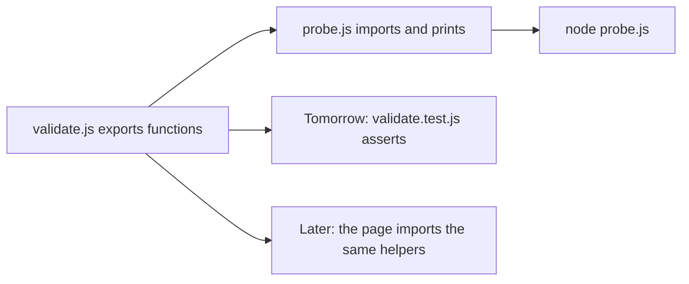

# Month 3 · Week 1 · Day 4
# Lab Feature: A Tiny Pure Logic Module

**Month index:** [../../README.md](../../README.md)  
**Week 1:** [1](day-01.md) · [2](day-02.md) · [3](day-03.md) · Day 4 (today) · [5](day-05.md) · [6](day-06.md) · [7](day-07.md)  
**Week rhythm today:** Add a real project feature  
**Study time:** 3–4 focused hours  
**Prereq:** Day 3 gate. You can write `const`/`let`, `===`, a loop, and a trim-blank check from this week’s recap.

Project 2 will need **validation** and **status labels** that do not touch the DOM. Start that habit now.

This is **not** Project 2. You will not get the product source from this textbook. You will get a small module you could later copy *ideas* from.

---

## How to read this chapter

Until today, every script was a single file that printed to the console. Real apps split **questions about data** from **drawing on the screen**.

Picture two rooms:

- **Logic room:** “Is this string blank?” “What kind of HTTP status is 404?” No browser. Node can run this.
- **UI room:** buttons, lists, `document`. The browser owns this. Week 3.

Today you build only the logic room, then a tiny **probe** that imports it and prints. Tomorrow a **test runner** will import the same file.



Read Block A until you can say, without looking, what `export` does and why `"200"` the string is invalid for `httpLabel`. Then type the spec. Do not paste.

---

## Today's contract

By the end of this day you will be able to:

1. Explain a **pure function** as “output from inputs, no `document`, no network, no `localStorage`.”
2. Split a folder into an ES **module** (`export`) and a file that **imports** it.
3. Make Node treat the folder as ESM with `"type": "module"` in `package.json`.
4. Return a **result object** `{ ok, query }` / `{ ok, error }` instead of throwing for empty search.
5. Keep `httpLabel` strict: numbers only; the caller converts.

**Today's gate**

> A file of functions (no `document`) that you can call from Node.

If `node probe.js` fails with “Cannot use import statement,” you have not finished the module setup. Stay here.

---

## Time box

| Block | Minutes | Work |
|---|---|---|
| A | 50 | Theory: purity, modules, result objects |
| B | 40 | Type-along: smallest export + import |
| C | 80 | Feature spec: `validate.js` + `probe.js` + README |
| D | 25 | Git |
| E | 15 | Recall |

---

# Block A — Theory

## 1. Pure functions — why they exist

A **pure function** computes an output from its inputs. Same inputs, same output. It does not:

- read or write `document`
- read or write `localStorage`
- call `fetch`
- print as its only result (logging while debugging is fine; the **return value** is the product)

```js
export function isBlank(s) {
  return typeof s !== "string" || s.trim() === "";
}
```

Given `"  "`, this always returns `true`. Given `"0"`, always `false`. You can test that in Node without opening a browser.

**Why split logic from UI:** Project 2 will have a search box (DOM) and a “is this query blank?” question (logic). If blank-check lives in a click handler, you cannot test it with `node --test`. If it lives in `validate.js`, both the page and the tests import it.

**Wrong belief:** “I’ll put everything in `main.js` until the app is big.”  
**Correct:** the app is already too mixed the moment a question about strings lives inside a click. Split on **kind of work**, not on file size.

## 2. ES modules — one file offers, another file asks

**ES modules (you need them this month):**

- `export function isBlank(s) { ... }` makes the function available to other files.
- `import { isBlank } from "./validate.js"` brings it in. The path is **relative**; include the `.js` extension in the browser.
- The importing file is also a module (`<script type="module" src="./probe.js">` or Node with `"type": "module"`).

Think of `export` as putting a tool on a labeled shelf. `import` is walking to that shelf and taking the tool by name. The curly braces `{ isBlank }` mean “I want the **named** export called `isBlank`,” not “invent a new function.”

You can export several names from one file:

```js
export function isBlank(s) { /* ... */ }
export function toQuery(s) { /* ... */ }
export function httpLabel(status) { /* ... */ }
```

Or export after defining:

```js
function isBlank(s) { /* ... */ }
export { isBlank };
```

**Default export** (`export default function ...` / `import fn from "..."`) exists. This course prefers **named** exports so the name in the source and the name at the import site stay the same. You will read default exports in other people’s code; you do not need them today.

Node must know the folder is ESM. Easiest:

```json
{
  "type": "module"
}
```

in that folder’s `package.json`. Then `node probe.js`. Alternative: name files `.mjs`.

Without `"type": "module"`, Node treats `.js` as the old CommonJS style (`require`). `import` then throws. The error is telling you the folder is not a module package yet.

```powershell
cd ~\fullstack-lab\month-03\week-01\day-04
# create package.json with "type": "module", then:
node probe.js
```

**Browser:** the importing HTML uses `<script type="module" src="./probe.js"></script>`. Serve over **HTTP**. `file://` will often refuse ES modules (Month 2: a page is a URL). Relative paths: `from "./validate.js"` means “same folder.” `from "validate.js"` without `./` is a **bare specifier** — Node and the browser look for a package, not a neighbor file. Always `./` or `../` for your own files this month.

**Wrong belief:** “The `.js` extension is optional, like in some bundlers.”  
**Correct:** in native ES modules in the browser, the URL must be a real file. Include `.js`. Node with `"type": "module"` follows the same habit in this course.

## 3. Design choice — be strict at the boundary

**Design choice you will document:** `httpLabel` takes a **number**. The string `"200"` is invalid unless the **caller** converts. Helpers that silently `Number(status)` hide bugs. Be strict at the boundary; convert at the edge (form strings → numbers) with `Number(...)` and `Number.isNaN`.

Worked example:

| Call | Result | Why |
|---|---|---|
| `httpLabel(200)` | `"ok"` | 200–299 |
| `httpLabel(404)` | `"client"` | 400–499 |
| `httpLabel(500)` | `"server"` | 500–599 |
| `httpLabel(301)` | `"other"` | not in those bands |
| `httpLabel("200")` | `"invalid"` | not a number — caller forgot to convert |
| `httpLabel(NaN)` | `"invalid"` | `typeof NaN` is `"number"`, so you must also `Number.isNaN` |

If you “helpfully” run `Number(status)` inside `httpLabel`, `"200"` becomes 200 and the bug at the form edge disappears from tests. Then a typo `"20o"` becomes `NaN` and you get `"invalid"` for a different reason than you think. **Do not** convert inside `httpLabel`.

Ranges: use `>=` and `<=` (or `>=` and `<`). `===` alone cannot express “200 through 299.”

## 4. Return shapes — result objects vs throws

`toQuery` returns `{ ok: true, query }` or `{ ok: false, error }`. That is a **result object** — the caller branches on `ok` instead of catching throws for normal empty input. Throws are for true surprises. Empty search is not a surprise.

```js
export function toQuery(s) {
  if (isBlank(s)) {
    return { ok: false, error: "empty" };
  }
  return { ok: true, query: s.trim() };
}
```

The caller:

```js
const result = toQuery(input);
if (!result.ok) {
  // show result.error — do not fetch
} else {
  // use result.query
}
```

**Wrong belief:** “I’ll `throw new Error('empty')` for a blank box; `try/catch` is professional.”  
**Correct:** exceptions are for broken situations (network down, JSON garbage you did not expect to handle here). A user leaving the box empty is a **normal branch**. Return `{ ok: false }`.

`isBlank` returns a boolean. `httpLabel` returns a string label. Different functions, different shapes. What they share: **no DOM**.

## 5. How `isBlank` must think

From Days 2–3:

- Not a string → blank (invalid as a query).
- After `trim()`, equal to `""` → blank.
- `"0"` is **not** blank.
- `"  "` **is** blank.

```js
export function isBlank(s) {
  return typeof s !== "string" || s.trim() === "";
}
```

`typeof s !== "string"` guards `s.trim` — calling `.trim` on `null` throws. Pure functions still need to be safe at the edges.

---

# Block B — Type-along

Create `~\fullstack-lab\month-03\week-01\day-04\`.

`package.json`:

```json
{
  "type": "module"
}
```

Smallest module pair, so the error messages are about **your** code, not about Node’s module mode.

`math.js`:

```js
export function clamp(n, min, max) {
  if (n < min) {
    return min;
  }
  if (n > max) {
    return max;
  }
  return n;
}
```

`try-clamp.js`:

```js
import { clamp } from "./math.js";

console.log(clamp(15, 0, 10));
```

```powershell
cd ~\fullstack-lab\month-03\week-01\day-04
node try-clamp.js
```

You should see `10`. If you see an import error, fix `package.json` before writing `validate.js`.

---

# Feature spec

`validate.js` exports:

1. `isBlank(s)` — true if not a string or trim empty  
2. `toQuery(s)` — if blank, return `{ ok: false, error: "empty" }`; else `{ ok: true, query: s.trim() }`  
3. `httpLabel(status)` — `"ok"` if 200–299, `"client"` if 400–499, `"server"` if 500–599, `"other"` otherwise. Use `>=` `<=`. If `typeof status !== "number"` or `Number.isNaN(status)`, `"invalid"`

`probe.js` imports and prints several cases: `"  hi  "`, `""`, `"0"`, status `200`, `404`, `500`, `"200"`.

`README.md`: how to run. Note: `"200"` the string is invalid for `httpLabel` unless you convert — **do not** convert inside `httpLabel`; the caller must pass a number. Document that choice.

Suggested probe shape (you type it; print labels so you can read the terminal):

```js
import { isBlank, toQuery, httpLabel } from "./validate.js";

console.log("blank hi", isBlank("  hi  "));
console.log("blank empty", isBlank(""));
console.log("blank 0", isBlank("0"));
console.log("toQuery hi", toQuery("  hi  "));
console.log("toQuery empty", toQuery(""));
console.log("label 200", httpLabel(200));
console.log("label 404", httpLabel(404));
console.log("label 500", httpLabel(500));
console.log("label string 200", httpLabel("200"));
```

Expected reasoning (write `PROBE.txt` with predicted vs actual):

- `"  hi  "` is not blank; `toQuery` yields `{ ok: true, query: "hi" }`.
- `""` is blank; `toQuery` yields `{ ok: false, error: "empty" }`.
- `"0"` is not blank.
- `httpLabel("200")` is `"invalid"`.

If `httpLabel("200")` prints `"ok"`, you converted inside the helper. Fix the helper, not the probe.

```powershell
git add month-03/week-01/day-04
git commit -m "Add query and HTTP label helpers as pure functions."
```

---

# Block E — Recall

Close the files.

1. What makes a function pure?
2. Why named exports include the `.js` extension in the import path.
3. Why empty search returns `{ ok: false }` instead of throwing.
4. Why `httpLabel` must use `Number.isNaN` in addition to `typeof === "number"`.
5. What `"type": "module"` is for.

---

## Definition of done

- [ ] `node probe.js` runs as a module
- [ ] `"0"` is not blank
- [ ] `"200"` is invalid for `httpLabel`
- [ ] README explains how to run
- [ ] I can explain export/import without saying “magic”
- [ ] Commit exists

---

## Optional review links

Pure functions, ES modules, and result objects are explained in this chapter. These pages are for later checking, not for first learning.

- [MDN: JavaScript modules](https://developer.mozilla.org/en-US/docs/Web/JavaScript/Guide/Modules)
- [Node: ECMAScript modules](https://nodejs.org/api/esm.html)

---

## Tomorrow

The same `validate.js` gets a **test file**. The machine will check the claims you just printed by hand.
