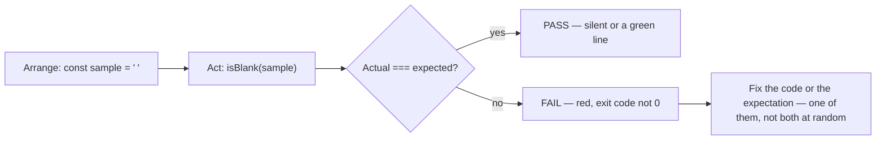

# Month 3 · Week 1 · Day 5
# Tests Begin in JavaScript

**Program:** Full-Stack Mastery · 18 months  
**Phase:** 1 — Foundations  
**Month index:** [../../README.md](../../README.md)  
**Week 1:** [1](day-01.md) · [2](day-02.md) · [3](day-03.md) · [4](day-04.md) · Day 5 (today) · [6](day-06.md) · [7](day-07.md)  
**Week rhythm today:** Tests + refactor + documentation  
**Study time:** 3–4 focused hours  
**Student state:** You have a `validate.js` module. Today you stop hoping `probe.js` still prints the right thing and start **claiming** it.

The roadmap: simple JavaScript tests while learning JavaScript. Full lint/format tooling is Month 4–5. You still write tests **now**.

---

## How to use this textbook

1. Read a section. Close it. Say the idea in a full sentence.
2. Type every test. Do not paste a gist of `assert.equal` and rename it.
3. Predict pass or fail **before** you run. Write the prediction. Then run `node --test`.
4. Optional review links at the end are for later rechecking — not for first learning.

---

## How to read this chapter

Month 1’s `TESTS.md` tables were claims you checked by hand. Month 2’s HTML checklists were the same idea on markup. Today the **machine** runs the claim.

A test is not a vibe and not “I remember writing `isBlank`.” It is a tiny program that **throws** if yesterday’s helper changed meaning.



Read Block A until you can explain arrange / act / assert in your own sentences. Then write tests from the **spec**, not from a happy memory of `probe.js`.

If you finish early, do not add a DOM page. Tighten names. Add one more boundary case.

---

## What a test is (complete)

A **test** is a claim that can fail. Now the **machine** checks them.

Not a test:

- “I ran `node probe.js` and it looked right.”
- “I remember `"0"` not being blank.”
- “The README says it works.”

A test:

- “`isBlank("  ")` equals `true`.”
- “`httpLabel("200")` equals `"invalid"`.”
- “`toQuery("")` is `{ ok: false, error: "empty" }`.”

If someone later “simplifies” `isBlank` to `return !s`, the test **must** go red. That is the point. `!s` treats `"0"` as truthy (good) but treats `""` as falsy (good) and treats `"  "` as truthy (wrong — spaces are not blank under that shortcut). The whitespace test is the one that catches the lie.

### Anatomy

1. **Arrange** — set up data (`const sample = "  "`).
2. **Act** — call the function (`isBlank(sample)`).
3. **Assert** — if the actual value is not the expected value, throw.

Node’s built-in runner (`node --test`) plus `node:assert/strict`:

```js
import assert from "node:assert/strict";
import { test } from "node:test";
import { isBlank, toQuery, httpLabel } from "./validate.js";

test("whitespace is blank", () => {
  assert.equal(isBlank("  "), true);
});

test("0 is not blank", () => {
  assert.equal(isBlank("0"), false);
});
```

```powershell
cd ~\fullstack-lab\month-03\week-01\day-04
node --test validate.test.js
```

If your files still live only in `day-04`, put the test **next to** `validate.js` so the import path `./validate.js` works. You may copy the module into `day-05` if you prefer a clean folder; then tests live there. Either way, `"type": "module"` must still be in that folder’s `package.json` (or a parent Node will not treat as ESM — keep it next to the files you run).

### What the commands mean

- `node --test validate.test.js` — run this file as tests.
- `node --test` with a folder — run files matching the runner’s defaults (names like `*.test.js`). Start with an explicit file so you know what ran.
- Exit code **0** — all assertions passed. Exit code **not 0** — at least one failed. Git hooks and later CI use that number. You use it today with your eyes.

A **failing** test prints which assertion failed and exits non-zero. That is a **gift**. Either the code is wrong or the test’s expectation is wrong — decide which, then fix that one.

Worked failure (you will see something in this family):

```text
AssertionError [ERR_ASSERTION]: Expected values to be strictly equal:
+ actual - expected
+ false
- true
```

Read it as: `isBlank("  ")` returned `false`; you claimed `true`. Do not “fix” the test to `false` unless the spec changed. The spec still says whitespace is blank.

### Assertions you need this month

| Call | Meaning |
|---|---|
| `assert.equal(actual, expected)` | Compare with `===`. Use for primitives and for `ok` booleans. |
| `assert.deepEqual(actual, expected)` | Compare objects/arrays by **contents**. Use for `{ ok: true, query: "hi" }`. |
| `assert.ok(value)` | Value is truthy. Use sparingly; prefer exact equals. `assert.ok(toQuery("x"))` would pass even if `ok` were missing, because a non-null object is truthy. |

`assert.equal({ a: 1 }, { a: 1 })` **fails** — different objects, `===` is false. That is why `deepEqual` exists.

```js
test("toQuery trims", () => {
  assert.deepEqual(toQuery("  hi  "), { ok: true, query: "hi" });
});
```

If you used `assert.equal` here, two objects with the same keys would still fail. That is not Node being broken. That is `===` on objects asking “same pile?”

> **Wrong belief:** “I’ll `console.log` in the test and read it.”  
> **Correct:** the runner is not a spectator sport. An assertion must throw. Logs are extra.

> **Wrong belief:** “`assert.ok(toQuery("hi"))` proves the helper works.”  
> **Correct:** a truthy object proves almost nothing. Assert `ok` and `query` with `deepEqual`.

### What to test

**What to test:** pure functions, boundaries (`""`, `"  "`, `"0"`, `NaN`, wrong types). **What not to test yet:** pixels, click coordinates. DOM tests come later; this month Node tests the logic Project 2 will import.

Good names describe the **claim**, not the implementation: `"0 is not blank"`, not `"test2"`.

Each `test("...", () => { ... })` is one claim. If it fails, you should not have to decode which of seven asserts inside it blew up. Prefer small tests.

### Deliberate break — proving the test is watching

**Deliberate break:** change `isBlank` so whitespace is not blank. Run tests. See the red failure. Restore. You just proved the test is watching.

If you change `isBlank` and every test still passes, the tests are not covering whitespace. That is a hole, not a success.

Refactor names if unclear. Do not add DOM. Do not delete a failing test to “go green.”

> **Wrong belief:** “Green means the product is done.”  
> **Correct:** green means **these claims** still hold. Unguarded behavior can still be wrong. You add claims for the bugs you care about.

> **Wrong belief:** “I’ll delete the red test and ship.”  
> **Correct:** red is information. Deleting it is lying to future you. Fix the helper or fix a wrong expectation — one of those.

### The folder is still ESM

`validate.test.js` uses `import`. Same rule as Day 4: `"type": "module"` in `package.json`. The test file is a module that imports your module. There is no special “test language.” It is JavaScript plus `assert`.

If Node complains `Cannot use import statement outside a module`, you are missing `"type": "module"` in the `package.json` that owns this folder. That is not a test-runner bug.

### Why `"200"` has a test

`httpLabel` takes a **number**. `"200"` is a string — the kind of value a form or a JSON field might give you if you forgot to convert. The helper must return `"invalid"`, not `"ok"`. A test locks that design so a later “helpful” `Number(n)` cannot sneak in without going red.

`httpLabel(NaN)` is also `"invalid"`. `typeof NaN === "number"`, so you cannot rely on `typeof` alone. Use `Number.isNaN` inside the helper; the test proves it.

### package.json next to the tests

```json
{ "type": "module" }
```

Without that file, `import assert from "node:assert/strict"` fails. The test file is ordinary JavaScript. Node is not a special “test language.” You import your helpers the same way `probe.js` did.

If you keep tests in `day-04` beside `validate.js`, run from **that** folder:

```powershell
cd ~\fullstack-lab\month-03\week-01\day-04
node --test validate.test.js
```

Do not run `node --test` from `Downloads\2026` and hope it finds the lab. The runner starts from the current directory. PowerShell’s `cd` is part of the evidence you write in `TESTS.md`.

### Isolation: one claim, one reason to fail

A test that calls `isBlank`, `toQuery`, and `httpLabel` in one callback is a bundle. When it goes red, you do not know which helper lied. Split them. Names are sentences: `"whitespace is blank"`, not `"test1"`.

Do not assert by logging. `console.log(isBlank("  "))` in a test file is a probe wearing a costume. The runner can print it and still exit 0. An assertion must throw.

> **Wrong belief:** “If I `console.log` the TAP output I have tests.”  
> **Correct:** exit code 0 is the claim. Read the red assertion, then fix **one** of: helper or expectation.

> **Wrong belief:** “I’ll `Number("200")` inside `httpLabel` so forms are easier.”  
> **Correct:** conversion belongs at the edge. The helper stays strict. The `"200"` test exists so a later “helpful” coerce goes red.

### Worked `toQuery` object claim

```js
test("toQuery empty is an error object", () => {
  assert.deepEqual(toQuery(""), { ok: false, error: "empty" });
});

test("toQuery does not treat 0-like strings as empty", () => {
  assert.deepEqual(toQuery("0"), { ok: true, query: "0" });
});
```

`assert.equal(toQuery(""), { ok: false, error: "empty" })` fails even when the keys match. Two objects are never `===`. That failure is Week 1 references arriving early: the assertion asked “same pile?”, not “same contents?”

`toQuery("  hi  ")` must trim. If you forget trim, `"  hi  "` is a truthy string and you might return it as the query. The test locks trim, not a vibe.

### What Node prints when you are wrong

Read `+ actual` and `- expected`. Do not “fix” expected to match a buggy helper. The spec still says whitespace is blank, `"0"` is not, `"200"` is invalid for `httpLabel`.

If every test is green after you break `isBlank` to `return s === ""`, you never tested `"  "`. Add that test, break again, watch red, restore. That loop is the whole day.

Refactor names only while green. `isEmpty` instead of `isBlank` is allowed if you update imports and test titles. Adding a DOM page is not a refactor. Deleting a red test is not a refactor.

---

## Today's contract

By the end of this day you will be able to:

1. Write arrange / act / assert for a pure function.
2. Run `node --test` and read a failure.
3. Cover blank, not blank, `toQuery` ok/error, and `httpLabel` including `NaN` and `"200"`.
4. Break `isBlank` on purpose, watch red, restore.
5. Record the command and the pass in `TESTS.md`.

**Today's gate**

> `node --test` is green for yesterday’s helpers, and I have seen a test fail on purpose.

If you cannot show a red run in your notes, you have a checklist, not tests.

---

## Time box

| Block | Minutes | Work |
|---|---|---|
| A | 35 | Theory: what a test is; runner; assertions |
| B | 50 | Write `validate.test.js` from the spec |
| C | 50 | Deliberate fail, restore, refactor names |
| D | 30 | `TESTS.md` + README how to test |
| E | 15 | Recall |

---

# Today

1. `validate.test.js` covering: blank, not blank, `toQuery` ok/error, `httpLabel` for 200, 404, 500, NaN, `"200"`.
2. Run `node --test`. All pass.
3. **Break** `isBlank` on purpose; see a fail; restore.
4. Refactor names if unclear. Do not add DOM.
5. `TESTS.md` records the command and pass.

Worked cases you must cover (write a test per row or group honestly):

| Claim | Call | Expected |
|---|---|---|
| empty string is blank | `isBlank("")` | `true` |
| whitespace is blank | `isBlank("  ")` | `true` |
| `"0"` is not blank | `isBlank("0")` | `false` |
| a word is not blank | `isBlank("ada")` | `false` |
| `toQuery` trims | `toQuery("  hi  ")` | `{ ok: true, query: "hi" }` |
| `toQuery` empty | `toQuery("")` | `{ ok: false, error: "empty" }` |
| 200 is ok | `httpLabel(200)` | `"ok"` |
| 404 is client | `httpLabel(404)` | `"client"` |
| 500 is server | `httpLabel(500)` | `"server"` |
| NaN is invalid | `httpLabel(NaN)` | `"invalid"` |
| string 200 is invalid | `httpLabel("200")` | `"invalid"` |

Use `assert.deepEqual` for the `toQuery` objects.

`TESTS.md` is a table you fill from **this run**, not from hope:

| Command | What it claims | Result |
|---|---|---|
| `node --test validate.test.js` | helpers match the spec | PASS (date) |

Also record the deliberate fail: which test name went red, and that you restored `isBlank`.

README (short): how to run `node --test validate.test.js` from this folder. A stranger should not have to guess the path.

```powershell
git add month-03/week-01
git commit -m "Add node:test coverage for validate helpers."
```

---

# Block E — Recall

Close the files.

1. Arrange, act, assert — one sentence each.
2. Why `assert.equal` is wrong for two objects with the same keys.
3. What exit code 0 means.
4. Why you must not delete a failing test to ship.
5. Why DOM is out of scope for these tests.
6. Why `"200"` has a test.

---

## Definition of done

- [ ] Tests cover the listed cases
- [ ] Deliberate fail was observed
- [ ] TESTS.md records the command
- [ ] I can explain why `"200"` has a test
- [ ] Commit exists

---

## Optional review links

The runner and assertions are explained above. These pages are for later checking, not for first learning.

- [Node: test runner](https://nodejs.org/api/test.html)
- [Node: assert](https://nodejs.org/api/assert.html)

---

## Tomorrow

Independent drills: a new classifier, FizzBuzz as a **function that returns an array**, and a teach-back in prose. Days 1–5 stay closed during the challenges; this file’s recap of testing still applies.
