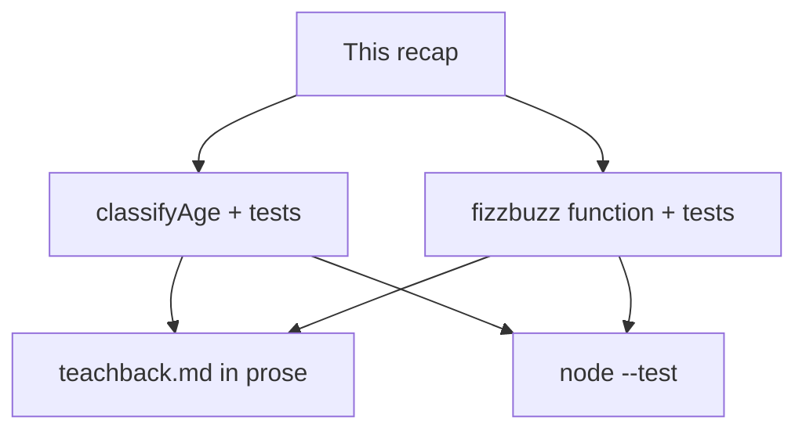
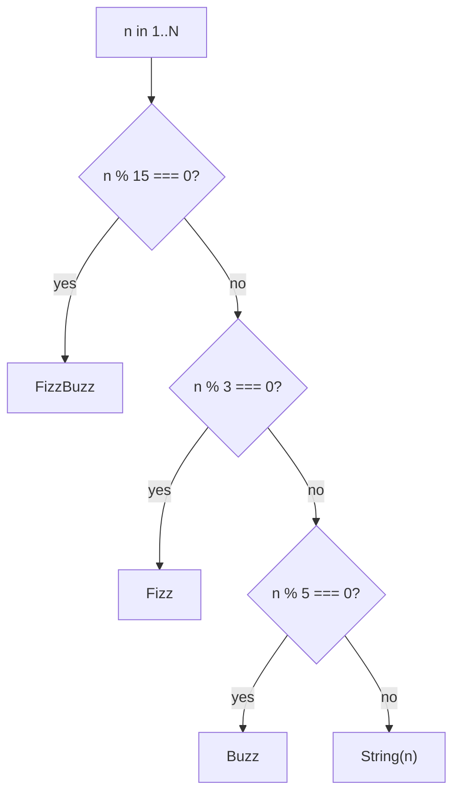

# Month 3 · Week 1 · Day 6
# Independent: Language Basics

**Program:** Full-Stack Mastery · 18 months  
**Phase:** 1 — Foundations  
**Month index:** [../../README.md](../../README.md)  
**Week 1:** [1](day-01.md) · [2](day-02.md) · [3](day-03.md) · [4](day-04.md) · [5](day-05.md) · Day 6 (today) · [7](day-07.md)  
**Week rhythm today:** Independent project work  
**Study time:** 3–4 focused hours  
**Days 1–5 textbook files:** closed for the *challenges*. Repair from **Week 1 Days 1–2 in this book**.

---

## How to use this textbook

1. Read a section of this recap. Close it. Say it in one sentence.
2. Write the function **before** the tests, or the tests **before** the function — either order is honest if you do not paste.
3. Predict a case, then `node --test`. Repair from **this file** first.
4. Optional review links are for later — not for writing `classifyAge`.

---

## How to read this chapter

Today you prove Week 1 without a type-along. The complete explanation below **is** the lesson. Read a section. Close it. Say it in one sentence. Then write the function.

If you catch yourself copying `validate.js` line for line into `classify.js`, stop. A classifier is a different question. Same *rules*, new *branches*.



Allowed during challenges: this file, your notes, the error in the terminal.  
Not allowed: Day 1–5 files as a paste source, MDN as the teacher, AI writing the functions.

If you are stuck more than 25 minutes, open **only** Day 1 or Day 2 **in this textbook**, read one section, close it, continue. Record the lookup.

---

## Complete explanation (this book is the lesson)

You already practiced these ideas. Here they are again in full, so a later review never requires another page.

### Bindings

**`const` / `let`:** `const` forbids reassignment of the binding, not mutation of objects. `let` allows reassignment. No `var`.

```js
const user = { name: "Ada" };
user.name = "Grace"; // the object changed; `user` still names that object
let n = 0;
n += 1; // reassignment — this is what `let` is for
```

> **Wrong belief:** “I used `const` so the data is frozen.”  
> **Correct:** you used `const` so you cannot write `user = otherUser`. Nested fields can still change. Week 2 treats copying as a separate skill.

Counters in FizzBuzz use `let` (or you build an array with `push` on a `const` array — that is mutation of the pile, allowed). Do not reassign `const results = []` to a new array if you chose push; or return a new array from `map` and keep `const`.

### Primitives and typeof

**Primitives** copy by value. `typeof` reports them, except `typeof null === "object"`. `NaN` is a number; use `Number.isNaN`.

| Value | `typeof` | Note |
|---|---|---|
| `"18"` | `"string"` | Form input. Not an age until you convert **on purpose**. |
| `18` | `"number"` | An age you can compare with `>=`. |
| `null` | `"object"` | Bug. Use `=== null`. |
| `NaN` | `"number"` | `Number("ada")`. `Number.isNaN`. |

### Convert on purpose; compare with `===`

**Convert on purpose:** `Number`, `String`, `Boolean`. Do not use `==`. Use `===`.

Today’s classifiers take a **number**. The string `"18"` is invalid unless you document that you coerce — and this spec says you **do not** coerce. That is the same design as `httpLabel("200")`.

> **Wrong belief:** “I’ll `Number(n)` inside `classifyAge` so forms are easier.”  
> **Correct:** conversion belongs at the edge. The helper stays strict. Tests lock that choice.

`==` would make `18 == "18"` true. That is the opposite of this lab. `===` keeps the string invalid.

### Falsy vs blank vs number

**Falsy:** `false`, `0`, `""`, `null`, `undefined`, `NaN` (and `-0`, `0n`). `"0"` and `" "` are truthy. Blank search: `typeof s !== "string" || s.trim() === ""`.

Age `0` is a number (a newborn in a toy example). It is falsy, but it is not `invalid` if your spec says `0–12` is `"child"`. **Do not** write `if (!n) return "invalid"` — that rejects `0`.

Worked example for `classifyAge`:

| Input | Result | Why |
|---|---|---|
| `10` | `"child"` | 0–12 |
| `13` | `"teen"` | 13–17 |
| `17` | `"teen"` | edge |
| `18` | `"adult"` | 18+ |
| `0` | `"child"` | zero is a number in range |
| `-1` | `"invalid"` | below 0 |
| `NaN` | `"invalid"` | not a usable number |
| `"18"` | `"invalid"` | not a number type |

`13` is not a child. `12` is. `17` is a teen. `18` is an adult. Off-by-one at the edges is the usual bug. Tests must include those four numbers, not only `10` and `40`.

### Control flow

**Control flow:** `if`/`else`, `for`/`while`. Counters use `let`. Braces on every `if`. `%` remainder: `n % 15 === 0` means multiple of 15 (also of 3 and 5 — check 15 **first** in FizzBuzz).

```js
if (n % 15 === 0) {
  return "FizzBuzz";
}
if (n % 3 === 0) {
  return "Fizz";
}
if (n % 5 === 0) {
  return "Buzz";
}
return String(n);
```

If you check 3 before 15, `15` becomes `"Fizz"` and never `"FizzBuzz"`. Order is part of the spec.

> **Wrong belief:** “I’ll check 3 and 5 and concatenate `Fizz` + `Buzz`.”  
> **Correct:** that can work if you are careful. This spec’s order (15, then 3, then 5, then `String(n)`) is the version tests can read. Use it.

### Pure functions and tests

**Pure functions** return values. Tests: arrange, act, `assert.equal`, `node --test`.

FizzBuzz as a **function** `fizzbuzz(n)` that returns an **array of strings** is testable. FizzBuzz that only `console.log`s is a firework: pretty, gone, unassertable. Return the array. Log at the edge if you want to see it.

Index reminder: `fizzbuzz(15)[14]` is the fifteenth line because arrays start at `0`. The number `15` lives at index `14`.

### Modules

**Modules:** `export` / `import`, `"type": "module"`, HTTP for browser scripts. Independent work today is Node. Same `package.json` habit.

```json
{ "type": "module" }
```

Put that next to `classify.js`. `node --test classify.test.js` then understands `import`.

### Worked FizzBuzz trace

For `n = 15`, index `14` is the number 15. Remainders: `15 % 15 === 0` first, so `"FizzBuzz"`. If you tested `% 3` first, you would return `"Fizz"` and never reach 15. That is why the spec orders 15, then 3, then 5, then `String(n)`.

`fizzbuzz(1)` is `["1"]`. `fizzbuzz(0)` is not required; if you receive `0` or a non-number, return `[]` or `"invalid"` — **document** it. Tests should at least lock `fizzbuzz(15)[14]`.



### How `classifyAge` must not use truthiness

```js
export function classifyAge(n) {
  if (typeof n !== "number" || Number.isNaN(n) || n < 0) {
    return "invalid";
  }
  if (n <= 12) {
    return "child";
  }
  if (n <= 17) {
    return "teen";
  }
  return "adult";
}
```

`if (!n)` would mark `0` invalid. `n <= 12` after the invalid check includes `0`. `"18"` fails `typeof n !== "number"`.

> **Wrong belief:** “I’ll write `if (n >= 18)` first so adults are easy.”  
> **Correct:** any order of ranges works if the boundaries do not overlap. Overlapping `>= 13` and `>= 0` without `else` is how a teen becomes a child. Use `else if` or `return` early as above.

### Tests as a contract with future you

Each test name is a sentence that can fail. `"18 the string is invalid"` is better than `"test3"`. If you later “helpfully” add `Number(n)`, that test must go red. That is the point of documenting no coerce.

Arrange: `const sample = "18"`. Act: `classifyAge(sample)`. Assert: `assert.equal(..., "invalid")`.

At least six cases. The table above is more than six; pick at least: a child, a teen edge (`17`), an adult (`18`), `0`, `NaN`, `"18"`.

### Teach-back quality

A teach-back that lists keywords (`const let === falsy trim`) is a glossary, not teaching. A teach-back that tells the search-box story — empty string, spaces, `"0"`, `Number("0")` — is teaching. Aim for the story.

If you cannot write 400 words, you do not yet own the week. Re-read **this file’s** complete explanation, then write. Do not open Day 1 as a paste source.

### Folder and runner

```powershell
cd ~\fullstack-lab\month-03\week-01\independent
node --test
```

`package.json` with `"type": "module"` lives in **this** folder. `classify.js` and `fizzbuzz.js` export. Tests import. There is no HTML today, so there is no `file://` story — Node reads files from disk.

Predict `classifyAge(0)` before you run. If you wrote `if (!n) return "invalid"`, you will be wrong. Then write the test that would have caught it: `assert.equal(classifyAge(0), "child")`.

Predict `fizzbuzz(15)[14]`. If you checked `% 3` first, you will get `"Fizz"`. The test is not mean. Order is the spec.

### Extra FizzBuzz claims (still your tests)

```js
import assert from "node:assert/strict";
import { test } from "node:test";
import { fizzbuzz } from "./fizzbuzz.js";

test("fizzbuzz(5) mixed labels", () => {
  assert.deepEqual(fizzbuzz(5), ["1", "2", "Fizz", "4", "Buzz"]);
});

test("fifteenth line is FizzBuzz", () => {
  assert.equal(fizzbuzz(15)[14], "FizzBuzz");
});
```

`assert.deepEqual` for the whole small array. `assert.equal` for one index. A function that always returns `"FizzBuzz"` fails the `fizzbuzz(5)` test. That is why both exist.

Do not `console.log` inside `fizzbuzz`. Return the array. If you want to see it, log in a tiny `probe.js` at the edge — not in the helper tests import.

> **Wrong belief:** “`fizzbuzz` should print, because that is how the meme works.”  
> **Correct:** the meme is a firework. This course tests return values.

> **Wrong belief:** “I’ll coerce `"18"` so a form can call `classifyAge` later.”  
> **Correct:** the form will `Number` at the edge in Week 3. Today the helper rejects the string. Document that. Tests lock it.

### Teach-back that actually teaches

Open with search-box physics: `""` is blank, `"  "` is blank after trim, `"0"` is a query, `0` is a number that is falsy. Then `===` vs `==` (`0 == ""`). Then `const` vs mutating an object. Then why FizzBuzz checks 15 first. Four scenes. Paragraphs. 400–700 words. Keywords in a list are not a teach-back.

If you paste this recap, you have not taught. Close the file. Write from the scenes.

---

## Today's contract

By the end of this day you will be able to:

1. Export `classifyAge` that is strict about types and includes `0` as a child.
2. Cover at least six cases in `node --test`, including `"18"` invalid.
3. Return FizzBuzz as an array and assert index `14`.
4. Teach Week 1 in 400–700 words of prose, from this chapter, not from a glossary dump.

**Today's gate**

> `node --test` is green for classify and fizzbuzz, `"18"` is documented as invalid, and the teach-back is paragraphs a human would speak.

---

## Time box

| Block | Minutes | Work |
|---|---|---|
| A | 20 | Read this recap; speak the falsy list and `===` |
| B | 70 | Challenge 1 — classify + tests |
| C | 50 | Challenge 3 — fizzbuzz + tests |
| D | 50 | Challenge 2 — teach-back prose |
| E | 20 | Git |

---

# Challenge 1 — `classify.js`

Export `classifyAge(n)`:

- not a number / NaN → `"invalid"`
- `< 0` → `"invalid"`
- `0–12` → `"child"`
- `13–17` → `"teen"`
- `18+` → `"adult"`

Use `===` / `>=`. Tests in `classify.test.js` (`node --test`). At least 6 cases including `"18"` the string (invalid unless you choose to coerce — **document** that you do **not** coerce).

`typeof n !== "number"` catches `"18"`. `Number.isNaN(n)` catches `NaN` (which is a number). You need **both**.

Folder: `~\fullstack-lab\month-03\week-01\independent\` with `"type": "module"`.

---

# Challenge 2 — Teach-back

`teachback.md` (400–700 words): `const`/`let`, primitives, `===`, falsy list, why trim for search. Prose, from this chapter.

Not a bullet list of keywords. Not a paste of this file. Write as if you were explaining to a classmate who missed Days 1–2. Include the `"0"` vs `0` vs `""` story in full sentences.

---

# Challenge 3

FizzBuzz 1..30 in `fizzbuzz.js` with a test that the 15th line of output is `FizzBuzz` (return an array of strings from a function `fizzbuzz(n)` and test `fizzbuzz(15)[14]`). Multiples of 15 are `FizzBuzz`, of 3 `Fizz`, of 5 `Buzz`, else the number as a string. Use `%` and `===`.

`fizzbuzz(n)` should produce `n` entries for 1 through `n`. Example: `fizzbuzz(5)` is `["1", "2", "Fizz", "4", "Buzz"]`.

Also test a non-multiple (e.g. `fizzbuzz(2)[1] === "2"`) so a function that always returns `"FizzBuzz"` cannot hide.

Suggested extra claims: `fizzbuzz(3)[2] === "Fizz"`; `fizzbuzz(5)[4] === "Buzz"`; `fizzbuzz(15)[0] === "1"`.

```powershell
git add month-03/week-01/independent
git commit -m "Independent Week 1 JS: classify, fizzbuzz, tests."
```

---

## Definition of done

- [ ] `node --test` green
- [ ] `"18"` documented as invalid
- [ ] Teach-back is prose
- [ ] `0` is `"child"`, not `"invalid"`
- [ ] `fizzbuzz(15)[14]` is `"FizzBuzz"`
- [ ] Commit exists

---

## Optional review links

Language basics and `node --test` are explained in this chapter and Days 1–5. These pages are for later checking, not for first learning.

- [MDN: Equality comparisons](https://developer.mozilla.org/en-US/docs/Web/JavaScript/Equality_comparisons_and_sameness)
- [Node: test runner](https://nodejs.org/api/test.html)

---

## Tomorrow

Week review: speak the synthesis, a small `sumPositive` helper, four classic bugs, retro. Repair the weakest topic **today** if the teach-back already showed a hole.
