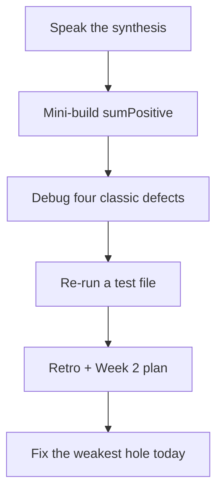
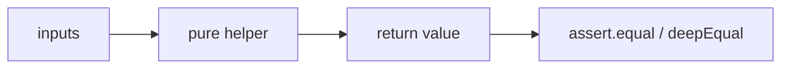

# Month 3 · Week 1 · Day 7
# Week Review — Language Fundamentals

**Program:** Full-Stack Mastery · 18 months  
**Phase:** 1 — Foundations  
**Month index:** [../../README.md](../../README.md)  
**Week 1:** [1](day-01.md) · [2](day-02.md) · [3](day-03.md) · [4](day-04.md) · [5](day-05.md) · [6](day-06.md) · Day 7 (today)  
**Week rhythm today:** Review, repair, plan Week 2  
**Study time:** 3–4 focused hours  
**Student state:** You have named values, branched, looped, exported helpers, and watched `node --test` go red on purpose. Today those ideas must still live in your head — from **this file**, not from a syntax catalog.

Do not start Week 2 because the calendar moved. Start Week 2 because this file’s gate is true.

---

## How to use this textbook

1. Read a section. Close it. Say the idea in one honest sentence.
2. Type the mini-build. Do not paste Day 4’s `validate.js` and rename it `sum`.
3. Predict `sumPositive` on paper, then `node --test`.
4. Optional review links are for later rechecking — not for first repair.

---

## How to read this chapter

This is a **closed-book teaching day**. The synthesis below is the lesson, written so you can re-learn Week 1 from this page alone if the week is foggy.

1. Read a section. Close it. Say the idea in one honest sentence.
2. Then do the review blocks in order. During the mini-build, Days 1–6 stay closed. If you go blank, re-read **this synthesis**, not a random article.
3. Repair the weakest topic **today**. Week 2 (functions, references, array methods) assumes `const`/`let`, `===`, and falsy are automatic.



---

## Week synthesis (the lesson, in this book)

JavaScript **computes**. Browser (DOM later) vs Node (tests now).

**Bindings:** `const` / `let`. `const` ≠ immutable object. No `var`.

**Primitives:** string, number, boolean, undefined, null, bigint, symbol. `typeof null` is `"object"`. `NaN` is a number; `Number.isNaN`.

**Operators and conversion:** arithmetic; template strings; `Number`/`String` on purpose. `+` concatenates if a string is involved.

**`===` vs `==`:** always `===`. `==` coerces.

**Truthy/falsy:** falsy = `false`, `0`, `""`, `null`, `undefined`, `NaN` (plus `-0`, `0n`). `"0"` and `" "` are truthy. Search: `trim() === ""`.

**if / loops:** branch and repeat. Infinite loop = condition stuck true.

**Pure functions + tests:** return values; `node --test` + `assert.equal`. Modules: `export`/`import`.

The rest of this file unpacks each sentence so a student who only has **today’s file** can still teach the week.

---

## Today's contract

By the end of this day you will be able to:

1. Teach Week 1 aloud from the synthesis, without opening Days 1–6.
2. Write `sumPositive(arr)` from the spec, with tests, without converting strings by accident.
3. Diagnose four classic defects (`==`, `if (q)`, `typeof null`, forgotten increment).
4. Re-run `node --test` on this mini-build and on one earlier test file.
5. Write a retro and a Week 2 plan, then repair the weakest language topic today.

**Today's gate.** Closed-book:

> I can explain `const` vs mutation, `===` vs `==`, the falsy list, why search uses trim, and I have a green `node --test` file this week.

If you cannot, stay on Week 1. Functions on a mushy equality story become two problems.

---

## Time box

| Block | Minutes | Work |
|---|---|---|
| 1 | 40 | Closed-book: speak the synthesis |
| 2 | 50 | Mini-build: `review/sum.js` + tests |
| 3 | 30 | Debug four defects on paper |
| 4 | 25 | Review independent code — one fix |
| 5 | 20 | Re-run TESTS / `node --test` |
| 6 | 20 | Design: when not to convert |
| 7 | 25 | Retro + Week 2 plan + repair |

---

# Complete explanation — language you must still own

## 1. Two places to run, one language

JavaScript **computes**. In the **browser**, a module script over HTTP will later change the DOM. In **Node**, `node file.js` and `node --test` run the same language without a page. This week you lived mostly in Node so the ideas are not tangled with clicks.

`"type": "module"` in `package.json` makes `import`/`export` work in Node. `<script type="module">` does the same in the browser. `file://` is still the wrong way to load a page.

## 2. Bindings

`const title = "Harbor clinic"` puts a string in a box named `title` and forbids replacing the box. `let count = 0` allows `count = count + 1`.

```js
const user = { name: "Ada" };
user.name = "Grace"; // allowed
```

> **Wrong belief:** “`const` means immutable data.”  
> **Correct:** `const` means immutable **binding**. Arrays and objects behind `const` can still be mutated.

`var` is function-scoped and hoists in ways that surprise you. Banned.

## 3. Primitives

A primitive is a single value: string, number, boolean, undefined, null, bigint, symbol.

`typeof null` is `"object"` — a historic bug you remember, not a theory of types. `NaN` is a number; `NaN === NaN` is false; `Number.isNaN(x)` is the test.

Strings are immutable. Template strings: `` `Week ${n}` ``.

## 4. Conversion and `+`

`"42"` is not `42`. `Number("42")` is. `Number("  ")` is `0`. `Number("ada")` is `NaN`. Form fields are strings.

`+` concatenates if either side is a string. That is how `"3" + 1` becomes `"31"`. Convert on purpose, then do math.

> **Wrong belief:** “The language will just know.”  
> **Correct:** you convert at the edge. Helpers that take numbers reject strings (`httpLabel("200")` is `"invalid"`).

Today’s `sumPositive` skips `"1"`. It does not `Number("1")`. That is the same design.

## 5. Equality

`===` compares type and value. `==` coerces (`0 == ""` is true). This course uses **`===` and `!==` only**.

If types might differ, convert, then `===`. Do not outsource conversion to `==`.

## 6. Truthy, falsy, blank

Falsy: `false`, `0`, `-0`, `0n`, `""`, `null`, `undefined`, `NaN`. Everything else is truthy, including `"0"` and `" "`.

Blank search is not `if (query)`. Blank is `typeof s !== "string" || s.trim() === ""`.

Worked example:

| Value | `if (value)` | Blank after trim? | `Number(value)` |
|---|---|---|---|
| `""` | skip | yes | `0` |
| `"  "` | run | yes | `0` |
| `"0"` | run | no | `0` |
| `0` | skip | not a string — your helper decides | `0` |

Three questions. Search boxes, scores, and flags are not the same question.

`||` treats `0` as missing. `??` only treats `null`/`undefined` as missing.

> **Wrong belief:** “Falsy means blank.”  
> **Correct:** `0` is falsy and may be a valid score. `"  "` is truthy and is blank after trim.

## 7. Conditions and loops

`if` / `else if` / `else` with braces. `for`, `while`, `for...of`. No `for...in` on arrays. `break` / `continue`. Infinite loop: kill with Ctrl+C; the CPU is busy (Month 1), not “slow.”

```js
for (let i = 0; i < 10; ) {
  // forgot i += 1 — this never ends
}
```

The condition stays true. The process spins. That is debug item four.

## 8. Pure functions, modules, tests

A pure function returns a value from its inputs. No `document`. `export` / `import` with `.js` paths. `node --test` plus `assert.equal` / `assert.deepEqual`. Arrange, act, assert. A failing test is a gift. Do not delete it to go green. Break on purpose once so you know it watches.

Result objects `{ ok: true, query }` vs throws: empty input is a branch, not an exception.



Work in `~\fullstack-lab\month-03\week-01\review\` with `"type": "module"`. Command: `node --test`. There is no page today; Node is enough. Week 3 will demand HTTP for modules in the browser. Do not unlearn `"type": "module"`.

> **Wrong belief:** “`sumPositive` should `Number` every item so `"1"` counts.”  
> **Correct:** skip non-numbers. Same design as `httpLabel("200")` → `"invalid"`. Convert at the edge later.

> **Wrong belief:** “`typeof item === "number"` is enough to add.”  
> **Correct:** `NaN` is a number. `Number.isNaN` keeps the sum honest. `1 + NaN` is `NaN`, and then the whole total is poisoned.

Suggested tests you type:

```js
test("skips strings and zero", () => {
  assert.equal(sumPositive([1, -2, 3, "4", 0, NaN]), 4);
});

test("empty is 0", () => {
  assert.equal(sumPositive([]), 0);
});
```

Predict `[1, -2, 3, "4", 0, NaN]` → `4` on paper. Then run. If you got `"14"` or `NaN`, you concatenated or added `NaN`.

DEBUG.txt needs causes, not slogans. For `0 == ""`, write: `==` coerces; both become empty-ish numbers/strings; `===` would be false; this course never uses `==`. For `if (q)`, write: `"  "` is truthy so a “blank” search would run; trim is the blank test. For `typeof null`, write: historic bug; check `=== null`. For the infinite `for`, write: condition never becomes false; Ctrl+C; add `i += 1`.

---

Closed-book: speak the synthesis.

---

# Mini-build: `review/sum.js`

Function `sumPositive(arr)` summing numbers `> 0`, skip others (including `"1"` unless you convert — **do not** convert; skip non-numbers). Tests.

Worked example: `sumPositive([1, -2, 3, "4", 0, NaN])` is `4` (1 + 3). Zero is not `> 0`. The string `"4"` is skipped. `NaN` is skipped (`typeof NaN === "number"` — use `Number.isNaN` so you do not add it).

```js
export function sumPositive(arr) {
  let total = 0;
  for (const item of arr) {
    if (typeof item === "number" && !Number.isNaN(item) && item > 0) {
      total += item;
    }
  }
  return total;
}
```

That is a shape, not a paste-from-the-book exam cheat if you already closed Days 1–6 — you may retype from **this** synthesis. Tests must lock `"1"` skipped and negatives skipped.

Suggested tests: empty array → `0`; `[1, 2]` → `3`; `[-1, 0, "1"]` → `0`; `[1, NaN, 2]` → `3`.

`package.json` with `"type": "module"`. `node --test` on `sum.test.js`.

Folder: `~\fullstack-lab\month-03\week-01\review\`. If `import` fails, you are in the wrong directory or missing `"type": "module"`. There is no `file://` today.

Write `DEBUG.txt` in full sentences. “JS is weird” is not a cause. `==` coerces; `if (q)` skips trim; `typeof null` is a historic lie; a `for` without `i += 1` never ends. For each, what you observe, why a beginner believes the wrong thing, what to write instead.

Repair **one** hole in `review/repair.js` if `sumPositive` was easy but `===` still wobbles: a five-line `sameNumber(a, b)` that is false for `0` and `""`. Test it. Week 2 will not wait for mushy equality.

---

# Debug (write the cause, from this week)

Write `DEBUG.txt` — cause in full sentences, not “because JS is weird.”

- `==` surprises (`0 == ""`)
- `if (q)` vs trim
- `typeof null`
- infinite loop (`for (let i = 0; i < 10; )` forgetting `i++`)

For each: what the program does, why a beginner believes the wrong thing, what to write instead.

---

# Review and tests

Open **one** independent or Day 4 file. One strength, one defect, one committed fix (a name, a missing test, a `==` you find). Re-run `node --test` on validate or classify. Record PASS in `review/TESTS.md`.

---

# Design

When should a helper convert, and when should it reject? Write a paragraph: search boxes are strings (trim in `toQuery`); HTTP labels are numbers (`httpLabel` rejects `"200"`); `sumPositive` skips strings. The **edge** (the form, the `fetch` status) converts. The **core** stays strict.

`node --test` from `~\fullstack-lab\month-03\week-01\review`. Record the command in `review/TESTS.md`. Re-run Day 5 or independent tests too. Green from memory is not evidence.

Week 2 plan: functions return values; arrays are references; copy before `sort`. If `===` or falsy still wobbles, repair **today** in ten lines. Do not carry a mushy equality story into `map`.

---

# Retro

What was foggy: `const` vs mutation, falsy vs blank, modules, tests? Repair **one** hole with a ten-line script in `review/repair.js`. **Week 2:** functions, scope, arrays, objects, destructuring, spread/rest, array methods, Map/Set, Big-O intuition — explained in Week 2 day files.

```powershell
git add month-03/week-01/review
git commit -m "Record Week 1 JavaScript review."
```

---

## Week 1 definition of done

- [ ] `const`/`let`, primitives, `===`, falsy explained from this book
- [ ] A loop and a conversion written without a tutorial
- [ ] At least one `node --test` file green this week
- [ ] `sumPositive` skips `"1"` and `0`
- [ ] DEBUG.txt has four causes
- [ ] Retro names the Week 2 plan honestly

If `sumPositive(["1"])` is `1`, you converted. Skip the string. If `0 == ""` still feels true, write the DEBUG row again until the sentence uses `===`. Week 2 assumes this is automatic.

`typeof null === "object"` is a fact you recite, not a type theory. Check `=== null`. `Number.isNaN` for `NaN`. `"0"` is a query. `0` may be a score. Blank is trim.

---

## Optional review links

Week 1 language is explained in this chapter. These pages are for later checking, not for first learning.

- [MDN: Grammar and types](https://developer.mozilla.org/en-US/docs/Web/JavaScript/Guide/Grammar_and_types)
- [MDN: Equality comparisons](https://developer.mozilla.org/en-US/docs/Web/JavaScript/Equality_comparisons_and_sameness)
- [Node: test runner](https://nodejs.org/api/test.html)

---

## Tomorrow

Week 2: functions, scope, objects, arrays as **references**. Bring the sticky-note picture. Two names can share one pile.
