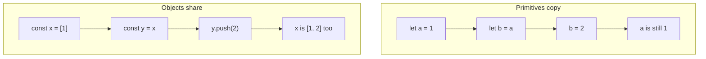

# Month 3 · Week 2 · Day 1
# Functions, Scope, Objects, Arrays

**Month index:** [../../README.md](../../README.md)  
**Week 2:** Day 1 (today) · [2](day-02.md) · [3](day-03.md) · [4](day-04.md) · [5](day-05.md) · [6](day-06.md) · [7](day-07.md)  
**Week rhythm today:** Learn + type-along  
**Study time:** 3–4 focused hours  
**Student state:** Week 1 gate passed. You can name values, branch with `===`, loop, and import a pure helper. Today those helpers get **parameters**, **scope**, and the first real bug of full-stack work: **two names, one array**.

**This week covers:** functions, parameters, returns, scope, arrays, objects, destructuring, spread/rest, array methods, Map, Set; algorithmic thinking; Big-O intuition.

Today: functions, scope, objects, arrays as **references**. Methods and Big-O are Day 2.

---

## How to read this chapter

Week 1 put values in labeled boxes. Today you pack a **recipe** (a function) and you learn that some boxes hold the value itself while others hold an **arrow to a shared pile**.

If you have never programmed beyond `console.log`, use this picture. A **function** is a named recipe: give it eggs and flour (parameters), get a cake (`return`). **Scope** is which kitchen can see which ingredients. An **object** or **array** is a pile of stuff on the counter. Two sticky notes can point at the **same pile**. Moving a mug on the pile is visible to both notes. A **number** is a photocopy: changing your copy does not change mine.



Read each section. Close it. Say it in one sentence. Type the lab. When `a` and `b` both show `[1, 2]`, that is not Node being broken. That is the model.

`this` is **not** today’s topic (Month 4). Do not build methods that depend on `this`. Pass the object in.

---

## Today's contract

By the end of this day you will be able to:

1. Write function declarations, expressions, and arrows — and know `this` is **not** today’s topic (Month 4).
2. Use parameters, defaults, `return`.
3. Explain **scope**: global, function, block.
4. Build objects and arrays; mutate vs reassign; copy vs shared reference.
5. Explain why `const book` still allows `book.title = ...`.
6. Make a shallow copy of an array with `.slice()` and prove it is independent of the original for **top-level** slots.

**Today's gate**

> Two variables can point at the **same** array. Changing one “name” changes the other. Primitives copy; objects share. That bug will appear in Project 2 state if you push into an array you did not mean to share.

If you cannot draw the sticky-note picture, stay here. Day 2 `map`/`filter` will hide the bug until save “corrupts” search.

---

## Time box

| Block | Minutes | Work |
|---|---|---|
| A | 55 | Theory (read slowly — this is the week’s core) |
| B | 50 | Type-along: `clamp` + `demoRefs` |
| C | 70 | Independent: `library.js` + tests |
| D | 20 | Git |
| E | 15 | Recall |

---

# Block A — Theory

## 1. Functions — reusable computation

A **function** is a reusable piece of computation with **inputs** (parameters) and an optional **output** (`return`).

Without functions you copy the same `if` five times. With functions you name the question once and call it.

```js
function add(a, b) {
  return a + b;
}

const add2 = function (a, b) {
  return a + b;
};

const add3 = (a, b) => a + b;
```

Three styles, one idea: given `a` and `b`, produce a sum.

| Style | Shape | Use this week |
|---|---|---|
| **Declaration** | `function add(a, b) { ... }` | Named tools (`clamp`, `createBook`) |
| **Expression** | `const add2 = function (a, b) { ... }` | Same idea, assigned to a const |
| **Arrow** | `const add3 = (a, b) => a + b;` | Short callbacks on Day 2 |

- Declaration: hoisted (Month 4). Fine to use.
- Arrow: concise; **lexical `this`** (Month 4). For Week 2, use arrows for short callbacks, declarations for named tools.
- If you omit `return`, the function returns `undefined`.

```js
function brokenAdd(a, b) {
  a + b; // computed, then thrown away
}
brokenAdd(1, 2); // undefined
```

**Wrong belief:** “A function must `console.log`.”  
**Correct:** prefer **return values**. Log at the edge. Pure functions are testable (Week 1 Day 5).

Calling is `add(1, 2)` — parentheses **invoke**. `add` without `()` is the function value itself (you will pass that as a callback tomorrow). Forgetting `()` is a common bug: you log the function, not the result.

### Parameters, arguments, defaults

The names in the definition (`a`, `b`) are **parameters**. The values you pass (`1`, `2`) are **arguments**.

Too few arguments: missing parameters are `undefined`. Too many: extras are ignored (unless you gather them with rest).

```js
function greet(name = "student") {
  return `Hello, ${name}`;
}

greet();           // "Hello, student"
greet("Ada");      // "Hello, Ada"
```

Default parameters apply when the argument is **missing** or **`undefined`**. They do **not** apply for `""` or `0`. `greet("")` is `"Hello, "` — empty string is a real argument. If you want “blank becomes student,” combine with Week 1 `isBlank`.

**Rest parameters:** `function sum(...nums) { ... }` — `nums` is an array. Day 2 pairs this with spread. Today, know the token `...` in a parameter list **gathers**.

```js
function firstAndRest(first, ...rest) {
  return { first, rest };
}
firstAndRest(1, 2, 3); // { first: 1, rest: [2, 3] }
```

### Return ends the function

After `return`, no later line in that call runs.

```js
function clamp(n, min, max) {
  if (n < min) {
    return min;
  }
  if (n > max) {
    return max;
  }
  return n;
}
```

Worked example: `clamp(15, 0, 10)` hits `n > max`, returns `10`. `clamp(-1, 0, 10)` returns `0`. `clamp(5, 0, 10)` returns `5`. Tests should cover all three branches plus `NaN` if you decide to document it (today: numbers assumed; you may return `n` for `NaN` or treat it as invalid — **document**).

## 2. Scope — who can see which name

**Scope** is the region of source where a binding is visible.

```js
const global = 1;

function outer() {
  const inFn = 2;
  if (true) {
    const inBlock = 3;
    let also = 4;
  }
  // inBlock is not visible here
}
```

| Kind | Where it lives | Visible |
|---|---|---|
| **Global** | Top of a script / module | Everywhere in that file (modules: not automatically other files) |
| **Function** | Inside `function` body | Only that call |
| **Block** | Inside `{ }` | Only that block — `let` / `const` |

- **Global:** avoid. Later: modules are the boundary. A file full of `const` at the top is module-global, which is better than `window` soup, still not an excuse to dump fifty names.
- **Function:** `var` leaked here — another reason we banned it.
- **Block:** `let`/`const` live in `{ }`. `if`, `for`, `while`, and plain `{ }` all create blocks.

Inner functions can **see** outer bindings (a **closure** — Month 4 deepens; today: nested functions may read outer `const`).

```js
function outer() {
  const label = "book";
  function inner() {
    return label;
  }
  return inner();
}
```

`inner` does not receive `label` as a parameter. It **closes over** `label`. That is allowed and ordinary. Month 4 will ask you to *explain* closures. Today you only need: inner can read outer.

**Shadowing:** an inner `const x` hides an outer `x`. Do not shadow on purpose yet. If you are debugging “the wrong `x`,” you probably shadowed.

**Wrong belief:** “If I declared it, I can use it anywhere in the file.”  
**Correct:** `let`/`const` exist from the declaration to the end of the **block**. Using them above the line is a `ReferenceError` (Temporal Dead Zone — Month 4 names it; today: declare first).

Parameters are function-scoped. `a` in `function add(a, b)` is not visible outside `add`.

## 3. Objects — named piles of values

An **object** is a collection of **properties**: keys attached to values.

```js
const book = {
  id: 1,
  title: "Dune",
  tags: ["sf"],
};

book.title;
book["title"];
book.year = 1965;
delete book.year;
```

- Dot access `book.title` when the key is a valid identifier.
- Bracket access `book["title"]` when the key is in a variable or not a simple name.

Keys are strings (or symbols). Values can be anything, including functions (methods):

```js
const counter = {
  n: 0,
  inc() {
    this.n += 1; // Month 4 — avoid this pattern today
  },
};
```

Today: keep methods as **plain functions** that take the object as an argument: `function inc(counter) { return { ...counter, n: counter.n + 1 }; }` — spread is Day 2; until then mutate carefully or return a new object with fields listed.

```js
function withTitle(book, title) {
  return { id: book.id, title, inPrint: book.inPrint };
}
```

`const book` still allows `book.title = ...`. Reassignment `book = {}` is the thing `const` forbids.

**Missing keys** are `undefined`, not an error: `book.author` is `undefined`. Reading `.name` of `undefined` **is** an error (`Cannot read properties of undefined`). That is tomorrow’s `find` bug.

`Object.keys(book)` returns an array of key names. Useful in the console. Prefer known fields in app code rather than looping mystery keys.

## 4. Arrays — ordered piles

An **array** is an ordered list, indexed from `0`.

```js
const ids = [3, 1, 2];
ids.length;  // 3
ids[0];      // 3
ids.push(4); // mutate: now [3, 1, 2, 4]
ids.pop();   // mutate: remove last
```

`ids[9]` is `undefined`, not an error. `ids[-1]` is not “last item” (that is a Python habit). Last item is `ids[ids.length - 1]`.

**for...of** for values. `ids.length` in a `for` if you need the index.

```js
for (const id of ids) {
  console.log(id);
}

for (let i = 0; i < ids.length; i += 1) {
  console.log(i, ids[i]);
}
```

`push` / `pop` / `shift` / `unshift` / `splice` **mutate** the array. That is sometimes what you want in a 10-line script. In helpers you will **test**, mutation of the **caller’s** array is a bug. Day 2: prefer `map`/`filter`/spread. Today: `.slice()` copies top-level slots.

## 5. References vs copies — the gate

```js
let a = 1;
let b = a;
b = 2; // a is still 1

const x = [1];
const y = x;
y.push(2); // x is [1, 2] too
```

Assigning a primitive **copies the value**. Assigning an object/array **copies the reference**, not the contents.

In memory: `x` and `y` are two names for **one** array. `push` changes that array. Both names see it.

```js
const y = x.slice(); // shallow copy of array
```

Now `y` is a **new** array whose slots were copied. `y.push(3)` does not change `x`. Nested objects inside are still shared (shallow). Day 2: spread `{ ...book }` is also shallow.

Worked example you must be able to teach:

```js
const a = [1];
const b = a;
const c = a.slice();
b.push(2);
c.push(3);
// a is [1, 2]
// b is [1, 2]  — same array as a
// c is [1, 2, 3] wait — no: c was copied when a was [1], then c.push(3)
// so c is [1, 3]
```

Trace it:

1. `a` points at array `#1` containing `1`.
2. `b` points at array `#1` too.
3. `c` points at array `#2` containing `1` (copy of slots at that moment).
4. `b.push(2)` mutates array `#1` → `[1, 2]`. `a` sees it.
5. `c.push(3)` mutates array `#2` → `[1, 3]`.

If you said `c` is `[1, 2, 3]`, you copied **after** the push, or you thought `slice` stayed linked.

**Shallow** means: the new array has its own slots, but if a slot holds an **object**, that object is still shared.

```js
const book = { title: "Dune", tags: ["sf"] };
const copy = { id: book.id, title: book.title, tags: book.tags };
copy.tags.push("classic");
// book.tags is also ["sf", "classic"] — tags is the same array
```

For this month, keep data **flat** when you can: `{ id, title, inPrint }` without nested arrays you mutate. If you need tags, copy the tags array too (`book.tags.slice()`), or wait for spread tomorrow.

Project 2: if `state.results` and `state.saved` accidentally alias the same array, saving will “corrupt” search results. `const saved = results; saved.push(item)` was not a copy.

**Wrong belief:** “`const list = oldList` copies.”  
**Correct:** it copies the **reference**. Two names, one array.

**Wrong belief:** “`const` on an array prevents `push`.”  
**Correct:** `const` prevents `list = []`. `push` mutates the object the binding points at.

---

# Block B — Type-along

`fn.js` (`package.json` `{ "type": "module" }`):

```js
export function clamp(n, min, max) {
  if (n < min) return min;
  if (n > max) return max;
  return n;
}

function demoRefs() {
  const a = [1];
  const b = a;
  b.push(2);
  const c = a.slice();
  c.push(3);
  return { a, b, c };
}

console.log(clamp(15, 0, 10));
console.log(demoRefs());
```

Create `~\fullstack-lab\month-03\week-02\day-01\`. Run `node fn.js`. Write whether `a` equals `b` and whether `c` is independent.

Write `PREDICT.txt` **before** running: predicted `{ a, b, c }`. Then `ACTUAL.txt`. If you missed, redraw the two-array picture.

Also log `a === b` and `a === c`. The first should be `true` (same reference). The second `false` (different arrays). `===` on objects asks “same pile?”, not “same contents?”. Tomorrow `assert.deepEqual` asks contents.

---

# Block C — Independent

`library.js`:

- `createBook(id, title)` returns `{ id, title, inPrint: true }`
- `addTag(book, tag)` — **decide**: mutate `book.tags` (create array if missing) **or** return a new object. Document the choice. Prefer **return a new object** if you can write it without spread (list fields). If that is too long, mutate and write a comment that Day 2 will replace this with spread.

`library.test.js` — at least 3 tests with `node --test`.

Suggested tests (claims that can fail):

1. `createBook(1, "Dune")` has `id`, `title`, `inPrint: true`.
2. After `addTag`, the returned (or mutated) book includes the tag.
3. A **reference** test: if you chose “return a new object,” the original `book.tags` must not gain the tag (or original has no `tags` and stays that way). If you chose mutate, write a test that documents that the input **does** change — and a comment that this is the weaker choice.

Do not use `this`. Do not use the DOM.

```powershell
git add month-03/week-02
git commit -m "Week 2 Day 1: functions, objects, array references."
```

---

# Block E — Recall

Close the file.

1. What does a function return if you forget `return`?
2. Where is a `const` inside an `if` visible?
3. Why `const y = x` then `y.push` changes `x`.
4. What does `slice()` copy, and what does it not copy?
5. Why we are not writing `this.n += 1` today.

---

## Definition of done

- [ ] `node fn.js` matches a written PREDICT/ACTUAL for references
- [ ] I can say “primitives copy, objects share” without looking
- [ ] `library.js` exports `createBook` and `addTag`
- [ ] At least 3 tests green
- [ ] Choice to mutate or copy is documented
- [ ] Commit exists

---

## Optional review links

Functions, scope, objects, and array references are explained in this chapter. These pages are for later checking, not for first learning.

- [MDN: Functions](https://developer.mozilla.org/en-US/docs/Web/JavaScript/Guide/Functions)
- [MDN: Working with objects](https://developer.mozilla.org/en-US/docs/Web/JavaScript/Guide/Working_with_objects)
- [MDN: Indexed collections](https://developer.mozilla.org/en-US/docs/Web/JavaScript/Guide/Indexed_collections)

---

## Tomorrow

Destructuring, spread/rest, `map`/`filter`/`find`/`some`/`sort` (sort **mutates**), `Set`/`Map`, Big-O intuition. Bring the reference picture. You will need it when `sort` reorders the array you thought was a copy.
