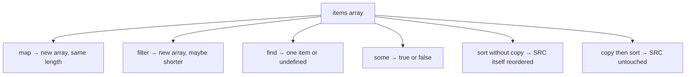

# Month 3 · Week 2 · Day 2
# Destructuring, Spread, Array Methods, Map/Set, Big-O

**Month index:** [../../README.md](../../README.md)  
**Week 2:** [1](day-01.md) · Day 2 (today) · [3](day-03.md) · [4](day-04.md) · [5](day-05.md) · [6](day-06.md) · [7](day-07.md)  
**Week rhythm today:** Exercises + debugging  
**Study time:** 3–4 focused hours  
**Prereq:** Day 1 gate. You can write a function that returns, explain block scope, and draw “two names, one array.”

Project 2 **requires** `map`, `filter`, `find`, `some`, `sort`, destructuring, spread.

Yesterday arrays were piles you `push`ed. Today you **transform** piles with functions you pass in, and you **copy** before anything that mutates.

---

## How to read this chapter

A **callback** is a function you hand to another function: “for each item, run this.” `map`, `filter`, `find`, and `some` all do that. They differ in **what they return**.

`sort` is the trap: it rearranges the **same** array and hands it back. If that array is also your search results, you just destroyed the original order.



Read. Predict. Run. Write PREDICT before ACTUAL. Science, not hope.

---

## Today's contract

By the end of this day you will be able to:

1. Unpack objects and arrays with destructuring, including defaults.
2. Copy objects/arrays with spread and gather arguments with rest.
3. Use `map`, `filter`, `find`, `some`, `reduce` without mutating the source.
4. Copy **before** `sort`, and write a comparator with `localeCompare` for strings.
5. Use `Set` for unique values and know `Map` exists for non-string keys.
6. Explain O(1) / O(n) / O(n²) / O(n log n) as **growth**, not milliseconds.

**Today's gate**

> I can chain `filter` + `map` without mutating the source array. I can explain why nested loops over `n` items are about `n²` work.

If `sortedByYear` reorders `items` in a test, you did not copy. Stay here.

---

## Time box

| Block | Minutes | Work |
|---|---|---|
| A | 55 | Theory |
| B | 40 | Guided: predict mutate vs copy |
| C | 80 | Independent: `methods.js` + tests |
| D | 20 | Git |
| E | 15 | Recall |

---

# Theory

## 1. Destructuring — unpack without a temporary line

**Destructuring** copies **slots** out of an object or array into names.

```js
const book = { id: 1, title: "Dune", year: 1965 };
const { title, year } = book;
const [first, second] = ["a", "b"];
function label({ title }) {
  return title;
}
```

In English: “from `book`, take `title` and `year`.” `book` is unchanged. `title` is a new binding holding a **primitive** copy of the string (strings are primitives). If you destructure a nested object, you still share that nested object (shallow, same as yesterday).

Defaults: `const { pages = 0 } = book` — if `pages` is missing or `undefined`, use `0`. `null` does **not** trigger the default (`null` is present). Empty string `""` is present.

Rename: `const { title: name } = book` — local name `name`, property still `title`.

Skip array slots: `const [, second] = arr`. Rest in destructuring: `const [head, ...tail] = arr`.

**Wrong belief:** “Destructuring copies the whole object deeply.”  
**Correct:** it creates bindings for the properties you named. Nested objects remain shared.

You will see this in callbacks: `items.map(({ title }) => title)`.

## 2. Spread and rest — the same `...` token

```js
const copy = { ...book, year: 2024 }; // shallow; new object
const all = [...ids, 99];
function sum(...nums) {
  return nums.reduce((acc, n) => acc + n, 0);
}
```

**Rest** is “gather” (in a parameter list or on the left of destructuring). **Spread** is “expand” (in an array/object literal or in a call). Same `...` token, different position.

```js
Math.max(...[3, 1, 2]); // expand into max(3, 1, 2)
```

Later properties win: `{ ...book, year: 2024 }` keeps `book`’s other fields and **overrides** `year`. Order matters.

Spread is **shallow**. `{ ...book }` copies the `tags` **reference**. Mutating `copy.tags` mutates `book.tags`. Copy nested arrays on purpose: `{ ...book, tags: [...book.tags] }`.

**Wrong belief:** “Spread clones everything.”  
**Correct:** one level. Nested piles are still shared.

## 3. Array methods (know mutate vs not)

These methods take a **callback** — a function they call once per item.

```js
const years = items.map((item) => item.year);
const old = items.filter((item) => item.year < 1970);
const dune = items.find((item) => item.id === 1); // object or undefined
const has1965 = items.some((item) => item.year === 1965);
const total = items.reduce((acc, item) => acc + item.year, 0);
```

The callback can take `(item, index, array)`. You usually need `item` only.

| Method | Returns | Mutates source? | Length |
|---|---|---|---|
| `map` | new array | no | **same** as source |
| `filter` | new array | no | same or shorter |
| `find` | element or `undefined` | no | n/a |
| `some` | boolean | no | n/a |
| `every` | boolean | no | n/a |
| `reduce` | whatever you accumulate | no | n/a |
| `slice` | new array (subset or copy) | no | as specified |
| `sort` | **the same array** | **yes** | same |
| `push` / `pop` / `splice` | length or removed items | **yes** | changes |

### `map` — transform every slot

**`map`** — new array, **same length**, each slot transformed.

```js
["Ada", "Grace"].map((name) => name.length); // [3, 5]
```

If you `map` and sometimes skip, you are using the wrong tool — use `filter` then `map`, or `flatMap` later. `map` that returns `undefined` for some items still has those slots.

### `filter` — keep some items

**`filter`** — new array; keep items for which the callback returns true.

Truthy callback result keeps the item. Return a **boolean on purpose**, not the title string (a title is truthy, so that “works” until a weird value).

```js
const q = "dune";
items.filter((item) => item.title.toLowerCase().includes(q));
```

`includes` on strings is substring search. Case: `"Dune".includes("dune")` is **false**. Lowercase both sides.

### `find` — first match or undefined

**`find`** — first match or **`undefined`**. Always handle missing: `if (!dune) return;`.

```js
const dune = items.find((item) => item.id === 1);
const title = dune.title; // THROWS if find missed
```

**Wrong belief:** “`find` returns `null` when missing.”  
**Correct:** it returns **`undefined`**. Reading `.title` throws. Guard.

`findIndex` returns `-1` when missing (number), not `undefined`. Do not mix them up.

### `some` / `every` — booleans

**`some` / `every`** — booleans (`some` = at least one; `every` = all).

`some` stops at the first true. Good for “already saved this id”: `list.some((item) => item.id === id)`.

Empty array: `some` is `false` (nothing succeeded). `every` is `true` (vacuous: there is no counterexample). That surprises people. Know it.

### `reduce` — fold to one value

**`reduce`** — start from an **accumulator** (the `0` above) and fold each item into it. `totalQty`, `sum`, “object grouped by key” later.

```js
items.reduce((acc, item) => acc + item.year, 0);
```

The `0` is the **initial value**. If you omit it, the first item is the start and the rest are folded — easy to get wrong on empty arrays (`reduce` of `[]` with no init **throws**). **Always pass the initial value** in this course.

You can write most Week 2 totals with a `for...of` and a `let`. `reduce` is required enough that Project 2 and this lab use it once so you can read it. Prefer `map`/`filter` when they name the job better.

### `slice` — copy or window

**`slice`** — shallow copy / subset; does not mutate. `arr.slice()` copies all. `arr.slice(0, 2)` is the first two items (end index excluded).

### `sort` — mutates — copy first

**`sort`** — **mutates** and returns the **same** array. Copy first.

```js
const sorted = [...items].sort((a, b) => a.title.localeCompare(b.title));
```

**Sort copy:** `[...items].sort((a, b) => a.title.localeCompare(b.title))`

Without copy: `items.sort(...)` reorders `items`. Your next `filter` on “original” is already scrambled. Tests must freeze the original order.

Default `sort` without a comparator converts to strings. `[10, 2, 1].sort()` is `[1, 10, 2]` because `"10"` < `"2"` as strings. **Always pass a comparator** for numbers and for titles.

Comparator: return negative if `a` before `b`, positive if after, `0` if equal. Do not subtract strings (`"10" - "2"` is not dictionary order).

```js
(a, b) => a.year - b.year; // numbers: negative if a.year < b.year
(a, b) => a.title.localeCompare(b.title); // strings, locale-aware
```

`localeCompare` returns negative / zero / positive. Good for titles. For numbers, subtract (watch overflow only in fantasy-sized integers; movie years are fine).

**`push` / `pop` / `splice`** — mutate. Prefer spread/`filter` in helpers you test.

Callbacks can destructure: `items.map(({ title }) => title)`.

### Chain without mutating

```js
const titles = items
  .filter((item) => item.year < 1970)
  .map((item) => item.title);
```

Each step returns a **new** array (for `filter`/`map`). `items` is unchanged. This is the Project 2 search pipeline: filter by query, then map to what the UI needs — still not `innerHTML` (Week 3).

## 4. Map and Set

`Set`: unique values. `set.has(x)`, `set.add(x)`. Useful for “already saved this id.”

```js
const savedIds = new Set();
savedIds.add(3);
savedIds.has(3); // true
savedIds.add(3); // still one 3
```

Build from an array: `new Set(years)`. Back to array: `[...set]`. Order of unique values is insertion order.

`Map`: keys of any type. `map.get(id)`, `map.set(id, value)`. Objects only have string keys.

```js
const byId = new Map();
byId.set(1, book);
byId.get(1);
```

Object pitfall: `obj[1]` and `obj["1"]` are the **same** key (string `"1"`). `Map` can keep the number `1` distinct from `"1"` if you actually use both (you should not mix; still, Map is the honest keyed collection).

For string ids this month, an object or a Map both work. Map is clearer when you iterate `map.entries()`. Set is the tool for uniqueness.

**Wrong belief:** “I’ll use `[]` and `includes` for saved ids; it is simpler.”  
**Correct:** `includes` is a full scan each time (fine for 20 ids). `Set.has` is the name of the idea “is this already in the club.” Prefer Set when the question is membership.

## 5. Algorithmic thinking and Big-O intuition

**Big-O** describes how work **grows** as data grows — not the exact milliseconds.

You do not need calculus. You need a picture: if the list is ten times longer, does the work stay the same, grow ten times, or grow a hundred times?

| Pattern | Intuition | Example |
|---|---|---|
| O(1) | Work does not grow with `n` | `arr[0]`, `set.has` |
| O(n) | One pass | `filter`, `find` (worst) |
| O(n log n) | Sort-shaped | typical `sort` |
| O(n²) | Nested loops over n | Compare every pair |

`find` is O(n) in the worst case (the item is last or missing). `set.has` is treated as O(1) for intuition (the engine hashes; you are not scanning).

You do **not** grind LeetCode this month. You **do** notice: filtering 20 movies is free; filtering 2,000,000 in the browser on every keystroke may not be. Measure later (roadmap Rule 7). Prefer a clear `filter` over a clever trick.

`sort` is typically **O(n log n)** — faster than n², slower than n. Know the phrase.

Two `filter`s in a row is two O(n) passes — still **O(n)**. Readability beats fusing them into one clever loop.

Nested `for` of all items, and inside it `find` on the whole list, is about **n × n**. For Project 2 sizes (tens or hundreds), correctness first. Do not “optimize” a 20-item array. Do not write n² by accident on a huge in-memory dump without noticing.

**Wrong belief:** “Big-O is for interviews, not for my app.”  
**Correct:** it is a vocabulary for “this will get worse as the list grows.” You still pick the clear `filter` today.

Worked example: 100 books. One `filter` ≈ 100 callback calls. Nested compare-every-pair ≈ 10,000. Sort is more than 100, much less than 10,000. Your laptop does not care at 100. Your laptop might care at 1,000,000 on every keystroke.

---

# Block B — Guided debugging

Create `~\fullstack-lab\month-03\week-02\day-02\predict.js` with yesterday’s reference habit plus sort:

```js
const items = [
  { id: 1, title: "Dune", year: 1965 },
  { id: 2, title: "Neuromancer", year: 1984 },
];

const mapped = items.map((item) => item.year);
const sortedWrong = items.sort((a, b) => a.year - b.year);

console.log("mapped", mapped);
console.log("items after sort", items);
console.log("sortedWrong === items", sortedWrong === items);
```

**Before** running, write `PREDICT.txt`: does `items[0].title` still `"Dune"` after `sort`? Is `sortedWrong` the same reference as `items`?

Then `node predict.js`. Write `ACTUAL.txt`. The mutation is the lesson.

Fix in a second file `predict-copy.js`: `[...items].sort(...)` and prove `items[0]` unchanged.

---

# Labs

`methods.js` — given:

```js
export const items = [
  { id: 1, title: "Dune", year: 1965 },
  { id: 2, title: "Neuromancer", year: 1984 },
  { id: 3, title: "Dune Messiah", year: 1969 },
];
```

Export:

- `titles(items)` → map to titles  
- `search(items, q)` → filter case-insensitive substring; blank query → `[]` or all? **Choose all if blank after trim, document it** — Project 2 will validate empty *before* search. Here: if blank, return `[]` to match “do not search empty.”  
- `findById(items, id)` → `find`  
- `hasYear(items, year)` → `some`  
- `sortedByYear(items)` → **copy** then `sort`  
- `uniqueYears(items)` → `Set` then `[...set]`

Tests for each. Include a test that `sortedByYear` does not change the original order of `items`.

Deliberate bug: `items.sort` without copy. Watch the mutation test fail. Fix.

Search details: `q` is a string. Trim. If blank, `[]`. Else `item.title.toLowerCase().includes(q.trim().toLowerCase())`. `"dune"` matches Dune and Dune Messiah.

`findById` may return `undefined`. A test should expect `undefined` for a missing id — not throw.

`package.json` `{ "type": "module" }`. `node --test`.

```powershell
git add month-03/week-02
git commit -m "Week 2 Day 2: array methods, Set, sort-copy tests."
```

---

# Block E — Recall

Close the file.

1. `map` vs `filter` vs `find` vs `some` — return type of each.
2. Why `sort` needs a copy.
3. Why `find` missing is `undefined`, not `null`.
4. Shallow spread: what is still shared.
5. O(n) vs O(n²) in one sentence each.

---

## Definition of done

- [ ] PREDICT written before ACTUAL on the sort trap
- [ ] Every export has a test
- [ ] Mutation test failed when you sorted in place, then passed after copy
- [ ] Blank search returns `[]` and is documented
- [ ] I can say sort is typically O(n log n) without pretending I measured it
- [ ] Commit exists

---

## Optional review links

Destructuring, spread, array methods, Set, and Big-O intuition are explained in this chapter. These pages are for later checking, not for first learning.

- [MDN: Destructuring](https://developer.mozilla.org/en-US/docs/Web/JavaScript/Reference/Operators/Destructuring_assignment)
- [MDN: Spread](https://developer.mozilla.org/en-US/docs/Web/JavaScript/Reference/Operators/Spread_syntax)
- [MDN: `Array`](https://developer.mozilla.org/en-US/docs/Web/JavaScript/Reference/Global_Objects/Array)
- [MDN: `Set`](https://developer.mozilla.org/en-US/docs/Web/JavaScript/Reference/Global_Objects/Set)
- [MDN: Time complexity (glossary)](https://developer.mozilla.org/en-US/docs/Glossary/Time_complexity)

---

## Tomorrow

From memory: an **immutable cart** — `addLine` returns a new cart; tests prove the input did not change. Days 1–2 closed during the drills. Repair from **those files in this book**.
