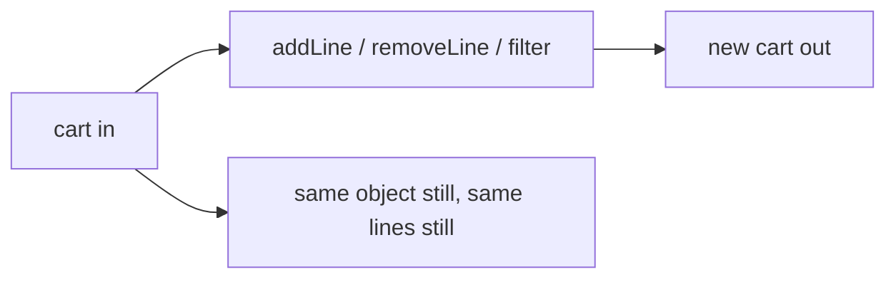

# Month 3 · Week 2 · Day 3
# From Memory: Data and Functions

**Program:** Full-Stack Mastery · 18 months  
**Phase:** 1 — Foundations  
**Month index:** [../../README.md](../../README.md)  
**Week 2:** [1](day-01.md) · [2](day-02.md) · Day 3 (today) · [4](day-04.md) · [5](day-05.md) · [6](day-06.md) · [7](day-07.md)  
**Week rhythm today:** Implement from memory  
**Study time:** 3–4 focused hours  
**Days 1–2 of this week:** closed during the drills. Repair from **those day files in this textbook**, not from MDN.

---

## How to use this textbook

1. Read a section of this recap. Close it. Say it in a full sentence.
2. Type `cart.js` from the spec. Do not paste Day 2 `methods.js`.
3. Predict “original qty still 1” **before** you run `node --test`.
4. Optional review links are for later — not for writing `addLine`.

---

## How to read this chapter

Day 1 and Day 2 had type-along modules. During the drills they stay **closed**. This file contains a recap so you are not sent to another site to learn.

Today’s product is a **cart** that never mutates the object you passed in. The tests are the teacher: if the original `lines` array gains an item, you pushed into a shared pile.



Allowed: this recap, your notes, the failing assertion.  
Not allowed: pasting Day 2 `methods.js`, MDN as teacher, AI writing `cart.js`.

If you are stuck more than 25 minutes, open **only** Day 1 or Day 2 **in this textbook**, read one section, close it, continue. Record `lookups.txt`.

There is **no complete cart** in this file. The behavior is specified. You write it.

---

## Complete explanation (functions + data)

A **function** takes parameters and **returns** a value. Prefer return over `console.log` inside helpers. Default parameters: `function greet(name = "student")`. Rest: `function sum(...nums)` — `nums` is an array.

If you omit `return`, you get `undefined`. After `return`, the function stops.

**Scope:** `const`/`let` in a block `{ }` are not visible outside. Inner functions may read outer bindings. Parameters are not visible outside the function. Avoid globals.

**Primitives vs references:** numbers/strings/booleans copy. Objects and arrays are **references**. `const a = [1]; const b = a; b.push(2);` — `a` is `[1, 2]`. Two names, one array.

`const cart` still allows `cart.lines.push(...)`. `const` forbids `cart = otherCart`, not mutation. That is why tests must check the **input** after the call.

**Copy:** spread `[...arr]`, `{ ...obj }` — **shallow**. Nested objects are still shared. For this month, keep data flat (`{ id, name, qty }`).

If you write:

```js
return { ...cart, lines: cart.lines };
```

you copied the cart shell but **reused** the same `lines` array. `push` on that array still mutates the caller. You must copy lines: `lines: [...cart.lines]` or build a new array with `map`/`filter`.

**Immutability habit:** `addLine` **returns a new cart**. Do not `cart.lines.push(...)`. Use `map`/`filter`/`concat`/spread. Tests will freeze the original and expect it unchanged.

Worked example (you must be able to teach this before coding):

Start: `{ lines: [{ id: "a", name: "Dune", qty: 1 }] }`.

`addLine(cart, { id: "a", name: "Dune" })` → qty becomes 2. Same id: **increment**, do not append a second line.

`addLine(cart, { id: "b", name: "Neuromancer" })` → new line `{ id: "b", name: "Neuromancer", qty: 1 }`.

The original `cart.lines[0].qty` must still be `1` if you return a new structure. If you mutate, the test fails.

How increment without mutate:

```js
const lines = cart.lines.map((line) =>
  line.id === id ? { ...line, qty: line.qty + 1 } : line,
);
return { lines };
```

Unchanged lines are the **same object references** (shallow). That is acceptable this month if you do not mutate those line objects later. The line you increment is a **new** object.

How append without mutate:

```js
return { lines: [...cart.lines, { id, name, qty: 1 }] };
```

**Array methods you must be able to write:**

| Method | Job |
|---|---|
| `map` | new array, same length, transformed items |
| `filter` | new array, items that pass a test |
| `find` | first match or `undefined` |
| `some` / `every` | boolean |
| `reduce` | accumulate to one value |
| `sort` | **mutates** the array — copy first: `[...arr].sort(...)` |

`removeLine` is `filter` that keeps lines whose `id` is **not** the one to remove. Missing id: filter keeps everyone — cart equivalent, still a **new** object/array if you always copy. Returning the same reference when nothing changes is a design choice; tests say “equivalent.” Prefer always returning `{ lines: filtered }` so callers never hold an alias they can `push`.

`filterLines` — name substring, case-insensitive: `line.name.toLowerCase().includes(q.toLowerCase())`. Decide blank `q`: empty filter string could mean “keep all” or “keep none.” **Document it.** Reasonable today: trim; if blank, return all lines (copy). Unlike Day 2 search-empty-`[]`, a cart filter with empty query is “show the cart.”

`totalQty` — `reduce`:

```js
cart.lines.reduce((acc, line) => acc + line.qty, 0)
```

Always pass `0` so an empty cart is `0`, not a throw.

**Objects:** `obj.key`, `obj["key"]`. Destructuring: `const { id, name } = item`. Nested: `const { lines } = cart`.

**`this` is not today** (Month 4). Do not put methods that rely on `this` in the cart.

> **Wrong belief:** “Returning `{ ...cart }` is enough.”  
> **Correct:** you must also copy `lines` (and any line you change). Spread is shallow.

> **Wrong belief:** “`find` always returns an object.”  
> **Correct:** missing → `undefined`. Guard before `.qty`.

### `emptyCart` and identity

`emptyCart()` should return `{ lines: [] }` — a **new** object every call. Two calls should not share the same `lines` array (`emptyCart().lines === emptyCart().lines` should be **false**). If they share, the second cart’s `addLine` will appear in the first. That is the reference bug wearing a factory costume.

```js
export function emptyCart() {
  return { lines: [] };
}
```

A module-level `const EMPTY = { lines: [] }; return EMPTY;` is the bug. Every caller shares one pile.

### `removeLine` in slow motion

`removeLine(cart, id)` is “keep every line whose id is not this one.”

```js
export function removeLine(cart, id) {
  return { lines: cart.lines.filter((line) => line.id !== id) };
}
```

Missing id: filter keeps everyone. Still return a new `{ lines: ... }` so the caller never holds an alias. Tests: “equivalent” means same ids and qtys, not `===` the same object.

### `filterLines` vs Day 2 search-empty

Day 2 `search` returned `[]` on blank so “do not search empty.” A cart already has lines. Blank filter query meaning “show all” is reasonable. Trim first. Case-insensitive `includes` on `name`.

If `q` is not a string, treat as blank or return a copy of all — **document**.

### Why tests freeze the original

```js
const cart = { lines: [{ id: "a", name: "Dune", qty: 1 }] };
const next = addLine(cart, { id: "a", name: "Dune" });
assert.equal(cart.lines[0].qty, 1);
assert.equal(next.lines[0].qty, 2);
assert.notEqual(cart.lines[0], next.lines[0]); // new line object
```

If `qty` became 2 on `cart`, you mutated. If `next === cart`, you returned the same object. Both fail the immutability habit.

> **Wrong belief:** “I’ll `Object.freeze(cart)` in production.”  
> **Correct:** freeze in a test if you want the engine to throw on mutate. Production still **returns copies**. Freeze is a detector, not the design.

### `this` still banned

`cart.add = function () { this.lines.push(...) }` couples mutation to `this`. Month 4. Today: `addLine(cart, item)` as a plain export.

### `totalQty` empty cart

If you write `cart.lines.reduce((acc, line) => acc + line.qty)` **without** `0`, an empty `lines` array throws. The initial value is not decoration.

### Warm-up: copy an array, prove independence

Before the cart, type this in a scratch file or as the first test. It is the whole week in six lines.

```js
const a = [{ qty: 1 }];
const b = a;
b[0].qty = 2;
// a[0].qty is 2 — shared pile

const c = a.map((row) => ({ ...row, qty: row.qty }));
c[0].qty = 9;
// if you spread each row, a[0].qty stays 2
```

`const b = a` copies the arrow. `map` + `{ ...row }` copies each line object. Shallow spread of the cart shell without copying `lines` is the bug `{ ...cart, lines: cart.lines }`.

### Folder, runner, extra claims

```powershell
cd ~\fullstack-lab\month-03\week-02\day-03
node --test cart.test.js
```

`"type": "module"` in this folder’s `package.json`. No HTML today. Node is the lab.

```js
test("addLine increments same id without mutating input", () => {
  const cart = { lines: [{ id: "a", name: "Dune", qty: 1 }] };
  const next = addLine(cart, { id: "a", name: "Dune" });
  assert.equal(cart.lines[0].qty, 1);
  assert.equal(next.lines[0].qty, 2);
});

test("totalQty empty is 0", () => {
  assert.equal(totalQty(emptyCart()), 0);
});
```

`assert.deepEqual` if you compare whole `lines` arrays. `assert.equal` for `qty`. If `emptyCart()` twice shares `lines`, `addLine` on one will appear on the other — test `assert.notEqual(emptyCart().lines, emptyCart().lines)`.

> **Wrong belief:** “Returning the same cart when remove misses is an optimization I need.”  
> **Correct:** a new `{ lines: filtered }` is simpler. Callers never `push` into an alias they thought was a snapshot.

> **Wrong belief:** “I’ll `sort` the cart in `filterLines` so names look nice.”  
> **Correct:** filter keeps; sort is a different helper and it mutates. Copy first if you sort at all. Today’s spec does not require sort — do not sneak it in.

`filterLines` blank query: document “show all” (copy). That differs from search-empty-`[]`. Write one sentence in a comment or README so Week 4 you do not mix the two habits.

---

## Today's contract

Rebuild Week 2 skills as if this were a lab exam.

**Today's gate**

> `addLine` returns a new cart; a test proves the input cart’s quantities did not change. `node --test` is green.

---

## Time box

| Block | Minutes | Work |
|---|---|---|
| A | 20 | Speak: references, shallow spread, map vs filter |
| B | 30 | Warm: copy an array, prove independence |
| C | 90 | `cart.js` + `cart.test.js` from the spec |
| D | 25 | Git + lookups |
| E | 15 | Recall |

---

# Spec

Build `cart.js` + `cart.test.js`.

A cart is `{ lines: [{ id, name, qty }] }`.

Export:

- `emptyCart()`  
- `addLine(cart, { id, name })` — if id exists, increment qty; else append `{ id, name, qty: 1 }`. **Return a new cart** (spread + map). Do not mutate the input.  
- `removeLine(cart, id)`  
- `filterLines(cart, q)` — name substring, case-insensitive  
- `totalQty(cart)` — `reduce`

Tests: add twice same id → qty 2; original cart unchanged after add; filter; remove missing id leaves cart equivalent.

Folder: `~\fullstack-lab\month-03\week-02\day-03\` with `"type": "module"`.

Suggested extra claims (still your tests):

- `emptyCart()` has `lines` length 0.
- `totalQty` of empty is 0.
- After add of a new id, original `lines.length` unchanged.

To prove “unchanged,” keep a copy of `qty` or `JSON.stringify(cart)` **before** the call (stringify is a cheap snapshot for this lab; know it is not a deep freeze). Or `const before = cart.lines[0].qty` then assert `before === 1` after add.

```powershell
git add month-03/week-02/day-03
git commit -m "Day 3: immutable cart helpers from memory."
```

---

# Block E — Recall

Close the file.

1. Why `{ ...cart, lines: cart.lines }` still shares the pile.
2. What `find` returns when the id is missing.
3. Why `reduce` needs `0`.
4. Why `emptyCart()` must not return a module-level singleton.
5. Why `this` is banned today.

---

## Definition of done

- [ ] Input cart unchanged (test)
- [ ] `node --test` green
- [ ] Same id twice → qty 2, not two lines
- [ ] `totalQty` uses `reduce` with an initial `0`
- [ ] No `this`
- [ ] Commit exists

---

## Optional review links

Functions, references, and array methods are explained in this chapter. These pages are for later checking, not for first learning.

- [MDN: `Array.prototype.map`](https://developer.mozilla.org/en-US/docs/Web/JavaScript/Reference/Global_Objects/Array/map)
- [MDN: Spread](https://developer.mozilla.org/en-US/docs/Web/JavaScript/Reference/Operators/Spread_syntax)

---

## Tomorrow

A **collection** module in the shape Project 2 will need: add without duplicates, status, filter, sort with a copy. Not the app.
