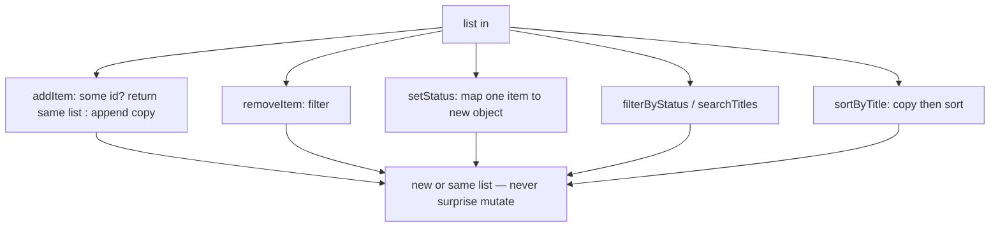

# Month 3 · Week 2 · Day 4
# Feature: Collection Helpers for Project 2

**Month index:** [../../README.md](../../README.md)  
**Week 2:** [1](day-01.md) · [2](day-02.md) · [3](day-03.md) · Day 4 (today) · [5](day-05.md) · [6](day-06.md) · [7](day-07.md)  
**Week rhythm today:** Add a real project feature  
**Study time:** 3–4 focused hours  
**Prereq:** Day 3 gate. You can return a new cart and prove the old one did not change.

Not the Project 2 app. A **module** you could later copy *ideas* from (not paste into the product blindly).

---

## How to read this chapter

Project 2’s saved list is not a pile of `<li>`s. It is an **array of objects**. The UI will draw it later. Today the array lives in Node, where tests can catch `sort` mutating it.

Think of a **collection** as a library card catalog: each card has `id`, `title`, `status`. Operations return a **new catalog**. The old one stays on the desk so a test (and later the UI) can still trust it.



Read Block A until you can say why `filterByStatus(list, "all")` must not return the original reference. Then type the spec.

---

## Today's contract

By the end of this day you will be able to:

1. Treat a saved list as data, not as DOM.
2. Add items **idempotently** (`some` id exists → no duplicate).
3. Update one field with `map` and spread, leaving other items shared (shallow) on purpose.
4. Copy before `sort` and when returning `"all"`.
5. Search with trim; blank → `[]` in **this** spec.
6. Map each function to a Project 2 story in README without building UI.

**Today's gate**

> Every export has a test. Sort/filter copies are documented by a mutation test.

---

## Time box

| Block | Minutes | Work |
|---|---|---|
| A | 45 | Theory: collection as data |
| B | 30 | Type-along: `setStatus` shape |
| C | 80 | Feature: `collection.js` + tests + README |
| D | 20 | Git |
| E | 15 | Recall |

---

## Theory (complete) — a collection as data, not as DOM

Project 2’s saved list is an **array of objects**. The UI will draw it; the **module** must not touch `document`.

That split is Week 1’s purity rule applied to a list: `addItem(list, item)` returns a list. `main.js` (Week 3–4) will call it and then render. Tests never open a browser.

### Status as a string

**Status as a string:** `"want" | "doing" | "done"`. Invalid status: decide now — ignore the update or return the list unchanged. Document it. Do not silently coerce `"DONE"` unless you `toLowerCase` on purpose.

This course’s default: if `status` is not exactly `"want"`, `"doing"`, or `"done"`, `setStatus` returns a **copy** of the list unchanged (or the same list — document). Do not throw. Do not invent `"want"` from garbage. Tests should include `"DONE"` or `"nope"` so the choice is locked.

### Idempotent add

**Idempotent add:** if `some` item already has that `id`, `addItem` returns the same list (or a copy of it) — no duplicates. `some` stops at the first match (enough).

```js
export function addItem(list, item) {
  if (list.some((row) => row.id === item.id)) {
    return list;
  }
  return [...list, item];
}
```

Returning the **same** reference when the id exists is fine: nothing changed. Returning `[...list]` is also fine and safer against a caller who `push`es later. **Document** which you picked. A mutation test on `"all"` filter still matters either way.

### Updates return new arrays

**Updates return new arrays:**

```js
export function setStatus(list, id, status) {
  return list.map((item) =>
    item.id === id ? { ...item, status } : item,
  );
}
```

The unchanged items are the **same object references** (shallow). That is acceptable this month if you do not mutate those objects later.

Missing `id`: `map` returns a new array of the same items. Fine.

### Search and blank

**Search:** `trim` the query. If blank, this spec says return `[]` — a deliberate choice so “empty box” is not “show everything.” Project 2 may choose differently (empty = all); **document** whichever you pick in the product. Here, follow the spec: blank → `[]`.

Case-insensitive substring on `title`, same as Day 2.

### Sort copies

**Sort:** `localeCompare` for titles. Always copy: `[...list].sort((a, b) => a.title.localeCompare(b.title))`. `sort` mutates.

Comparator reminder: negative if `a` before `b`. `localeCompare` does that for strings. Do not subtract titles.

### Filter `"all"` returns a copy

**Filter `"all"`:** return a **copy** (`[...list]`), not the original reference, so callers cannot `push` into your stored array by accident.

```js
export function filterByStatus(list, status) {
  if (status === "all") {
    return [...list];
  }
  return list.filter((item) => item.status === status);
}
```

`filter` already returns a new array. `"all"` would be the dangerous alias if you `return list`.

**Wrong belief:** “If I do not `push` in this file, sharing the array is fine.”  
**Correct:** the next file will `push`. Copy at the boundary.

**Wrong belief:** “`const next = list` then `next.push` is a copy.”  
**Correct:** Day 1. References.

Worked example:

| list titles | call | result titles | original order |
|---|---|---|---|
| Dune, Neuromancer | `sortByTitle` | Dune, Neuromancer (D before N) | still Dune, Neuromancer |
| Dune want, Neuromancer done | `filterByStatus(..., "want")` | Dune | unchanged |
| Dune | `searchTitles(..., "  ")` | `[]` | unchanged |
| Dune id 1 | `addItem` same id | still one Dune | unchanged |

### `removeItem`

```js
export function removeItem(list, id) {
  return list.filter((item) => item.id !== id);
}
```

`filter` already copies. Missing id → new array equivalent to the old. Prefer not `return list` when missing, so callers cannot `push` into storage by accident — **or** document that missing id returns the same reference. Tests should `push` on the result of `"all"` filter; they should also check remove.

### Status updates vs replacing the row

`setStatus` must not drop other fields:

```js
item.id === id ? { ...item, status } : item
```

If you write `{ id, status }` you **lost** `title`. Spread first, override `status`.

Invalid status: compare with `===` to `"want"`, `"doing"`, `"done"`. `"DONE"` is not `"done"` unless you `toLowerCase` on purpose. Project 2 will have the same fork. Lock it in a test.

### Search is not filter-by-status

`searchTitles` looks at **title** text. `filterByStatus` looks at **status**. Project 2 will often **compose**: filter status, then search, then sort. Each helper stays one job so tests stay small. Composing two O(n) filters is still O(n).

Blank search → `[]` **in this spec**. Write that sentence in README so you do not “fix” it to return all when you copy the idea into the product (the product may choose all; the product README must say so).

### Mutation test for `"all"`

```js
const list = [{ id: 1, title: "Dune", status: "want" }];
const all = filterByStatus(list, "all");
all.push({ id: 2, title: "X", status: "want" });
assert.equal(list.length, 1);
```

If this fails, you returned the original array. That is the aliasing bug Week 2 exists to kill.

**Wrong belief:** “`filter` for a real status already copies, so `"all"` can `return list` for speed.”  
**Correct:** `"all"` is the common path. Copy. Twenty movies do not care about the extra array.

Worked sort: titles `Neuromancer`, `Dune`. `localeCompare` puts Dune first in many English locales. Original list still Neuromancer first.

---

# Block B — Type-along

In `~\fullstack-lab\month-03\week-02\day-04\`, `"type": "module"`.

Tiny `setStatus` in a scratch file, run with `node`, then delete or keep as comments. Prove `list[0] === next[0]` for the **unchanged** item (same reference) and `list[1] !== next[1]` for the item whose status changed (new object). That is shallow update in the console, not a mystery.

---

`collection.js` — items `{ id, title, status }` where status is `"want" | "doing" | "done"` as strings.

Export:

- `addItem(list, item)` — if `some` id exists, return list unchanged  
- `removeItem(list, id)`  
- `setStatus(list, id, status)`  
- `filterByStatus(list, status)` — if status is `"all"`, return copy of all  
- `sortByTitle(list)` — copy + `localeCompare`  
- `searchTitles(list, q)` — trim; if blank return `[]`

Tests for each. `README.md` maps functions to Project 2 stories (save, remove, filter, sort) without implementing UI.

Example mapping (write this in **your** words in README):

| Helper | Project 2 story |
|---|---|
| `addItem` | Save a search result into My List |
| `removeItem` | Remove from My List |
| `setStatus` | Mark want / doing / done |
| `filterByStatus` | Show only done items, or all |
| `sortByTitle` | Sort the list A–Z |
| `searchTitles` | Filter saved titles by the box (blank handled in UI in the product) |

Do not implement the page. Do not fetch.

Mutation tests you must have:

1. After `sortByTitle`, original title order unchanged.
2. After `filterByStatus(list, "all")`, `push` on the **returned** array does not change `list.length` (because you copied).

### Tests you might skip (do not)

- `addItem` duplicate: length stays 1.
- `removeItem` missing id: equivalent items.
- `setStatus` missing id: titles unchanged.
- `searchTitles("DUNE")` matches `Dune` (lower both sides).
- `searchTitles("   ")` is `[]`.
- `sortByTitle` output order **and** input order.

`node --test`. `"type": "module"`. No `document`.

**Wrong belief:** “README mapping is extra.”  
**Correct:** it is how you will find these helpers when Project 2 starts, without pasting the lab file blindly.

### `addItem` shape

The `item` argument should already be `{ id, title, status }`. Do not accept a giant API document and stash it. Mapping belongs at the search edge (Week 4). Today, tests pass small objects.

If `item` lacks `id`, `some` cannot detect duplicates. Reject or document. Tests should include a well-formed item.

```powershell
git add month-03/week-02/day-04
git commit -m "Add collection helpers with tests for filter/sort/status."
```

---

# Block E — Recall

1. Why `some` is enough for duplicate ids.
2. Why `"all"` must copy.
3. Blank search in **this** spec vs Project 2’s possible choice.
4. Shallow `map`: which objects are new.
5. Invalid status: your documented choice.

---

## Definition of done

- [ ] Every export has a test
- [ ] Sort/filter copies documented by a mutation test
- [ ] README maps helpers to stories, no UI
- [ ] `"DONE"` (wrong case) does not silently become `"done"` unless you documented `toLowerCase`
- [ ] Commit exists

---

## Optional review links

Collection helpers, `some`, `map`, and `sort` copies are explained in this chapter. These pages are for later checking, not for first learning.

- [MDN: `Array.prototype.some`](https://developer.mozilla.org/en-US/docs/Web/JavaScript/Reference/Global_Objects/Array/some)
- [MDN: `String.prototype.localeCompare`](https://developer.mozilla.org/en-US/docs/Web/JavaScript/Reference/Global_Objects/String/localeCompare)

---

## Tomorrow

Regression tests, a refactor that must stay green, and a Big-O paragraph in your words.
