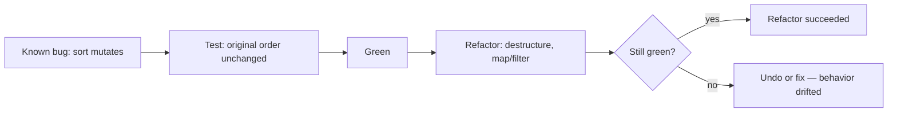
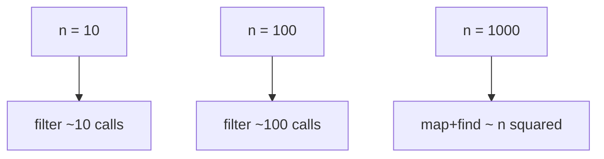

# Month 3 · Week 2 · Day 5
# Tests, Refactor, Docs — Collection Module

**Program:** Full-Stack Mastery · 18 months  
**Phase:** 1 — Foundations  
**Month index:** [../../README.md](../../README.md)  
**Week 2:** [1](day-01.md) · [2](day-02.md) · [3](day-03.md) · [4](day-04.md) · Day 5 (today) · [6](day-06.md) · [7](day-07.md)  
**Week rhythm today:** Tests + refactor + documentation  
**Study time:** 3–4 focused hours  
**Student state:** You have `collection.js`. Today you lock the `sort` bug so it cannot return, then change the **source** without changing **behavior**.

Work in `~\fullstack-lab\month-03\week-02\` next to yesterday’s module. Run tests with `node --test`. Do not open a browser for this day. Do not paste Project 2.

---

## How to use this textbook

1. Read a section. Close it. Say “regression vs refactor” in full sentences.
2. Break `sort` on purpose. Watch `node --test` go red. Restore.
3. Refactor only while tests stay green.
4. Optional review links are for later — not for rewriting Big-O as a formula dump.

---

## How to read this chapter

A **regression** test is a claim about a bug you already met. You write it so the bug has to go red if it comes back.

A **refactor** is a change that a user (and a test) cannot see. If a test goes red, you did not refactor; you changed behavior — or the test was coupled to a name you renamed without updating the test.



Read until you can explain O(n) vs sort in a paragraph you could put in `BIGO.md`. Then work on **your** collection module, not a new feature.

---

## What we are testing (explained)

**Regression:** a test that locks a bug you already met. `sort` mutating the input is the classic. If `sortByTitle` does `list.sort(...)`, a later `filter` on the “original” is already reordered. The test: keep a copy of titles before sort; sort; assert the original titles are still in the old order.

```js
import assert from "node:assert/strict";
import { test } from "node:test";
import { sortByTitle } from "./collection.js";

test("sortByTitle does not mutate input order", () => {
  const list = [
    { id: 1, title: "Neuromancer", status: "want" },
    { id: 2, title: "Dune", status: "want" },
  ];
  const before = list.map((item) => item.title);
  const sorted = sortByTitle(list);
  assert.deepEqual(
    list.map((item) => item.title),
    before,
  );
  assert.deepEqual(
    sorted.map((item) => item.title),
    ["Dune", "Neuromancer"],
  );
});
```

Arrange the list in **non-sorted** order so a mutating sort would be visible. If you start with already-sorted titles, the test is weak.

Also assert the **output** is Dune then Neuromancer. Two claims: output order, input unchanged. You need both. `assert.deepEqual` compares contents — use it for the title arrays. `assert.equal` on two arrays fails because they are different piles even when the strings match.

**Refactor without changing behavior:** destructuring in signatures (`function removeItem(list, id)` stays; inside, `const { title } = item`). Replace `for` + `push` with `map`/`filter` when that is clearer. Tests must stay green — that is how you know the refactor is a refactor.

Do **not** add a new status value. Do **not** add DOM. Do **not** “optimize” two filters into one nested monster.

Names: if `filterByStatus` is unclear, `itemsWithStatus` might be better — then **rename in tests too**. The claim stays.

**Big-O intuition (not a math course):**

- One pass over n items (`map`, `filter`, `find`, `some`, `reduce`) is **O(n)** — time grows linearly with list length.
- `sort` is typically **O(n log n)** — more than a single pass, still fine for hundreds of movies.
- Nested loops over the same list (`for` each item, `find` in the whole list) can become **O(n²)**. For Project 2 sizes, correctness first. Do not “optimize” a 20-item array.

If two `filter`s run in a row, that is two O(n) passes — still fine. Readability beats micro-fusion.

`Set.has` for “is this id saved?” is the O(1)-ish membership check. Scanning `list.some` is O(n). At Project 2 size both are instant. You still **name** the difference so later a million-row admin table does not surprise you.

> **Wrong belief:** “I should cache and index everything now.”  
> **Correct:** you should have tests and clear helpers. Measure later.

> **Wrong belief:** “Green after refactor means I did not have to read the diff.”  
> **Correct:** you still read the diff. Tests catch behavior, not confused names.

Deliberate break: mutate in `sortByTitle`. Confirm test fail. Restore. That is the scientific method.

If you break sort and **no** test fails, the regression does not exist yet. Write it, then break again.

### What “behavior” means during a refactor

Behavior is what tests and users can observe: given this list and this id, `removeItem` returns a list without that id, and the input list still has it.

Not behavior: whether you wrote `function removeItem(list, id)` or `function removeItem(list, itemId)` internally then renamed the parameter. Not behavior: a `for` loop vs `filter` that keep the same items.

If you change blank search from `[]` to “all items,” that is a **product change**. Update the test on purpose, or do not do it today.

### Weak tests vs regression tests

A weak sort test: start with already-sorted titles, call `sortByTitle`, assert the result is sorted. A mutating sort still passes. A regression test uses **Neuromancer then Dune**, copies titles before the call, asserts the **input** still Neuromancer then Dune, **and** asserts the **output** is Dune then Neuromancer.

Filter has the same trap. A test that only checks “want items come back” can pass even if you mutated the source by splicing. Copy ids before `filterByStatus`, then assert the source length and order are unchanged.

```js
test("filterByStatus does not mutate the source", () => {
  const list = [
    { id: "a", title: "Dune", status: "want" },
    { id: "b", title: "Dune 2", status: "done" },
  ];
  const idsBefore = list.map((item) => item.id);
  filterByStatus(list, "want");
  assert.deepEqual(
    list.map((item) => item.id),
    idsBefore,
  );
});
```

`filter` already returns a new array. The regression still matters because a tired rewrite might `splice` in place. The test does not care *how* you stay immutable. It cares that you do.

### How to break sort on purpose

1. Change `return [...list].sort(...)` to `return list.sort(...)`.
2. Run `node --test` from the folder that has `"type": "module"` in `package.json`.
3. Read the failure: `deepEqual` shows the input titles in sorted order.
4. Restore the copy.

If nothing fails, your test used a list that was already sorted, or you asserted only the return value.

PowerShell from the lab folder:

```powershell
cd ~\fullstack-lab\month-03\week-02
node --test collection.test.js
```

Exit code **0** means every assertion passed. A non-zero exit is a gift: a claim is now false. Do not delete the test to go green.

### Safe sort, typed so you own it

The helper you are locking looks like this. Type it if yesterday’s version still mutates. Do not paste a movie app around it.

```js
export function sortByTitle(list) {
  return [...list].sort((a, b) => a.title.localeCompare(b.title));
}
```

`localeCompare` compares strings the way a human expects for titles. Subtracting strings (`a.title - b.title`) yields `NaN` and chaos. Numbers use subtract. Strings use `localeCompare`. Document that in `BIGO.md` only if you mention comparators; the paragraph is still about growth, not Unicode tables.

### Refactor checklist (do not skip)

- Destructuring: `list.map(({ id, title, status }) => ...)` only when you still return a full item (`{ id, title, status }` or `{ ...item }`). Dropping a field is a behavior change.
- Replace `for` + `push` with `filter`/`map` when the loop is “keep or transform.”
- Do not nest `find` inside `map` to “merge two lists” today. That is n² and a new feature.
- Keep exports’ names unless you update every test and README.

A loop that becomes `filter`:

```js
// before: a pile you grow by hand
const kept = [];
for (const item of list) {
  if (item.status === status) {
    kept.push(item);
  }
}
return kept;

// after: same keep-rule, clearer
return list.filter((item) => item.status === status);
```

If `status === "all"`, return `[...list]`, not `list`. Returning the live array lets a later `push` rewrite “the whole collection” by accident. That is a reference bug, not a style choice.

### Big-O in words you can own

Imagine 10 items, then 100, then 1000.

- `filter`: about 10, 100, 1000 callback calls — linear.
- `sort`: more than linear, less than “compare every pair.” Fine at 100 movies.
- For each item, `find` in the same list: about 10×10, 100×100, 1000×1000. At 1000 that is a million comparisons in a naive picture. You will not see that on Project 2. You should still **recognize** the shape if you paste it by accident.

`Set` membership is the tool when the question is “is this id already saved?” while adding many items. `some` is clear and enough for small n.

> **Wrong belief:** “I must use a Map for ids or I am not a real engineer.”  
> **Correct:** a tested `some` on twenty rows is professional. A Map you never test is not.

Write `BIGO.md` as if explaining to Week-1-you. No formula dump. One paragraph can be enough if it is honest; two if you include the nested-find warning.



### TESTS.md is evidence

Fill the date and the command from the terminal, not from memory of a previous day. If you refactored, green **after** the refactor is the evidence. Green from yesterday does not cover today’s diff.

Command: `node --test` (or `node --test collection.test.js`). Record it.

A row that says “tests pass” without a command is a diary, not evidence. Write the exact invocation you typed in PowerShell.

### Names that lie

`sortByTitle` that sorts by status is a bug even if tests are weak. Rename or fix. `filterByStatus` that searches titles is two jobs in a trench coat. Keep one job.

If two helpers share a loop body, a tiny `matchesStatus(item, status)` is a refactor. Tests still call the public exports.

```js
function matchesStatus(item, status) {
  return item.status === status;
}

export function filterByStatus(list, status) {
  if (status === "all") {
    return [...list];
  }
  return list.filter((item) => matchesStatus(item, status));
}
```

That inner function is not a new feature. Tests still import `filterByStatus`. If you export the helper, add a test or keep it unexported.

### Documentation is part of the module

README from Day 4 mapping helpers to stories: update if you renamed. BIGO.md is new today. TESTS.md is evidence. Three files, three jobs. Do not put Big-O in the test file as a comment only — you will not find it later.

> **Wrong belief:** “Comments in collection.js replace BIGO.md.”  
> **Correct:** BIGO.md is the paragraph you can show a human. Comments can still say `// copy because sort mutates`.

README still must say how to run tests from this folder. A stranger clones the lab and should not guess whether to type `node --test` or `npm test`.

### What refactor is not

Not: adding tags, fetch, or a search page. Not: changing `"want"` to `"wishlist"` without updating tests. Yes: clearer names, `filter` instead of `for`, a copy before `"all"`. If a test goes red, stop. Either undo or admit you changed behavior and update the claim on purpose.

### ESM still matters

`collection.test.js` uses `import`. The folder’s `package.json` still needs `"type": "module"`. If Node says you cannot use `import` outside a module, that is not a test-runner bug. Fix `package.json`. There is no DOM today, so you do not serve HTTP — Node reads files from disk. Browser modules still need HTTP later this month.

### Recall (close the file)

1. What makes a sort test weak?
2. What is a refactor vs a feature?
3. O(n) vs O(n²) in one sentence each.
4. Why two filters in a row is still fine.
5. What you do when a deliberate break does not go red.
6. Why `filterByStatus(list, "all")` must not return the original array.
7. Why `assert.equal` is the wrong tool for two title arrays.

---

## Today's contract

**Today's gate**

> A mutation regression exists and failed when I broke sort. `BIGO.md` is my words. Tests green after refactor.

---

## Time box

| Block | Minutes | Work |
|---|---|---|
| A | 25 | What regression vs refactor means |
| B | 40 | Add/confirm mutation test; deliberate fail |
| C | 60 | Refactor collection.js |
| D | 40 | BIGO.md + TESTS.md |
| E | 15 | Recall |

---

# Today

Add a **regression** test: sort must not mutate. If missing, add it. Add a filter (or `"all"` copy) mutation claim if you do not have one.

Refactor `collection.js`: destructuring in signatures; no duplicated loops if `map`/`filter` suffice.

`BIGO.md`: one paragraph — `filter` is O(n); sorting is slower than a single pass; for Project 2’s list sizes this is fine.

Write `BIGO.md` as prose, not a table dump of this file. Include one sentence on why nested `find` inside `map` could become n², and why you are **not** rewriting the module to avoid `filter`.

`TESTS.md` records:

| Command | Claim | Result |
|---|---|---|
| `node --test` | collection helpers + sort regression | PASS |
| deliberate `list.sort` | regression goes red | observed, restored |

`node --test` must pass.

```powershell
git add month-03/week-02
git commit -m "Refactor collection module; document Big-O intuition."
```

---

## Definition of done

- [ ] Mutation regression exists and failed when you broke sort
- [ ] BIGO.md is your words
- [ ] Tests green
- [ ] Refactor did not add DOM or features
- [ ] Commit exists

---

## Optional review links

Regression tests and Big-O intuition are explained in this chapter. These pages are for later checking, not for first learning.

- [Node: test runner](https://nodejs.org/api/test.html)
- [MDN: Time complexity (glossary)](https://developer.mozilla.org/en-US/docs/Glossary/Time_complexity)

---

## Tomorrow

Independent `playlist.js` — same skills, new fields (`minutes`, `genre`), teach-back on references vs `sort` vs Map keys.
