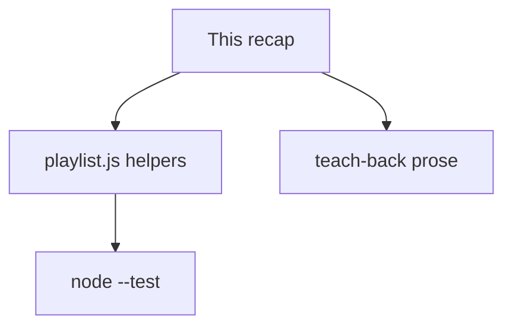
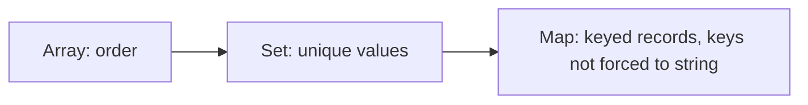

# Month 3 · Week 2 · Day 6
# Independent: Data Layer

**Program:** Full-Stack Mastery · 18 months  
**Phase:** 1 — Foundations  
**Month index:** [../../README.md](../../README.md)  
**Week 2:** [1](day-01.md) · [2](day-02.md) · [3](day-03.md) · [4](day-04.md) · [5](day-05.md) · Day 6 (today) · [7](day-07.md)  
**Week rhythm today:** Independent project work  
**Study time:** 3–4 focused hours  
**Days 1–5 textbook files:** closed for the *challenges*. Repair from **Week 2 Days 1–2 in this book**.

Work in `~\fullstack-lab\month-03\week-02\independent\`. Node only. `"type": "module"`. `node --test`. No HTML required. Do not paste `collection.js`. Do not paste Project 2.

---

## How to use this textbook

1. Read this recap. Close it. Say “primitives copy, objects share” and “copy before sort.”
2. Type `playlist.js` from the spec. Do not paste `collection.js` and rename `status` to `genre`.
3. Predict sort output, then `node --test`.
4. Optional review links are for later — not for writing `totalMinutes`.

---

## How to read this chapter

Today you prove Week 2 without a type-along. The complete explanation below **is** the lesson. A playlist is not a cart and not yesterday’s collection. Same *rules*: return new lists, copy before sort, test membership and totals.



If you copy `collection.js` and rename `status` to `genre` without thinking, you will miss `totalMinutes` and `Set`. Write from the spec.

Stuck more than 25 minutes: open Day 1 or Day 2 in this textbook only. Record lookups.

---

## Complete explanation (this book is the lesson)

**Functions** return values. Parameters are inputs. Defaults apply for `undefined` only. Rest gathers to an array. Forget `return` and you get `undefined`. Log at the edge.

**Scope** is where a binding is visible. `let`/`const` in a block are not visible outside. Inner functions may read outer bindings. No `var`. No `this` in these helpers.

**References:** arrays/objects are shared if you assign them. **Primitives** copy. Mutating a shared array is the bug `const b = a; b.push`.

`const list = oldList` copies the **arrow**, not the pile. `list.push` changes `oldList`.

**Copy with spread** (shallow). `{ ...song, minutes: 4 }` is a new object; nested objects would still be shared. Keep playlist rows flat: `{ id, title, minutes, genre }`.

**`sort` mutates** — copy first: `[...list].sort((a, b) => a.minutes - b.minutes)`. Default string sort will ruin numbers (`[10, 2]`). Subtract numbers in the comparator. For titles, `localeCompare`.

**Methods:** `map` transform (same length), `filter` keep, `find` first or `undefined` (guard), `some` boolean (duplicate id), `reduce` accumulate (always pass initial value, `0` for a sum).

Chain: `filter` then `map` is two new arrays. Source unchanged.

**`Set`:** unique values. `new Set(arr)`, `[...set]` back to array. **`Map`:** key/value where keys can be any type; object keys are strings. For string ids, an object or a Map both work; Map is clearer when you iterate entries.

`genres(list)`: map to genre strings, `new Set(...)`, spread to array. Duplicate `"jazz"` appears once.

**Immutability:** helpers return new lists. Tests prove the input is unchanged. `add` that finds a duplicate id returns the same list (or a copy) — no second row.

**Big-O:** one pass O(n); sort more expensive; Project 2 lists are small. Nested loops over n are n². Do not optimize twenty songs. Do notice the shape.

> **Wrong belief:** “`JSON.parse(JSON.stringify(list))` is how I copy.”  
> **Correct:** that is a blunt deep clone and it drops functions and some types. This week: spread and `map`. You do not need a deep clone for flat rows.

> **Wrong belief:** “`find` returns `null`.”  
> **Correct:** `undefined`. Do not read `.title` until you checked.

Worked example for sort: list `[{ minutes: 5 }, { minutes: 2 }]`. After `sortByMinutes` the **returned** array is 2 then 5. The input’s first row is still 5. If both changed, you sorted in place.

Worked example for `totalMinutes`: `reduce((acc, row) => acc + row.minutes, 0)`. Empty list: `0`.

### Playlist operations, named

| Export | Idea | Mutates input? |
|---|---|---|
| `addTrack` (or `add`) | `some` id → no duplicate; else `[...list, track]` | no |
| `remove` | `filter` id | no |
| `search` | trim; blank → `[]`; else title `includes` | no |
| `filterByGenre` | exact genre string `===` | no |
| `sortByMinutes` | `[...list].sort((a, b) => a.minutes - b.minutes)` | **must not** |
| `totalMinutes` | `reduce` from `0` | no |
| `genres` | `new Set(list.map((t) => t.genre))` then `[...set]` | no |

If `minutes` is missing, `sort` comparator gets `undefined - 5` → `NaN`, order becomes chaos. Guard in tests with complete rows. Do not coerce `"5"` unless documented.

### Map vs object keys (for the teach-back)

An ordinary object key is always a string. `obj[1]` and `obj["1"]` are the same slot. A `Map` can use a number `1` as a key that is not the string `"1"`. This month your ids are strings from APIs (`"OL123"`). Either structure works. Map is the honest “dictionary” when you iterate entries or when keys are not strings. Objects are fine for `{ [id]: true }` membership **if** you remember keys stringify. Prefer `Set` for “is this id saved?”

> **Wrong belief:** “I’ll use an object as a list: `{ 0: song, 1: song }`.”  
> **Correct:** that is an array with extra steps. Arrays for order; Set for uniqueness; Map for keyed records.



### Teach-back (5–8 sentences) must include

1. Primitive copy vs shared array (`push` story).
2. Why `[...list].sort` not `list.sort`.
3. One sentence Map vs object keys.

If you write bullets, rewrite as prose. The length is short; the sentences must still teach.

### Tests that catch aliases

After `sortByMinutes`, `assert.deepEqual(original.map((t) => t.id), idsBefore)`. After `add` duplicate, length unchanged. After `genres`, mutating the returned array (`push("x")`) must not change a second `genres(list)` call if you returned a copy — Sets spread to a new array each call, so that should hold.

`node --test` on `playlist.test.js`. `"type": "module"` in `package.json`.

Do not serve a page today. If you open HTML anyway, still HTTP, still `textContent` — extra credit, not the gate. The gate is the data layer.

`search` trims first. `"   "` is blank → `[]`. `"0"` as a title is searchable. `filterByGenre` uses `===`. `sortByMinutes` copies. `totalMinutes` starts `reduce` at `0`. `genres` uses `Set` then spread.

If you paste `collection.js` and rename `status` to `genre`, you will ship without `totalMinutes`. Type from the table. Predict sort. Then run.

---

## Today's contract

**Today's gate**

> Tests cover add/remove/search/filter/sort/reduce/Set. Sort does not mutate. Teach-back is prose.

---

## Time box

| Block | Minutes | Work |
|---|---|---|
| A | 20 | Speak this recap |
| B | 90 | `playlist.js` + full tests |
| C | 40 | Teach-back |
| D | 20 | Git |

---

# Spec

Build `playlist.js` for `{ id, title, minutes, genre }`.

Folder: `~\fullstack-lab\month-03\week-02\independent\` with `"type": "module"`.

Export: add (no duplicate id), remove, search by title, filter by genre, sort by minutes ascending **copy**, `totalMinutes` reduce, `genres(list)` via `Set`.

Details you must decide and document:

- Search blank query: follow Day 2/4 habit — trim, blank → `[]`.
- `add` duplicate: no second row; document same reference vs copy.
- `filter` unknown genre: `[]`.
- `minutes` are numbers. Do not coerce `"3"` inside `totalMinutes` unless you document it — prefer skip or treat as data already numeric.

Full tests. Teach-back: references vs primitives; why `sort` copies; Map vs object keys in 5–8 sentences.

The teach-back is short compared to Week 1’s 400–700 words, but it must be **sentences**, not bullets. Include one example of `const b = a; b.push`.

### Worked `add` without duplicates

```js
export function addTrack(list, track) {
  if (list.some((row) => row.id === track.id)) {
    return list;
  }
  return [...list, track];
}
```

Test: start with one id `"a"`; add `"a"` again; `length === 1`; original still length 1 if you returned the same reference, **or** original unchanged if you returned a copy. Either way the **logical** list has one row.

Returning the same reference on duplicate is allowed if you document it. Returning `[...list]` is also allowed. What is not allowed: `list.push(track)` when the id is new, because that mutates the caller.

### Worked `sortByMinutes`

Input `[{ id: "b", minutes: 5 }, { id: "a", minutes: 2 }]`. Output ids `a` then `b`. Input still `b` then `a`. Comparator `a.minutes - b.minutes` is ascending. Descending would be `b.minutes - a.minutes` — not today unless you document it.

```js
export function sortByMinutes(list) {
  return [...list].sort((a, b) => a.minutes - b.minutes);
}
```

The `[...]` is the whole lesson. Without it, `list.sort` rearranges the caller’s pile.

Default `sort` without a comparator turns numbers into strings. `10` then sorts before `2` because `"10"` < `"2"` as text. Subtracting numbers is not optional for `minutes`.

### Worked `genres`

Input two jazz and one rock. `genres` returns two strings. Order is first-seen if you `map` then `Set`. Mutating the returned array must not change the playlist rows.

```js
export function genres(list) {
  return [...new Set(list.map((track) => track.genre))];
}
```

`Set` drops duplicates. Spread makes a **new** array. If you returned the Set itself, tests that expect an array would fail, and callers might call `.push` and be confused. Return an array.

### `reduce` without fear

```js
export function totalMinutes(list) {
  return list.reduce((acc, row) => acc + row.minutes, 0);
}
```

The `0` is required. Empty playlist → `0`. If you forget `0` and the list is empty, `reduce` throws. That throw is a gift in a test.

> **Wrong belief:** “I’ll `for` loop because reduce is fancy.”  
> **Correct:** a `for` that sums is honest. This spec asks `reduce` so you can read it in other people’s code. Write it once.

If a row’s `minutes` is the string `"3"`, `"3"` plus a number concatenates or yields a mess depending on order. Do not coerce. Tests use numeric `minutes`. Same design as Week 1: convert at the edge, keep the helper strict.

### Search and filter tests

`search(list, "  ")` → `[]`. `search(list, "neu")` matches Neuromancer case-insensitively. `filterByGenre(list, "jazz")` keeps jazz only. Unknown genre → `[]`. `remove` missing id → equivalent list, input unchanged.

```js
export function search(list, query) {
  if (typeof query !== "string" || query.trim() === "") {
    return [];
  }
  const needle = query.trim().toLowerCase();
  return list.filter((row) => row.title.toLowerCase().includes(needle));
}

export function filterByGenre(list, genre) {
  return list.filter((row) => row.genre === genre);
}

export function removeTrack(list, id) {
  return list.filter((row) => row.id !== id);
}
```

Blank search returns `[]` on purpose — same habit as collection search, different from a cart “show all.” Genre filter uses `===`, not `includes`. `"Jazz"` is not `"jazz"` unless you document case-folding. Pick one and test it.

`"0"` as a title is a real title. It is not blank. Trim does not make `"0"` empty.

### Teach-back opening sentence you may not copy

You must write your own. It should contain: photocopy vs sticky note, `sort` rearranges the only pile, object keys stringify. If those three are missing, rewrite.

Photocopy: a number copied into a second variable. Sticky note: two names pointing at one array. After `b.push`, both names see the extra song. That paragraph is the week.

### Independent folder layout

`playlist.js`, `playlist.test.js`, `package.json` with `"type": "module"`, `teachback.md`. `node --test`. No HTML today unless you want extra credit — the data layer is the challenge.

```json
{ "type": "module" }
```

```powershell
cd ~\fullstack-lab\month-03\week-02\independent
node --test playlist.test.js
```

If `import` fails, you are missing `"type": "module"` or you ran from the wrong folder. There is no `file://` story today because there is no page.

Predict on paper before `node --test`: two tracks, minutes 5 then 2. After `sortByMinutes`, the **input** first id is still the 5-minute row. If both the input and the output start with 2, you called `list.sort`. Restore `[...list]`.

> **Wrong belief:** “`genres` can return the Set so uniqueness is obvious.”  
> **Correct:** callers expect an array. Tests use `deepEqual` on strings. Spread the Set.

> **Wrong belief:** “`totalMinutes` should `Number(row.minutes)` so JSON strings work.”  
> **Correct:** keep minutes numeric in the module. Convert at the edge when a form exists. Same Week 1 design.

`remove` missing id still returns a new array (or an equivalent list you document). The input’s length stays. `search` uses `includes` on titles, not `===`. Genre filter uses `===`. Mixing those two is how jazz search accidentally becomes a substring of `"jazzercise"` — only if you used `includes` on genre. Do not.

Minimum claims to write (names yours):

| Claim | Idea |
|---|---|
| add duplicate id | length stays 1 |
| remove missing id | equivalent list, input unchanged |
| search blank | `[]` |
| search title | case-insensitive `includes` |
| filter unknown genre | `[]` |
| sort minutes | output ascending, input order unchanged |
| totalMinutes empty | `0` |
| genres unique | two jazz → one `"jazz"` |

### Predict before you run

Write on paper: input two tracks, 5 minutes then 2. After `sortByMinutes`, input first id still the 5-minute track. Then run. If you are wrong, the bug is `list.sort`. If you are right, you copied.

```powershell
git add month-03/week-02/independent
git commit -m "Independent playlist module with tests."
```

---

## Definition of done

- [ ] Tests cover add/remove/search/filter/sort/reduce/Set
- [ ] Sort does not mutate (test)
- [ ] Teach-back is prose
- [ ] `totalMinutes` uses `reduce` with `0`
- [ ] `genres` unique via `Set`
- [ ] Commit exists

---

## Optional review links

References, array methods, and Set are explained in this chapter. These pages are for later checking, not for first learning.

- [MDN: `Set`](https://developer.mozilla.org/en-US/docs/Web/JavaScript/Reference/Global_Objects/Set)
- [MDN: `Array.prototype.reduce`](https://developer.mozilla.org/en-US/docs/Web/JavaScript/Reference/Global_Objects/Array/reduce)

---

## Tomorrow

Week review: speak the synthesis, `uniqueNames` with Set, debug shared references / sort / `find` undefined. Repair the weakest topic today if the teach-back already wobbled.
