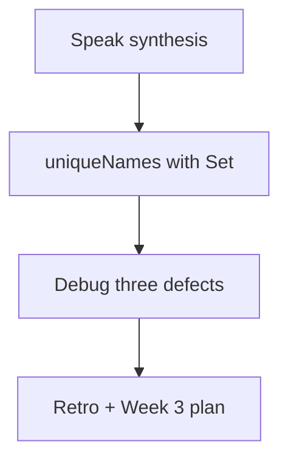
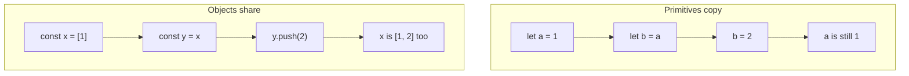

# Month 3 · Week 2 · Day 7
# Week Review — Functions and Data

**Program:** Full-Stack Mastery · 18 months  
**Phase:** 1 — Foundations  
**Month index:** [../../README.md](../../README.md)  
**Week 2:** [1](day-01.md) · [2](day-02.md) · [3](day-03.md) · [4](day-04.md) · [5](day-05.md) · [6](day-06.md) · Day 7 (today)  
**Week rhythm today:** Review, repair, plan Week 3  
**Study time:** 3–4 focused hours  
**Student state:** You can return values from functions, copy before `sort`, and test a collection in Node. Today those ideas must still live in your head — from **this file**.

Do not start Week 3 because the calendar moved. Start Week 3 because this file’s gate is true. The DOM will multiply a mushy reference story, not hide it.

---

## How to use this textbook

1. Read a section. Close it. Say it in one honest sentence.
2. Type `uniqueNames` from this synthesis. Do not paste `genres`.
3. Predict the unique array, then `node --test`.
4. Optional review links are for later — not for first repair.

---

## How to read this chapter

This is a **closed-book teaching day**. The synthesis below is the lesson, written so you can re-learn Week 2 from this page alone.

1. Read a section. Close it. Say it in one honest sentence.
2. Then mini-build. Days 1–6 stay closed. If you go blank, re-read **this synthesis**.
3. Repair the weakest topic **today**. Week 3 (`textContent`, events) assumes you can keep list data in modules.



---

## Week synthesis (this book)

**Functions:** parameters, `return`, defaults, rest. Log at the edge; return in helpers.

**Scope:** global (avoid), function, block (`let`/`const`). Inner functions may read outer bindings.

**Objects and arrays** are references. Primitives copy. Spread copies **shallow**.

**Destructuring:** `const { id, title } = item`. **Spread/rest:** `[...arr]`, `{ ...obj }`, `function f(...args)`.

**Array methods:** `map`, `filter`, `find` (`undefined` if missing), `some`, `reduce`, `sort` (mutates — copy first).

**Map / Set:** Set = unique values; Map = keyed collection (keys not forced to string).

**Big-O intuition:** filter O(n); sort slower; n of Project 2 is small — correctness first.

> **Wrong belief:** “`const list = oldList` copies.”  
> **Correct:** it copies the **reference**.

The rest of this file unpacks those sentences so today’s mini-build is possible with Days 1–6 closed.

---

## Today's contract

**Today's gate.** Closed-book:

> I can explain primitive vs reference, why `sort` copies, what `find` returns when missing, and I have a green `uniqueNames` test.

---

## Time box

| Block | Minutes | Work |
|---|---|---|
| 1 | 40 | Speak the synthesis |
| 2 | 50 | Mini-build `uniqueNames` |
| 3 | 30 | Debug three defects |
| 4 | 25 | Review playlist/collection — one fix |
| 5 | 20 | Re-run `node --test` |
| 6 | 20 | Design: when sharing a reference is a bug |
| 7 | 25 | Retro + Week 3 plan + repair |

---

# Complete explanation — functions and data you must still own

## 1. Functions

A function is a named recipe. Parameters in, `return` out. Declarations, expressions, arrows: all fine; skip `this` (Month 4). Defaults fire for missing/`undefined`, not for `""` or `0`. Rest `...nums` gathers an array.

> **Wrong belief:** “A helper should `console.log`.”  
> **Correct:** return. Tests cannot assert a firework.

If you omit `return`, you get `undefined`. After `return`, later lines in that call do not run.

## 2. Scope

A `const` inside `{ }` is not visible outside. Modules are the real global boundary. Inner functions may read outer names (closure — Month 4 deepens). Do not shadow on purpose.

## 3. References

```js
let a = 1;
let b = a;
b = 2; // a is 1

const x = [1];
const y = x;
y.push(2); // x is [1, 2]
```

Primitives copy. Objects share. `const` does not freeze the pile.

`slice` / `[...arr]` / `{ ...obj }` copy **one** level. Nested arrays inside are still shared unless you copy them too. Keep rows flat this month.



## 4. Destructuring and spread

`const { id, title } = item` unpacks. `function label({ title })` unpacks the argument. `{ ...item, status: "done" }` is a new object with an override. Rest vs spread: gather vs expand.

## 5. Array methods

| Method | Returns | Mutates? |
|---|---|---|
| `map` | new array, same length | no |
| `filter` | new array, kept items | no |
| `find` | item or `undefined` | no |
| `some` / `every` | boolean | no |
| `reduce` | accumulator (pass initial `0`) | no |
| `sort` | **same** array | **yes** |

Always `[...list].sort(comparator)`. Strings: `localeCompare`. Numbers: subtract. Guard `find`. Empty `every` is `true`; empty `some` is `false`.

## 6. Set and Map

`Set` uniqueness: `new Set(names)`, `[...set]`. `has` / `add`. `Map` for keys that should not be forced to string. Object keys stringify.

Today’s `uniqueNames` is Set insertion order: first-seen, duplicates dropped.

## 7. Big-O

O(n) one pass. O(n log n) sort. O(n²) nested full scans. Project 2 n is small. Prefer clear `filter`. Do not fuse passes for speed you did not measure.

## 8. Worked defects (teach these aloud)

**Shared reference.** `const saved = results;` then `saved.push(hit)`. Search re-render shows the saved item inside results. Fix: `addItem` copies fields into a new object in a **new** array.

**Sort mutation.** `results.sort(...)` to display A–Z. User clears sort. Order is still A–Z because you sorted the only array. Fix: `[...results].sort(...)` for display, or keep a “sort key” in state and derive.

**find undefined.** `const book = list.find((b) => b.id === id); console.log(book.title);` throws when id is missing. Fix: `if (!book) return;` then use `book.title`.

**Shallow copy surprise.** `const copy = { ...book }; copy.tags.push("x");` changes `book.tags`. Fix: keep data flat, or copy `tags` too.

> **Wrong belief:** “Green tests on Day 4 mean I can forget references.”  
> **Correct:** Week 3 will `push` into whatever you handed the UI. The habit is the gate.

## 9. uniqueNames, specified so you cannot cheat

`uniqueNames(["Ada", "Ada", "Grace"])` → `["Ada", "Grace"]` (first-seen). `uniqueNames(["Ada", 1, null])` skips non-strings. `uniqueNames` must not `sort` unless you document it — Set insertion order is enough. Original unchanged: clone titles before, call, compare.

If you lowercase to unique `"Ada"` and `"ada"`, that is a different function. Tests must state case-sensitive vs not. This mini-build: **case-sensitive** unless you write otherwise in README.

### uniqueNames implementation picture

```js
export function uniqueNames(arr) {
  const set = new Set();
  for (const item of arr) {
    if (typeof item === "string") {
      set.add(item);
    }
  }
  return [...set];
}
```

`Set` drops duplicates. Insertion order preserved. Non-strings never enter. You could `arr.filter(...)` then `new Set` — also fine. Do not `sort` as a side effect of unique.

Test original unchanged: `const src = ["Ada"]; const out = uniqueNames(src); out.push("Grace"); assert.equal(src.length, 1);`

Do not coerce `1` to `"1"`. `typeof item === "string"` is the guard. Same design as `sumPositive` skipping `"1"`.

### Folder, tests, repair

Work in `~\fullstack-lab\month-03\week-02\review\`. `"type": "module"`. No HTML required.

```powershell
cd ~\fullstack-lab\month-03\week-02\review
node --test
```

```js
import assert from "node:assert/strict";
import { test } from "node:test";
import { uniqueNames } from "./unique.js";

test("first-seen unique strings", () => {
  assert.deepEqual(uniqueNames(["Ada", "Ada", "Grace"]), ["Ada", "Grace"]);
});

test("skips non-strings", () => {
  assert.deepEqual(uniqueNames(["Ada", 1, null]), ["Ada"]);
});

test("result push does not change source", () => {
  const src = ["Ada"];
  const out = uniqueNames(src);
  out.push("Grace");
  assert.equal(src.length, 1);
});
```

If `uniqueNames` returned `src` itself when there were no duplicates, `out.push` would mutate `src`. Always return a new array (`[...set]`).

> **Wrong belief:** “I’ll `sort` the unique names so tests are easier.”  
> **Correct:** first-seen order is the spec. Sorting is a different function and it mutates unless you copy.

> **Wrong belief:** “`find` returning `undefined` is a Node bug.”  
> **Correct:** missing means missing. Guard. `if (!book) return;` then `book.title`.

Design paragraph: sharing a reference is correct for unchanged rows in `map` if nobody mutates those objects later. It is wrong when you return `state.list` from `filterByStatus(..., "all")` and the UI `push`es. Copy on `"all"`. Copy before `sort`. Copy fields when saving a search hit into a collection (Week 4).

Repair in `review/repair.js` if `find` still scares you: a five-line function that returns a title or `""` when missing — tested.

Week 3 will put this list on a page. If `sort` still mutates, the UI will lie after “clear sort.” If `find` is unguarded, a missing id throws and the whole script dies. Fix the data habits **today**. The DOM multiplies them; it does not hide them.

Re-run `node --test` on playlist or collection. Record PASS in `review/TESTS.md` with the exact command from PowerShell.

---

Speak the synthesis.

---

# Mini-build: `uniqueNames(arr)` using `Set`, tested.

`review/unique.js`:

Export `uniqueNames(arr)` that returns an array of unique strings, first-seen order (Set insertion order). Skip non-strings (do not coerce `1` to `"1"` unless you document it — **do not** coerce).

Tests: `["Ada", "ada", "Ada"]` — if you compare case-sensitive, two entries (`Ada`, `ada`). Document case. `["Ada", "Ada"]` → `["Ada"]`. Original array unchanged (push a name onto the result, source length stays).

`node --test`. `"type": "module"`.

---

# Debug: shared array reference; `sort` mutation; `find` undefined (you must handle it — do not read `.title` on `undefined`).

Write `DEBUG.txt` in full sentences:

1. `const saved = results; saved.push(hit)` — why search results change.
2. `results.sort(...)` in a render path — why the next unsorted view is a lie.
3. `items.find(...) .title` — what throws, what to write instead.

---

# Review and tests

One fix on playlist or collection (a missing guard, a weak test, a name). Re-run `node --test`. Record PASS.

---

# Design

When is sharing a reference **correct**? Unchanged items in `map` can stay the same object if nobody mutates them later. When is it **wrong**? Returning the live `state.list` from `filterByStatus(..., "all")` so the UI can `push`. Write a paragraph.

`node --test` from `~\fullstack-lab\month-03\week-02\review`. If uniqueNames is green but collection `sort` still mutates, that is today’s committed fix. Week 3 will render whatever array you hand it.

---

Retro. **Week 3:** DOM, events, bubbling, forms, localStorage, `textContent` vs `innerHTML` (XSS) — explained in Week 3 day files.

Repair one hole in `review/repair.js` if uniqueNames was easy but `find` still scares you.

```powershell
git add month-03/week-02/review
git commit -m "Record Week 2 functions and data review."
```

---

## Week 2 definition of done

- [ ] Primitive vs reference explained from this book
- [ ] `sort` copy habit has a test somewhere this week
- [ ] `find` undefined handled in DEBUG.txt
- [ ] `uniqueNames` tests green
- [ ] Retro names Week 3 without pretending the DOM is “just HTML”

If `uniqueNames` returns the same array it was given, `out.push` mutates the source. Always `[...set]`. If DEBUG.txt cannot explain `find` → `undefined`, repair that before Week 3.

---

## Optional review links

Week 2 is explained in this chapter. These pages are for later checking, not for first learning.

- [MDN: Functions](https://developer.mozilla.org/en-US/docs/Web/JavaScript/Guide/Functions)
- [MDN: `Array`](https://developer.mozilla.org/en-US/docs/Web/JavaScript/Reference/Global_Objects/Array)
- [MDN: `Set`](https://developer.mozilla.org/en-US/docs/Web/JavaScript/Reference/Global_Objects/Set)

---

## Tomorrow

The DOM: select, create, update — and why user strings go through `textContent`, never `innerHTML`.
