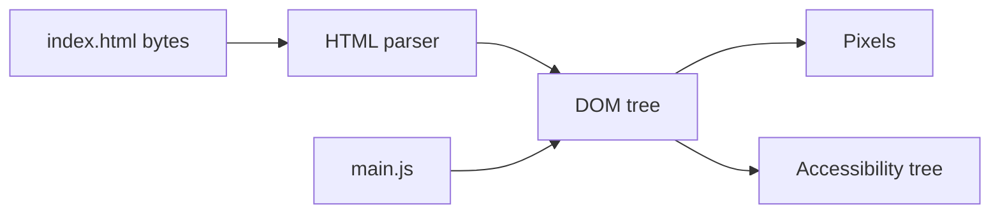

# Month 3 · Week 3 · Day 1
# The DOM: Select, Create, Update — and XSS

**Month index:** [../../README.md](../../README.md)  
**Week 3:** Day 1 (today) · [2](day-02.md) · [3](day-03.md) · [4](day-04.md) · [5](day-05.md) · [6](day-06.md) · [7](day-07.md)  
**Week rhythm today:** Learn + type-along  
**Study time:** 3–4 focused hours  
**Student state:** You can keep lists in pure modules. Today those lists become **nodes on a page**. The dangerous part is not `createElement`. It is treating a title string as **HTML**.

**This week covers:** DOM, selecting/creating/updating elements, events, event propagation, forms, validation, localStorage.

Today: the tree and how you change it **safely**. Events are Day 2.

---

## How to read this chapter

Month 2 taught you that the browser **parses** HTML into a tree. That tree is the **DOM** (Document Object Model). JavaScript can walk it and change it. The screen updates.

HTML source is a **file**. The DOM is a **live machine**. If you change a node, you are not editing the `.html` file on disk. Refresh without saving JS state and the file’s original tree comes back (until Week 3 Day 4 persists).



Untrusted strings — search queries, API titles, anything from `localStorage` — are **data**. `textContent` puts data in the tree as text. `innerHTML` asks the parser to treat the string as **markup**. That is how a title becomes a program in the page. That class of bug is **XSS** (cross-site scripting). This chapter teaches the **safe habit**. It does not teach attack recipes.

Read. Type. When `<b>hack</b>` shows angle brackets as text, that is success. When it goes bold, you used the wrong API.

Serve over **HTTP**. Modules and `file://` still fight.

---

## Today's contract

By the end of this day you will be able to:

1. Explain DOM vs HTML source.
2. Select nodes with `querySelector` / `querySelectorAll`.
3. Create elements, set **text** with `textContent`, attributes with `setAttribute` or properties.
4. Explain why `innerHTML` with untrusted strings is an **XSS** hole.
5. Null-check `querySelector` before using the node.
6. Import a `renderList` helper from `ui.js` in a module page.

**Today's gate**

> The DOM is a live tree. `textContent` is text. `innerHTML` is markup. API titles, search queries, and localStorage data are **untrusted**. They go through `textContent`.

If you cannot say that closed-book, stay here. Event listeners on an innerHTML soup are two problems.

---

## Time box

| Block | Minutes | Work |
|---|---|---|
| A | 55 | Theory (DOM, select, create, XSS) |
| B | 50 | Type-along: safe list + temporary unsafe contrast |
| C | 70 | Independent: two lists, XSS.txt |
| D | 20 | Git |
| E | 15 | Recall |

---

# Block A — Theory

## 1. DOM — the live tree, not the file

The browser parsed HTML into a tree (Month 2). **JavaScript** can walk and change that tree. The screen updates.

`document` is the entry. `document.documentElement` is `<html>`. `document.body` is `<body>` (null if your script ran in `head` before body existed — another reason to put `<script type="module" src="./main.js">` at the **end of body**, or use `type="module"` which defers; this course: script at end of body, module, HTTP).

**Wrong belief:** “`document` is the `.html` file.”  
**Correct:** `document` is the live tree after parse (and after your JS). View Source shows the file. Elements panel shows the tree. They can differ.

Nodes have **parents, children, siblings**. `ul` contains `li`s. You will `append` an `li` to a `ul`. You will not concatenate HTML strings to “build a list.”

## 2. Select — ask the tree a question

```js
const form = document.querySelector("#search-form");
const items = document.querySelectorAll(".result"); // NodeList
```

`querySelector` uses CSS selectors (Month 2): type `ul`, class `.result`, id `#list`, descendant `ul li`, attribute `[data-id]`.

`querySelector` returns the first match or `null`. **Always** check `null` before using.

```js
const ul = document.querySelector("#list");
if (ul === null) {
  throw new Error("missing #list — check the HTML id");
}
```

If you skip the check, `ul.append(...)` throws `Cannot read properties of null`. That error is honest: the selector did not match. Fix the HTML or the selector, not with a random `if` that hides a missing landmark.

`querySelectorAll` returns a **NodeList** (array-like). It is **not** a live HTMLCollection in the same way `getElementsByClassName` often is — treat it as a snapshot of matches. You can `for...of` it. You can `[...nodeList]` if you need array methods. Calling `map` directly on a NodeList may fail — spread or `Array.from` first.

`getElementById` exists; `querySelector("#id")` is enough.

Do not select with brittle full paths that break when you add a wrapper (`body > div > div > ul > li:nth-child(3)`). Prefer **one id** on the list, **classes** on repeated items, `data-*` for ids of rows.

**Wrong belief:** “If it worked in the console, it is in my file.”  
**Correct:** the console runs against the **current** tree. Your file might query before the node exists, or use a typo id. Read the null.

## 3. Create and update — nodes, not strings

```js
const li = document.createElement("li");
li.textContent = item.title; // safe
li.className = "result";
ul.append(li);
```

`document.createElement("li")` makes an element that is **not yet** in the tree. `append` (or `prepend`) inserts it. `remove()` takes a node out. `replaceChildren()` clears and optionally inserts new children — good for re-render: empty the `ul`, then append fresh `li`s.

```js
ul.replaceChildren();
for (const title of titles) {
  const li = document.createElement("li");
  li.textContent = title;
  ul.append(li);
}
```

If you `append` without `replaceChildren`, re-render **duplicates** the list. If you `innerHTML = ""` to clear, you are using HTML parsing to destroy nodes — `replaceChildren()` is the honest empty.

Attributes and properties:

```js
img.alt = "…";
img.setAttribute("hidden", "");
img.removeAttribute("hidden");
```

`classList.add/remove/toggle`. Prefer `classList` over rewriting `className` so you do not wipe other classes.

`dataset`: `btn.dataset.id = "42"` sets `data-id="42"`. Read with `btn.dataset.id` (string). Tomorrow’s delegation uses this.

**Wrong belief:** “I’ll build HTML with `+` and assign once; it is faster to type.”  
**Correct:** string HTML is how untrusted data becomes markup. `createElement` is the default. Speed of typing is not the metric.

## 4. `textContent` vs `innerHTML` — XSS without a payload cookbook

| API | Meaning |
|---|---|
| `textContent` | All descendants as **text**. Assignment escapes. Safe for untrusted data. |
| `innerHTML` | Parse a **string as HTML**. If the string contains markup from a user or API, you may run an attacker’s code (**XSS**). |

```js
// WRONG
el.innerHTML = userQuery;

// RIGHT
el.textContent = userQuery;
```

**XSS (cross-site scripting)** means: a stranger’s data is treated as **the site’s program**. The browser cannot tell a book title from a tag you typed. If you parse titles as HTML, you invited the title’s markup into **your origin**. Scripts on your origin can read `localStorage` (Day 4), cookies for this site, and the DOM. That is why this is a security topic, not a style topic.

This course does **not** give you attack strings to try on other sites. You will use a **harmless** demonstration: a title `"<b>hack</b>"`. With `textContent`, the user sees the characters `<`, `b`, `>`, and the word hack, then `</b>` as text. With `innerHTML`, the browser makes **bold** text. Bold is enough to prove **parse vs text**. You do not need a working exploit. You need the habit.

If you must build structure, use `createElement`, not string HTML.

Trusted static HTML you wrote yourself in the `.html` file is fine — that is the document. The hole is **string assignment** of data you did not author as markup.

**Wrong belief:** “The API is trusted because it is famous.”  
**Correct:** JSON fields can contain anything. Treat them as data, not markup.

**Wrong belief:** “I’ll `replace <` with `&lt;` and then use `innerHTML`.”  
**Correct:** escaping by hand is how holes remain. `textContent` is the API that means “this is text.” Use it.

`innerText` is a different, layout-aware API. Do not use it as your default. `textContent` is the one you want for data.

## 5. Modules in the browser

```html
<script type="module" src="./main.js"></script>
```

```js
// main.js
import { renderList } from "./ui.js";
```

Relative paths. Include `.js`. Serve over HTTP.

`ui.js` must not assume `document` at **import time** for nodes that might not exist yet — query inside `renderList` or pass the `ul` in (better: pass the node, so tests later could pass a fake; this month you may pass `ul`).

```js
export function renderList(ul, titles) {
  ul.replaceChildren();
  for (const title of titles) {
    const li = document.createElement("li");
    li.textContent = title;
    ul.append(li);
  }
}
```

Purity note: `renderList` touches the DOM. It is **not** a Week 1 pure function. That is fine — it is the UI layer. Keep **filter/sort** in another file with no `document`. Same split as Week 2 collection vs a future page.

## 6. A worked render

HTML:

```html
<ul id="list"></ul>
<p id="status"></p>
```

JS:

```js
const ul = document.querySelector("#list");
const status = document.querySelector("#status");
if (ul === null || status === null) {
  throw new Error("missing #list or #status");
}
renderList(ul, ["Dune", "<b>hack</b>"]);
status.textContent = "2 titles";
```

Inspect Elements: two `li`s. The second’s text is the characters of the “tag,” not a `b` element child. That is the proof.

---

# Block B — Type-along

`index.html`: `ul#list`, `p#status`. Semantic skeleton.

Month 2 document: doctype, `lang`, charset, viewport, unique `title`, `header` / `main` / `footer` as appropriate. One `h1`. Script module at end of `body`.

`ui.js`:

```js
export function renderList(ul, titles) {
  ul.replaceChildren();
  for (const title of titles) {
    const li = document.createElement("li");
    li.textContent = title;
    ul.append(li);
  }
}
```

`main.js`: import, `renderList` with `["Dune", "<b>hack</b>"]`. Prove the second item shows angle brackets as text, not bold.

Then **temporarily** use `innerHTML = title` to see the bold. Restore `textContent`. Write `XSS.txt`: what you saw.

Do not keep the `innerHTML` version. The commit should be the **safe** code. XSS.txt records the contrast.

Folder: `~\fullstack-lab\month-03\week-03\day-01\`. Serve HTTP (the same habit as Month 2: Live Server, `npx serve`, or Python’s http.server from that folder).

If the page is blank: Console for module errors; Network for 404 on `ui.js`; Elements for whether `#list` exists.

---

# Block C

A page with an `<input>` and a button (no events yet — you may use a `<form>` and wait for Day 2, **or** add a tiny `click` listener if you already know it; otherwise create the list in `main.js` from a hard-coded array and a second array from a “seed” in the script). Prefer: render two lists — safe and (commented) unsafe.

Suggested shape:

- `#safe-list` always `textContent`.
- `#unsafe-list` code **commented out** that would have used `innerHTML`, plus a paragraph in `XSS.txt` describing what you saw when you uncommented briefly.

Do not ship a live innerHTML renderer of input values.

Null-check both lists.

```powershell
git add month-03/week-03
git commit -m "Week 3 Day 1: DOM render with textContent."
```

---

# Block E — Recall

1. DOM vs View Source.
2. What `querySelector` returns when nothing matches.
3. Why `replaceChildren` before re-append.
4. `textContent` vs `innerHTML` in one sentence each.
5. Why API titles are untrusted.

---

## Definition of done

- [ ] Page served over HTTP with ES modules
- [ ] `#list` null-checked
- [ ] `"<b>hack</b>"` visible as text in the safe list
- [ ] XSS.txt describes the innerHTML contrast; committed code uses textContent
- [ ] I can explain XSS without naming an exploit
- [ ] Commit exists

---

## Optional review links

The DOM, `querySelector`, `textContent`, and why `innerHTML` is dangerous are explained in this chapter. These pages are for later checking, not for first learning.

- [MDN: DOM intro](https://developer.mozilla.org/en-US/docs/Web/API/Document_Object_Model/Introduction)
- [MDN: `querySelector`](https://developer.mozilla.org/en-US/docs/Web/API/Document/querySelector)
- [MDN: `textContent`](https://developer.mozilla.org/en-US/docs/Web/API/Node/textContent)
- [OWASP: XSS](https://owasp.org/www-community/attacks/xss/) (idea only — not a payload cookbook)

---

## Tomorrow

Clicks and submits. Bubbling, `target` vs `currentTarget`, delegation, `preventDefault` so the form does not reload. Bring `textContent` with you.
