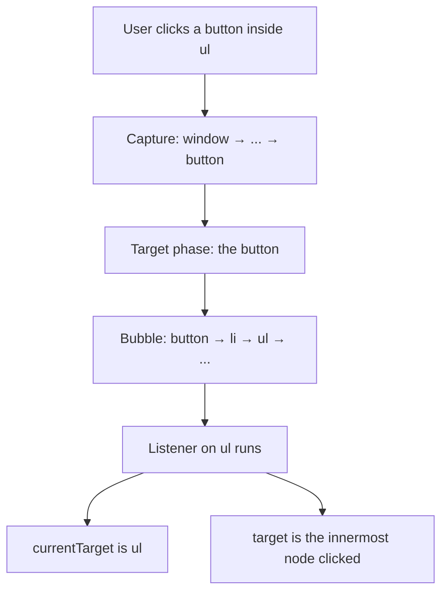

# Month 3 · Week 3 · Day 2
# Events, Propagation, Forms, Validation

**Month index:** [../../README.md](../../README.md)  
**Week 3:** [1](day-01.md) · Day 2 (today) · [3](day-03.md) · [4](day-04.md) · [5](day-05.md) · [6](day-06.md) · [7](day-07.md)  
**Week rhythm today:** Exercises + debugging  
**Study time:** 3–4 focused hours  
**Prereq:** Day 1 gate. You can `querySelector` with a null check, `createElement`, and `textContent` for untrusted strings.

Yesterday the tree sat still until `main.js` filled it. Today the user **does something**, the browser **emits an event**, and your function runs. The classic bug is not “I forgot the listener.” It is “the page reloaded so it looks like my JS never ran,” or “I clicked the icon inside the button and `target` was a `span`.”

---

## How to read this chapter

An **event** is a fact: “this click happened on this node.” The browser delivers that fact down and then up the tree. Your listener is a function that receives an **event object**.



Read until you can say `preventDefault` vs `stopPropagation` without mixing them. Then build the search UI. Predict `target` vs `currentTarget` in `EVENTS.txt` **before** you trust the console.

---

## Today's contract

By the end of this day you will be able to:

1. Register listeners with `addEventListener`, not `onclick` attributes.
2. Draw capture → target → bubble.
3. Use `event.target` vs `event.currentTarget` and `closest` for delegation.
4. Call `preventDefault` on `submit` so the page does not reload.
5. Trim a query; if blank, show an error via `textContent` and do not fake-search.
6. Put `type="button"` on a clear control so it does not submit.

**Today's gate**

> Click bubbles. `event.target` is what was clicked; `currentTarget` is the listener’s element. `preventDefault` on `submit` stops the page reload. Empty search: `trim`, then show a message — do not `fetch`.

---

## Time box

| Block | Minutes | Work |
|---|---|---|
| A | 50 | Theory |
| B | 40 | Guided: log target vs currentTarget |
| C | 80 | Lab: search UI + EVENTS.txt |
| D | 20 | Git |
| E | 15 | Recall |

---

# Theory (complete)

## 1. What an event is

The browser emits **events** when something happens: a click, a key, a form submit, a page load. Your JS can **listen**. When the event fires, the browser calls your function with an **event object**.

```js
form.addEventListener("submit", (event) => {
  event.preventDefault();
  const data = new FormData(form);
  const q = String(data.get("q") ?? "");
});
```

- `addEventListener` can register **multiple** listeners. Assigning `el.onclick = fn` keeps only one.
- Do not use HTML `onclick="..."` attributes. They mix documents with programs and make CSP later harder.
- The handler receives the event. You do not call the handler yourself. Do not write `form.addEventListener("submit", onSubmit())` — the extra `()` **runs it now** and registers `undefined`. Pass `onSubmit`, not `onSubmit()`.

The event object has many fields. Today you need `type`, `target`, `currentTarget`, `preventDefault`, `stopPropagation`. `event.key` is for keyboard later; do not block typing.

**Wrong belief:** “I’ll put JS in the HTML attribute; it is fewer files.”  
**Correct:** listeners belong in modules. The HTML names controls (`id`, `name`, `type`).

## 2. Propagation (capture, target, bubble)

When you click a button inside a `ul`, the event does not exist only on the button.

1. **Capture phase:** the event travels **down** from `window` / document toward the target.
2. **Target phase:** the element that was actually clicked.
3. **Bubble phase:** the event travels **up** through ancestors (`button` → `li` → `ul` → `form` → `body` → …).

Default `addEventListener(type, fn)` listens in the **bubble** phase. (A third argument `{ capture: true }` listens on the way down. You rarely need it this month.)

If both a button and a `ul` listen for `click` in bubble phase, **button runs first** (inner), then `ul` (outer), because bubble goes **up**. (Capture would be outer first.)

**`event.target`:** the innermost element that was clicked (may be a text node’s parent — often an icon `span` inside the button).

**`event.currentTarget`:** the element **you attached the listener to**.

If you listen on `ul` and click a button inside it, `currentTarget` is the `ul`; `target` might be the `<button>` or a child of it.

Worked example: markup `<ul id="list"><li><button data-id="1"><span>Dune</span></button></li></ul>`. Listener on `#list`. Click the word Dune.

- `target` is likely the `span` (or the button, depending where the click hit).
- `currentTarget` is the `ul`.
- `target.id` may be `""`. The id you care about is on the button.

**`closest`:** walk up from `target` until a selector matches.

```js
ul.addEventListener("click", (event) => {
  const btn = event.target.closest("[data-id]");
  if (!btn || !ul.contains(btn)) return;
  const id = btn.dataset.id;
});
```

`closest` includes the node itself. If `target` is already the button, you get the button. If `target` is the `span`, you still get the button.

`ul.contains(btn)` avoids a match that `closest` found **outside** this list (a nested component edge case). Cheap honesty.

**Delegation:** one listener on a **parent** handles clicks for many current and **future** children. Project 2 lists need this — you will add rows after the listener is registered. Do not attach a new listener to every row if the parent can do it.

If you `addEventListener` inside `renderList` on every `li` without removing old ones, re-render **stacks** listeners. Delegation on the `ul` once in `main.js` does not stack.

**`stopPropagation`:** the event will not continue to ancestors. Use it only when a parent **must not** see the event. Do not sprinkle it to “fix” mystery double-handlers — find the extra listener instead.

**`preventDefault`:** stops the **browser’s default action**. For `submit`, that default is “navigate / reload.” For `a`, it is “follow href.” Always `preventDefault` on `submit` if you handle the form in JS. Forgetting it looks like “my JS ran then the page flashed empty.”

They are **not** the same:

| Call | Stops |
|---|---|
| `preventDefault` | Browser default (reload, follow link, check a box, …) |
| `stopPropagation` | Other listeners on **ancestors** (and remaining bubble) |

You can need `preventDefault` and still **want** bubble (parent analytics). You can stop propagation and still reload if you forgot preventDefault on submit.

**Wrong belief:** “`return false` in the handler does everything.”  
**Correct:** in `addEventListener`, `return false` does **not** mean preventDefault. Call the methods.

## 3. Forms in JS

`submit` fires on the **form**, including when the user presses Enter in a text field. Listen on the form, not only on the button.

Read values with `FormData` or `input.value`. `FormData.get("q")` may be `null` — coerce with `String(... ?? "")`.

The input needs `name="q"` for `FormData` to see it. `id` is for labels (`label for`). You want both: label association (Month 2) and a `name` for the form.

Clear button: `type="button"` so it does **not** submit.

If you omit `type` on `<button>`, HTML’s default in a form is **`submit`**. A “Clear” that reloads the page is often a missing `type="button"`.

```html
<form id="search-form">
  <label for="q">Query</label>
  <input id="q" name="q" type="search" />
  <button type="submit">Search</button>
  <button type="button" id="clear">Clear</button>
</form>
<p id="search-error" aria-live="polite"></p>
<ul id="results"></ul>
```

## 4. Validation (JS)

Reuse `isBlank` from Week 1. Native HTML `required` plus your trim check. Show errors in a `p#search-error` via **`textContent`** (never `innerHTML` for the query). `aria-live="polite"` on that `p` is justified ARIA: native HTML cannot announce a dynamic status message by itself (Month 2 first rule still holds — this is a gap native HTML does not fill).

Blank query: **do not fetch** (Week 4). Today, do not even filter — show the error.

Whitespace-only is blank (`trim`). `"0"` is a real query (Week 1). Filter your **hard-coded** titles with `includes` after `toLowerCase`.

```js
function isBlank(s) {
  return typeof s !== "string" || s.trim() === "";
}
```

You may import this from a `validate.js` in the lab folder. The page still must not `innerHTML` the query into the error `p`.

**Wrong belief:** “HTML `required` is enough.”  
**Correct:** `required` still treats `"   "` as filled. Trim in JS.

## 5. Putting it together — a fake search

State in your head (Week 4 will make this an object):

1. User submits.
2. `preventDefault`.
3. Read `q`. If blank, `error.textContent = "Enter a search."`, clear the list, **return**.
4. Else clear the error (`textContent = ""`), `filter` the hard-coded array, `renderList` with `textContent`.
5. Clicks on a result button: delegated `console.log` of `data-id`.

No `fetch` today. No `innerHTML`.

---

# Block B — Guided

Create the HTML skeleton. In `main.js`, before the full lab:

```js
ul.addEventListener("click", (event) => {
  console.log("target", event.target);
  console.log("currentTarget", event.currentTarget);
});
```

Click the button text, then (if you added a span) the span. Write `EVENTS.txt` predictions first.

---

# Lab

Search UI: input `name="q"`, submit, clear button `type="button"`, `ul`, error `p`.

- Submit: preventDefault; if blank, error text; else render a **fake** result list from a hard-coded array `filter`ed by title (no fetch yet).
- Clear: empty input, empty list, clear error.
- Click a result button: `console.log` id via delegation.
- Render titles with `textContent` / `createElement` — no `innerHTML`.

`EVENTS.txt`: target vs currentTarget on one click.

Hard-coded array example (you may change titles):

```js
const BOOKS = [
  { id: "1", title: "Dune" },
  { id: "2", title: "Neuromancer" },
  { id: "3", title: "Dune Messiah" },
];
```

Each result row: `createElement("li")` containing `createElement("button")` with `dataset.id` and `textContent` = title. Do not set the button’s innerHTML to the title.

Serve HTTP. Submit blank: URL must **not** gain `?q=` (that `?` is the browser navigating — you forgot preventDefault).

### Listener mistakes that look like “JS is broken”

| What you wrote | What happens |
|---|---|
| `form.addEventListener("submit", onSubmit())` | `onSubmit` runs **now**, registers `undefined`, later submit does nothing useful |
| `button.addEventListener("click", ...)` only | Enter in the field may still submit the form (listen on **form**) |
| `<button>Clear</button>` | Default type submit → reload |
| `el.onclick = a; el.onclick = b` | Only `b` remains |
| Listener inside `renderList` | Each re-render **adds** another listener; one click fires many times |

Delegation belongs in `main.js` **once**. Render only builds nodes.

### Why `closest` plus `contains`

`closest("[data-id]")` walks **up** including the node. If the click was on a link **outside** the list that also has `data-id` (you nested widgets), `contains` keeps the handler from acting. For a simple lab, `if (!btn) return` is the usual path.

### Validation and `"0"`

If your fake catalog has no title `"0"`, still write in `EVENTS.txt` or `NOTES` that `"0"` is a valid query: `isBlank("0")` is false. Filter may return empty **success** (no titles matched), which is not the blank error. Blank error is for `trim() === ""` only.

**Wrong belief:** “Empty list after search means I should have rejected the query.”  
**Correct:** empty list means no matches. Rejected query means you never filtered.

### Keyboard: Enter submits the form

That is why `submit` on the form is the right event. A click-only search excludes keyboard users (Month 2). Do not `preventDefault` on every `keydown`; you will block typing. Only prevent default on `submit` (and on links you intercept, which you should rarely do).

```powershell
git add month-03/week-03
git commit -m "Week 3 Day 2: form submit, delegation, preventDefault."
```

---

# Block E — Recall

1. Why `onSubmit()` with parentheses is wrong in `addEventListener`.
2. target vs currentTarget.
3. preventDefault vs stopPropagation.
4. Why Clear needs `type="button"`.
5. Why `"   "` is blank.

---

## Definition of done

- [ ] Blank submit shows error via textContent and does not reload
- [ ] `"0"` can match if you add such a title — or NOTES say it is a valid query
- [ ] Delegation logs id
- [ ] EVENTS.txt explains one click
- [ ] No innerHTML of query or titles
- [ ] Commit exists

---

## Optional review links

Events, bubbling, and `preventDefault` are explained above.

- [MDN: Introduction to events](https://developer.mozilla.org/en-US/docs/Learn_web_development/Core/Scripting/Events)
- [MDN: Event bubbling](https://developer.mozilla.org/en-US/docs/Learn_web_development/Core/Scripting/Event_bubbling)
- [MDN: `preventDefault`](https://developer.mozilla.org/en-US/docs/Web/API/Event/preventDefault)

---

## Tomorrow

From memory: a notes list with add, delegated delete, `textContent`, `preventDefault`. Days 1–2 closed during the drills.
