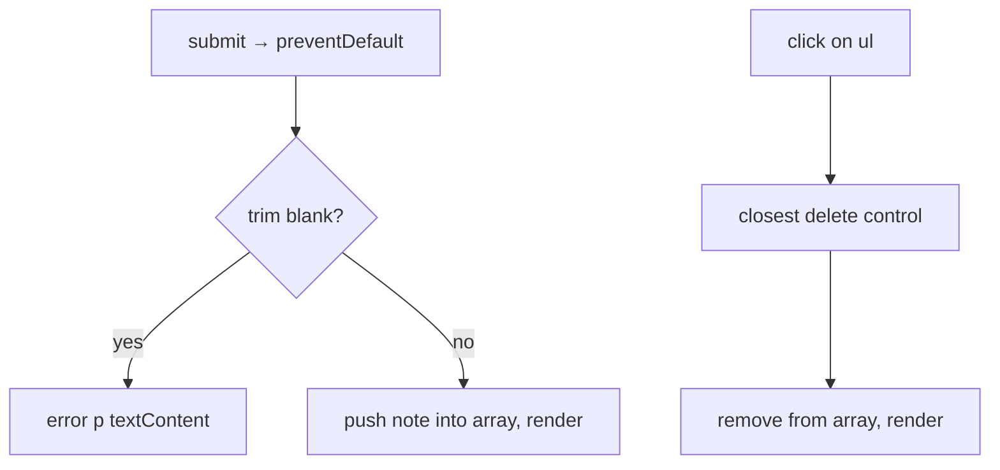
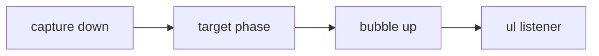

# Month 3 · Week 3 · Day 3
# From Memory: DOM + Events

**Program:** Full-Stack Mastery · 18 months  
**Phase:** 1 — Foundations  
**Month index:** [../../README.md](../../README.md)  
**Week 3:** [1](day-01.md) · [2](day-02.md) · Day 3 (today) · [4](day-04.md) · [5](day-05.md) · [6](day-06.md) · [7](day-07.md)  
**Week rhythm today:** Implement from memory  
**Study time:** 3–4 focused hours  
**Days 1–2 of this week:** closed during the drills. Repair from **those day files in this textbook**.

Work in `~\fullstack-lab\month-03\week-03\day-03\`. Serve over **HTTP**, not `file://`. ES modules need a server. Do not paste Day 2’s search UI. Do not paste Project 2.

---

## How to use this textbook

1. Read a section of this recap. Close it. Say “textContent is text; innerHTML is markup.”
2. Type the notes page. Do not paste Day 2’s search UI.
3. Predict: a note titled `"<b>x</b>"` shows angle brackets. Then prove it.
4. Optional review links are for later — not for first wiring.

---

## How to read this chapter

Type-along pages stay closed. This recap **is** the lesson. You will build a notes list: add from a form, delete via **one** listener on the `ul`. If delete only works on the first note, you bound listeners inside render and lost them — or you used `innerHTML` and blew the nodes away.



Allowed: this file, notes, the Console error. Not allowed: copying Day 2 search UI as the notes app, MDN as teacher, AI pasting the page.

Stuck 25 minutes: open Day 1 or Day 2 in this book only. Record lookups.

---

## Complete explanation (DOM + events)

The **DOM** is the live tree. HTML source is the file. View Source ≠ Elements after JS runs.

`document.querySelector` returns the first match or `null` — check null. `querySelectorAll` returns a NodeList. Brittle deep selectors break; use ids on landmarks and `data-*` on rows.

**Create:** `document.createElement("li")`. **Text:** `el.textContent = userString`. **Never** `el.innerHTML = userString` — that is **XSS** (the browser parses markup; a title like a tag becomes structure, not text). Attributes: `setAttribute` or properties (`btn.dataset.id = id`).

`replaceChildren()` clears a list before re-render so you do not duplicate. Re-render from an **array in JS** (`notes = [...]`). The DOM is the view. The array is the model. If you only delete a DOM node and forget the array, the next add brings the note back.

**Events:** `addEventListener`. Pass the function, not `fn()`. **Submit:** `preventDefault` or the page reloads (URL gets `?`, your array in RAM dies).

**Bubble:** the event goes up. **`target`** = what was clicked; **`currentTarget`** = the listener’s element. **Delegation:** listen on `ul`, `closest("[data-id]")` to find the button. New rows are covered automatically.

`stopPropagation` is rare. Do not use it to silence a second handler you do not understand.

Clear / extra buttons: `type="button"`. A button in a form without type **submits**.

Blank notes: `trim() === ""` — reject. Do not add empty `li`s. `"0"` is not blank.

Error and note text: `textContent` only.

Serve over **HTTP**. ES modules: `import` / `export`, `.js` paths, script `type="module"`.

> **Wrong belief:** “I’ll `innerHTML += '<li>' + note + '</li>'`.”  
> **Correct:** that parses `note` as HTML and also wrecks delegation if you are sloppy. Array + `createElement`.

> **Wrong belief:** “I clicked the button but `target` is the wrong node, so delegation is broken.”  
> **Correct:** `closest` from `target`. That is the feature.

Worked example: notes `["buy milk", "<b>x</b>"]`. The second row shows angle brackets as text. Delete the first: click `button[data-index="0"]` (or `data-id`). After render, indexes must be rebuilt if you used index — **ids are stabler**. Prefer `crypto.randomUUID()` if available, or `String(Date.now())` plus a counter, so delete does not remove the wrong row after a shift. If you use index, re-render **all** `data-index` every time. Document the choice.

This chapter does not teach attack recipes. `"<b>x</b>"` as **text vs bold** is the whole XSS proof you need.

---

## Today's contract

**Today's gate**

> Notes add and delete without reload, without `innerHTML`, with delegation, blank rejected.

---

## Time box

| Block | Minutes | Work |
|---|---|---|
| A | 20 | Speak DOM vs source, XSS, bubble |
| B | 80 | Notes page from spec |
| C | 30 | NOTES.txt bubbling paragraph |
| D | 20 | Git + lookups |

---

# Spec

Build a **notes** page: input + add button; `ul` of notes; each note a delete button.

- `textContent` only  
- form `preventDefault`  
- delegation for delete (`data-index` or `data-id`)  
- blank note rejected  
- no `innerHTML`  
- `NOTES.txt`: bubbling in one paragraph  

Semantic HTML, labels, HTTP. `~\fullstack-lab\month-03\week-03\day-03\`.

Prove preventDefault: submit blank; URL has no query string; error `p` visible.

### Model vs view, on this page

Keep `let notes = []` (or `{ items: [] }`) in `main.js`. Add: trim, reject blank, `notes = [...notes, { id, text }]`, then `render(notes)`, do not `ul.innerHTML +=`. Delete: find id from `closest`, `notes = notes.filter(...)`, `render(notes)`.

If you delete only `li.remove()` and leave the array, the next add re-renders from the array and the “deleted” note returns. The DOM is not the database.

Ids: `crypto.randomUUID()` or incrementing `let nextId = 1`. Indexes as `data-index` work only if **every** render rewrites indexes. After deleting index 0, old index 1 is the new 0 — that is why ids hurt less.

### XSS check on your own notes

Add a note whose text is `"<b>x</b>"`. The row must show the characters, not bold. If it is bold, you used `innerHTML`. Fix before commit. You do not need any other “test string.” Bold vs text is the whole proof.

### Bubbling paragraph (NOTES.txt)

Write: the click happens on the delete button (or a child). The event bubbles to `ul`. The listener on `ul` runs. `currentTarget` is `ul`. `target` may be the button or a span inside it. `closest` finds the control with `data-id`. That is why new notes, added after the listener was registered, still delete. If you only listened on buttons that existed at page load, new notes would not delete.

> **Wrong belief:** “I need to re-bind delete on every render.”  
> **Correct:** that is how you stack handlers. Delegate once.

### HTTP and modules

`index.html` at end of body: `<script type="module" src="./main.js"></script>`. `main.js` imports `renderNotes` from `./ui.js` if you split. Serve HTTP. Console 404 on `ui.js` means the path is wrong, not that “modules do not work.”

From the day folder in PowerShell:

```powershell
cd ~\fullstack-lab\month-03\week-03\day-03
npx --yes serve .
```

Open the printed URL (`http://127.0.0.1:...`). If you double-click `index.html`, the address bar starts with `file://` and module imports fail. That is not a JavaScript bug. Live Server in the editor is also HTTP — write the origin you actually used.

### Render function shape

```js
export function renderNotes(ul, notes) {
  ul.replaceChildren();
  for (const note of notes) {
    const li = document.createElement("li");
    const text = document.createElement("span");
    text.textContent = note.text;
    const btn = document.createElement("button");
    btn.type = "button";
    btn.textContent = "Delete";
    btn.dataset.id = note.id;
    li.append(text, btn);
    ul.append(li);
  }
}
```

You type this from the recap, not from Day 2’s search UI. Delete label is visible text (Month 2). `type="button"` so a future wrapper `<form>` does not submit.

`replaceChildren()` with no arguments empties the list. If you `append` without clearing, every add duplicates the old rows. If you `innerHTML = ""` to clear, you are one habit away from stuffing user text into `innerHTML`. Prefer `replaceChildren`.

### Form markup you must not skip

Label the input. `name` on the field if you use `FormData`. One `h1`. Serve HTTP. If add “does nothing,” open Console: is the module 404, or did you forget preventDefault and miss the flash, or is `querySelector` null?

```html
<form id="note-form">
  <label for="note">Note</label>
  <input id="note" name="note" type="text" autocomplete="off" />
  <button type="submit">Add</button>
</form>
<p id="error" aria-live="polite"></p>
<ul id="list"></ul>
```

`aria-live="polite"` on the error is justified: native HTML cannot announce a JS validation message. The note text still goes through `textContent`.

Null-check in `main.js` before you listen:

```js
const form = document.querySelector("#note-form");
const listEl = document.querySelector("#list");
const errorEl = document.querySelector("#error");
if (!form || !listEl || !errorEl) {
  throw new Error("Missing #note-form, #list, or #error");
}
```

A throw here is kinder than `Cannot read properties of null`. Wrong id in HTML is the usual cause.

### Time-box reminder if you stall

Blank reject first (smallest). Then add + render. Then delete delegation. Then XSS check with `"<b>x</b>"`. Do not start CSS art. Do not start localStorage (tomorrow).

> **Wrong belief:** “A contenteditable div is a simpler notes app.”  
> **Correct:** it is a harder XSS and keyboard story. `input` or `textarea` in a form.

> **Wrong belief:** “`file://` is fine if I do not use modules.”  
> **Correct:** you use modules. Serve HTTP. The course does not practice `file://` pages.

### Event listener once

```js
ul.addEventListener("click", (event) => {
  const btn = event.target.closest("button[data-id]");
  if (!btn || !ul.contains(btn)) {
    return;
  }
  notes = notes.filter((note) => note.id !== btn.dataset.id);
  renderNotes(ul, notes);
});
```

This is the delete path. Register it **once** in `main.js`. `notes` lives in `main.js` (or a small state object). `renderNotes` does not add listeners.

`ul.contains(btn)` stops a click on a button that was moved or that lives outside this list. `closest` without that check can match a delete control elsewhere on the page if you nest badly.

`dataset.id` is always a **string**. If you stored numeric ids, compare with `String(note.id)` or keep ids as strings from the start. `1 !== "1"` is Week 1 coming back.

### Blank path

```js
form.addEventListener("submit", (event) => {
  event.preventDefault();
  const q = String(new FormData(form).get("note") ?? "");
  if (typeof q !== "string" || q.trim() === "") {
    errorEl.textContent = "Write a note first.";
    return;
  }
  errorEl.textContent = "";
  notes = [...notes, { id: crypto.randomUUID(), text: q.trim() }];
  renderNotes(listEl, notes);
  form.reset();
});
```

`preventDefault` first. Then trim. Then work. `"0"` is a note. `"   "` is not.

If you `return` before `preventDefault`, a blank submit still navigates. Put prevent first, even on the error path.

### Capture vs bubble, in one paragraph you can say

The event travels **down** (capture) to the target, then **up** (bubble). You almost always listen in bubble (the default). Delegation listens on an ancestor during bubble. `currentTarget` is the ancestor. `target` is the innermost node — sometimes a text node’s parent, sometimes an icon inside the button. That is why `closest` exists.



Do not call `stopPropagation` to “fix” two handlers. Remove the extra handler.

### Predict, then prove

Predict: submit `"<b>x</b>"`. The list row shows angle brackets. If the word is bold, you assigned `innerHTML`. Fix `textContent` before you commit.

Predict: three notes, delete the middle. The other two remain, ids still match. If the wrong row vanishes, you used a stale `data-index` after a shift. Prefer ids.

Predict: blank submit. Address bar has no `?`. Error `p` has text. If the page flashes empty, you reloaded. `preventDefault` first.

> **Wrong belief:** “Delegation is slower so I bind each Delete in render.”  
> **Correct:** re-binding stacks listeners. One listener on `ul` is the design. New notes are free.

> **Wrong belief:** “`querySelectorAll("button")` and a loop of listeners is the same as delegation.”  
> **Correct:** that only covers buttons that exist **now**. The next `replaceChildren` throws those nodes away. Listen on the parent that survives.

`NOTES.txt` is one paragraph, not a glossary. If `currentTarget` never appears, rewrite.

There is no `localStorage` today. If you add it, you are stealing tomorrow and you will skip the parse lesson. RAM is enough. Refresh wiping notes is expected until Day 4.

```powershell
git add month-03/week-03/day-03
git commit -m "Day 3: notes list from memory with delegated delete."
```

---

# Recall

Close the file.

1. Why `textContent` and not `innerHTML` for a note.
2. What `preventDefault` stops on submit.
3. Why `closest` exists.
4. Why the array is the model.
5. Why `type="button"` on Delete.
6. Why `file://` is the wrong way to load this page.
7. Why `dataset.id` compared with `===` to a number fails.

---

## Definition of done

- [ ] Add and delete work after several notes
- [ ] Blank rejected
- [ ] NOTES.txt is a paragraph on bubbling
- [ ] No innerHTML
- [ ] Commit exists

---

## Optional review links

DOM and events are explained in this chapter. These pages are for later checking, not for first learning.

- [MDN: `textContent`](https://developer.mozilla.org/en-US/docs/Web/API/Node/textContent)
- [MDN: Event bubbling](https://developer.mozilla.org/en-US/docs/Learn_web_development/Core/Scripting/Event_bubbling)

---

## Tomorrow

The notes array must survive refresh: `localStorage`, `JSON.parse` in `try/catch`, not a vault.
