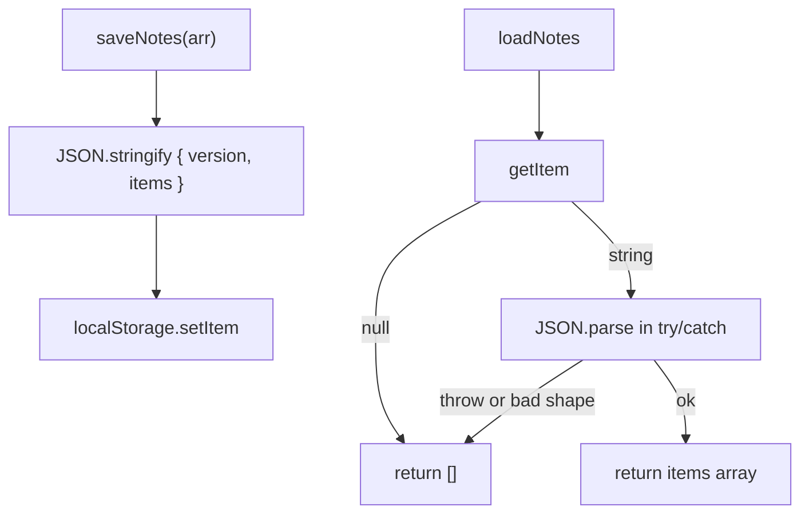

# Month 3 · Week 3 · Day 4
# localStorage — Persist Without Trusting the Disk

**Month index:** [../../README.md](../../README.md)  
**Week 3:** [1](day-01.md) · [2](day-02.md) · [3](day-03.md) · Day 4 (today) · [5](day-05.md) · [6](day-06.md) · [7](day-07.md)  
**Week rhythm today:** Add a real project feature  
**Study time:** 3–4 focused hours  
**Prereq:** Day 3 notes page works in memory.

Project 2 must survive refresh. `localStorage` is a string map **origin-scoped** (scheme + host + port). `http://127.0.0.1:5500` does not share storage with `http://localhost:5500` or another port.

---

## How to read this chapter

RAM dies when the tab dies (Month 1). `localStorage` is a tiny notebook the browser keeps **per origin**. You write strings. You read strings. If you stuff an array in without `JSON.stringify`, you will not get an array back in any useful way.

The notebook can be **torn**: a human pastes garbage in DevTools. `JSON.parse` **throws**. If that throw is uncaught, the page is a white screen. Today you catch, return `[]`, and optionally delete the bad key.



`parseNotes(raw)` takes a **string** and returns an array. Node tests it. `localStorage` is a thin wrapper. That split is the whole design.

---

## Today's contract

1. Explain origin-scoped string storage.
2. Round-trip arrays with `JSON.stringify` / `JSON.parse`.
3. Guard `null` getItem, parse throws, wrong shape, quota throws.
4. Extract `parseNotes` for `node --test`.
5. Wire Day 3 notes to load on start and save after add/delete.

**Today's gate**

> Malformed JSON in the key does not white-screen. Tests cover garbage strings. I never call this a vault.

---

## Time box

| Block | Minutes | Work |
|---|---|---|
| A | 45 | Theory |
| B | 30 | `parseNotes` in Node first |
| C | 80 | Wire storage + notes UI |
| D | 20 | Git |
| E | 15 | Recall |

---

## Theory (complete)

```js
localStorage.setItem("key", jsonString);
localStorage.getItem("key"); // string or null
localStorage.removeItem("key");
```

**Only strings.** You cannot store an array directly. `JSON.stringify(value)` on the way in; `JSON.parse(string)` on the way out.

If you `setItem("notes", notesArray)`, the engine stringifies with `ToString`: you save `"[object Object]"` or a useless list. Always stringify **yourself** so the shape is the JSON you chose.

**`getItem` returns `null`** when the key is missing. Do not `JSON.parse(null)` as a habit — `JSON.parse("null")` is the value `null`; `JSON.parse(null)` becomes `JSON.parse("null")` because parse stringifies the argument — still confusing. Guard:

```js
const raw = localStorage.getItem(KEY);
if (raw === null) return [];
```

**Malformed data:** a human or a bug can put `"NOT JSON"` in the key. `JSON.parse` **throws**. Wrap in `try/catch`. If invalid, treat as empty list and optionally `removeItem` so the next load is clean.

**Wrong shape:** parse succeeds but you get `{ items: "nope" }` or an array of strings. Check `Array.isArray`. If `version` is missing or wrong, discard. Schema this course:

```js
{ "version": 1, "items": [ /* notes */ ] }
```

Worked example of `parseNotes`:

| `raw` | Result |
|---|---|
| missing / you pass a sentinel | tests use strings only; `loadNotes` maps null → `[]` |
| `"NOT JSON"` | `[]` |
| `"null"` | `[]` (value null is not our schema) |
| `"{}"` | `[]` (no items array) |
| `'{"version":1,"items":[]}'` | `[]` |
| `'{"version":1,"items":["hi"]}'` | `["hi"]` if you allow string notes |
| `'{"version":2,"items":[]}'` | `[]` if you only accept version 1 |

Decide whether items are strings or `{ id, text }` objects. **Document it.** Tests must match. Prefer `{ id, text }` if you already used ids on Day 3.

If an item is not the shape you expect, skip it or discard the whole store. Discarding the whole store is simpler and honest for a lab.

**Quota / private mode:** `setItem` can throw (`QuotaExceededError`). Catch and return `false` / show a message; do not crash the page.

```js
export function saveNotes(arr) {
  try {
    localStorage.setItem(KEY, JSON.stringify({ version: 1, items: arr }));
    return true;
  } catch (err) {
    console.error(err);
    return false;
  }
}
```

**Not secure:** any script on this origin can read it. XSS (innerHTML) steals it. No passwords. No session tokens you care about. This is a **convenience cache** for a student app, not a vault.

**Wrong belief:** “I saved an object.”  
**Correct:** you saved a string. Dates come back as strings. Extra fields may appear — ignore unknown keys.

**Wrong belief:** “Private mode means storage is safer.”  
**Correct:** it may be stricter or ephemeral. Still not a vault. Still can throw.

**Test without the browser:** extract `parseNotes(raw)` that takes a string and returns an array. Node tests pass `"not json"`, `"null"`, `"{}"`, `{"version":1,"items":[]}`. The function that calls `localStorage` is a thin wrapper.

Node does not have `localStorage`. That is why parse is separate. Do not fake `global.localStorage` today unless you want extra credit; you do not need it for the gate.

Origin reminder: if you switch ports, you will think save “failed.” It saved on the other origin. DevTools Application → Local Storage → the origin of **this** page.

### `parseNotes` as a total function

A **total function** here means: every string in, an array out, never a throw to the UI. Tests are the proof.

```js
export function parseNotes(raw) {
  if (typeof raw !== "string") {
    return [];
  }
  try {
    const data = JSON.parse(raw);
    if (data === null || typeof data !== "object") {
      return [];
    }
    if (data.version !== 1 || !Array.isArray(data.items)) {
      return [];
    }
    return data.items;
  } catch {
    return [];
  }
}
```

`JSON.parse("null")` is `null`. `typeof null === "object"` (Week 1), so you must reject `null` explicitly or `data.items` will throw. Catching that throw also returns `[]` — still write the null check so the intent is obvious.

If `items` contains mixed junk, you may `filter` to strings or objects with `text`. Document. Simpler lab: if any item is wrong, discard the store (`return []`).

### `loadNotes` / `saveNotes` wrappers

```js
const KEY = "month03-notes";

export function loadNotes() {
  const raw = localStorage.getItem(KEY);
  if (raw === null) {
    return [];
  }
  return parseNotes(raw);
}
```

Never call `loadNotes` from a Node test. Export `parseNotes` and test that.

`saveNotes` must stringify the **schema**, not the raw array alone, so version exists on the way back. If you save a bare array, `parseNotes` looking for `version` will discard it — a bug that looks like “storage does not work.”

### What DevTools shows

Application → Local Storage → origin → key. The value is a **string**. You can edit it. That is why malformed data is not hypothetical. Edit to `NOT JSON`, reload, page lives. Edit to a valid schema, reload, notes return.

**Wrong belief:** “I’ll only save; I don’t need parse tests because I never type garbage.”  
**Correct:** you will type garbage. Browsers persist old keys across code changes. Version exists so an old shape can be dropped instead of crashing.

### Private mode and quota

Some browsers limit or skip storage in private windows. `setItem` throwing is not “JS is broken.” Catch, `console.error`, return `false`, show “Could not save” via **textContent**. Still not a vault.

---

# Feature

Extract `storage.js`:

- `loadNotes()` → array (never throws to UI — returns `[]` on failure)  
- `saveNotes(arr)` → boolean success  

Wire Day 3 notes (retype or import) to load on start and save after add/delete.

Test `storage.js` **logic** in Node by extracting `parseNotes(raw)` that does not call `localStorage` — inject the string. Test valid JSON, invalid JSON, `{ items: "nope" }`.

`parseNotes` export must be usable as:

```js
import { parseNotes } from "./storage.js";
```

In the browser, `storage.js` may import nothing from `document`. `loadNotes` uses `localStorage` — only call it from `main.js` in the page, not from the test file.

If Node imports `storage.js` and the file touches `localStorage` at top level, tests explode. Guard: only call `localStorage` inside `loadNotes`/`saveNotes`, and do not run those in Node tests.

### Wiring Day 3 without copying a blob

On startup: `notes = loadNotes(); render(ul, notes)`. After add/delete: `notes = next; saveNotes(notes); render(ul, notes)`. If `saveNotes` returns `false`, set a status `p` via `textContent` — do not throw.

KEY constant in `storage.js` only. If `main.js` uses a different string, you will save to one key and load from another. That bug looks like “refresh loses notes.”

### Tests table (fill after you run)

| Input to `parseNotes` | Expected |
|---|---|
| `"not json"` | `[]` |
| `"null"` | `[]` |
| `"{}"` | `[]` |
| `'{"version":1,"items":"nope"}'` | `[]` |
| `'{"version":1,"items":[]}'` | `[]` |
| valid items array | those items |

### Quota in the UI

If save returns `false`, the notes still exist in RAM until refresh. Tell the user the notebook is full or blocked. Do not pretend the save worked. Next refresh will load whatever last **succeeded**.

**Wrong belief:** “I’ll ignore quota; students never hit it.”  
**Correct:** private mode hits it. Catching is the habit.

```powershell
git add month-03/week-03/day-04
git commit -m "Add localStorage notes with parse guards and tests."
```

---

# Block E — Recall

1. Why getItem null is not “empty JSON.”
2. Why parse throws.
3. Why version exists.
4. Why this is not a password store.
5. Why 127.0.0.1 ≠ localhost for storage.

---

## Definition of done

- [ ] `parseNotes` tests green in Node
- [ ] Refresh keeps notes
- [ ] DevTools garbage JSON → empty list, page alive
- [ ] save failure returns false / does not crash
- [ ] Commit exists

---

## Optional review links

`localStorage` and `JSON.parse` failures are explained above.

- [MDN: `localStorage`](https://developer.mozilla.org/en-US/docs/Web/API/Window/localStorage)
- [MDN: `JSON.parse`](https://developer.mozilla.org/en-US/docs/Web/JavaScript/Reference/Global_Objects/JSON/parse)

---

## Tomorrow

Split `storage.js` / `ui.js` / `main.js`. Checklist for XSS, preventDefault, refresh, malformed storage. README.
