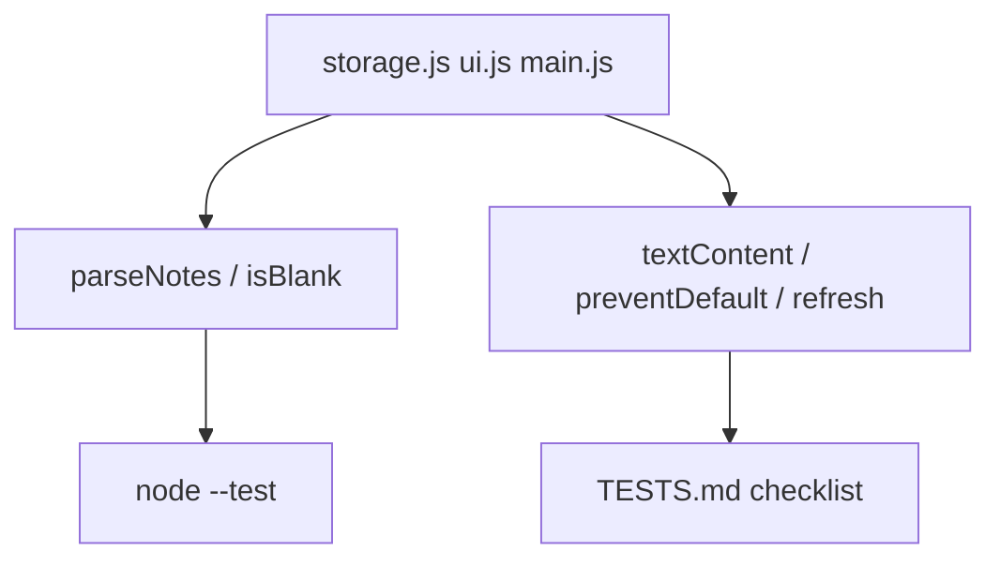

# Month 3 · Week 3 · Day 5
# Tests, Refactor, Docs — DOM Lab

**Program:** Full-Stack Mastery · 18 months  
**Phase:** 1 — Foundations  
**Month index:** [../../README.md](../../README.md)  
**Week 3:** [1](day-01.md) · [2](day-02.md) · [3](day-03.md) · [4](day-04.md) · Day 5 (today) · [6](day-06.md) · [7](day-07.md)  
**Week rhythm today:** Tests + refactor + documentation  
**Study time:** 3–4 focused hours  
**Student state:** Notes persist. Today you prove the claims that Node cannot see (clicks, paint) with a **checklist**, and the claims it can see (`parseNotes`, `isBlank`) with `node --test`.

Work in `~\fullstack-lab\month-03\week-03\`. Serve the page over **HTTP**. Run `node --test` on parse/validate. Do not paste Project 2. Do not add `fetch`.

---

## How to use this textbook

1. Read a section. Close it. Say what Node can test vs what a checklist tests.
2. Split modules. Run `node --test` on parse/validate.
3. Fill TESTS.md from **this** machine, not from hope.
4. Optional review links are for later — not for first splitting.

---

## How to read this chapter

DOM labs fail in ways Node cannot see. That does not mean “no tests.” It means **two layers**:

1. Pure functions — machine.
2. Page behavior — written claims you can fail with your hands and DevTools.



If you finish early, do not add fetch. Tighten modules. Grep `innerHTML`.

---

## What we are testing (explained)

DOM labs fail in ways Node cannot see (clicks, paint). You still **test the pure parts** in Node: `parseNotes`, `isBlank`, filters. The rest is a **checklist** you can fail with your hands.

A checklist item is still a test: it can fail. “Looks fine” is not an item. “Submit blank; URL has no `?`; error `p` has text” is an item.

**XSS claim:** user text and future API titles go through `textContent` / `createElement`. Search the project for `innerHTML`. One hit on a **trusted** static template you wrote is a judgment call; `innerHTML` of `input.value` is a fail.

In PowerShell, from the lab folder:

```powershell
Select-String -Path *.js -Pattern "innerHTML"
```

Record what you found. Zero hits is the cleanest story. A commented teaching line in XSS.txt is not running code.

**preventDefault:** submit must not reload. Prove it: submit a blank note; the URL must not gain `?` and the list must not wipe because the document reloaded.

If the list wipes, you either reloaded (lost RAM before save) or save never ran. Distinguish: refresh **after a successful add** should keep the note (Day 4). Blank submit should not reload at all.

**Refresh:** add a note, reload, it is still there. If not, save was not called or parse failed silently — check DevTools Application → Local Storage.

Silent parse failure that returns `[]` will **look** like “save failed” if you saved bad JSON. Open the key. If it is valid JSON and the page still shows empty, `parseNotes` is too strict or `loadNotes` uses a different KEY.

**Malformed storage:** in DevTools, set the key to `NOT JSON`. Reload. The page must show empty list, not a white screen. That is the `try/catch` you wrote.

Then restore a valid save by adding a note again.

**Modules:** `storage.js` (parse/save), `ui.js` (render with textContent), `main.js` (listeners). UI imports storage; tests import parse without `document`.

`ui.js` receives the `ul` and the notes array. It does not call `fetch`. It does not `JSON.parse`. One job.

`main.js` wires: query nodes (null-check), load, render, listeners, save after changes.

Break `parseNotes` to not catch; confirm fail; restore.

If you remove `try/catch` and reload with `NOT JSON`, you **want** a throw in the console. That proves the test is about the catch. Restore immediately. Do not commit the break.

> **Wrong belief:** “Modules are extra files for later.”  
> **Correct:** they are how Node tests stay possible. One `app.js` blob cannot import parse without importing `document`.

> **Wrong belief:** “I’ll test clicks in Node.”  
> **Correct:** not this month. Checklist + Network/Application panels.

### What each module is allowed to import

| File | May import | Must not |
|---|---|---|
| `storage.js` | nothing from `document` | `querySelector`, `innerHTML` |
| `ui.js` | maybe tiny formatters | `localStorage`, `fetch` |
| `main.js` | storage + ui | giant HTML strings |
| `*.test.js` | `parseNotes`, `isBlank` | `document` |

If `storage.js` runs `document.querySelector` at the top, Node tests die. Keep side effects **inside functions** that only the page calls.

### Pure parse, typed so Node can own it

`localStorage` only stores **strings**. `getItem` returns a string or `null`. `JSON.parse` **throws** on garbage. The helper takes a string (or `null`) and returns an array. Tests inject strings. They never open a browser.

```js
export function parseNotes(raw) {
  if (raw === null || raw === "") {
    return [];
  }
  try {
    const data = JSON.parse(raw);
    if (!data || typeof data !== "object" || !Array.isArray(data.items)) {
      return [];
    }
    if (data.version !== 1) {
      return [];
    }
    return data.items;
  } catch {
    return [];
  }
}

export function isBlank(value) {
  return typeof value !== "string" || value.trim() === "";
}
```

`JSON.parse` lives only inside `try`. `Array.isArray` rejects `{ items: "nope" }`. Missing version rejects a bag of keys from an old experiment. `"0"` is not blank. `"   "` is.

```js
import assert from "node:assert/strict";
import { test } from "node:test";
import { parseNotes, isBlank } from "./storage.js";

test("garbage JSON is empty list", () => {
  assert.deepEqual(parseNotes("NOT JSON"), []);
});

test("valid version 1 returns items", () => {
  const raw = JSON.stringify({
    version: 1,
    items: [{ id: "1", text: "hello" }],
  });
  assert.equal(parseNotes(raw).length, 1);
});

test("whitespace is blank", () => {
  assert.equal(isBlank("  "), true);
});
```

`assert.deepEqual` for arrays. `assert.equal` for booleans and lengths. Do not `JSON.parse` in the test without your own try if you are feeding garbage — that is what `parseNotes` is for.

### Checklist items, written so they can fail

“XSS OK” cannot fail. “`Select-String innerHTML` on `*.js` has no assignment of `input.value` or note text” can fail.

“persist works” cannot fail. “Add ‘hello’, refresh, `#list` still has a `li` whose `textContent` is hello, and Application shows version 1 JSON” can fail.

“malformed OK” cannot fail. “Set key to `NOT JSON`, reload, no white screen, list empty, Console may log, page still has the form” can fail.

### preventDefault proof, step by step

1. Note the URL (`http://127.0.0.1:PORT/` with no query).
2. Submit blank.
3. URL still has no `?`.
4. Error `p` `textContent` is not empty.
5. Notes that were already saved still show (you did not reload).

If the URL gains `?`, JS may have run **and then** the browser navigated. Prevent default **first** in the handler, before any `return`.

Serve HTTP so the address bar is a real origin. `file://` makes “did the URL gain `?`” a confusing story and modules fail anyway.

```powershell
cd ~\fullstack-lab\month-03\week-03
npx --yes serve .
node --test storage.test.js
```

`127.0.0.1` and `localhost` are **different origins**. Notes saved on one will not appear on the other. Write the origin in README so you stop “losing” storage.

### Refactor without new features

Move inline render from `main.js` into `ui.js`. Rename a confusing `el` to `listEl`. Do not add tags, fetch, or a second page. Tests stay green. Checklist still passes.

Break `parseNotes` catch; reload with garbage; observe throw; restore. Write that in TESTS.md. Do not commit the break.

`saveNotes` still `JSON.stringify`s `{ version: 1, items }` and `setItem`s a **string**. Wrap `setItem` in `try/catch` if you want a visible quota error; do not let it white-screen. Tests can skip quota; the checklist can mention “I read that setItem can throw.”

### README sections that must exist

1. How to serve (exact command + example URL).
2. How to test (`node --test storage.test.js` or equivalent).
3. XSS rule: user text via `textContent` only.
4. Storage key name so a debugger can find it.

A README that says “run it” is not a README.

### What refactor is not

Not: adding tags. Not: adding fetch. Not: a new color theme. Yes: `ui.js` `render(ul, notes)` instead of a 80-line `main.js`. Yes: `isBlank` imported from a tiny `validate.js`. Tests import validate and parse. `main.js` imports both plus ui.

> **Wrong belief:** “I’ll `innerHTML` a static shell and `textContent` the title later.”  
> **Correct:** one habit. `createElement` + `textContent` for anything that might hold user or storage text. Static HTML in `index.html` is the place for markup you wrote.

> **Wrong belief:** “Returning `[]` on garbage means I can skip try/catch.”  
> **Correct:** `JSON.parse("NOT JSON")` throws **before** you can return. Catch first. Then return `[]`.

### Filter helpers if you already have them

If notes grew a status or you extract `filterByStatus` for practice, test it in Node the Week 2 way: copy ids before the call; assert the source unchanged; assert the output. Do not test clicks on filter buttons in Node. The checklist covers the buttons.

```js
export function filterByStatus(list, status) {
  if (status === "all") {
    return [...list];
  }
  return list.filter((item) => item.status === status);
}
```

`"all"` copies. A later `push` on the filtered array must not grow storage. Save still writes the **full** `items` array, never the derived view.

### Evidence vs hope

Fill TESTS.md **after** the commands, not before. Paste the PowerShell `node --test` line you ran. If parse tests live in `storage.test.js`, write that filename. A row dated yesterday does not cover today’s module split.

Deliberate break: comment out `try/catch` in `parseNotes`, set Application to `NOT JSON`, reload, read the Console throw, restore, reload, empty list, page alive. Write “observed throw, restored” in the table. Do not commit the break.

`Select-String` from the folder that actually contains `*.js`. If you grep the textbook, you will find the word `innerHTML` in teaching prose. Grep the **lab**.

> **Wrong belief:** “README can say ‘open the html file’.”  
> **Correct:** HTTP command + example origin. `file://` is a fail for modules and a confusing origin for storage.

> **Wrong belief:** “I’ll keep `parseNotes` in `main.js` because it is short.”  
> **Correct:** Node cannot import `main.js` without `document`. The split is the test strategy.

If two filters run in the UI, Node still tests the **helper**. Clicks stay on the checklist. Do not invent a fetch test today.

---

### Recall

1. What Node can test vs what a checklist tests.
2. Why `storage.js` must not touch `document` at import.
3. How you prove preventDefault with the URL bar.
4. What Application panel is for.
5. Why `"type": "module"` still matters for tests.
6. Why `JSON.parse` must sit in `try/catch`.
7. Why `127.0.0.1` and `localhost` do not share notes.

---

## Today's contract

**Today's gate**

> Modules split. `node --test` green for parse/validate. TESTS.md includes XSS, preventDefault, refresh, malformed storage. README says how to serve and test.

---

## Time box

| Block | Minutes | Work |
|---|---|---|
| A | 25 | What we can test in Node vs by hand |
| B | 50 | Split modules; fix imports |
| C | 50 | Checklist + deliberate parse break |
| D | 40 | README + TESTS.md |
| E | 15 | Recall |

---

# Today

Split modules: `storage.js` (parse/save helpers), `ui.js` (render with textContent), `main.js` (listeners).

`node --test` for parse/validate/filter helpers.

Checklist `TESTS.md`: no innerHTML of user data; preventDefault; load after refresh; malformed localStorage does not white-screen.

Suggested table (fill from **this** machine):

| Claim | How you checked | PASS? |
|---|---|---|
| `node --test` parseNotes garbage | terminal | |
| No innerHTML of user/API/storage text | Select-String | |
| Blank submit does not add `?` to URL | address bar | |
| Add + refresh keeps note | Application + page | |
| `NOT JSON` reload: empty, no white screen | DevTools + page | |
| Deliberate missing catch threw, then restored | console | |

README: how to serve, how to test, XSS rule.

Serve command you actually use (example): `npx serve .` or Live Server. Write the URL origin so future-you does not mix ports and “lose” storage.

```powershell
git add month-03/week-03
git commit -m "Split DOM lab into modules; document XSS and storage tests."
```

---

## Definition of done

- [ ] Three modules, tests import parse only
- [ ] TESTS.md filled from evidence
- [ ] README has HTTP + `node --test` + XSS sentence
- [ ] Deliberate catch break observed
- [ ] Commit exists

---

## Optional review links

Testing DOM labs and storage guards are explained in this chapter. These pages are for later checking, not for first learning.

- [Node: test runner](https://nodejs.org/api/test.html)
- [MDN: `localStorage`](https://developer.mozilla.org/en-US/docs/Web/API/Window/localStorage)

---

## Tomorrow

Independent **reading list**: status per row, filter, localStorage, teach-back on bubbling / preventDefault / XSS. Not Project 2.
