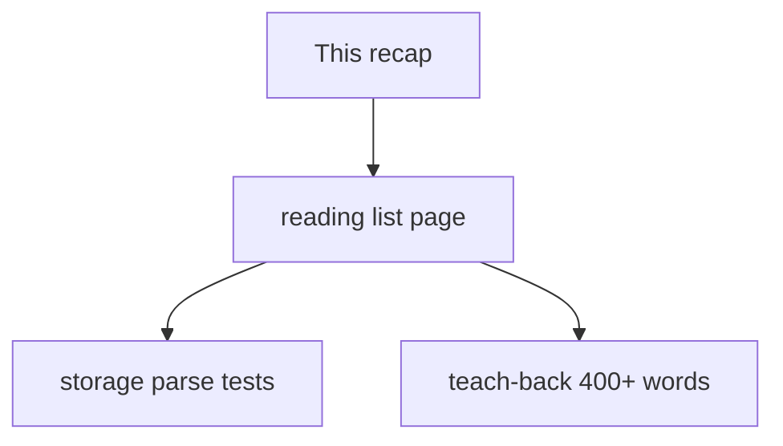
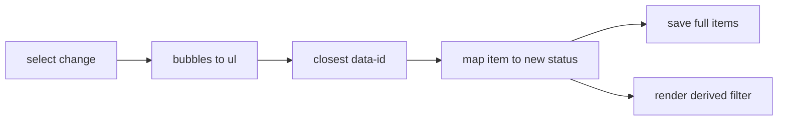

# Month 3 · Week 3 · Day 6
# Independent: Interactive Page + Persistence

**Program:** Full-Stack Mastery · 18 months  
**Phase:** 1 — Foundations  
**Month index:** [../../README.md](../../README.md)  
**Week 3:** [1](day-01.md) · [2](day-02.md) · [3](day-03.md) · [4](day-04.md) · [5](day-05.md) · Day 6 (today) · [7](day-07.md)  
**Week rhythm today:** Independent project work  
**Study time:** 3–4 focused hours  
**Days 1–5 textbook files:** closed for the *challenges*. Repair from **Week 3 Days 1–2 and 4 in this book**.

Work in `~\fullstack-lab\month-03\week-03\independent\`. Serve over **HTTP**. `node --test` on parse/filter/sort. Do not paste Day 3/4 notes. Do not paste Project 2.

---

## How to use this textbook

1. Read this recap. Close it. Say bubbling, preventDefault, and textContent vs innerHTML.
2. Build a **new** reading list. Do not paste Day 3/4 notes and rename “note” to “book.”
3. Run `node --test` on parse/filter **before** you polish CSS.
4. Optional review links are for later — not for first wiring.

---

## How to read this chapter

Today you prove Week 3 on a **new** document: a reading list, not notes and not Project 2. Same physics: DOM tree, bubble, `textContent`, JSON notebook with guards.

The recap below **is** the lesson. Do not paste Day 3/4 files and rename “note” to “book.” New markup, new statuses, new filters.



Stuck 25 minutes: Days 1, 2, or 4 of this week in the textbook only.

---

## Complete explanation (this book is the lesson)

**DOM:** query, create, `textContent` for untrusted strings. `innerHTML` + user/API/storage text = XSS. `querySelector` can be `null`. `replaceChildren` before redraw. Pass the `ul` into `render`. The **array** is the model.

**Events:** `addEventListener`. Submit → `preventDefault`. **Bubble** up the tree. **target** vs **currentTarget**. **Delegation** on the list parent with `closest` and `data-*`. Do not stack listeners inside render. `stopPropagation` is rare. Clear buttons `type="button"`.

**Forms:** `FormData` or `.value`. Trim. Blank → error `p` via textContent, no work. `"0"` is not blank. HTML `required` does not trim.

**localStorage:** strings only, origin-scoped. `JSON.stringify` / `parse`. `parse` throws — `try/catch`, return `[]`. Check `Array.isArray` and `version`. `setItem` can throw. Not a secrets store. `127.0.0.1` ≠ `localhost`. Node tests `parseNotes` / `parseList` with injected strings — no `localStorage` at module top level.

**Modules:** `api` not required today; `storage.js`, `ui.js`, `main.js`. Tests for parse/filter in Node.

Status values: `"want"` / `"reading"` / `"done"` (this lab’s words). Invalid status: ignore or leave unchanged; document. Filter buttons set a **filter field in state**, then render. Do not keep three copies of the list in the DOM as the source of truth.

> **Wrong belief:** “Filter means delete from storage.”  
> **Correct:** storage holds all rows. Filter is a view. Changing filter must not `save` a truncated list unless you intend to destroy data.

> **Wrong belief:** “A `<select>` per row needs its own listener.”  
> **Correct:** delegate `change` on the `ul` if you want; `event.target` may be the `select`. `closest("li")` then read `data-id`. Or listen `change` on the list parent — `change` bubbles.

Worked example: three books, filter `done`, one match. Storage still has three. Refresh, filter may reset to `all` unless you persist filter too — **optional**; document. Persist the **items**.

### Page anatomy (you write it; this is not a paste app)

- Form: title `input` + add `button type="submit"` inside `<form>`. `preventDefault`.
- Filter controls: three `button type="button"` or a `fieldset` of radio buttons, labeled.
- `ul` of rows: title `span` (`textContent`), `select` for status, delete `button type="button"` with `data-id`.
- Status `p` for blank error, `aria-live="polite"`.

State: `{ items: [], filter: "all" }`. Render **derives** the visible list: `filter === "all" ? items : items.filter(...)`. Save **items only** on add/delete/status. Changing filter does not `save` a subset.

### Delegation for `change` and `click`

`ul.addEventListener("click", ...)` for delete. `ul.addEventListener("change", ...)` for `select`. On change, `event.target` is often the `select`. Read `value` with `===` to `"want"` | `"reading"` | `"done"`. Find `data-id` on `event.target.closest("[data-id]")` or the `li`.

> **Wrong belief:** “`change` does not bubble.”  
> **Correct:** it bubbles. Delegation works. (Some old IE stories do not apply here.)



### Parse helper name

Call it `parseList` or `parseReading` — same rules as `parseNotes`: string in, array out, try/catch, version, `Array.isArray`. Tests in Node with `"not json"`, `"{}"`, valid payload.

Sort helper: copy + `localeCompare` on title. Test mutation. The page may call it when the user clicks “Sort”; or only tests call it. Either is fine if the export exists.

### Teach-back (400+ words)

Tell a story: a user adds a book titled with angle brackets; a user presses Enter on an empty box; a user clicks the word inside a delete button. Those three scenes **are** XSS, preventDefault, and bubbling. If the essay never mentions `currentTarget`, it is incomplete.

Do not paste this file. Close it after reading, then write.

User text, titles from later APIs, and strings from `localStorage` all go through `textContent`. You do not need an exploit payload. `"<b>x</b>"` as text vs bold is enough.

---

## Today's contract

**Today's gate**

> Reading list with add, delegated status, filter, localStorage, textContent, tests for filter/sort/parse, 400+ word teach-back.

---

## Time box

| Block | Minutes | Work |
|---|---|---|
| A | 20 | Speak recap |
| B | 100 | Build reading list |
| C | 40 | Tests + teach-back |
| D | 20 | Git |

---

# Spec

Build a **reading list** (not Project 2): title input, add, list, status select per row (`want`/`reading`/`done`) via delegation, filter buttons, localStorage, refresh keeps data.

Modules. `textContent`. Tests for filter/sort/parse. Teach-back: bubbling, preventDefault, XSS. 400+ words, prose.

Teach-back must include: why `target` can be a child, why submit reloads without preventDefault, why titles never go through `innerHTML`. Not a bullet dump of APIs.

Sort: optional on the page; **required in tests** if you export `sortByTitle` (copy then `localeCompare`). If the page has no sort control, still export and test the helper — Project 2 will want it.

### Persistence schema

```json
{ "version": 1, "items": [ { "id": "1", "title": "Dune", "status": "want" } ] }
```

Save after add, delete, and status change. Do not save on filter click. Load on startup before first render. If parse fails, start empty and optionally `removeItem` the key.

### Filter buttons vs three lists

Do not keep three `ul`s in the HTML as the source of truth. One `ul`. One `items` array. Filter is a **question** you ask when rendering. Three lists in the DOM will drift.

### Accessibility you already owe

Each filter button needs visible text (“Want”, “Reading”, “Done”, “All”). The title field needs a `<label>`. Status `select` needs a label — a visually associated label per row can be a `span` plus `aria-label` on the select if a visible “Status” would repeat noisily; Month 2 preferred visible labels. A short `aria-label="Status for this book"` is a justified small ARIA if the row title is already the name. Document the choice.

### Independent vs Project 2

Different folder, different copy, different statuses if you want (`want`/`reading`/`done` here). Do not start the explorer repo today. Do not paste a movie-app tutorial. The teach-back is how we know you understood bubbling rather than cloned a theme.

> **Wrong belief:** “If the reading list is pretty, I can skip tests.”  
> **Correct:** parse and filter tests are the assignment. Pretty is extra and still `textContent`.

### Status change without mutating search (there is no search today)

When the `select` fires `change`, copy the item with a new status:

```js
items = items.map((item) =>
  item.id === id ? { ...item, status } : item,
);
saveList(items);
render(state);
```

Do not `item.status = status` on the object still in the array if you want the immutability habit — mutating in place works until a test freezes the row. Prefer map + spread. Then save the **full** `items`, not the filtered view.

### Parse, filter, sort — type these in `list.js` / `storage.js`

Node must import these without `document`. `localStorage` stays behind functions the page calls.

```js
export function parseList(raw) {
  if (raw === null || raw === "") {
    return [];
  }
  try {
    const data = JSON.parse(raw);
    if (!data || typeof data !== "object" || data.version !== 1) {
      return [];
    }
    if (!Array.isArray(data.items)) {
      return [];
    }
    return data.items;
  } catch {
    return [];
  }
}

export function filterByStatus(list, status) {
  if (status === "all") {
    return [...list];
  }
  return list.filter((item) => item.status === status);
}

export function sortByTitle(list) {
  return [...list].sort((a, b) => a.title.localeCompare(b.title));
}
```

Tests: `parseList("NOT JSON")` → `[]`. `parseList("{}")` → `[]`. Valid payload → items. `filterByStatus` with `"want"` keeps want rows; source ids unchanged. `sortByTitle` with Neuromancer then Dune: output Dune first, input still Neuromancer first.

`"type": "module"` in this folder’s `package.json`. Command:

```powershell
cd ~\fullstack-lab\month-03\week-03\independent
node --test
npx --yes serve .
```

If `JSON.parse` is not in `try/catch`, the garbage test throws in the **test process**. That is still a fail. Catch inside the helper.

### Folder

`~\fullstack-lab\month-03\week-03\independent\` with `index.html`, `main.js`, `ui.js`, `storage.js`, `list.js` (filter/sort), tests, `teachback.md`, `"type": "module"`.

HTTP. `node --test`. Teach-back last so you have something real to describe.

Titles, including `"<b>x</b>"`, go through `textContent`. `Select-String -Path *.js -Pattern "innerHTML"` should not show assignments of titles.

Blank add: `preventDefault` first, trim, error `p`, no row, URL has no `?`. `"0"` is a title.

If refresh loses data, you saved a different KEY than you load, or parse rejects `version`, or you served a different origin (port or `localhost` vs `127.0.0.1`). Open Application and read the string. `localStorage` is not a vault; it is a notebook of strings.

### Render derives; save does not

When `filter === "reading"`, `render` walks `filterByStatus(items, "reading")` and builds `li`s with `textContent`. The `items` array still has want and done rows. `saveList(items)` writes every row. If you `saveList(visible)`, a refresh followed by “All” cannot resurrect what you destroyed. That bug feels like “filter works” until it does not.

Teach-back must be 400+ words of **prose**. Three scenes: angle-bracket title (XSS), empty Enter (preventDefault + trim), click on the word “Delete” inside the button (`target` vs `currentTarget`, `closest`). Mention `localStorage` strings and `JSON.parse` in `try/catch` once. Do not paste this file.

> **Wrong belief:** “I’ll persist the filter so the page feels like an app.”  
> **Correct:** optional, and a second parse path. Persist **items** first. Document if filter resets to `all` on refresh.

> **Wrong belief:** “Status `select` needs `stopPropagation` so the row click does not fire.”  
> **Correct:** you should not have a row click that fights the select. Delegate `change` for status and `click` for delete. Two listener types, one parent.

Invalid status from a hand-edited storage string: ignore or leave unchanged; do not throw. Tests can pass `"DONE"` into `setStatus` if you export it — document the choice. The page’s `<select>` only offers the three values.

HTTP + tests:

```powershell
cd ~\fullstack-lab\month-03\week-03\independent
npx --yes serve .
node --test
```

If the module 404s, the `src` path is wrong. If storage “vanishes,” you changed port or `localhost` vs `127.0.0.1`. Open Application. Read the string.

Typed tests you must own (names yours):

```js
test("parseList garbage is empty", () => {
  assert.deepEqual(parseList("NOT JSON"), []);
});

test("filter want does not mutate source", () => {
  const list = [
    { id: "a", title: "Dune", status: "want" },
    { id: "b", title: "Dune 2", status: "done" },
  ];
  const ids = list.map((row) => row.id);
  filterByStatus(list, "want");
  assert.deepEqual(
    list.map((row) => row.id),
    ids,
  );
});

test("sortByTitle copies", () => {
  const list = [
    { id: "2", title: "Neuromancer", status: "want" },
    { id: "1", title: "Dune", status: "want" },
  ];
  const before = list.map((row) => row.title);
  sortByTitle(list);
  assert.deepEqual(
    list.map((row) => row.title),
    before,
  );
});
```

`JSON.parse` stays in `try/catch` inside `parseList`. Tests never call `localStorage`. The page `stringify`s `{ version: 1, items }` — strings only.

Blank title: `preventDefault`, trim, error `p` via `textContent`, URL has no `?`. `"0"` is a title. `"<b>x</b>"` shows angle brackets.

```powershell
git add month-03/week-03/independent
git commit -m "Independent reading list with events and localStorage."
```

---

## Definition of done

- [ ] Refresh keeps items
- [ ] Filter does not destroy storage
- [ ] Delegation for status
- [ ] parse/filter tests green
- [ ] Teach-back 400+ words
- [ ] No innerHTML of titles
- [ ] Commit exists

---

## Optional review links

DOM, events, and storage are explained in this chapter. These pages are for later checking, not for first learning.

- [MDN: Event bubbling](https://developer.mozilla.org/en-US/docs/Learn_web_development/Core/Scripting/Event_bubbling)
- [OWASP: XSS](https://owasp.org/www-community/attacks/xss/) (idea only — this course does not teach payloads)

---

## Tomorrow

Week review: speak the synthesis, a tiny persist counter, four debug stories. Then Week 4 fetch.
