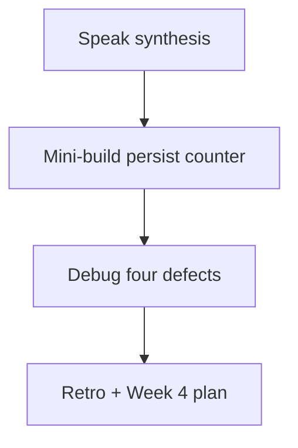
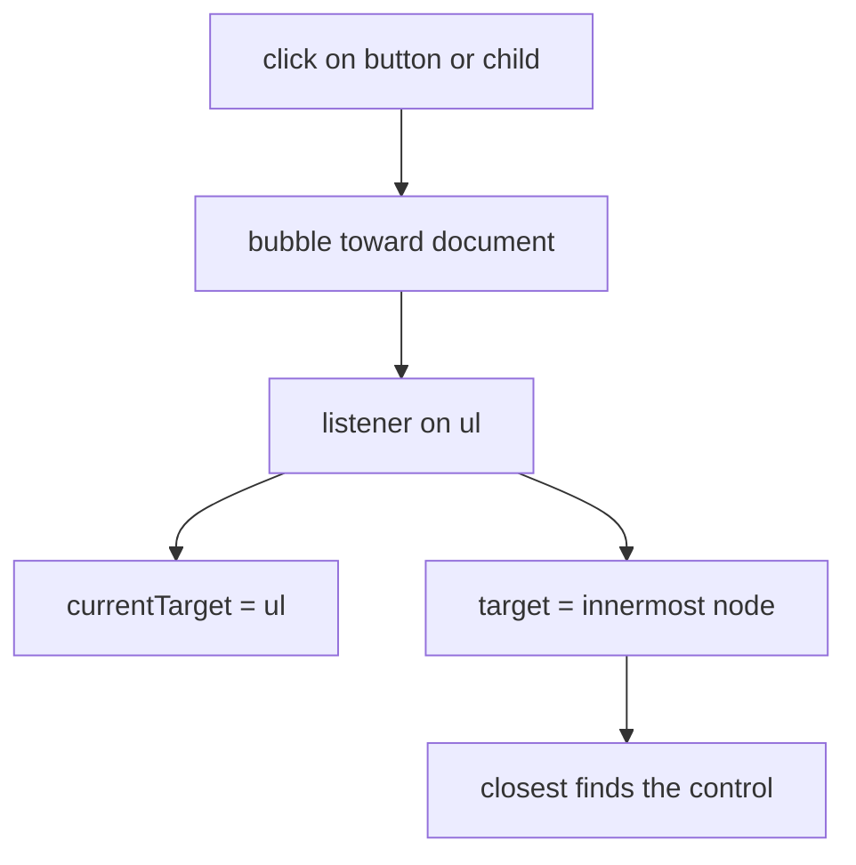

# Month 3 · Week 3 · Day 7
# Week Review — DOM and Events

**Program:** Full-Stack Mastery · 18 months  
**Phase:** 1 — Foundations  
**Month index:** [../../README.md](../../README.md)  
**Week 3:** [1](day-01.md) · [2](day-02.md) · [3](day-03.md) · [4](day-04.md) · [5](day-05.md) · [6](day-06.md) · Day 7 (today)  
**Week rhythm today:** Review, repair, plan Week 4  
**Study time:** 3–4 focused hours  
**Student state:** You can render with `textContent`, listen with delegation, and parse storage without crashing. Today those ideas must still live in your head — from **this file**.

Do not start Week 4 because the calendar moved. `fetch` on a page that still uses `innerHTML` for titles is a security defect plus a network lesson.

Work in `~\fullstack-lab\month-03\week-03\review\`. Serve the mini-build over **HTTP**. `node --test` on `parseCount`. Do not paste the reading list. Do not paste Project 2.

---

## How to use this textbook

1. Read a section. Close it. Say it in one honest sentence.
2. Type the persist counter from this synthesis. Do not paste the reading list.
3. Predict garbage JSON → `0`, then prove it in DevTools and `node --test`.
4. Optional review links are for later — not for first repair.

---

## How to read this chapter

This is a **closed-book teaching day**. The synthesis **is** the Week 3 lesson.



Days 1–6 closed during mini-build. Repair from **this** recap.

---

## Week synthesis (this book)

**DOM** is the live tree. Select (`querySelector`, null-check), create (`createElement`), update (`textContent`, attributes).

**XSS:** `textContent` is text. `innerHTML` is markup. Queries, titles, localStorage — untrusted.

**Events:** listen with `addEventListener`. **Capture → target → bubble.** `target` = clicked node; `currentTarget` = listener. Delegation: parent + `closest`. `preventDefault` on submit stops reload. `stopPropagation` is rare.

**Forms:** handle `submit` on the form; `type="button"` for non-submit. Trim; blank is not “run the action.”

**localStorage:** string map per origin. JSON round-trip. Parse errors and bad shapes → `[]`. Quota throws. No passwords.

**Modules** keep parse/filter testable in Node.

The sections below unpack that so you can mini-build without Days 1–6.

---

## Today's contract

**Today's gate.** Closed-book:

> I can explain bubbling, preventDefault, textContent vs innerHTML, and parse guards, and I persisted a number that survives refresh without crashing on garbage JSON.

---

## Time box

| Block | Minutes | Work |
|---|---|---|
| 1 | 40 | Speak the synthesis |
| 2 | 50 | Mini-build counter |
| 3 | 30 | Debug four defects |
| 4 | 25 | Review reading list — one fix |
| 5 | 20 | Re-run parse tests + checklist |
| 6 | 20 | Design: why the array is the model |
| 7 | 25 | Retro + Week 4 plan |

---

# Complete explanation — DOM you must still own

## 1. Tree vs file

The browser parsed HTML into a DOM. JS changes the tree. The `.html` file on disk does not rewrite itself. Refresh reloads the file, then JS runs, then storage may refill the tree.

`querySelector` → node or `null`. Throw or bail if missing. `createElement` + `append` + `replaceChildren`. `classList`, `dataset`, attributes.

> **Wrong belief:** “`document` is the `.html` file.”  
> **Correct:** `document` is the live tree. View Source is the file. Elements is the tree.

Serve HTTP. `file://` breaks ES modules. `npx --yes serve .` from the review folder, then open `http://127.0.0.1:...`.

## 2. XSS

`textContent = userString` means text. `innerHTML = userString` means parse. Famous APIs are not trusted. You do not need an exploit to understand the hole. `"<b>x</b>"` as text vs bold is enough.

User notes, later API titles, and strings from `localStorage` are all untrusted. Same habit.

## 3. Events

`addEventListener(type, fn)` — no extra `()`. Capture down, target, bubble up. Delegation for lists that grow. `closest`. `preventDefault` ≠ `stopPropagation`. Default submit **navigates**. Missing `type` on button **submits**.



Today’s increment button can be a direct listener because there is one of them. A list of notes still needs delegation. Do not unlearn delegation because the counter is small.

## 4. Forms and blank

`FormData`, `name=`, trim, `isBlank`. Error `p` `aria-live="polite"` via textContent. `"0"` is a query. `"   "` is not.

If increment lives in a `<form>`, `type="submit"` will reload unless you `preventDefault`. Easier: `type="button"` and a `click` listener. If you use submit, prevent first.

## 5. Storage

`setItem`/`getItem` strings. `JSON.stringify` `{ version: 1, items }`. `parse` try/catch. `Array.isArray`. Quota catch. Origin = scheme + host + port. Not a vault. XSS reads it.

Today’s counter uses the same parse pattern with a number default `0` instead of `[]`.

`JSON.parse` throws on `"NOT JSON"`. That throw must not become a white screen. Catch, return `0`. `getItem` returns `null` when missing — treat as default, do not parse blindly.

## 6. Modules

`storage.js` parse without `document` at import. `ui.js` render. `main.js` wire. Tests inject strings. `node --test` on `parseCount`.

> **Wrong belief:** “If it works in my tab, the origin is irrelevant.”  
> **Correct:** a different port is a different notebook.

`"type": "module"` in `package.json` so tests can `import`. The page uses `<script type="module" src="./main.js"></script>`.

## 7. Worked counter (the mini-build in words)

Start `value` at `0`. Render `span.textContent = String(value)`. Click: `value += 1`; render; `saveCount(value)`. Load: `parseCount(raw)` → number. Garbage → `0`. Do not read the span with `Number(span.textContent)` as the only source of truth — a render bug would then poison storage. The variable (or a `state` object) is the model.

Malformed: DevTools set key to `NOT JSON`. Reload. `parseCount` catch. `value = 0`. Page shows 0. Form/button still there.

> **Wrong belief:** “I’ll `innerHTML` the number into a fancy badge.”  
> **Correct:** `textContent` on the span. The number is data.

### Mini-build markup

`button type="button"` labeled Increment. `span id="count"`. Optional `p` for save failure. Semantic skeleton. HTTP. `storage.js` with `parseCount`, `loadCount`, `saveCount`. Tests only on `parseCount`.

`parseCount("NOT JSON") === 0`. `parseCount('{"version":1,"value":3}') === 3`. `parseCount("{}") === 0`. `parseCount("null") === 0`.

### parseCount you type

```js
export function parseCount(raw) {
  if (raw === null || raw === "") {
    return 0;
  }
  try {
    const data = JSON.parse(raw);
    if (!data || typeof data !== "object" || data.version !== 1) {
      return 0;
    }
    if (typeof data.value !== "number" || Number.isNaN(data.value)) {
      return 0;
    }
    return data.value;
  } catch {
    return 0;
  }
}
```

`JSON.parse("null")` is `null`. The `!data` check returns `0`. `JSON.parse` of garbage hits `catch`. Tests use injected strings, not `localStorage`.

```js
import assert from "node:assert/strict";
import { test } from "node:test";
import { parseCount } from "./storage.js";

test("garbage is 0", () => {
  assert.equal(parseCount("NOT JSON"), 0);
});

test("version 1 value 4", () => {
  assert.equal(parseCount('{"version":1,"value":4}'), 4);
});
```

```powershell
cd ~\fullstack-lab\month-03\week-03\review
node --test
```

### Design paragraph prompt

Why not `Number(document.querySelector("#count").textContent)` after click? Because the screen can be wrong (a render skipped) and because parsing UI strings is how `"3 likes"` becomes `3` by accident. Increment the model, render the model, persist the model.

Save still writes a **string**: `localStorage.setItem(KEY, JSON.stringify({ version: 1, value }))`. Never `setItem(KEY, value)` with a number and hope. The engine will stringify in a way you did not choose.

## 8. Debug stories, fully

**Forgot preventDefault.** You click Add; the number flashes 1 then returns to 0; the URL shows `?`. The document reloaded; RAM died; storage might have saved 1 if save ran before navigate — or not. Fix: `event.preventDefault()` on submit, or use `type="button"` for increment.

**innerHTML XSS.** A note title with tags becomes structure. Fix: `textContent`. You do not need a working exploit.

**getItem null.** First visit, key missing, `JSON.parse(localStorage.getItem(k))` without a null guard. Depending on engine details this is a mess; you already decided: if `raw === null` return default. Write that.

**JSON throw.** Key is `NOT JSON`. Uncaught parse → white screen. `try/catch` → default.

> **Wrong belief:** “Checklist tests are fake because Node cannot click.”  
> **Correct:** a claim you can fail with the URL bar is a test. Machine tests cover parse. Together they are Week 3.

If increment works but refresh always shows 0, KEY mismatch or parse too strict. Open Application. Read the string. `127.0.0.1` vs `localhost` is a different notebook.

### Speak, then build, then debug

Closed-book speech (do this before the mini-build): DOM vs file; `textContent` vs `innerHTML`; bubble + `closest`; `preventDefault` on submit; `localStorage` strings + `JSON.parse` in `try/catch`; modules so Node can test parse. If you cannot say those six, re-read this file. Do not open Days 1–6.

Week 4 plan in the retro: you will check `response.ok` because `fetch` fulfills on 404. You will not `innerHTML` API titles. You will abort the previous search. Write those sentences. They are the bridge, not a promise to skip the counter.

> **Wrong belief:** “A number in a span is too small to persist with versioned JSON.”  
> **Correct:** the schema is the habit. `{ version: 1, value: n }` trains the parse you will use on arrays tomorrow.

> **Wrong belief:** “I’ll parse `span.textContent` so I do not need a variable.”  
> **Correct:** the DOM is the view. A skipped render would persist a lie. Increment the model.

If the reading list still uses `innerHTML` for titles, that is today’s committed fix — more important than a pretty counter badge.

Mini-build increment in words you can type without Days 1–6:

```js
button.addEventListener("click", () => {
  value += 1;
  countEl.textContent = String(value);
  saveCount(value);
});
```

`type="button"`. Null-check `button` and `countEl`. Load `value` from `parseCount` **before** the first render. Garbage JSON → `0`, page still has the button. Serve HTTP from `~\fullstack-lab\month-03\week-03\review\`.

---

Speak the synthesis.

---

# Mini-build

Button increments a number in a `span` via textContent; persist the number; malformed storage does not crash.

Spec:

- `span#count` shows an integer.
- `button type="button"` increments by 1.
- Save `{ version: 1, value: n }` (or a tiny schema you document).
- `parseCount(raw)` tested in Node: garbage → `0` (or `[]` pattern — here a number default `0`).
- DevTools: set key to `NOT JSON`, reload, see `0`, page alive.
- No `innerHTML`.

`review/` under week-03. HTTP.

Null-check `#count` and the button. `render` sets `span.textContent = String(value)`. Click updates `value`, renders, saves. Load on startup before first paint of the number.

---

# Debug (write the cause, from this week)

- forgot preventDefault
- innerHTML XSS
- getItem null
- JSON throw

Full sentences in `DEBUG.txt`. Include what you would observe (reload, bold title, white screen). Do not provide XSS payloads. For innerHTML, “parses the string as markup / use textContent” is enough.

### Mini-build parseCount tests

At least: garbage string, valid version 1 with value 4, missing version, `null` JSON. `node --test`. `"type": "module"`.

If increment works but refresh always shows 0, you saved a different KEY than you load, or parse rejects your schema. Open Application and read the string.

---

# Review, tests, design

One committed fix on the independent reading list. Re-run `node --test`. Design paragraph: why the array (or number) is the model and the DOM is the view — increment the variable, then render, then save; do not parse the `span` text as the only truth (`parseInt` of the screen is a trap).

If the reading list still saves the **filtered** array, that is the fix. Filter is a view. Storage holds all rows.

Retro. **Week 4:** fetch, promises, async/await, try/catch, loading/error/empty, AbortController, network failures, then Project 2 — explained in Week 4 day files. Plan one sentence: “I will check `response.ok` because fetch fulfills on 404.”

```powershell
git add month-03/week-03/review
git commit -m "Record Week 3 DOM review."
```

---

## Week 3 definition of done

- [ ] textContent vs innerHTML taught from this book
- [ ] bubbling + preventDefault in DEBUG or oral
- [ ] parse guard tested
- [ ] Mini-build persists
- [ ] Retro does not skip Week 4 `response.ok`

---

## Optional review links

Week 3 is explained in this chapter. These pages are for later checking, not for first learning.

- [MDN: DOM intro](https://developer.mozilla.org/en-US/docs/Web/API/Document_Object_Model/Introduction)
- [MDN: `preventDefault`](https://developer.mozilla.org/en-US/docs/Web/API/Event/preventDefault)
- [MDN: `localStorage`](https://developer.mozilla.org/en-US/docs/Web/API/Window/localStorage)

---

## Tomorrow

Promises, `async/await`, `fetch`, JSON. `fetch` fulfills on 404 — you check `ok`. The Network tab and `curl.exe` both speak HTTP; the browser also enforces CORS.
