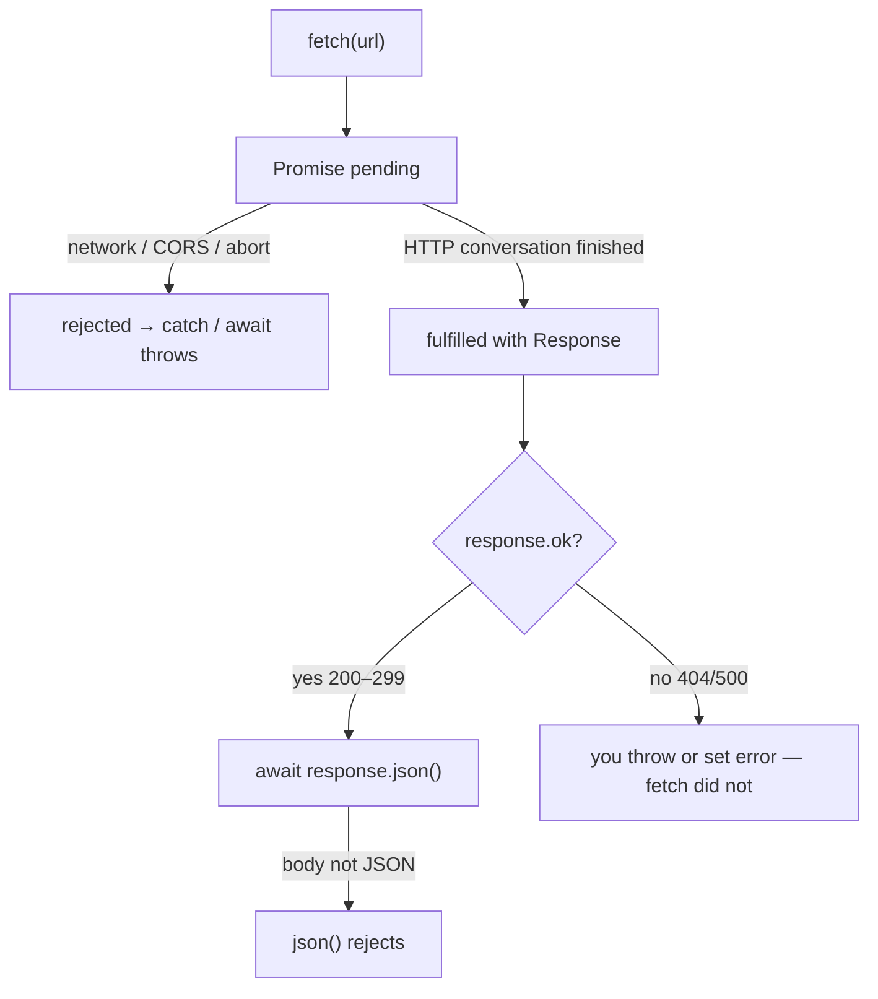

# Month 3 · Week 4 · Day 1
# Promises, async/await, fetch, JSON

**Month index:** [../../README.md](../../README.md)  
**Week 4:** Day 1 (today) · [2](day-02.md) · [3](day-03.md) · [4](day-04.md) · [5](day-05.md) · [6](day-06.md) · [7](day-07.md)  
**Week rhythm today:** Learn + type-along  
**Study time:** 3–4 focused hours  
**Student state:** You can render lists safely and persist them. Today the data comes from **another computer**. The dangerous belief is “`fetch` threw, so it must be a 404.”

**This week covers:** JSON, fetch, promises, async/await, try/catch, loading/error/empty states, AbortController, network failures — then **Project 2** (you build) and the Month 3 exam.

---

## How to read this chapter

Until today, functions finished before the next line ran. Network is **slow** compared to RAM (Month 1). If JavaScript waited by spinning (`while (not done) {}`), the tab would freeze: no clicks, no paint. The browser therefore **starts** a request and lets your function **continue later**.

A **Promise** is a JavaScript object that means: “this work is not done yet; I will hold the result or the failure.”



Read until you can say that picture without looking. Then type `getUser`. Record **what the fake API actually does** for a missing id — do not memorize a blog’s 404 if JSONPlaceholder returns 200 and `{}`.

Serve the page over **HTTP**. `fetch` to `https://` APIs. ES modules as all month.

---

## Today's contract

By the end of this day you will be able to:

1. Explain a **Promise** as a value for a result that may arrive later.
2. Use `async/await` and `try/catch` as the default style.
3. Call `fetch`, check `response.ok`, parse JSON.
4. Know that HTTP 404 is **not** a thrown error by `fetch`.
5. Map an API object to `{ id, name, email }` in a **pure** function you test without the network.
6. Read the Network tab: URL, method, status.

**Today's gate**

> `fetch` rejects on **network** failure (offline, DNS). It **fulfills** on 404 and 500. You must check `response.ok` (or `status`) yourself. Then `response.json()` can still throw if the body is not JSON.

---

## Time box

| Block | Minutes | Work |
|---|---|---|
| A | 55 | Theory |
| B | 50 | Type-along: getUser + Network tab |
| C | 70 | Fixture + `toCard` tests |
| D | 20 | Git |
| E | 15 | Recall |

---

# Block A — Theory

## 1. Why async (complete)

JavaScript in a page runs on **one main thread** (Month 4 will name the event loop). If you waited for the network with a tight loop (`while (not done) {}`), the tab would freeze: no clicks, no paint.

Instead, the **browser** performs the network work outside your function. Your function **starts** the request and **returns**. When bytes arrive, the engine **continues** your code.

A **Promise** is a JS object that represents that later completion.

Three states:

1. **pending** — not finished
2. **fulfilled** — succeeded; the value is available
3. **rejected** — failed; the reason is available (often an `Error`)

A promise settles **once**. You cannot fulfill it twice. “Succeeded” here means “the promise’s job finished without reject,” **not** “HTTP 200.” That distinction is the gate.

**`.then` / `.catch` (know how to read; do not prefer this style in new code):**

```js
fetch(url)
  .then((response) => response.json())
  .then((data) => {
    console.log(data);
  })
  .catch((err) => {
    console.error(err);
  });
```

Each `.then` returns a new promise. If you `return response.json()` inside a then, the next then receives the parsed value. If a then throws or a fetch rejects, control jumps to `.catch`.

Forgetting `return` inside then is a classic bug: the next then gets `undefined`.

**`async` / `await` (this course’s default):**

```js
async function load() {
  try {
    const response = await fetch(url);
    const data = await response.json();
    return data;
  } catch (err) {
    console.error(err);
    throw err;
  }
}
```

- `async` before `function` means the function **always returns a Promise**. Even `return 1` becomes a promise fulfilled with `1`.
- `await` pauses **this async function** until that promise settles. It does **not** freeze the whole tab. Other event handlers can still run.
- If the awaited promise **rejects**, `await` throws, and `catch` runs.
- You may only `await` inside `async` functions (or at the top level of a module). In `main.js` as a module you may `await` at top level in modern browsers; wrapping in `async function main()` is clearer.

**Wrong belief:** “`await` waits like `sleep` in the CPU.”  
**Correct:** the function yields. The thread is free until the promise settles.

**Wrong belief:** “`async` makes the function fast.”  
**Correct:** `async` makes the function return a promise. The network is still the network.

You can `await` any promise, not only `fetch`: `await response.json()`, or a helper that already returns a promise.

## 2. `fetch` (complete)

`fetch(url)` returns a **Promise** that fulfills with a **Response** object when the browser has the HTTP **status and headers** (and can start reading the body).

That promise **rejects** on:

- no network (offline)
- DNS failure
- connection reset
- CORS failure from the browser’s point of view
- abort (`AbortController` — tomorrow)

It **fulfills** on HTTP 404 and HTTP 500. Those are successful HTTP conversations with error statuses. You must inspect `response.ok` (true for 200–299) or `response.status`.

```js
const response = await fetch(url);
if (!response.ok) {
  throw new Error(`HTTP ${response.status}`);
}
const data = await response.json();
```

If you skip `ok` and call `json()` on an HTML error page, `json()` **rejects** (invalid JSON) or you parse a surprise object. Check `ok` **first**, then parse, and still `try/catch`.

`response.json()` also returns a Promise. It **rejects** if the body is not valid JSON (HTML error page, empty body). Always check `ok` **before** assuming JSON, and still `try/catch` parse failures.

You can only read the body **once**. A second `response.json()` or `response.text()` fails. If you need to debug, `response.clone()` exists — you do not need it today if you log `status` first.

Default method is GET. For POST you pass a second argument:

```js
await fetch(url, {
  method: "POST",
  headers: { "Content-Type": "application/json" },
  body: JSON.stringify({ title: "week3" }),
});
```

Project 2 search is GET with a query string. You still need to know POST exists. `JSON.stringify` on the body is the same family as Day 4 storage — objects are not bytes until you make a string.

**CORS:** the browser asks the server whether this **origin** (scheme+host+port of your page) may read the response. If the server does not allow you, `fetch` rejects with a CORS error. You cannot “fix CORS” from the frontend for someone else’s API. Pick a public API that allows browsers (JSONPlaceholder, Open Library, DummyJSON) or, later, your own FastAPI with explicit CORS. Do not install a “disable CORS” extension as a learning strategy.

The Network tab may show the request as failed. The Console may mention CORS. That is the **server** (or the browser enforcing the server’s headers). Your `ok` check never runs if fetch **rejected**.

Always use `https://` URLs in this course.

**Wrong belief:** “CORS is a Node error I fix with a proxy tomorrow.”  
**Correct:** for this month, choose an API that already allows browser origins. Month 8+ you will set CORS on **your** API on purpose.

Worked example — four endings:

| Situation | `fetch` promise | `response.ok` | `json()` |
|---|---|---|---|
| 200 JSON | fulfill | true | fulfill with object/array |
| 404 JSON or empty | fulfill | false | maybe parse, maybe not — you should throw before assuming |
| 500 HTML | fulfill | false | often reject |
| Offline | **reject** | n/a | n/a |
| CORS blocked | **reject** | n/a | n/a |

## 3. JSON in this context

You already wrote JSON in Month 1. `JSON.parse` turns a string into a value. `JSON.stringify` does the reverse. `response.json()` is parse **and** consume the body — you can only read the body once.

API shapes are **not** your app shapes. Map fields you need (`id`, `title`). Ignore extra keys. Missing keys are `undefined` — guard them. Do not render the raw API object into the DOM.

```js
export function toCard(user) {
  return {
    id: user.id,
    name: String(user.name ?? ""),
    email: String(user.email ?? ""),
  };
}
```

If `user` is `null` or not an object, return a documented fallback or throw in the mapper — tests lock the choice. Do not `innerHTML` `name`.

## 4. try/catch

`try/catch` catches **thrown** errors, including `await` of a rejected promise.

Only `catch` around work that may reject. Do not empty-catch (`catch (e) {}`) — you will hide bugs.

```js
try {
  const data = await getUser(1);
  return data;
} catch (err) {
  console.error(err);
  throw err; // or return { ok: false, error: "network" }
}
```

Tomorrow you will turn these failures into **UI states**. Today, throw or log honestly.

`try/catch` does **not** catch a 404 unless **you** threw after `!response.ok`. If the UI is silent on 404, you fulfilled and then mapped empty data.

---

# Block B — Type-along

Use JSONPlaceholder (or Open Library if you prefer).

Folder: `~\fullstack-lab\month-03\week-04\day-01\`. Module page + `api.js`.

```js
export async function getUser(id) {
  const response = await fetch(
    `https://jsonplaceholder.typicode.com/users/${id}`,
  );
  if (!response.ok) {
    throw new Error(`HTTP ${response.status}`);
  }
  return response.json();
}
```

`main.js`: `getUser(1)` log `name`. `getUser(99999)` — write what happens (200 + empty object is possible on this fake API; 404 on others). Record **reality**.

Browser Network tab: the request, status, JSON.

Write `REALITY.txt`: status code for user 1, status (and body shape) for 99999, whether `ok` was true. If you assumed 404 and saw 200, that is the lesson: **read the response**, do not invent the API.

Optional: DevTools Offline, reload, watch `catch`. Restore online.

---

# Block C

`getUser.json` saved from a successful response (copy fields by hand into a fixture file). Write `toCard(user)` mapping `{ id, name, email }` with tests — no fetch in the test.

You may paste a **subset** of the JSON into the fixture — only fields you need. Do not import `fetch` in the test file.

`toCard.test.js` with `node --test`. `"type": "module"`. Missing `name` → empty string if that is your guard.

```powershell
git add month-03/week-04
git commit -m "Week 4 Day 1: fetch, ok check, JSON map with tests."
```

---

# Block E — Recall

1. Three promise states.
2. Does `fetch` throw on 404?
3. What `async` does to the return value.
4. CORS in one sentence (browser + origin + server choice).
5. Why tests use a fixture, not live `getUser`.

---

## Definition of done

- [ ] `getUser(1)` logs a name
- [ ] REALITY.txt records 99999
- [ ] `ok` checked in `getUser`
- [ ] `toCard` tests green, no network
- [ ] Network tab used
- [ ] Commit exists

---

## Optional review links

Promises, `async/await`, `fetch`, and `response.ok` are explained in this chapter. These pages are for later checking, not for first learning.

- [MDN: Using fetch](https://developer.mozilla.org/en-US/docs/Web/API/Fetch_API/Using_Fetch)
- [MDN: Promise](https://developer.mozilla.org/en-US/docs/Web/JavaScript/Reference/Global_Objects/Promise)
- [MDN: `async` function](https://developer.mozilla.org/en-US/docs/Web/JavaScript/Reference/Statements/async_function)
- [MDN: `Response.ok`](https://developer.mozilla.org/en-US/docs/Web/API/Response/ok)

---

## Tomorrow

UI as a **state machine**: idle / loading / success / error. Empty success ≠ error. Abort the previous search so a slow response cannot overwrite a new one.
