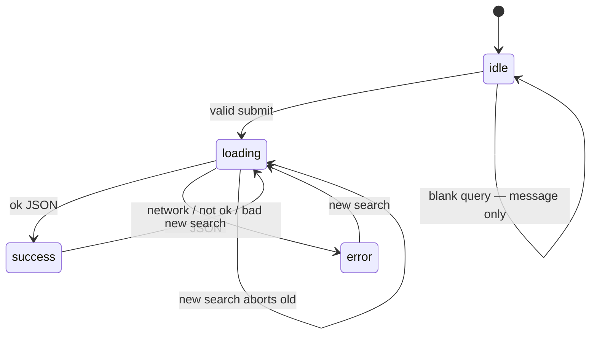

# Month 3 · Week 4 · Day 2
# Loading, Error, Empty, Abort, Network Failures

**Month index:** [../../README.md](../../README.md)  
**Week 4:** [1](day-01.md) · Day 2 (today) · [3](day-03.md) · [4](day-04.md) · [5](day-05.md) · [6](day-06.md) · [7](day-07.md)  
**Week rhythm today:** Exercises + debugging  
**Study time:** 3–4 focused hours  
**Prereq:** Day 1 gate. You check `response.ok`. You know `fetch` fulfills on 404.

Project 2 requires loading, success, empty, bad input, network failure, non-2xx.

Yesterday you logged JSON. Today the **page** must tell the truth while the request is in flight, when the list is empty, and when two searches race.

---

## How to read this chapter

Booleans `loading` and `error` both true is an illegal combo you will invent by accident. Prefer **one** `status` field. Render **reads** that object. `fetch` **writes** it. They meet in `main.js`, not inside the paint function.



A **race**: search “ada”, then “ada lovelace”. If the first response **arrives last**, the UI shows the wrong books. **AbortController** cancels the previous `fetch`. The aborted promise rejects with `AbortError`. You **ignore** that error for UI (the new search owns the spinner).

Read. Then build. Write `STATES.txt` from **observed** Network rows, not from hope.

---

## Today's contract

By the end of this day you will be able to:

1. Model UI as `{ status, error, items }`.
2. Distinguish empty success from error.
3. Skip fetch on blank query.
4. Abort the in-flight request when a new search starts.
5. Map failures to human sentences via `textContent`.
6. Force a network or HTTP failure on purpose and record it.

**Today's gate**

> UI state is data: `{ status: "idle" | "loading" | "success" | "error", error: string | null, items: [] }`. Empty success (`items.length === 0`) is not an error. Abort the in-flight search when the user searches again.

---

## Time box

| Block | Minutes | Work |
|---|---|---|
| A | 50 | Theory |
| B | 40 | Guided: Offline and a 404 URL |
| C | 80 | Lab: search page + abort |
| D | 20 | Git |
| E | 15 | Recall |

---

# Theory (complete)

## 1. UI state is data

Do not scatter `loading: true` and `error: true` as independent booleans. Illegal combinations appear (`loading` and `error` both true). Prefer **one** `status`:

| status | Meaning | What to render |
|---|---|---|
| `idle` | No search yet | Empty region, no spinner |
| `loading` | Request in flight | “Searching…” (`aria-live="polite"`) |
| `success` | Got a 2xx JSON list | If `items.length` → list; if `0` → “No results” |
| `error` | Network, HTTP not ok, JSON parse, or abort you chose to show | `error` string via **textContent** |

**Empty success is not an error.** The HTTP trip worked. The catalog had no rows. Users should not see “Network error” for “no books named zxqq.”

**Blank query** is not a fetch. Stay idle or show a validation message. Do not set `loading`.

Render functions read the state object and update the DOM. They do not call `fetch`.

```js
function render(state) {
  statusEl.textContent = "";
  errorEl.textContent = "";
  list.replaceChildren();
  if (state.status === "loading") {
    statusEl.textContent = "Searching…";
    return;
  }
  if (state.status === "error") {
    errorEl.textContent = state.error ?? "Something went wrong.";
    return;
  }
  if (state.status === "success" && state.items.length === 0) {
    statusEl.textContent = "No results";
    return;
  }
  if (state.status === "success") {
    for (const item of state.items) {
      const li = document.createElement("li");
      li.textContent = item.title;
      list.append(li);
    }
  }
}
```

That is a shape. Your ids and copy may differ. The rule holds: **one status**, `textContent`, no fetch in `render`.

**Wrong belief:** “I’ll hide the list with CSS until load finishes.”  
**Correct:** CSS hide without state still races. State is the source of truth.

## 2. What `fetch` does to you (recap)

- **Rejects:** offline, DNS, CORS, abort. `catch` runs.
- **Fulfills with `ok === false`:** 404, 500, 401. You throw or set `error` after checking `response.ok`.
- **`response.json()` rejects:** body is not JSON.

Map those to **human** sentences in the UI (“Network error. Check your connection.” / “The server returned 404.”). Log the real `err` in the console for you.

Do not `textContent = String(err)` if it dumps a stack to the user. Human sentence in the `p`; `console.error(err)` for you.

CORS still rejects: the user sees network/CORS failure, not `ok === false`. You cannot fix someone else’s headers from this page.

## 3. AbortController

The user searches “ada”, then quickly “ada lovelace”. Two requests fly. If the first **finishes last**, the UI shows the wrong list. That is a **race**.

**AbortController** is a browser object with a **signal** you pass to `fetch`. Calling `abort()` rejects that fetch with `AbortError`.

```js
let controller = null;

async function search(q) {
  controller?.abort();
  controller = new AbortController();
  try {
    const response = await fetch(url, { signal: controller.signal });
    if (!response.ok) throw new Error(`HTTP ${response.status}`);
    const data = await response.json();
    return data;
  } catch (err) {
    if (err.name === "AbortError") {
      return; // a newer search owns the UI; do not flash this error
    }
    throw err;
  }
}
```

Detect abort with `err.name === "AbortError"` (or `err instanceof DOMException` in some browsers — `name` is the portable check this course uses).

You abort **the previous** search when a new one starts, not the one you just started.

Order:

1. Abort old controller (if any).
2. Create a **new** controller; keep it in the module-level variable.
3. `fetch` with **that** signal.
4. On AbortError from the **old** fetch: do not set `error`, do not `render` success from the old data. Return.
5. On success: only apply if this controller is still the current one (abort usually prevents the old `json()` from being applied; still do not set state from a stale return).

`controller?.abort()` uses optional chaining: first search, `controller` is null, skip.

**Wrong belief:** “I’ll ignore all errors in catch so abort is quiet.”  
**Correct:** ignore **AbortError** only. Other errors set `status: "error"`.

**Wrong belief:** “Debouncing is the same as abort.”  
**Correct:** debounce waits to **start**. Abort cancels an **already started** request. You may want both later. Today: abort. Blank still does not start.

Worked race:

| Time | User | In flight | UI |
|---|---|---|---|
| 0 | submit “a” | request A | loading |
| 100ms | submit “ab” | A aborted, request B | still loading (new) |
| 150ms | A would have returned | ignored AbortError / stale | unchanged by A |
| 300ms | B returns list | — | success with “ab” results |

Without abort, at 400ms A could overwrite B’s list.

## 4. Debugging

Network tab: method, URL, status, timing, red failed rows. DevTools can emulate **Offline**. A garbage hostname forces DNS/network failure. A path the API does not have forces 404 (`ok === false`).

Throttle “Slow 3G” if you cannot type a second search fast enough to see the race. Then you will **see** two rows, then one cancelled.

`STATES.txt` should mention: how you produced loading (slow throttle or a breakpoint), empty (query that legitimately returns []), error (offline or bad URL).

### Mapping Open Library vs JSONPlaceholder

Open Library search JSON is roughly `{ numFound, docs: [ { key, title, ... } ] }`. Your app object is `{ id: doc.key, title: doc.title }`. `docs` missing → treat as `[]`. `title` missing → `""` or skip the row — **document**.

JSONPlaceholder `/posts?userId=1` returns an **array** of posts, not `{ docs }`. `normalize` must not assume one shape. Write `normalize(data)` for **your** chosen API. Tests use a fixture copied from a real 200 body.

If you fetch posts and then `filter` titles client-side, blank still must not fetch. A query that matches nothing after filter is empty **success** if HTTP was 200.

### When to set loading

Set `status: "loading"` **after** blank check, **before** `await fetch`. If you set loading first then return on blank, you flashed a spinner for an empty box. Order is validation → loading → fetch.

On AbortError, do not set `error`. The new search already set `loading` again (or will). If you `render({ status: "error" })` on abort, the UI flickers “Something went wrong” between keystrokes.

### Human sentences

| Cause | UI text (example) |
|---|---|
| blank | “Enter a search.” (validation, not `status: "error"` unless you document that) |
| empty list | “No results.” |
| `!ok` | “The server returned 404.” (include status) |
| network | “Network error. Check your connection.” |
| bad JSON | “The server returned data we could not read.” |

Log `err` always. Users see the sentence. You see the stack.

**Wrong belief:** “I’ll `alert(err)`.”  
**Correct:** `textContent` in the page region. `alert` blocks the tab and is not an error UI.

### Abort and module scope

`let controller = null` at module top is enough this month. Do not put it inside `render`. Do not create a controller you never pass to `fetch` — aborting that does nothing.

`fetch(url, { signal })` — if you omit `signal`, `abort()` does not cancel that request. The race remains.

---

# Block B — Guided failures

1. Online: one successful search. Note status 200.
2. Offline: submit again. Catch. Human error message. Console has the real error.
3. A URL that 404s (JSONPlaceholder `https://jsonplaceholder.typicode.com/posts/999999999` may 404; if it 200s, use a path you observed as not ok). Record `ok`.
4. Restore online.

Do not use a CORS-disable extension.

---

# Lab

Search page: type query, fetch JSONPlaceholder `GET /posts?userId=1` **or** Open Library `https://openlibrary.org/search.json?q=...&limit=5`.

Map to titles with `textContent`. States as above. Abort previous. Empty query: do not fetch.

If you use `/posts?userId=1`, the query box might filter **client-side** after fetch, or you use Open Library so `q` hits the server. Either is fine if:

- blank → no fetch
- titles via textContent
- loading / empty / error exist
- abort on new submit

Open Library: map `docs` array; each doc has `title`, key as id. Empty `docs` is success empty.

`STATES.txt`: notes for loading, empty, error (use a garbage URL to force network/HTTP error).

`preventDefault` on the form. Modules. HTTP.

```powershell
git add month-03/week-04
git commit -m "Week 4 Day 2: search UI states and AbortController."
```

---

# Block E — Recall

1. Why empty success is not error.
2. What fetch does on 404 vs offline.
3. Why abort the previous, not the current.
4. How you detect AbortError.
5. Why render does not fetch.

---

## Definition of done

- [ ] One status field, not dual booleans
- [ ] Blank does not fetch
- [ ] Empty results message ≠ network error
- [ ] Abort on new search
- [ ] STATES.txt from observation
- [ ] textContent only for titles and errors
- [ ] Commit exists

---

## Optional review links

UI states, network failures, and abort are explained above.

- [MDN: `AbortController`](https://developer.mozilla.org/en-US/docs/Web/API/AbortController)
- [MDN: Handling fetch errors](https://developer.mozilla.org/en-US/docs/Web/API/Fetch_API/Using_Fetch#checking_that_the_fetch_was_successful)

---

## Tomorrow

From memory: lookup page with `api.js` / `ui.js` / `main.js`, fixture tests for `normalize`, all states. Days 1–2 closed during drills.
