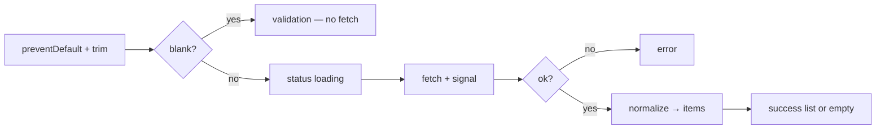

# Month 3 · Week 4 · Day 3
# From Memory: Fetch + States

**Program:** Full-Stack Mastery · 18 months  
**Phase:** 1 — Foundations  
**Month index:** [../../README.md](../../README.md)  
**Week 4:** [1](day-01.md) · [2](day-02.md) · Day 3 (today) · [4](day-04.md) · [5](day-05.md) · [6](day-06.md) · [7](day-07.md)  
**Week rhythm today:** Implement from memory  
**Study time:** 3–4 focused hours  
**Days 1–2 of this week:** closed during the drills. Repair from **those day files in this textbook**, not from MDN.

Work in `~\fullstack-lab\month-03\week-04\day-03\`. Serve over **HTTP**. `node --test` on `normalize` with a fixture — no live `fetch` in tests. Do not paste Day 2’s `main.js`. Do not paste Project 2.

---

## How to use this textbook

1. Read a section of this recap. Close it. Say “fetch fulfills on 404; I check `ok`.”
2. Type the lookup from the spec. Do not paste Day 2’s `main.js` from the folder.
3. Predict empty vs error, then prove it in the Network tab.
4. Optional review links are for later — not for first wiring.

---

## How to read this chapter

This recap **is** the lesson. You will build a lookup from a public API without yesterday’s files open. The fixture test proves `normalize` without the network. The page proves states with the network.



Stuck 25 minutes: Day 1 or Day 2 in this book only.

---

## Complete explanation (async HTTP)

A **Promise** is pending, then fulfilled or rejected once.

**`async` functions** always return a Promise. **`await`** pauses **that function** until settle; the tab does not freeze. Rejected await **throws** → `try/catch`.

**`fetch`:** fulfills on 404/500 — check **`response.ok`**. Rejects on network/CORS/abort. `response.json()` may reject.

**CORS** is the browser asking the server if this origin may read the response. You cannot disable it to “make learning easier.”

**`curl.exe` vs the browser.** On Windows PowerShell, type **`curl.exe`**, not `curl` (that alias is often `Invoke-WebRequest`). `curl.exe` is an HTTP client with **no CORS**. It can print JSON that the page cannot read if the API disallows your origin. Use curl to inspect a public URL. Use the **browser Network tab** to see what `fetch` actually got. They can disagree; that disagreement is CORS, not “Node vs JS.”

```powershell
curl.exe -i "https://openlibrary.org/search.json?q=dune&limit=1"
```

You should see an HTTP status line and a JSON body. That proves the **server** answered. It does not prove your page may read that body. If the page’s `fetch` rejects with a CORS message, pick an API that allows browsers (Open Library, JSONPlaceholder, DummyJSON). Do not install a disable-CORS extension.

**States:** one `status`: idle / loading / success / error. Success with `[]` is empty, not error. Blank query: no fetch.

**AbortController:** abort the previous `fetch` when a new search starts. Ignore `AbortError` for the abandoned request. Do not ignore other errors.

**UI:** `textContent`. `preventDefault` on the form. Map API JSON to `{ id, title }` in a pure function you can test with a fixture file — no network in `node --test`.

`render(state)` does not fetch. `api.js` does not touch `document`. `main.js` wires.

> **Wrong belief:** “If the list is empty, fetch failed.”  
> **Correct:** empty can be 200 + `[]`. Error is reject or `!ok` or parse throw.

> **Wrong belief:** “I’ll `await fetch` in the test.”  
> **Correct:** tests go red on airplane mode. Fixture + `normalize`.

> **Wrong belief:** “curl.exe failed, so the browser will fail the same way.”  
> **Correct:** curl has no origin policy. The browser does. Check both.

Worked normalize: Open Library-like `{ docs: [{ key: "/x", title: "Dune" }] }` → `[{ id: "/x", title: "Dune" }]`. Missing `docs`: `[]`. Extra fields ignored. Titles via later `textContent`.

### File split you must type

`api.js`: `searchBooks(q, { signal })` — builds URL (encode the query), `fetch`, `ok`, `json`, `normalize`, return `{ ok: true, items }` or throw. **Or** return a result object. Document. Tests do not call `searchBooks`.

`normalize(data)`: pure. Fixture in `fixture.json` or a copied object in the test file.

`ui.js`: `render(state)` — idle/loading/success/error, `textContent`, `replaceChildren`. Null-check nodes in `main.js` then pass them in, or query inside render with a throw if missing.

`main.js`: form submit, blank, abort previous, set loading, await, set success/error, render. `type="button"` clear resets to idle.

### Encoding the query

`https://openlibrary.org/search.json?q=${q}` breaks on spaces and `&`. Use `new URL("https://openlibrary.org/search.json")` then `url.searchParams.set("q", q)` then `url.searchParams.set("limit", "5")`. That is how query strings stay valid. A space becomes `%20` or `+`. If you skip this, some queries fail in ways that look like CORS.

### Fixture test shape

```js
import assert from "node:assert/strict";
import { test } from "node:test";
import { normalize } from "./api.js";

test("normalize reads docs", () => {
  const data = { docs: [{ key: "/works/OL1", title: "Dune", extra: 1 }] };
  assert.deepEqual(normalize(data), [{ id: "/works/OL1", title: "Dune" }]);
});

test("normalize missing docs is empty", () => {
  assert.deepEqual(normalize({}), []);
});
```

No `fetch`. No `document`. `node --test`. `"type": "module"`.

> **Wrong belief:** “I’ll copy Day 2’s `main.js` from memory of the folder.”  
> **Correct:** the folder is closed. This recap is the spec. A different heading and API still count.

### AbortError in the lookup

Same as Day 2: module-level controller, abort on new submit, ignore `err.name === "AbortError"`. If you skip abort, write in NOTES why a slow lookup is a race — then add abort anyway. The gate wants it.

### Loading copy and a11y

`aria-live="polite"` on the status `p`. When status becomes “Searching…”, assistive tech can announce it. Do not `aria-live` on the whole `ul` if every `li` would shout. Status region is the justified ARIA (Month 2 gap: native HTML cannot announce async status).

Empty: “No results” in that region or a dedicated `p`, still `textContent`. Error: human sentence, still `textContent`.

### Encoding reminder

`searchParams.set("q", q)` so spaces do not break the URL. If you concatenate raw `q` into the URL, `"dune & co"` becomes two query parameters and a confusing 400/empty.

### Time box if the API is slow

Use `limit=5`. Do not wait on huge payloads. If the API is down, switch to JSONPlaceholder and still `normalize` — document the switch in README. The skill is `ok` + states, not loyalty to one host.

### Promise recap in one worked call

```js
export function normalize(data) {
  if (!data || !Array.isArray(data.docs)) {
    return [];
  }
  return data.docs.map((doc) => ({
    id: String(doc.key ?? ""),
    title: String(doc.title ?? "Untitled"),
  }));
}

export async function searchBooks(q, { signal } = {}) {
  const url = new URL("https://openlibrary.org/search.json");
  url.searchParams.set("q", q);
  url.searchParams.set("limit", "5");
  const response = await fetch(url, { signal });
  if (!response.ok) {
    throw new Error(`HTTP ${response.status}`);
  }
  const data = await response.json();
  return normalize(data);
}
```

`await fetch` — network/CORS/abort reject. `ok` — 404 does not reject. `await json()` — parse may reject. `normalize` — pure, tested.

Tests import `normalize` only. If `api.js` called `fetch` at import time, Node tests would hit the network. Keep fetch inside `searchBooks`.

`assert.deepEqual` for the mapped array. Missing `docs` → `[]` is success-shaped data, not an error. The **page** decides empty vs error from `status`, not from `normalize`.

> **Wrong belief:** “I’ll `innerHTML` a card template and fill titles later.”  
> **Correct:** API titles are untrusted. `createElement` + `textContent` from the first row.

> **Wrong belief:** “Blank search can still fetch; the API will return everything.”  
> **Correct:** you must not fetch. Trim, error `p`, Network tab stays quiet. `"0"` is a query. `"   "` is not.

Offline: DevTools Network → Offline, submit a real query, error state, human sentence. That is not empty success. Empty success is 200 + zero rows while online.

### HTTP

Serve the `day-03` folder. Network tab: one request per non-blank submit. Blank: zero new search requests. Offline: error state.

Titles from the API go through `textContent`. Never `innerHTML`.

```powershell
cd ~\fullstack-lab\month-03\week-04\day-03
npx --yes serve .
node --test
```

`file://` will not load `./api.js` as a module. CORS is checked against the **page origin** (`http://127.0.0.1:PORT`), not against Node.

### Abort wiring in `main.js` (shape, not a product)

```js
let controller = null;

form.addEventListener("submit", async (event) => {
  event.preventDefault();
  const q = String(new FormData(form).get("q") ?? "");
  if (q.trim() === "") {
    errorEl.textContent = "Type a search first.";
    return;
  }
  errorEl.textContent = "";
  if (controller) {
    controller.abort();
  }
  controller = new AbortController();
  state.status = "loading";
  render(state);
  try {
    const items = await searchBooks(q.trim(), { signal: controller.signal });
    state.status = "success";
    state.items = items;
    render(state);
  } catch (err) {
    if (err && err.name === "AbortError") {
      return;
    }
    state.status = "error";
    state.message = "Could not load results.";
    render(state);
  }
});
```

`preventDefault` first. Blank: no `fetch` (Network tab proof). Ignore **only** `AbortError`. A 404 still fulfilled — `searchBooks` threw after `!ok`, so this catch is correct. Human message via `textContent`, not the raw stack.

Empty success: `status === "success"` and `items.length === 0`. Show “No results.” Do not reuse the error sentence.

`ui.js` `render(state)` switches on `state.status`. It does not fetch. Loading copy is a human sentence via `textContent`. Error copy is a human sentence via `textContent`. List rows: `createElement` + `textContent` for `item.title`. `replaceChildren` first.

Abort: store a controller at module scope in `main.js`. New submit → `controller.abort()`, new `AbortController`, pass `signal`. Catch: if `err.name === "AbortError"` return; else error state. A cancelled request must not flash the error `p`.

`curl.exe -i` the same URL. Write the HTTP status next to the Network tab status. If they disagree, the sentence is CORS, not “JavaScript is broken.”

---

## Today's contract

**Today's gate**

> Lookup page with async/await, ok check, try/catch, loading/error/empty, textContent, preventDefault, no fetch on blank, normalize tests without network.

---

## Time box

| Block | Minutes | Work |
|---|---|---|
| A | 20 | Speak promises / ok / states / abort |
| B | 90 | Build day-03 lookup |
| C | 40 | Fixture tests |
| D | 20 | Git |

---

# Spec

Build `day-03/` a **book or user lookup** from a public API of your choice.

Must: `async/await`, `response.ok`, `try/catch`, loading/error/empty, `textContent`, `preventDefault`, no fetch on blank query.

`api.js` + `ui.js` + `main.js`. `api.test.js` can test a **pure** `normalize(data)` with a fixture JSON file, not the network.

Pick JSONPlaceholder or Open Library — something that allows the browser. Record the base URL in README.

Abort on new search. Human error strings. `aria-live` on status.

Optional: paste the same URL into `curl.exe -i "..."` and write the status next to the Network tab status. If they differ, write one sentence about CORS.

This is a lookup lab, not Project 2. One form, one list, states. No collection feature required.

Predict before Network: blank submit → zero search requests. `"0"` → a request. Offline → error, not empty. 200 with no docs → empty success. `!ok` → error. Titles never `innerHTML`.

`package.json` `"type": "module"`. Tests: `node --test` on `normalize` only. If a test calls `fetch`, delete that test. Airplane mode must stay green for the fixture file.

```powershell
git add month-03/week-04/day-03
git commit -m "Day 3: fetch lookup from memory with UI states."
```

---

## Definition of done

- [ ] Modules split
- [ ] normalize tests green
- [ ] Blank does not appear in Network as a request
- [ ] Empty vs error distinguishable
- [ ] Abort present
- [ ] Commit exists

If the list stays empty on 200, log the JSON once in the Console during debugging, then fix `normalize` and lock it with a fixture. Do not leave `console.log` as the test. If abort is missing, a slow first query can overwrite a second — write that race in NOTES even if you add abort in the same hour.

`file://` will 404 `./api.js`. Serve HTTP. `curl.exe` is not the page. `response.ok` is not optional. Empty is not error.

### States you must be able to point at

| Status | What the page shows | Network |
|---|---|---|
| idle | form ready, no list claim | no search yet |
| loading | “Searching…” via `textContent` | request in flight |
| success + rows | `li` titles via `textContent` | 200, `ok` true |
| success + empty | “No results” | 200, zero mapped rows |
| error | human sentence | `!ok`, offline, CORS, JSON throw |
| abort | no error flash for the abandoned call | cancelled |

Blank never becomes loading. `"   "` is blank. `"0"` is not. `normalize` tests stay offline. `aria-live="polite"` on the status `p` only.

---

## Optional review links

Fetch, states, and abort are explained in this chapter. These pages are for later checking, not for first learning.

- [MDN: Using fetch](https://developer.mozilla.org/en-US/docs/Web/API/Fetch_API/Using_Fetch)
- [MDN: `AbortController`](https://developer.mozilla.org/en-US/docs/Web/API/AbortController)

---

## Tomorrow

**Project 2 starts** in its **own repo**. This textbook will not give you the app. Read the requirements file. PLAN.md, skeleton, search wired.
