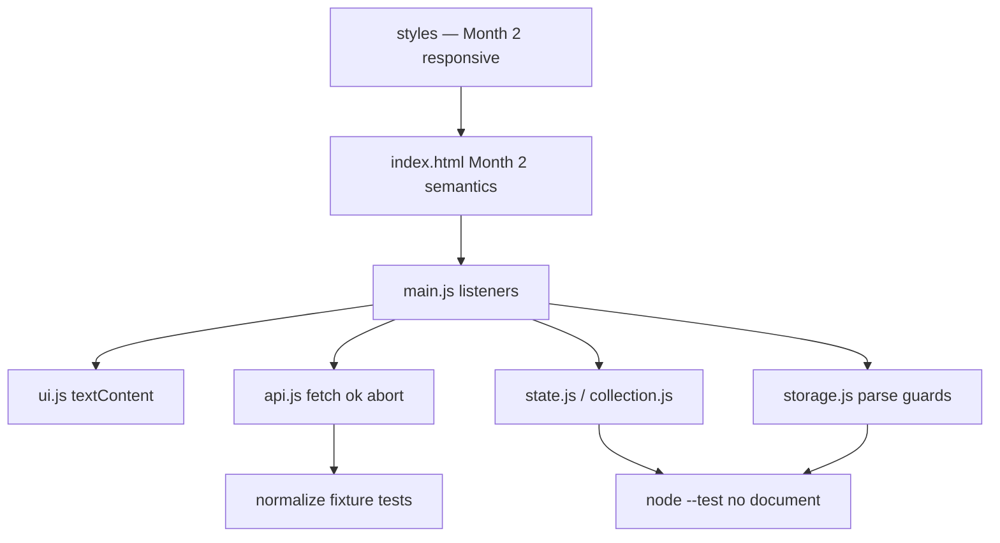

# Month 3 · Week 4 · Day 4
# Start Project 2 (Your App)

**Program:** Full-Stack Mastery · 18 months  
**Phase:** 1 — Foundations  
**Month index:** [../../README.md](../../README.md)  
**Week 4:** [1](day-01.md) · [2](day-02.md) · [3](day-03.md) · Day 4 (today) · [5](day-05.md) · [6](day-06.md) · [7](day-07.md)  
**Week rhythm today:** Add a real project feature  
**Study time:** 3–4 focused hours  

This textbook **does not** contain Project 2 source.

Read `full_stack_project_requirements_2026/project_02_vanilla_javascript_application.md`.

You have been building **skills**. Today those skills become a **product** you own. If you paste a YouTube movie app, you fail the Month 3 gate even if the pixels look finished.

---

## How to use this textbook

1. Read the requirements file first. This chapter is a map, not a substitute spec.
2. Type a new repo. Do not copy fullstack-lab into explorer as the product.
3. Wire **search** with states. Collection may be a labeled stub.
4. Optional review links are for later — not for pasting a tutorial.

---

## How to read this chapter

Project 2 is a **map**, not a new language. Each box in the diagram is a file you already know how to start.



Do **not** start Month 4 with an empty product. You may keep building after Day 7. You may not skip the skeleton today.

There is no complete app in this file. There will never be. Requirements live in the spec. Skills live in this month’s labs. The product lives in **your** repo.

---

## How the pieces you already learned become a product

Project 2 is not a new language. It is this month’s skills in one repo:

| Skill | Where it lives |
|---|---|
| Semantic HTML, labels, keyboard, responsive CSS | Month 2 + `index.html` / CSS you write |
| `isBlank`, filter, sort, status | `state.js` or `collection.js` — **pure**, tested in Node |
| `fetch`, `ok`, JSON map | `api.js` |
| `localStorage` + parse guards | `storage.js` |
| `textContent`, delegation, `preventDefault` | `ui.js` / `main.js` |
| idle/loading/success/error | a state object, not scattered booleans |
| Abort previous search | `AbortController` in `api.js` or `main.js` |

**HTTP:** serve the app (`npx serve`, Live Server, or Python’s http server). ES modules will not load reliably from `file://`.

**Map API → app objects.** Do not spread a giant Open Library document into the DOM. Pick `id`, `title`, maybe `year`. Extra keys stay in the API layer.

**Collection** is a second list (saved items), not the search results. Persist the collection, not necessarily the last search (unless the spec asks). Follow the requirements file.

If search results and saved items **share one array reference**, save will corrupt search (Week 2). Copy when you add: `addItem` from a **mapped** object `{ id, title, status }`, not `results.push`.

Forbidden: React, jQuery, copying a YouTube “movie app.” AI may review; it may not paste the product.

> **Wrong belief:** “I’ll wire everything today or I failed.”  
> **Correct:** today is repo + plan + skeleton + **search fetch with states**. Collection may be stubbed. The gate still wants the full product before Month 4.

> **Wrong belief:** “Labs in fullstack-lab are the app.”  
> **Correct:** new repo. You may **retype ideas**. You may not copy the lab into the product as the whole architecture without thinking. Paths, names, and domain are yours.

Worked plan excerpt (you write a real PLAN.md, not this paragraph as the file):

- Domain: books. API: Open Library search. Modules listed. State: `{ search: { status, error, items }, collection: [] }`. Regions: search form, results, saved list, filters. XSS: textContent. Tests: filter/sort/parse/normalize.

### What “stubbed collection” means

A stub is a visible region that says “Saved items will appear here” (or an empty `ul`) and a Save button that **does nothing yet** or `console.log`. It is not a hidden lie that save works. PLAN.md lists “collection: stub.” README says the same.

Search **must not** be a stub today. Loading, empty, error, `ok`, `textContent`, `preventDefault`, blank skip fetch, abort if you can wire it (wire it).

### HTML you already know how to write

Month 2: doctype, `lang`, charset, viewport, unique `title`, description, landmarks, one `h1`, labels `for`/`id`, visible text on buttons, skip link if you still have the habit, responsive CSS (`max-width`, `rem`, no horizontal disaster at 320px). Keyboard: form submit on Enter. Focus styles.

This is a **JavaScript** month, not permission to ship unlabelled inputs. Project 2 requirements will say accessible. You already have the HTML/CSS skill.

### State shape (write this in PLAN.md)

```text
{
  search: { status: "idle"|"loading"|"success"|"error", error: null|string, items: [] },
  collection: [],
  filter: "all"
}
```

Search `items` and `collection` are **two arrays**. Saving copies `{ id, title, status }`. `JSON.stringify` the collection schema in `storage.js`, not the whole state, unless the spec asks to persist more.

### API choice

JSONPlaceholder is easy and CORS-friendly but is not a book catalog. Open Library matches a book explorer. DummyJSON has products. Pick one, write the base URL, write example request URL with a sample query. If CORS bites, **change API**, do not install an extension.

Inspect the API once with **`curl.exe`** (Windows: not `curl`) so you see the real JSON shape before you guess field names:

```powershell
curl.exe -i "https://openlibrary.org/search.json?q=dune&limit=1"
```

Write the status and the array key (`docs`, `results`, …) in PLAN.md. Then `normalize` those fields. `curl.exe` has no CORS; the page still might. If `fetch` rejects and curl succeeded, that is origin policy.

### Git in the new repo

```powershell
cd ~\explorer
git init
git add .
git commit -m "Start Project 2: book explorer skeleton and search fetch."
```

Do not `git add` `node_modules`. First commit should be reviewable: HTML, CSS, JS modules, PLAN, README.

> **Wrong belief:** “fullstack-lab is my portfolio.”  
> **Correct:** the explorer repo is the product. Labs are drills.

> **Wrong belief:** “I need a bundler.”  
> **Correct:** ES modules over HTTP. Month 5 is tooling.

### XSS and Project 2 from minute one

`renderResults` uses `createElement` + `textContent`. If you generate a card with template strings and `innerHTML`, you failed a gate item before collection exists. Grep now.

API titles are untrusted. `"<b>x</b>"` as text vs bold is still the proof. This book will not give you an exploit.

### README the stranger test

A classmate clones the repo. They run the serve command you wrote. They open the URL. They see a labeled search box. They submit a real query and see loading then titles or empty or error. They do not need to guess the port. They do not double-click `index.html`.

If README says “just open the file,” rewrite README.

README must also say how to run `node --test` once tests exist (tomorrow at latest). Today you can add `"type": "module"` so tomorrow is not a scavenger hunt.

### `.gitignore` starter (you type; adjust)

```
node_modules/
.DS_Store
Thumbs.db
*.log
.env
```

There is no `.env` API key in a public book search this month. Still ignore `.env` so you never commit one later by habit.

### Search wiring order

1. HTML form + results region + status `p` (`aria-live="polite"`).
2. `api.js` `search(q, { signal })` with `ok` and `normalize`.
3. `ui.js` `renderSearch(state)`.
4. `main.js` submit → blank check → abort previous → loading → await → success/error.
5. Network tab proof: 200, and one forced failure.

Do not write collection helpers before search works. Search is today’s product slice.

### Requirements file is the boss

If the spec wants movies and you prefer books, that is a documented choice **only if the spec allows a domain pick**. Read it. Do not invent requirements that contradict it. This textbook does not reprint the spec so it cannot go stale against your PDF/markdown in `full_stack_project_requirements_2026/`.

### What you will be tempted to copy

Lab `getUser`. Lab search page. Week 2 `collection.js`. Ideas: yes. Entire files dropped into explorer as the app: no. Paths, names, and UI must be the product’s. Retype. Think.

> **Wrong belief:** “PLAN.md is bureaucracy.”  
> **Correct:** PLAN.md is how Day 7 you remembers why `search.items` is not `collection`.

---

## Today's contract

**Today's gate**

> A new git repo exists with README, PLAN.md, semantic skeleton, and search talking to a real API with loading/error/empty. Not a tutorial paste.

---

## Time box

| Block | Minutes | Work |
|---|---|---|
| A | 30 | Read the requirements file; choose domain + API |
| B | 40 | Repo, gitignore, README, PLAN.md |
| C | 80 | HTML/CSS skeleton + search fetch states |
| D | 20 | Notes commit in fullstack-lab if any |
| E | 15 | What is stubbed vs done |

---

## Today (required)

1. Create a **new repo** `~/explorer/` (or similar) — not a dump of fullstack-lab.
2. `git init`, `.gitignore`, README (problem, chosen API, how to run HTTP server).
3. `PLAN.md`: domain (movie / book / product), API base URL, module list (`api.js`, `storage.js`, `state.js`, `ui.js`, `main.js`), state shape, UI regions.
4. Semantic HTML skeleton + CSS using Month 2 skills (responsive, keyboard, labels).
5. Wire **search** to real fetch with loading/error/empty — even if save/collection is stubbed.

`.gitignore` should ignore `node_modules` if you add any, OS junk, editor folders. Do not commit secrets. There should be none.

`package.json` `{ "type": "module" }` so `node --test` works tomorrow.

Continue after Day 7 until the project Definition of Done is true. The **Month 3 gate** is: main application logic without a tutorial — you may finish collection/filter/sort/tests in extra sessions this month, but do not start Month 4 with an empty product.

```powershell
# only lab notes, if any
cd ~\fullstack-lab
git add month-03/week-04
git commit -m "Notes for Project 2 start (app lives in its own repo)."
```

Commit in **the Project 2 repo** separately (`git add` the skeleton, message that names the domain and API).

### Folder sketch (names yours)

```
explorer/
  index.html
  styles.css
  package.json
  README.md
  PLAN.md
  js/
    main.js
    api.js
    ui.js
    state.js
    storage.js
  js/api.test.js
```

Flat `*.js` next to `index.html` is also fine. What matters: `import` paths include `.js`, HTTP, modules.

### First search proof

Submit a query you know exists. Network 200. Titles as text. Submit `zxqqzzqq` or similar. 200 with empty docs → “No results,” not a red error. Offline → error sentence. Blank → no request.

If search is still stubbed at the end of the day, you did not finish today’s gate. Collection stub is allowed. Search stub is not.

### PLAN.md headings

Write: Problem, Domain, API (base URL + example query), Modules (one line each), State shape, UI regions, XSS rule, Test command, Out of scope (React, jQuery, file://). If a heading is empty, you have not planned.

### CSS you already know

`max-width` on main, `rem` type, visible `:focus-visible`, no color-only status (loading text is enough). Do not spend the day on a gradient hero. Search must work.

---

## Definition of done (today, not the whole product)

- [ ] Requirements file read
- [ ] Own repo, not fullstack-lab dump
- [ ] PLAN.md lists modules and state
- [ ] Search fetch with states on HTTP
- [ ] textContent for titles
- [ ] Collection may be stub — listed as stub in PLAN
- [ ] No React/jQuery/tutorial paste

---

## Optional review links

Project 2 is specified in the requirements file. Fetch and modules are explained in this month’s day files. These pages are for later checking, not for first learning.

- [MDN: Using fetch](https://developer.mozilla.org/en-US/docs/Web/API/Fetch_API/Using_Fetch)

---

## Tomorrow

Tests in the lab and in the product repo. DEBUG.md with one real bug. Grep innerHTML.
