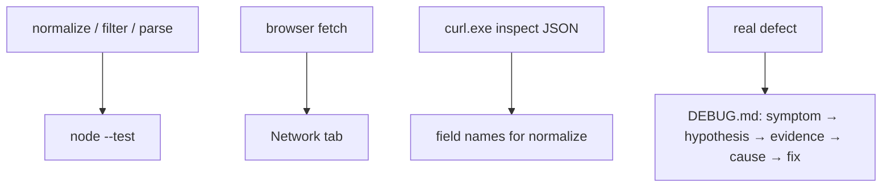

# Month 3 · Week 4 · Day 5
# Tests and Quality for Async Labs + Project 2

**Program:** Full-Stack Mastery · 18 months  
**Phase:** 1 — Foundations  
**Month index:** [../../README.md](../../README.md)  
**Week 4:** [1](day-01.md) · [2](day-02.md) · [3](day-03.md) · [4](day-04.md) · Day 5 (today) · [6](day-06.md) · [7](day-07.md)  
**Week rhythm today:** Tests + refactor + documentation  
**Study time:** 3–4 focused hours  
**Student state:** Search exists in Project 2 or in the week-04 lab. Today you lock **pure** transforms so the network cannot be your only test suite.

Work in `~\fullstack-lab\month-03\week-04\` for lab tests. Project 2 tests live in **that repo**, which this textbook does not contain. Never paste application source here or from a tutorial. Helpers you type (`normalize`, `isBlank`, `filterByStatus`, `sortByTitle`, `parseCollection`) are allowed.

---

## How to use this textbook

1. Read a section. Close it. Say why live `fetch` is a bad only-suite.
2. Write fixture tests. Run `node --test`. Do not paste Project 2.
3. Write one real DEBUG.md bug in five parts.
4. Optional review links are for later — not for first fixtures.

---

## How to read this chapter

Live `fetch` in `node --test` is flaky (network, CORS, rate limits). You test **functions that do not need the network**: normalize, filter, sort, parse, isBlank.

The Network tab is still a test — a **manual** one. `curl.exe` is another manual HTTP client (no CORS). DEBUG.md is how you write a bug like a scientist.



Zero tests in Project 2 is a **gate fail**, even if the UI dazzles.

This textbook still does not contain the app. Tests you write are **yours**, against **your** helpers.

---

## What we are testing (explained)

You cannot reliably `node --test` a live network as your only suite (flaky, needs credentials, CORS). You test **pure** functions:

- `normalize(apiJson)` → `{ id, title }`
- `isBlank`, `filterByStatus`, `sortByTitle`
- `parseCollection(raw)` for localStorage strings

Fixture: a saved JSON file next to the test, `import raw from` is unnecessary — `readFileSync` or a copied object in the test file is enough.

If you use `readFileSync`, remember ESM: `import { readFileSync } from "node:fs"` and a path next to the test. A copied object is simpler. Either is honest.

**Project 2 README** must say the exact command (`node --test` or `npm test` if you added a script). At least one test exists. More is better; zero is a gate fail.

**DEBUG.md:** the project spec asks for written bugs. Format: symptom → hypothesis → evidence (Network tab, console, test) → cause → fix. Start the file today with **one** real bug you already hit (empty `ok` check, CORS, `sort` mutation, JSON throw).

Example skeleton (write **your** bug, not this fiction as if it happened):

```md
## Bug: results stayed empty on 200
- Symptom: spinner stopped, list empty, no error.
- Hypothesis: ok was false, or normalize looked at the wrong key.
- Evidence: Network status 200; console logged the JSON; `docs` was the array, I mapped `results`.
- Cause: wrong field name in normalize.
- Fix: map `docs`; test with fixture.
```

**XSS:** grep `innerHTML`. API titles are untrusted. User text and storage strings too. `textContent` only.

**Network tab:** you used it — status, payload, failed request. That is an operate skill, not a screenshot contest. Write in TESTS.md or DEBUG that you saw a 200 and a failure.

**`curl.exe`:** same URL as the page, from PowerShell. Compare status. If curl shows JSON and the page’s `fetch` rejects, write CORS in DEBUG — that is evidence. Always `curl.exe`, never PowerShell `curl`.

```powershell
curl.exe -i "https://openlibrary.org/search.json?q=dune&limit=1"
```

> **Wrong belief:** “I’ll add tests after the UI is pretty.”  
> **Correct:** pretty UI with `sort` mutating search results is a defect factory. Tests on collection/sort now.

> **Wrong belief:** “Mocking fetch is required this month.”  
> **Correct:** not required. Pure normalize is enough. Month 4 deepens testing.

Deliberate: break `sortByTitle` to mutate; watch red; restore — if you have that helper yet. If collection is still stubbed, test `normalize` and `isBlank` at minimum.

### What “at least one test” may look like

```js
import assert from "node:assert/strict";
import { test } from "node:test";
import { isBlank } from "./validate.js";

test("whitespace is blank", () => {
  assert.equal(isBlank("  "), true);
});
```

That is enough to fail the “zero tests” gate **only** if you add more before Month 4: filter, sort mutation, parse garbage. Today’s minimum is one. Today’s **honesty** is a list in README of what is not tested yet.

Use `assert.deepEqual` for objects. `assert.equal` on two `{ id, title }` literals fails — different piles.

### Fixture without import assertions

Some Node versions want extra flags to `import json`. Avoid the fight: copy the object into the test file, or `JSON.parse(readFileSync(new URL("./fixture.json", import.meta.url), "utf8"))`. `import.meta.url` is how ESM finds a neighbor file. If that is too new, paste the object. The fixture must look like **real** API JSON, not `{ title: "x" }` if the API uses `docs`. `curl.exe` showed you the shape; the fixture should match.

Lab normalize test (fullstack-lab, not the product):

```js
test("normalize maps docs to id and title", () => {
  const fixture = {
    docs: [{ key: "/works/OL1", title: "Dune", extra: true }],
  };
  assert.deepEqual(normalize(fixture), [
    { id: "/works/OL1", title: "Dune" },
  ]);
});
```

No `await fetch`. Airplane mode must not fail this file.

### Filter and sort claims you already know

Keep the Week 2 ideas. Copy ids or titles **before** the call. Assert the source unchanged. Assert the output.

```js
test("sortByTitle copies before sort", () => {
  const list = [
    { id: "2", title: "Neuromancer", status: "want" },
    { id: "1", title: "Dune", status: "want" },
  ];
  const before = list.map((item) => item.title);
  const sorted = sortByTitle(list);
  assert.deepEqual(
    list.map((item) => item.title),
    before,
  );
  assert.equal(sorted[0].title, "Dune");
});

test("filterByStatus all returns a copy", () => {
  const list = [{ id: "1", title: "Dune", status: "want" }];
  const view = filterByStatus(list, "all");
  view.push({ id: "x", title: "nope", status: "want" });
  assert.equal(list.length, 1);
});
```

`parseCollection` / `parseNotes` still wrap `JSON.parse` in `try/catch`. Garbage → `[]`. Tests inject strings.

```js
export function parseCollection(raw) {
  if (raw === null || raw === "") {
    return [];
  }
  try {
    const data = JSON.parse(raw);
    if (!data || typeof data !== "object" || data.version !== 1) {
      return [];
    }
    if (!Array.isArray(data.items)) {
      return [];
    }
    return data.items;
  } catch {
    return [];
  }
}
```

`localStorage` stores strings. Tests never need `localStorage`. The page calls `getItem`, then `parseCollection`.

### DEBUG.md quality

A fake bug you did not hit (“I forgot a semicolon”) is not the assignment. Use one you **saw**: CORS, `ok`, empty `docs`, module 404, `file://`, sort, parse throw, AbortError flashed as error. Evidence is a status code, a Console line, or a test name.

Symptom is what a user or you noticed. Hypothesis is a guess you can test. Evidence is what you looked at. Cause is the actual mechanism. Fix is the change. Five parts. Not a diary of feelings.

### Quality that is not a linter

Month 4–5 add lint/format. Today: consistent names, no `innerHTML` of data, `===`, trim, `ok` check, copy before sort. README: how to serve, how to `node --test`, which API, that this is not a tutorial clone.

Serve the lab over HTTP. Project 2 too. `file://` is still wrong.

### Lab vs app

fullstack-lab week-04 tests prove you can normalize without the product. Project 2 tests prove the product’s helpers. Both exist. A green lab does not mark the app tested.

If the app repo has no `package.json` `"type": "module"`, add it today or tests using `import` will fail. Same lesson as Week 1 Day 4.

```powershell
cd ~\fullstack-lab\month-03\week-04
node --test
```

In the **app** repo, the same command — your path, not a path this book invents as the product.

### Break a test on purpose in the app

Change `isBlank` or `normalize` so a claim is false. Run `node --test`. Screenshot is optional; writing the failing test name in DEBUG or TESTS is required. Restore. Same scientific method as Week 1 Day 5.

> **Wrong belief:** “Project 2 is too UI to test.”  
> **Correct:** the UI is untested this month; the **transforms** are not. That split is the architecture.

> **Wrong belief:** “fetch fulfilled, so I can skip `ok`.”  
> **Correct:** 404 fulfilled. Empty UI with no error is the usual symptom. Check `response.ok`. Fixture tests will not catch a missing `ok`; the Network tab and DEBUG will.

### DEBUG.md second bug (start the file; finish by exam)

The spec wants two written bugs by the end. Today: one complete five-part entry. Leave a heading for bug 2 if you have not hit a second yet. Do not invent a fake second.

### What grep must not find

`innerHTML =` next to `title`, `query`, `name`, `item.`, `data.`. A comment that says “never innerHTML user data” is fine. Running assignment of API fields is a fail.

### Recall

1. Why live fetch is a bad only-suite.
2. `assert.deepEqual` vs `equal` for objects.
3. Five parts of DEBUG.md.
4. Where `"type": "module"` lives in the app repo.
5. Why `curl.exe` can succeed when `fetch` rejects.
6. Why `JSON.parse` belongs in `try/catch` even if normalize is pure.
7. What a weak sort test looks like (already-sorted titles).

---

## Today's contract

**Today's gate**

> Lab `node --test` green for normalize/filter. Project 2 has at least one test and documents the command. DEBUG.md has one real bug in the five-part format. No innerHTML of API data.

---

## Time box

| Block | Minutes | Work |
|---|---|---|
| A | 25 | What is testable without network |
| B | 50 | fullstack-lab week-04 tests |
| C | 60 | Project 2 tests + README command |
| D | 40 | DEBUG.md + innerHTML grep |
| E | 15 | Recall |

---

# Today

In **fullstack-lab** week-04: `node --test` for normalize/filter helpers.

In **Project 2 repo**: tests for filter/sort/validate/state transforms (no DOM). At least one test. Document `node --test` in README.

Checklist: Network tab used; one real bug written as symptom → hypothesis → evidence → cause → fix (Project 2 spec asks for two by the end — start the file `DEBUG.md` now).

No innerHTML of API data.

```powershell
git add month-03/week-04
# and commit in the Project 2 repo separately
```

PowerShell grep in the app repo:

```powershell
Select-String -Path *.js -Pattern "innerHTML"
```

Fill a lab `TESTS.md` from this machine: command, date, PASS. A green run from yesterday does not cover today’s new claims.

`parseCollection("NOT JSON")` must return `[]` without throwing. If the test process dies, `JSON.parse` is not in `try/catch`. `localStorage` is strings; tests inject strings. The page still serves over HTTP so origin matches the notebook you inspect in Application.

If Project 2 README still says “run the tests” with no command, write `node --test` today. A stranger in the repo should not guess.

Lab and app are two histories. Green normalize in fullstack-lab does not mark the product tested. Add `isBlank` or `filterByStatus` in the **app** repo even if the UI is unfinished. Zero tests is a gate fail.

`Select-String -Path *.js -Pattern "innerHTML"` in the app. Record zero hits, or justify a static trusted string you wrote — never `innerHTML` of `title` from the API, the query, or storage.

DEBUG.md five parts, one real bug. Symptom is what you saw. Evidence is a status code or a failing test name. Cause is the mechanism (`!ok` skipped, wrong JSON key, `list.sort`). Fix is the change plus a test if it was a transform.

Serve lab and app over **HTTP**. `file://` fails modules and invents a useless origin. `localStorage` is strings; `JSON.parse` in `try/catch`. `fetch` still checks `response.ok`. Filter/sort tests still copy ids before the call.

> **Wrong belief:** “curl.exe 200 means my `ok` check is tested.”  
> **Correct:** curl never runs your JavaScript. Fixture tests lock `normalize`. The Network tab locks that **this tab’s** `fetch` saw a status. Both.

---

## Definition of done

- [ ] Lab tests green
- [ ] Project 2 has ≥1 test and README command
- [ ] DEBUG.md five-part entry
- [ ] innerHTML grep recorded
- [ ] Network tab used this week (note it)

If `node --test` cannot `import`, add `"type": "module"` in the **folder you run from**. Lab and app each need their own `package.json` if they are separate trees. A fixture that looks like `{ title: "x" }` when the API uses `docs` trains the wrong mapper — copy the shape `curl.exe` printed.

Deliberate break: make `sortByTitle` call `list.sort` without copy. Watch red. Restore. If nothing fails, the sort test is weak (already-sorted titles).

Parse tests inject `"NOT JSON"`, `"{}"`, and a valid `{ version: 1, items: [...] }` string. They do not open Application. The checklist opens Application. Both layers. `assert.deepEqual` for arrays; `assert.equal` for booleans.

README in the app: exact `node --test` (or `npm test` if you added a script), how to serve HTTP, which API, XSS sentence (`textContent` for titles).

A green lab does not close the product gate. Write the app command in the app README today even if only `isBlank` exists. Tomorrow’s independent still does not paste the app.

---

## Optional review links

Testing async labs is explained in this chapter. These pages are for later checking, not for first learning.

- [Node: test runner](https://nodejs.org/api/test.html)
- [Node: assert](https://nodejs.org/api/assert.html)

---

## Tomorrow

Independent fetch lab + Project 2 **collection** on a feature branch. Spec allowed; tutorial paste still forbidden.
