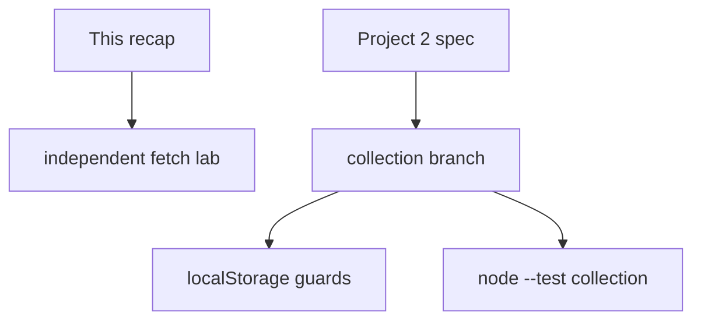

# Month 3 · Week 4 · Day 6
# Independent Async + Project 2 Collection

**Program:** Full-Stack Mastery · 18 months  
**Phase:** 1 — Foundations  
**Month index:** [../../README.md](../../README.md)  
**Week 4:** [1](day-01.md) · [2](day-02.md) · [3](day-03.md) · [4](day-04.md) · [5](day-05.md) · Day 6 (today) · [7](day-07.md)  
**Week rhythm today:** Independent project work  
**Study time:** 3–4 focused hours  
**Lab textbook days 1–5:** closed for Challenge 1. Project spec allowed for Challenge 2. Repair fetch facts from **this recap** or Week 4 Days 1–2 in this book.

Challenge 1 lives in `~\fullstack-lab\month-03\week-04\independent\`. Challenge 2 lives in **your** Project 2 repo. This textbook will not give you the app. Do not paste a movie explorer. Helpers below are for the **lab** and for ideas — retype collection functions in the app from the spec’s field names.

---

## How to use this textbook

1. Read this recap. Close it. Say ok / empty / abort / two arrays.
2. Challenge 1 is a **new** lab page. Do not paste Project 2.
3. Challenge 2 follows the **spec**. This file does not override field names.
4. Optional review links are for later — not for first collection wiring.

---

## How to read this chapter

Two challenges. The lab proves you can fetch without the Project 2 folder open. The product proves you can **save** without mixing arrays.



Do not paste Project 2 complete app from anywhere — including this book (it is not here).

---

## Complete explanation (async + collection)

**Promise / async/await / try/catch** as Day 1. A promise is pending, then fulfilled or rejected once. `async` functions return promises. `await` yields the thread.

**`fetch` + `ok` + JSON map.** Fulfills on 404 — you check `ok`. Rejects on network, CORS, abort. `json()` may reject. Map to `{ id, title }`. Extra API keys stay out of the DOM.

**`curl.exe`:** inspect a public URL from PowerShell (`curl.exe -i "https://..."`). No CORS. The page’s `fetch` still has CORS. If curl shows a body and the Console says CORS, change API. Always `curl.exe`, not `curl`.

**States:** idle, loading, success (list or empty), error. **Abort** previous search. **CORS** is the server’s choice. **`textContent`.** Blank → no fetch.

Empty success ≠ error. Dual booleans invent illegal combos. One `status`.

**Collection:** immutable helpers (`add`/`remove`/`status`/`filter`/`sort`) + `localStorage` parse guards. Tests in Node. UI delegates clicks. Do not mutate the array `sort` in place if that array is state.

`add` uses `some` for id — no duplicates. `filterByStatus("all")` returns a **copy**. Search results array ≠ collection array (references, Week 2).

Parse: `try/catch`, version, `Array.isArray`. Not a vault. XSS would steal it — so still no `innerHTML`.

**Git:** a feature branch (`git checkout -b feature/collection`) keeps collection work off `main` until it works. Month 4 deepens branches; creating one now is enough.

```powershell
cd ~\explorer
git checkout -b feature/collection
```

(Use your real repo path.) Commit there. Merge when it works — or leave the branch for Day 7 review. Do not `--force` anything.

> **Wrong belief:** “I’ll push search hits into `collection` by reference.”  
> **Correct:** save a **mapped** object. If the API object later grows weird fields, your list stays yours.

> **Wrong belief:** “404 should look like empty.”  
> **Correct:** 404 is error (or a dedicated not-found message). Empty is 200 + no rows.

Worked add: results show Dune id `OL1`. Save copies `{ id: "OL1", title: "Dune", status: "want" }` into collection, `saveCollection`, render saved list. Search `items` unchanged.

### Challenge 1 details

Folder `~\fullstack-lab\month-03\week-04\independent\`. New HTML. Public API. Cards: heading or `p` with title `textContent`, maybe year as a second `p`. 404: use a URL path that you **observed** as not ok, or a garbage host for network error — record which. Empty query: error or idle message, Network shows no search. Abort: throttle, submit twice, STATES or NOTES describe cancelled row.

If CORS bit you: write the origin, the API, and that you switched API or confirmed the API allows browsers. Do not leave a broken fetch as “CORS homework” without a working lab.

Confirm the API shape with `curl.exe -i` once so `normalize` maps the real key.

Serve HTTP:

```powershell
cd ~\fullstack-lab\month-03\week-04\independent
npx --yes serve .
node --test
```

`file://` is still wrong. `fetch` must check `response.ok`. Titles via `textContent`.

### Challenge 2 details

Export the same family as Week 2 `collection.js` — you may **retype**, not paste blindly: `addItem`, `removeItem`, `setStatus`, `filterByStatus`, `sortByTitle`, plus `parseCollection`. Wire UI: Save on a result uses `data-id` delegation; saved list has status control and remove; filter buttons; localStorage on change; refresh keeps **collection**, not necessarily last search.

Tests in the **app** repo: mutation sort, duplicate add, garbage JSON parse. `node --test`.

Branch: `feature/collection`. If you already committed collection on `main`, still create the branch for the next commit so you practice `checkout -b`. Month 4 will ask more of Git; today creating the branch is the introduce.

> **Wrong belief:** “Save can `innerHTML` a card template because I wrote the template.”  
> **Correct:** the **title** in the template is still API data. `createElement`.

> **Wrong belief:** “I’ll persist search results so refresh is nicer.”  
> **Correct:** only if the spec says so. Default: persist collection. Stale search JSON is a new class of parse bugs.

### Save button without aliasing

This is a **shape** for your own state names. It is not Project 2 source. Follow the spec for fields.

```js
function saveFromResult(id) {
  const hit = state.search.items.find((item) => item.id === id);
  if (!hit) {
    return;
  }
  state.collection = addItem(state.collection, {
    id: hit.id,
    title: hit.title,
    status: "want",
  });
  saveCollection(state.collection);
  render(state);
}
```

`addItem` returns a new array. `hit` is not pushed. If `addItem` did `list.push(hit)`, `hit` is still the search object — later mutating `status` would mutate search. Spread a **new** object.

Guard `find`: missing id → `undefined`. Do not read `.title`.

### Feature branch if `checkout -b` fails

You are already on a branch. Fine. Commit anyway. Month 4 will practice merge. Do not `--force`. Do not rewrite `main` history.

### Challenge 1 CORS notes

If the Console mentions CORS, write: origin of your page, request URL, and that the browser hid the body. Then use JSONPlaceholder or Open Library. The note is the lesson; a disabled-CORS extension is not.

`curl.exe` still prints the body. That is why curl “lying” about CORS is a feature of the tool, not a fix.

### Collection UI regions

Saved list is a second `ul`. Each row: title `textContent`, status control, remove. Filter **saved** items, not search hits (unless the spec says one combined view — read it). Sort the **copy** you display or the collection array via helper that copies.

If Save does nothing, `find` missed the id (`undefined`) — guard. If Save duplicates, `some` missing. If refresh loses, save not called or parse too strict or wrong KEY.

### Two repositories

Lab commit message as given. App commit: `Add saved collection with tests and localStorage.` Do not dump explorer files into fullstack-lab. Do not dump labs into explorer as the product.

### Lab helpers you type (not the numbered app)

```js
export function normalize(data) {
  if (!data || !Array.isArray(data.docs)) {
    return [];
  }
  return data.docs.map((doc) => ({
    id: String(doc.key ?? ""),
    title: String(doc.title ?? "Untitled"),
  }));
}

export function addItem(list, item) {
  if (list.some((row) => row.id === item.id)) {
    return list;
  }
  return [...list, { ...item }];
}

export function sortByTitle(list) {
  return [...list].sort((a, b) => a.title.localeCompare(b.title));
}

export function parseCollection(raw) {
  if (raw === null || raw === "") {
    return [];
  }
  try {
    const data = JSON.parse(raw);
    if (!data || typeof data !== "object" || data.version !== 1) {
      return [];
    }
    if (!Array.isArray(data.items)) {
      return [];
    }
    return data.items;
  } catch {
    return [];
  }
}
```

`JSON.parse` only inside `try`. `localStorage` is strings; the page `stringify`s `{ version: 1, items }` on save. Tests inject `"NOT JSON"` and a valid payload. Filter `"all"` must copy. Blank query: no `fetch`. Abort previous search. Ignore only `AbortError`.

`filterByStatus` and `removeItem` are the Week 2 exports. Retype them. Tests: parse garbage, filter does not mutate, sort does not mutate.

---

## Today's contract

**Today's gate**

> Independent lab fetches with states and abort. Project 2 collection add/remove/status/filter/sort/localStorage on a branch, tests in Node.

---

## Time box

| Block | Minutes | Work |
|---|---|---|
| A | 20 | Speak recap |
| B | 70 | Challenge 1 lab |
| C | 90 | Challenge 2 collection |
| D | 20 | Commits both repos |

---

# Challenge 1 — Lab

`week-04/independent/`: fetch a public list, render cards (`textContent`), handle 404 URL and empty query. AbortController. Notes on CORS if it bit you.

Cards: `article` or `li` with title `textContent`. Not `innerHTML` templates of JSON.

Must: `async/await`, `response.ok`, `try/catch`, loading / empty / error distinguishable, `preventDefault`, HTTP.

# Challenge 2 — Project 2

Implement **saved collection**: add, remove, status/category, filter, sort, localStorage. Feature branch if you can (`git checkout -b feature/collection`).

Follow the **spec** for field names (status vs category). This file does not override the spec.

```powershell
git add month-03/week-04/independent
git commit -m "Independent fetch lab with error states."
```

Project 2 repo: own commit on the feature branch.

Challenge 1 is a **new** page: different heading, different API if you want, still `ok` + states + abort + `textContent`. Pasting Project 2 into fullstack-lab fails the independent. Pasting a tutorial movie explorer fails the independent. Typed helpers are allowed.

Challenge 2: retype `addItem` / `filterByStatus` / `sortByTitle` / `parseCollection` in the **app** using the spec’s field names. Tests: duplicate id, sort mutation, garbage JSON. Save a **mapped copy**, not the search object. Filter the collection, not the search hits, unless the spec says otherwise.

> **Wrong belief:** “One array for search and saved is simpler.”  
> **Correct:** two piles. Status on a saved row must not rewrite the search row. Week 2 references.

> **Wrong belief:** “I’ll skip abort in the lab because Project 2 will have it.”  
> **Correct:** the lab is where you prove you can abort. The product still needs it. Do both.

If `fetch` fulfills with 404, the lab must not look like “No results.” That sentence is empty success. 404 is error (or a dedicated not-found message you document).

Lab Network tab: blank submit → no search request. Double submit → aborted row (or NOTES describing it). Offline → error state. Titles `textContent`. `response.ok` before `json()`. `JSON.parse` only if you persist — then `try/catch`, strings in `localStorage`.

App collection tests (your names, spec fields):

- add duplicate id → length unchanged  
- `sortByTitle` input order unchanged  
- `parseCollection("NOT JSON")` → `[]`  
- `filterByStatus(..., "all")` is a copy  

Do not paste a movie explorer into either repo. Do not dump lab files into the product. Two git histories.

Search results and collection are two arrays. `addItem` copies `{ id, title, status }`. `list.push(hit)` aliases. `sortByTitle` uses `[...list]` then `localeCompare`. `parseCollection` wraps `JSON.parse` in `try/catch`. Save writes `JSON.stringify({ version: 1, items })` — a string. Refresh keeps collection if KEY and origin match.

Lab: HTTP, `preventDefault`, blank no fetch, `ok`, abort, `textContent`. App: spec field names, feature branch if you can, `node --test` in **that** repo.

```powershell
cd ~\fullstack-lab\month-03\week-04\independent
npx --yes serve .
node --test
```

---

## Definition of done

- [ ] Lab: blank, 404-or-error URL, abort, textContent
- [ ] Collection helpers tested
- [ ] Persist refresh
- [ ] Search array not aliased to collection
- [ ] CORS notes if it bit you
- [ ] Two git histories (lab + app)

If Save duplicates, `some` on id is missing. If Save does nothing, `find` returned `undefined` and you read `.title`. If refresh loses collection, KEY/origin/parse. If filter empties storage, you saved the derived view. If 404 looks like “No results,” you skipped `ok`.

Do not `--force` git. Do not disable CORS with an extension. Do not paste Project 2 into the lab folder.

Collection helpers you retype in the **app** (spec names win): `addItem` uses `some`; `removeItem` uses `filter`; `setStatus` uses `map` + spread; `filterByStatus("all")` copies; `sortByTitle` copies then `localeCompare`. Tests in Node, not in the Network tab.

Lab `normalize` stays a fixture test. Live `fetch` stays in the browser with `ok`, abort, and states. Two challenges, two repos, one physics.

### Lab vs product, one more time

The independent page is a lookup with cards. It proves `fetch`, `ok`, empty vs error, abort, and `textContent`. It does not have to persist. It must not be a paste of the explorer.

The product collection is CRUD-like on **saved** rows. It proves immutable helpers, `localStorage` strings, `JSON.parse` in `try/catch`, filter as a view, sort as a copy. Search results stay a second array. The spec names the fields. This book does not.

Windows you will type:

```powershell
cd ~\fullstack-lab\month-03\week-04\independent
npx --yes serve .
node --test
curl.exe -i "https://openlibrary.org/search.json?q=dune&limit=1"
```

Always `curl.exe`, never PowerShell `curl`. Always HTTP, never `file://`.

---

## Optional review links

Async UI and collection habits are explained in this chapter. These pages are for later checking, not for first learning.

- [MDN: `AbortController`](https://developer.mozilla.org/en-US/docs/Web/API/AbortController)
- [MDN: `localStorage`](https://developer.mozilla.org/en-US/docs/Web/API/Window/localStorage)

---

## Tomorrow

Month 3 exam. Textbook closed except self-mark **and the synthesis in that file**. Finish collection if the gate item is still false — do not start Month 4.
