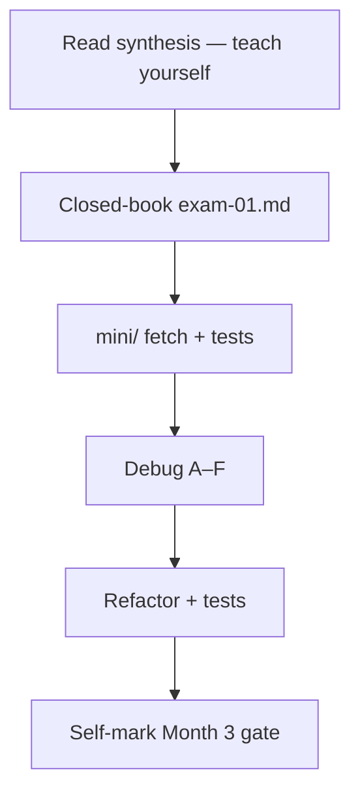
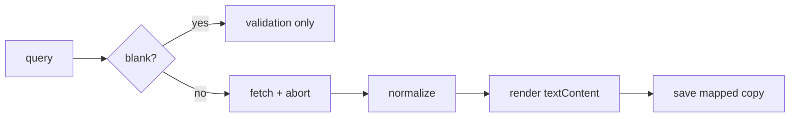

# Month 3 · Week 4 · Day 7
# Month 3 Exam

**Program:** Full-Stack Mastery · 18 months  
**Phase:** 1 — Foundations  
**Month index:** [../../README.md](../../README.md)  
**Week 4:** [1](day-01.md) · [2](day-02.md) · [3](day-03.md) · [4](day-04.md) · [5](day-05.md) · [6](day-06.md) · Day 7 (today)  
**Study time:** 3–4 hours  
**Week rhythm today:** Review, exam, gate  

Textbook closed except self-mark **and the synthesis below**. Project 2 spec allowed for gate item 1. Repair forgotten facts from this synthesis, not from MDN.

Work in `~\fullstack-lab\month-03-exam\`. Serve the mini-build over **HTTP**. Run `node --test` on parse/filter/sort/normalize helpers. This book does **not** contain a movie app, explorer app, or any Project 2 source.

Do not start Month 4 because the calendar moved. Start Month 4 because the gate table is honest.

When the gate is true, continue with [Month 4](../../month-04/README.md).

---

## How to use this textbook

1. Read the synthesis. Close it. Teach it aloud.
2. Type the mini-build. Do not paste Project 2. This book has no app source to paste.
3. Fill the self-mark table from evidence, not from attendance.
4. Optional review links are for later — not for writing exam-01.

---

## How to read this chapter

This file is the **exam and the teacher**. The synthesis is written so a student whose Week 1–4 notes are foggy can still re-learn the month from **today’s pages**, then prove it with the seven blocks.



During blocks 2–5, Days 1–6 of every week stay closed. If you go blank, re-read **this synthesis**. AI may not write the mini-app or exam-01.

This textbook will not give you Project 2’s source. Requirements: `full_stack_project_requirements_2026/project_02_vanilla_javascript_application.md`.

---

## Month 3 synthesis (the lesson, in this book)

**Language:** `const`/`let`; primitives vs object references; `===`; falsy list; `trim` for blank; convert on purpose.

**Functions and data:** return values; scope; spread copies shallow; `map`/`filter`/`find`/`some`/`sort` (sort mutates — copy); Set/Map; O(n) vs sort; tests in Node.

**DOM:** query/create/update; **`textContent` vs `innerHTML` (XSS)**; events bubble; target vs currentTarget; delegation; `preventDefault` on submit.

**Persist:** `localStorage` strings; `JSON.parse` throws; bad shape → `[]`; not a vault.

**HTTP in the browser:** Promise; `async/await`; `fetch` fulfills on 404 — check `ok`; network/CORS/abort reject; map JSON to app objects; UI states idle/loading/success/error; empty ≠ error; AbortController for races.

**Modules:** `api.js`, `storage.js`, `state.js`, `ui.js`, `main.js`. Product source is **your** repo, not this textbook.

The rest of this file unpacks those sentences in full, so the exam is not a vocabulary quiz against a ghost month.

---

## Today's contract

By the end of this day you will be able to teach Month 3 aloud from this synthesis and show evidence for every gate row.

**Today's gate** is the Month 3 Gate table below — not “I attended four weeks.”

---

## Time box

| Block | Minutes | Work |
|---|---|---|
| 0 | 25 | Read the complete explanation; speak it |
| 1 | 40 | Closed-book explanation |
| 2 | 45 | Independent mini-build |
| 3 | 25 | Debug A–F |
| 4 | 20 | Refactor commit |
| 5 | 20 | Run tests; break one; restore |
| 6 | 20 | Design: state, modules, mapping |
| 7 | 25 | Retro + self-mark |

---

# Complete explanation — JavaScript you must still own

## 1. Language (Week 1)

JavaScript **computes**. You run it in the browser (module script, HTTP) or in Node (`node file.js`, `node --test`). `"type": "module"` and `<script type="module">` enable `import`/`export`. `file://` is the wrong way to load a page of modules.

`const` forbids reassigning the **name**. Objects behind `const` can still change. `let` is for counters. No `var`.

Primitives: string, number, boolean, undefined, null, bigint, symbol. `typeof null` is `"object"` (historic bug). `NaN` is a number; `Number.isNaN`; `NaN === NaN` is false.

Convert on purpose: `Number`, `String`. `+` concatenates if a string is involved. Form fields are strings. `"42"` is not `42`.

**`===` compares type and value. `==` coerces** (`0 == ""` is true). This course uses `===` / `!==` only.

Falsy: `false`, `0`, `-0`, `0n`, `""`, `null`, `undefined`, `NaN`. `"0"` and `" "` are truthy. Blank search is `trim() === ""` (and not-a-string), not `if (query)`. `||` treats `0` as missing; `??` only treats `null`/`undefined` as missing.

`if` / loops with braces. `for...of` for array values. No `for...in` on arrays. Infinite loop: Ctrl+C; CPU busy.

Pure functions return values. Result object `{ ok: false, error: "empty" }` for normal empty input; throws for surprises.

> **Wrong belief:** “`const` means immutable data.”  
> **Correct:** immutable **binding**.

## 2. Functions and data (Week 2)

Functions take parameters and `return`. Defaults apply for `undefined`. Rest gathers. Forget `return` → `undefined`. Log at the edge.

Scope: block `let`/`const`; inner functions may read outer names. Skip `this` until Month 4.

**Primitives copy. Objects and arrays share a reference.** `const b = a; b.push(2)` changes `a`. `const list = oldList` does not copy.

Spread `{ ...obj }`, `[...arr]` is **shallow**. Nested piles still shared. Keep rows flat.

`map` new array same length; `filter` keep; `find` first or **`undefined`** (guard before `.title`); `some`/`every` booleans; `reduce` with **initial value**; `sort` **mutates** — `[...list].sort(comparator)`. Strings: `localeCompare`. Numbers: subtract.

`Set` unique values; `Map` keys not forced to string.

Big-O intuition: one pass O(n); sort typically O(n log n); nested full scans O(n²). Project 2 n is small; correctness first; still notice growth.

> **Wrong belief:** “`find` returns `null`.”  
> **Correct:** `undefined`.

A sort test that starts with already-sorted titles is weak. Arrange Neuromancer then Dune. Copy titles. Assert input unchanged **and** output Dune first.

`filterByStatus(list, "all")` must return a **copy**, not the live array.

## 3. DOM, events, storage (Week 3)

The DOM is the **live tree**, not the file on disk. `querySelector` → node or `null` — check. `createElement`, `append`, `replaceChildren`. `classList`, `dataset`.

**`textContent` is text. `innerHTML` is markup.** Queries, API titles, storage strings are untrusted. XSS means stranger data runs as **this origin’s program**. You do not need an exploit payload to understand that. `"<b>x</b>"` as text vs bold is enough. Never `innerHTML = userString`.

Events: `addEventListener(fn)` not `fn()`. Capture → target → bubble. **`target`** innermost click; **`currentTarget`** listener node. Delegation: parent + `closest`. `preventDefault` stops default (submit **reload**). `stopPropagation` stops ancestors — rare. `type="button"` so Clear does not submit.

Blank: trim; do not fetch; error `p` via textContent; `aria-live="polite"` is justified for a live status.

`localStorage`: strings, origin (scheme+host+port). `JSON.stringify` / `parse`. `getItem` null when missing. `parse` **throws** — `try/catch` → `[]`. Wrong shape: `Array.isArray`, `version`. `setItem` quota throws. **Not a vault.** XSS reads it. `127.0.0.1` ≠ `localhost`.

## 4. Async HTTP (Week 4)

A **Promise** is pending, then fulfilled or rejected **once**. `async` functions always return a promise. `await` pauses **that** function, not the tab. Rejected await throws.

**`fetch` fulfills on 404 and 500.** Check `response.ok` (200–299). It **rejects** on offline, DNS, CORS, abort. `response.json()` may reject if the body is not JSON. Body readable once.

CORS: browser asks if **this origin** may read the response. You cannot disable CORS as a learning hack. Pick APIs that allow browsers.

**`curl.exe`** (Windows: not `curl`) is HTTP without CORS. Use it to inspect a public JSON URL. The Network tab is what `fetch` saw. They can disagree.

```powershell
curl.exe -i "https://openlibrary.org/search.json?q=dune&limit=1"
```

UI state: one `status` idle | loading | success | error. Success with `[]` is **empty**, not error. Blank query: no fetch, no loading.

**AbortController:** abort the **previous** fetch when a new search starts; ignore `AbortError` only, so a slow response cannot overwrite a new list.

Map API JSON to app objects in a pure `normalize` you test with a fixture — no live network in `node --test`.

> **Wrong belief:** “Empty list means the request failed.”  
> **Correct:** empty can be HTTP 200 and zero rows. Failure is `!ok`, network reject, or JSON parse throw.

> **Wrong belief:** “I’ll test fetch live in Node as my only suite.”  
> **Correct:** flaky. Fixture `normalize`, plus filter/sort/parse tests.

## 5. Product shape (ideas, not source)

Project 2 (you build in **its repo**): semantic HTML, collection helpers tested, `api.js` fetch+ok+abort, `storage.js` guards, `ui.js` textContent+delegation, states, persist collection. Requirements file is the spec. This textbook never contains the complete app, a movie catalog, or an explorer clone.

Worked month-in-one-picture: user types a query → trim → maybe fetch with abort → `ok` → normalize → `status: "success"` → render titles as text → user saves a **copy** of `{ id, title, status }` → `addItem` without aliasing search results → `JSON.stringify` versioned payload → refresh → `parse` or `[]`.



Search array and collection array are two piles. `const saved = results; saved.push(hit)` is the Week 2 bug on a product page.

---

## Month 3 Gate

True without a tutorial:

1. Build the **main application logic** of a small CRUD + filter + persist + fetch app (Project 2) without copying a tutorial.
2. Explain primitive vs reference, `==` vs `===`, truthy/falsy.
3. Explain functions, scope, and the array methods you used (`map`, `filter`, `find`, `some`, `sort`).
4. Explain event bubbling and `preventDefault`.
5. Explain `fetch` + `async/await` + `try/catch` and what a non-2xx response means.
6. Persist data in `localStorage` with malformed-data handling.
7. Show loading, empty, and error UI states.
8. Have **tests** for non-DOM logic (filter/sort/validate) — simple JavaScript tests (`node --test`).

---

# 1. Closed-book explanation (40 min)

`exam-01.md` — all Week 1–4 topics, including XSS (`textContent`) and AbortController.

Write prose. Include: falsy list; why `"0"` is a query; two names one array; why sort copies; target vs currentTarget; why fetch 404 does not throw; why empty success is not error. If a paragraph is a bullet dump of APIs, rewrite it.

---

# 2. Independent mini-build (45 min)

`~\fullstack-lab\month-03-exam\mini\`: a **tiny lookup**, not Project 2 and not a movie explorer.

Form + `fetch` to a public API + `textContent` list + loading/error + `isBlank` (and `normalize`) test file run with `node --test`. No collection required. No paste from the product repo.

Must: `preventDefault`, blank no fetch, `response.ok`, human error, HTTP serve, `"type": "module"`.

Helpers you may type (this is a lab, not the numbered app):

```js
export function isBlank(value) {
  return typeof value !== "string" || value.trim() === "";
}

export function normalize(data) {
  if (!data || !Array.isArray(data.docs)) {
    return [];
  }
  return data.docs.map((doc) => ({
    id: String(doc.key ?? ""),
    title: String(doc.title ?? "Untitled"),
  }));
}

export async function search(q, { signal } = {}) {
  const url = new URL("https://openlibrary.org/search.json");
  url.searchParams.set("q", q);
  url.searchParams.set("limit", "5");
  const response = await fetch(url, { signal });
  if (!response.ok) {
    throw new Error(`HTTP ${response.status}`);
  }
  const data = await response.json();
  return normalize(data);
}
```

If you pick JSONPlaceholder instead, `normalize` maps **that** shape. Tests still do not call `fetch`. Titles still `textContent`. Abort if you have time; mention the race in `exam-01` either way.

```powershell
cd ~\fullstack-lab\month-03-exam\mini
npx --yes serve .
node --test
```

`file://` fails modules. `curl.exe` can inspect the URL; it does not prove CORS.

---

# 3. Debug (25 min)

**A.** `fetch` 404 and the UI shows nothing — they never checked `ok`.  
**B.** `if (query)` lets `"   "` through.  
**C.** `innerHTML = title`.  
**D.** `sort` mutated displayed results.  
**E.** `JSON.parse` of `localStorage` crashed the page.  
**F.** Two clicks, old response arrives last (no abort).

Write causes in `debug.md` — full sentences, what you would observe, what to write instead. Do not provide XSS payloads. For C, “parses title as HTML / XSS class of bug / use textContent” is enough.

For E, name `try/catch` and a default of `[]` (or `0` for a counter). `localStorage` is strings; `getItem` may be `null`.

---

# 4. Review Project 2 or lab `api.js` — one refactor commit.

A name, a missing `ok`, a `normalize` field. Behavior should stay; tests stay green. Do not paste a new app. Do not add a tutorial theme.

---

# 5. Run Project 2 tests + lab tests. Break one; show fail; restore.

Record the red test name. Deleting the test is not a restore. Command: `node --test`.

If the product still has zero tests, gate row 8 is false. Add `isBlank` or `filterByStatus` today — still not a paste of a whole UI.

Keep existing test ideas: parse garbage JSON → `[]`; filter does not mutate; sort copies then `localeCompare`.

```js
test("sort copies", () => {
  const list = [
    { id: "2", title: "Neuromancer" },
    { id: "1", title: "Dune" },
  ];
  const before = list.map((row) => row.title);
  sortByTitle(list);
  assert.deepEqual(
    list.map((row) => row.title),
    before,
  );
});
```

---

# 6. Design: state shape; why modules; why API data is mapped to internal objects.

Paragraphs: one `status`; parse/filter testable without `document`; API keys ignored so the DOM does not depend on Open Library’s whole document.

Why two arrays: search results are a network snapshot; collection is what you persist. Sharing a reference makes a status change rewrite the search row.

---

# 7. Retro: Project 2 URL/repo; remaining gaps vs project Definition of Done.

If collection is stubbed, the gate row 1 is **not** pass. Name the gap. Schedule hours. Do not mark pass as a gift.

---

# Self-mark

| Gate | Evidence | Pass? |
|---|---|---|
| App logic without tutorial | Project 2 repo | |
| `===`, falsy, references | exam-01 | |
| Array methods | collection tests | |
| Bubbling / preventDefault | exam-01 + app | |
| fetch / ok / await | mini + app | |
| localStorage guards | storage tests | |
| UI states | app | |
| node --test | CI-less but passing locally | |

If Project 2 is incomplete, **do not start Month 4**. Finish the product using the spec and this month’s labs as skill reference — not as copy-paste.

Honesty beats a green calendar. A dazzling UI with `innerHTML` of titles, no `ok` check, or zero `node --test` files is not a pass. Finish the product in its own repo. This textbook still will not paste it.

Mini-build `exam-01.md` must mention: `"0"` vs blank; two names one array; copy before `sort`; `textContent`; `preventDefault`; `fetch` fulfills on 404; empty ≠ error; `JSON.parse` in `try/catch`; AbortController. If any of those is missing, rewrite the paragraph — do not add a bullet glossary.

```powershell
cd ~\fullstack-lab
git add month-03-exam
git commit -m "Complete Month 3 exam evidence."
```

---

## Definition of done

- [ ] exam-01.md covers XSS and AbortController in prose
- [ ] mini-build exists and is not a Project 2 paste
- [ ] debug A–F written
- [ ] Self-mark table filled honestly
- [ ] Gate 1 false if the product is not really there

---

## Optional review links

Month 3 is explained in this chapter. These pages are for later checking, not for first learning.

- [MDN: Equality comparisons](https://developer.mozilla.org/en-US/docs/Web/JavaScript/Equality_comparisons_and_sameness)
- [MDN: Using fetch](https://developer.mozilla.org/en-US/docs/Web/API/Fetch_API/Using_Fetch)
- [MDN: `textContent`](https://developer.mozilla.org/en-US/docs/Web/API/Node/textContent)
- [Node: test runner](https://nodejs.org/api/test.html)

---

## If you passed

Continue with [Month 4](../../month-04/README.md). Month 4 is deep JavaScript, the event loop, testing tools, and Git branches/PRs. There is no numbered product project; the gate is a **broken app** you will debug.
