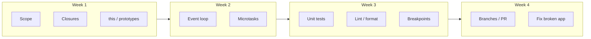

# Month 4 — Deep JavaScript, Browser Runtime, Testing, Advanced Git

**Program:** Full-Stack Mastery Textbook  
**Phase:** 1 — Foundations  
**Length:** 4 weeks · 7 days each · 3–4 focused hours/day  
**Prereq:** Month 3 gate passed (Project 2 main logic exists; you can explain `===`, array methods, DOM events, `fetch` + `ok`)  
**This month’s job:** Make JavaScript *predictable* — scope, closures, `this`, prototypes, classes, modules, the memory model, the event loop — and make quality *habitual*: unit tests, lint, format, breakpoints, branches, and pull requests.

There is **no numbered product project** this month. The gate **is** the work: debug a broken app shipped in this textbook, write regression tests, and submit the fix through a branch / pull-request workflow.

**This textbook is the lesson.** Scope, closures, the event loop, tests, and Git branches are explained in the day files the same way Month 1 explained the machine: slowly, in full sentences, with pictures, then labs. If a day feels like a checklist, it is incomplete — stay until you can teach the idea out loud.

Links at the end of a day are **optional review** after you already understand the chapter. They are not how you learn the first time.

These files are written to render as **web pages** (GitHub, GitHub Pages, or any Markdown site): relative links between days, tables, and **Mermaid** diagrams. If a diagram does not draw in a plain text editor, read the labeled boxes in order — the same information is in the prose.

---

## How this textbook is organized

```
month-04/
  README.md                      ← you are here
  week-01/                       Scope, closures, this, prototypes, classes, modules
  week-02/                       Call stack, event loop, tasks / microtasks, errors
  week-03/                       Tests, testable design, lint, format, breakpoints
  week-04/                       Branches, merge, conflicts, PRs, rebase concept, revert
  fixtures/broken-priority-list/ ← gate app (buggy on purpose — no solution in this book)
```

Each day file is one study day. Do them in order.

Labs live in `~\fullstack-lab\month-04\`. The broken app is copied from `fixtures/` into **your** repo (instructions in Week 4). This textbook will not give you the fixed source.

---

## Month 4 Gate

You pass only when all of these are true **without a tutorial**:

1. Explain lexical scope, a closure, and why a loop of click handlers can share the wrong index.
2. Explain `this` for a method, an extracted method, `call`/`bind`, and an arrow function.
3. Draw the event loop: call stack, Web APIs, task queue, microtask queue — and predict `setTimeout` vs `Promise.then` order.
4. Write unit tests (arrange / act / assert) for pure functions; name what is *not* a unit test.
5. Debug with a **breakpoint** (not only `console.log`).
6. Use a branch, resolve a conflict once, open a **pull request** (or a PR-style review if you work solo: branch + `gh pr create` or GitHub Compare).
7. **The product gate:** given `fixtures/broken-priority-list/`, debug the user-visible bugs, add **regression tests** that failed on the bug and pass after the fix, submit via branch/PR.

If any item is false, do not start Month 5.



---

## What this month must teach (complete list)

| Week | Must learn | Must practice |
|---|---|---|
| 1 | Lexical scope, closures, `this`, prototypes, classes, modules, immutability, references vs values | Predict output; write a factory/closure; copy vs mutate tests |
| 2 | Call stack, event loop, macrotasks, microtasks, promise error propagation, browser Web APIs vs JS | Predict async order; prove it in DevTools |
| 3 | Test anatomy, assertions, unit tests, testable design, ESLint, Prettier (or equivalent), breakpoints | Green tests; lint clean; pause on a line and read scope |
| 4 | Branches, merge, conflicts, pull requests, rebase **as a concept** (you will not rebase published `main`), revert, commit messages | PR for the broken-app fix |

Horizontal skills this month:

- **Debugging:** breakpoints, call stack pane, “Pause on exceptions.”
- **Documentation:** this book first; optional links only to recheck.
- **Security:** still no `innerHTML` of untrusted data; still no secrets in git.
- **Tests:** regression tests are how you prove a bug is dead.
- **Git:** history is a **graph**. `main` stays shippable.

---

## Weekly rhythm and daily time box

Same as Month 1. Day 6 independent. Day 7 review. Week 4 Day 7 is the Month 4 exam + gate.

| Minutes | Block |
|---|---|
| 30–45 | Concepts **from this textbook** (optional review links only after the chapter is already clear) |
| 45–60 | Focused exercises |
| 60–90 | Independent work |
| 30–60 | Lab / fixture work |
| 15 | Notes / recall |

---

## Tools this month

| Tool | Why |
|---|---|
| Node.js LTS | `node --test`, later ESLint |
| Browser DevTools | Breakpoints, call stack, async order |
| Git + GitHub | Branches and a real pull request |
| ESLint | Catch real mistakes (not taste wars) |
| Prettier | Format so reviews are about logic |

You may use **Vitest** instead of `node --test` in Week 3 if you want a runner with watch mode. This book’s typed labs use `node --test` so you do not need a bundler yet. Vite is Month 5.

---

## The broken app (do not open it early)

`fixtures/broken-priority-list/` is a small **priority task list**. It looks almost finished. It is not. The fixture README lists **symptoms** (what a user sees). It does **not** list root causes. Finding those is the gate.

Do not read the fixture in Week 1 “to get ahead.” You will pattern-match bugs you have not earned yet. Week 4 is when you copy it into your lab and work.

There is **no solutions folder** in this textbook.

---

## Start

Open [week-01/day-01.md](week-01/day-01.md).

When Month 4’s gate is true, continue with [Month 5](../month-05/README.md).
