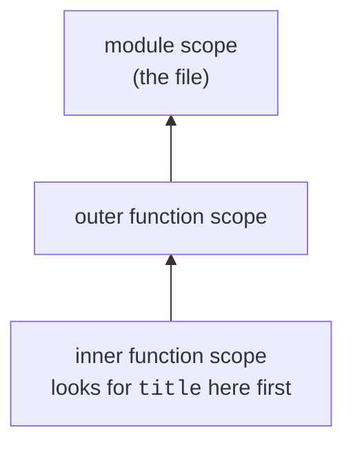
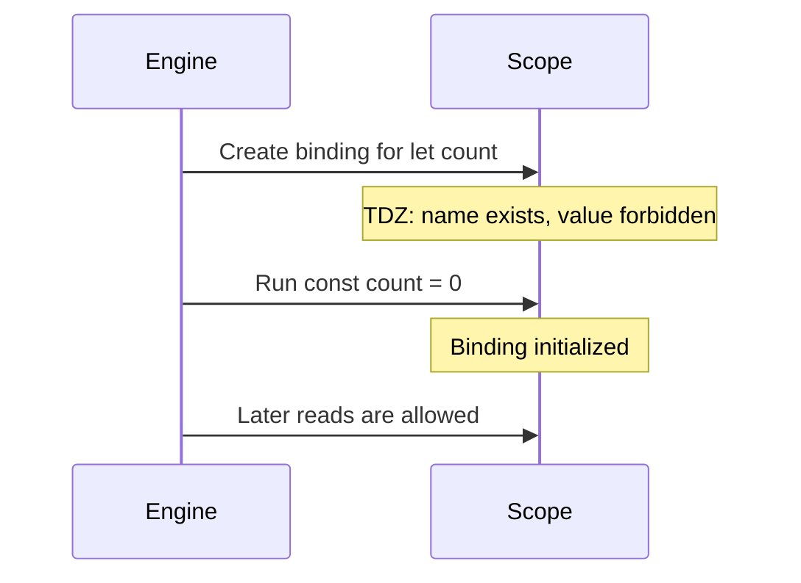
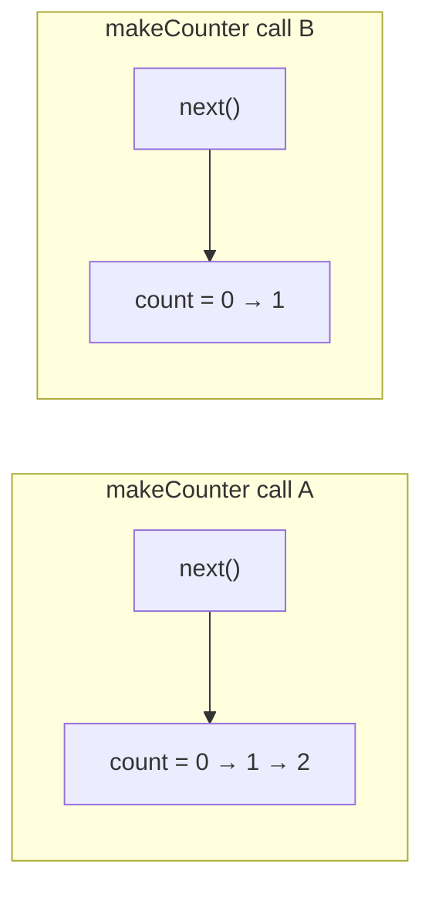

# Month 4 · Week 1 · Day 1
# Lexical Scope and Closures

**Program:** Full-Stack Mastery · 18 months  
**Phase:** 1 — Foundations  
**Month index:** [../../README.md](../../README.md)  
**Week 1:** Day 1 (today) · [2](day-02.md) · [3](day-03.md) · [4](day-04.md) · [5](day-05.md) · [6](day-06.md) · [7](day-07.md)  
**Week rhythm today:** Learn + type-along  
**Student state:** Month 3 gate passed  
**Study time:** 3–4 focused hours  

**This week covers:** lexical scope, closures, `this`, prototypes, classes, modules, immutability, references vs values.

Today is **where a name is looked up** and **what a function remembers after it returns**. `this` and prototypes are Day 2. Modules and immutability deepen on Day 4. Do not skip them.

---

## How to use this month

Same rules as Months 1–3. This book is the lesson.

1. Read a section. Close it. Draw the diagram from memory.
2. Type every lab. Do not paste.
3. Predict output **before** you run. Write the prediction. Then run.
4. Optional review links at the end are for later rechecking on the web — not for first learning.

Labs: `~\fullstack-lab\month-04\week-01\`.

---

## Today's contract

1. Explain **lexical scope**: a name is resolved where the function was **written**, not where it was **called**.
2. Walk a **scope chain** (block → function → module → not found).
3. Explain **hoisting** for `var` / `function` vs the **temporal dead zone** for `let` / `const`.
4. Explain a **closure**: a function plus the bindings it still needs.
5. Predict the classic loop-of-handlers bug and write the fix (block scope or a factory).

**Today's gate**

> A nested function can use variables from the function that created it, **after** that outer function has returned. Those variables are not “copies of values at birth” unless they were primitives assigned once — they are **live bindings**. A loop that creates functions with `var i` can make every function see the **same** `i`.

---

## Time box

| Block | Minutes | Work |
|---|---|---|
| A | 50 | Theory: scope, chain, hoisting, TDZ, closures |
| B | 55 | Type-along: predict / run / draw |
| C | 70 | Independent: factory + loop bug |
| D | 25 | Git |
| E | 15 | Recall |

---

# Block A — Theory

## 1. A name is not a value

In JavaScript, `const title = "Harbor"` creates a **binding**: the name `title` in this **scope** refers to a value.

Looking up a name is not “search the whole program.” It is: start in the current scope, then walk **outward** through enclosing scopes, until you find the binding or throw `ReferenceError`.

That walk is the **scope chain**.



**Lexical** means: the chain is determined by **where you nested the functions in the source**, not by who called whom.

```js
const x = "module";

function outer() {
  const x = "outer";
  function inner() {
    return x;
  }
  return inner;
}

const fn = outer();
fn(); // "outer" — not "module", not whoever called fn
```

`inner` was **written** inside `outer`. When `inner` runs later, `x` is still `outer`’s `x`. The call site `fn()` does not change that.

> **Wrong belief:** “JavaScript looks up variables at the place you *call* the function.”  
> **Correct:** lookup is lexical. Call site matters for `this` (tomorrow), not for `const`/`let`/`var` names.

---

## 2. The scopes you actually have

| Scope | Created by | Lives until |
|---|---|---|
| **Module** | One ES module file | The page / process unloads |
| **Function** | Entering a `function` | That call returns (unless a closure keeps it alive) |
| **Block** | `{ }` with `let` / `const` | The block finishes |
| **Global** | Scripts without modules; `window` in the browser | The page |

This course uses **ES modules**. Top-level `const` in `main.js` is **module** scope, not a browser global. It does not become `window.title`. That is a feature.

`var` is **function**-scoped (or global), not block-scoped. That is why this course banned it in Month 3 and why it still bites in loops today.

```js
function example() {
  if (true) {
    var leaked = 1;
    const boxed = 2;
  }
  console.log(leaked); // 1 — var ignores the if-block
  // console.log(boxed); // ReferenceError
}
```

---

## 3. Hoisting and the temporal dead zone

The engine **reads** a scope before running it.

**`function` declarations** are hoisted: you can call them above their line in the same scope. (Function **expressions** assigned to `const` are not.)

**`var`** is hoisted and starts as `undefined` until the assignment runs.

**`let` and `const`** are hoisted in a technical sense (the binding exists) but you **must not read them** before the line that initializes them. That forbidden window is the **temporal dead zone (TDZ)**. Reading in the TDZ throws `ReferenceError`.

```js
console.log(a); // undefined  (var)
var a = 1;

console.log(b); // ReferenceError
let b = 2;
```

You do not need to “use hoisting as a style.” Declare, then use. You **do** need to recognize a TDZ error: you referenced a `let`/`const` too early, often in a circular import or a callback that ran before initialization.



---

## 4. What a closure is

When a function is created, it keeps a reference to the **environment** (the bindings) it needs from outer scopes. That pair — function + remembered environment — is a **closure**.

You cannot see a “closure object” in your source. You see it in behavior: an inner function still reads `count` after `makeCounter` has returned.

```js
function makeCounter() {
  let count = 0;
  return function next() {
    count += 1;
    return count;
  };
}

const a = makeCounter();
const b = makeCounter();
a(); // 1
a(); // 2
b(); // 1  — different count binding
```



Each call to `makeCounter` creates a **new** `count`. Closures do not magically share unless they were created in the **same** environment.

**Live bindings, not snapshots:** if the outer variable changes, the inner function sees the **current** value.

```js
function makeReader() {
  let n = 1;
  const read = () => n;
  n = 2;
  return read;
}
makeReader()(); // 2 — not 1
```

That is why a loop variable is dangerous: every function closed over the **same** `i`, which ended at the final value.

---

## 5. The loop bug (you will meet it in the Month 4 gate)

```js
// Broken (classic)
for (var i = 0; i < 3; i++) {
  setTimeout(() => console.log(i), 0);
}
// prints 3, 3, 3
```

`var i` is **one** binding for the whole function. After the loop, `i` is `3`. Each arrow logs that live `i`.

```js
// Fixed: a new binding per iteration
for (let i = 0; i < 3; i++) {
  setTimeout(() => console.log(i), 0);
}
// prints 0, 1, 2
```

`let` in a `for` header creates a **fresh** `i` per iteration. Each timeout closes over its own.

Factory equivalent (works even with `var` in old code you must read):

```js
for (var i = 0; i < 3; i++) {
  setTimeout(makeLogger(i), 0);
}
function makeLogger(n) {
  return () => console.log(n);
}
```

`n` is a **parameter** — a new binding per call. The timeout closes over `n`, not the loop’s `i`.

In the DOM, the same bug is: `for (var i = 0; i < buttons.length; i++) { buttons[i].onclick = () => toggle(i); }` — every button toggles the last index. The gate app may contain a cousin of this. You now know what you are looking at.

---

## 6. Closures you should write on purpose

| Pattern | Idea |
|---|---|
| **Factory** | `makeCounter()` — private `count`, public `next` |
| **Partial configuration** | `makeApi(baseUrl)` returns `get(path)` that still knows `baseUrl` |
| **Event handler** | Listener closes over `ul` and `state` — fine if those bindings are the ones you meant |
| **Module privacy** | Bindings in a module are already private to the file; export only the API |

Closures are not “advanced magic.” They are how `addEventListener` callbacks still see `form` after `main()` finished.

**Cost:** a closure keeps those bindings **alive** (RAM) as long as the function is reachable. If you store thousands of handlers that each close over a huge object you no longer need, you leak. For Project 2-sized apps, correctness first. Do not “optimize” by copying every variable “just in case.”

---

## 7. Shadowing

An inner `const x` **hides** an outer `x`. The inner function cannot see the outer one by that name. This is not a bug; it is a rule. If you meant the outer value, do not reuse the name.

---

# Block B — Type-along

Create `~\fullstack-lab\month-04\week-01\day-01\`.

`package.json`: `{ "type": "module" }`

## B1 — Predict the chain

`scope.js` — type this **exactly**, then fill `PREDICT.txt` **before** running.

```js
const label = "module";

function outer() {
  const label = "outer";
  function inner() {
    return label;
  }
  return inner;
}

export const got = outer()();
console.log("got:", got);
```

Prediction: what does `got` print? Why not `"module"`?

```powershell
node scope.js
```

## B2 — Two counters

`counter.js`:

```js
export function makeCounter(start = 0) {
  let count = start;
  return {
    next() {
      count += 1;
      return count;
    },
    peek() {
      return count;
    },
  };
}

const a = makeCounter();
const b = makeCounter(10);
console.log(a.next(), a.next(), b.next(), a.peek(), b.peek());
```

`PREDICT-COUNTER.txt`: five numbers, then run.

## B3 — Loop bug, on purpose

`loop-bug.js`:

```js
console.log("var loop:");
  for (var i = 0; i < 3; i++) {
  setTimeout(() => console.log("var", i), 0);
}

console.log("let loop:");
  for (let j = 0; j < 3; j++) {
  setTimeout(() => console.log("let", j), 0);
}
```

Run. Write `LOOP.txt`: why `var` prints three `3`s; why `let` prints 0,1,2. (The `var` logs appear **after** both loops finish — Week 2 will name that `setTimeout` queue. Today, the lesson is **which `i` they close over**.)

## B4 — Live binding

`live.js`:

```js
function make() {
let n = 1;
  const read = () => n;
  n = 99;
  return read;
}
console.log(make()());
```

Predict, then run. One sentence in `LIVE.txt`.

---

# Block C — Independent

## C1 — `makeAdder.js`

Export `makeAdder(x)` returning a function `add(y)` that returns `x + y`.

Tests in `makeAdder.test.js` (`node --test`): `makeAdder(5)(2) === 7`; two adders do not share `x`.

## C2 — Button index (mental DOM, real test)

You will not open a browser yet. Export:

```js
export function attachToggles(count, toggleFn) {
  const handlers = [];
  for (let i = 0; i < count; i++) {
    handlers.push(() => toggleFn(i));
  }
  return handlers;
}
```

Tests: create `const seen = []`; `attachToggles(3, (i) => seen.push(i))`; call `handlers[0]()`, `handlers[2]()`; `seen` is `[0, 2]`.

Then write `attachTogglesBroken` using `var i` in the loop (you may disable ESLint later; today, write it in a file named `broken-loop.js` and **do not export it as the solution**). Test that **all** handlers push `3` (or `count`) — document the observed number. That test is a **characterization** of the bug.

## C3 — Teach-back

`teachback.md` (400–700 words): lexical vs dynamic lookup; closure as live environment; loop bug; one sentence on when you *want* a closure (factory). Prose, not a bullet dump. Draw the scope chain for `makeAdder` as ASCII or describe the Mermaid in this chapter.

---

```powershell
cd ~\fullstack-lab
git add month-04/week-01
git commit -m "Week 1 Day 1: lexical scope, closures, loop-binding lab."
```

---

## Definition of done

- [ ] Predictions were written **before** running
- [ ] Two counters do not share `count`
- [ ] `LOOP.txt` explains `var` vs `let`
- [ ] `makeAdder` tests green
- [ ] Characterization of the broken loop exists
- [ ] Teach-back is prose

---

## Optional review links

Scope, TDZ, and closures are explained in this chapter. These pages are for later checking, not for first learning.

- [ECMA-262: Lexical Environments](https://tc39.es/ecma262/#sec-lexical-environments) (spec language — optional later)
- [MDN: Closures](https://developer.mozilla.org/en-US/docs/Web/JavaScript/Guide/Closures)
- [MDN: `let` TDZ](https://developer.mozilla.org/en-US/docs/Web/JavaScript/Reference/Statements/let#temporal_dead_zone_tdz)

---

## Tomorrow

`this`, prototypes, and classes — a different lookup: **how the function was called**, not where it was written. Closures do not replace `this`. They are two systems. Keep them separate in your head.
