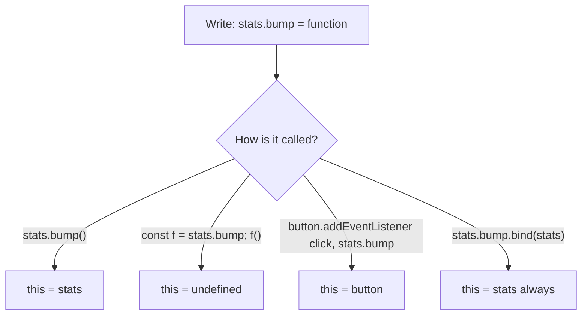
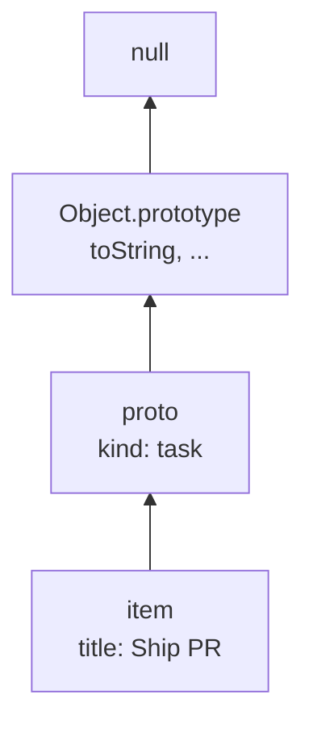
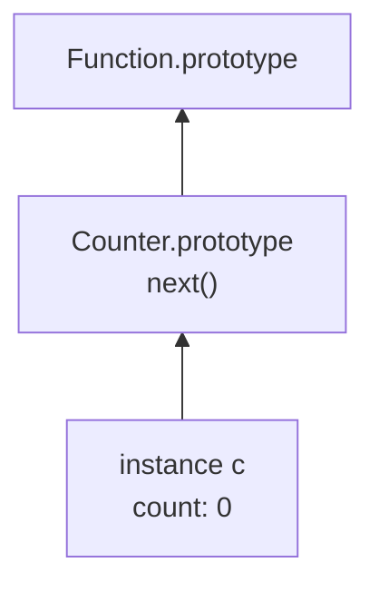

# Month 4 · Week 1 · Day 2
# `this`, Prototypes, and Classes

**Month index:** [../../README.md](../../README.md)  
**Week 1:** [1](day-01.md) · Day 2 (today) · [3](day-03.md) · [4](day-04.md) · [5](day-05.md) · [6](day-06.md) · [7](day-07.md)  
**Week rhythm today:** Exercises + debugging  
**Study time:** 3–4 focused hours  

Yesterday: **names** (`const`, `let`) look up **lexically**. Today: **`this`** is not a name in that chain. It is set by **how the function is called** (unless it is an arrow, which takes `this` from the enclosing scope).

---

## Today's contract

1. Predict `this` for: method call, extracted method, `call`/`apply`/`bind`, constructor, arrow.
2. Explain a **prototype**: an object that another object delegates to for missing properties.
3. Write a `class` as syntax over that prototype model — not as Java.
4. Know when **not** to use `class` this month (most Project 2 helpers stay plain functions).

**Today's gate**

> `obj.method()` sets `this` to `obj`. `const fn = obj.method; fn()` does **not**. Arrows do not get their own `this`. `class` methods on the prototype behave like functions: extracting them still loses `this`.

---

# Block A — Theory

## 1. `this` is a call-site rule

When a **non-arrow** function runs, `this` is filled in by the call:

| How you call it | `this` is |
|---|---|
| `obj.fn()` | `obj` |
| `fn()` (plain call, module/strict) | `undefined` (in modules, always strict) |
| `fn.call(obj)` / `fn.apply(obj, args)` | `obj` |
| `fn.bind(obj)` then later `bound()` | `obj` (locked) |
| `new Fn()` | the new instance |
| `elem.addEventListener("click", obj.fn)` | often the **element**, not `obj` — because the browser calls it as a function |

```js
const stats = {
  n: 0,
  bump() {
    this.n += 1;
  },
};

stats.bump(); // this === stats; n is 1

const detached = stats.bump;
detached(); // TypeError: cannot read n of undefined  (module scope)
```



**Fix patterns:**

1. `button.addEventListener("click", () => stats.bump())` — arrow **closes over** `stats` (yesterday’s tool). The arrow’s `this` is unused.
2. `button.addEventListener("click", stats.bump.bind(stats))`.
3. Do not use `this` at all: `function bump(stats) { stats.n += 1; }` — easiest to test.

This course prefers **(3)** for data helpers and **(1)** for DOM listeners. You still must **read** (2) and the error in the table.

> **Wrong belief:** “`this` means the object the function was defined on.”  
> **Correct:** for ordinary functions, `this` means the object **left of the dot at the call**, or `undefined`, or what `bind` locked.

---

## 2. Arrow functions and `this`

An **arrow** does not bind its own `this`. It uses the `this` of the **enclosing** function (lexical `this`).

```js
const stats = {
  n: 0,
  bumpMany(times) {
    const inner = () => {
      this.n += times; // this is stats, because bumpMany was called as stats.bumpMany
    };
    inner();
  },
};
```

If you write `bump: () => { this.n += 1 }` as a property, `this` is **not** `stats` — it is the enclosing module’s `this` (`undefined`). Do not use arrows as object methods when you meant `this`.

---

## 3. Prototypes (delegation)

Every object can have an internal link to another object: its **prototype**. If you read `obj.x` and `obj` has no own `x`, the engine looks on the prototype, then that object’s prototype, until `null`.

```js
const proto = { kind: "task" };
const item = Object.create(proto);
item.title = "Ship PR";
item.title; // own
item.kind;  // from proto
item.toString; // from Object.prototype eventually
```



**Own vs inherited:** `Object.hasOwn(item, "title")` is true; `Object.hasOwn(item, "kind")` is false.

**`obj.__proto__`** exists as a legacy getter. Prefer `Object.getPrototypeOf(obj)`.

Arrays, functions, and class instances all use this chain. That is why `[] .map` works: `map` lives on `Array.prototype`, not on each array.

**You almost never assign `__proto__` in app code.** You use `class`, `Object.create`, or plain object literals. You **do** need the model so `console.log` and “why does this object have `toString`?” are not mysteries.

---

## 4. `class` is syntax over prototypes

```js
class Counter {
  constructor(start = 0) {
    this.count = start; // own property on the instance
  }
  next() {
    this.count += 1;
    return this.count;
  }
}

const c = new Counter();
c.next();
```

What that actually is:

- `Counter.prototype.next` is the shared function.
- `new Counter()` creates an object whose prototype is `Counter.prototype`, then runs `constructor`.
- `c.next()` is a **method call** — `this` is `c`.
- `const n = c.next; n()` loses `this` — **same rule as Day 2 section 1**.



**`extends` / `super`:** a subclass prototype’s prototype is the parent prototype. `super()` in the constructor calls the parent constructor. You need this later for Error subclasses; you do not need a zoo of inheritance for a task list.

**When to use `class` this month:** a small domain type with a few methods, or to **read** library docs. **When not to:** wrapping every helper in a class so it “looks professional.” Pure functions plus modules remain the default for testable logic.

**`static`:** `Counter.create()` lives on the function, not on instances.

---

## 5. `new` without `class`

```js
function Counter(start) {
  this.count = start;
}
Counter.prototype.next = function () {
  this.count += 1;
  return this.count;
};
```

This is the same model. If you forget `new`, `this` is `undefined` and `this.count =` throws. `class` constructors throw if you omit `new`. Prefer `class` if you use this style at all.

---

# Block B — Type-along

`~\fullstack-lab\month-04\week-01\day-02\`

## B1 — Lose `this` on purpose

`this-lab.js`:

```js
export const stats = {
  n: 0,
  bump() {
    this.n += 1;
    return this.n;
  },
};

stats.bump();
const bump = stats.bump;
try {
  bump();
} catch (err) {
  console.error("detached:", err.message);
}
const bound = stats.bump.bind(stats);
console.log("bound", bound());
```

`THIS.txt`: three sentences — method call, detached, bind.

## B2 — Prototype walk

`proto-lab.js`:

```js
const proto = { kind: "task" };
const item = Object.create(proto);
item.title = "Lab";
console.log(item.title, item.kind);
console.log("own title", Object.hasOwn(item, "title"));
console.log("own kind", Object.hasOwn(item, "kind"));
console.log(Object.getPrototypeOf(item) === proto);
```

## B3 — Class

`counter.js` — `class Counter` as in the theory. `counter.test.js`: two instances do not share `count`; `next` increments.

Deliberate: extract `next`, call it, record the error, restore tests to only the method-call style.

---

# Block C — Independent

1. `speaker.js`: object `{ name, greet() { return "I am " + this.name; } }`. Tests for `speaker.greet()`. A second test documents that `const g = speaker.greet; g()` throws — `assert.throws`.
2. `Task` class: `{ id, title, done }` with `toggle()` returning nothing but flipping `done`. Test two tasks.
3. `NOTES.txt`: when you would **not** use a class for `isBlank` from Month 3.

```powershell
git add month-04/week-01
git commit -m "Week 1 Day 2: this, prototypes, class Counter tests."
```

---

## Definition of done

- [ ] Detached method error recorded
- [ ] `hasOwn` vs inherited demonstrated
- [ ] Class tests green; extraction throw documented
- [ ] NOTES.txt exists

---

## Optional review links

`this`, prototypes, and `class` are explained above.

- [MDN: `this`](https://developer.mozilla.org/en-US/docs/Web/JavaScript/Reference/Operators/this)
- [MDN: Object prototypes](https://developer.mozilla.org/en-US/docs/Learn_web_development/Extensions/Advanced_JavaScript_objects/Object_prototypes)
- [MDN: `class`](https://developer.mozilla.org/en-US/docs/Web/JavaScript/Reference/Classes)

---

## Tomorrow

From memory: closures + `this`. You will write a small factory and a class without today’s files open. Repair from **Day 1–2 of this textbook**.
