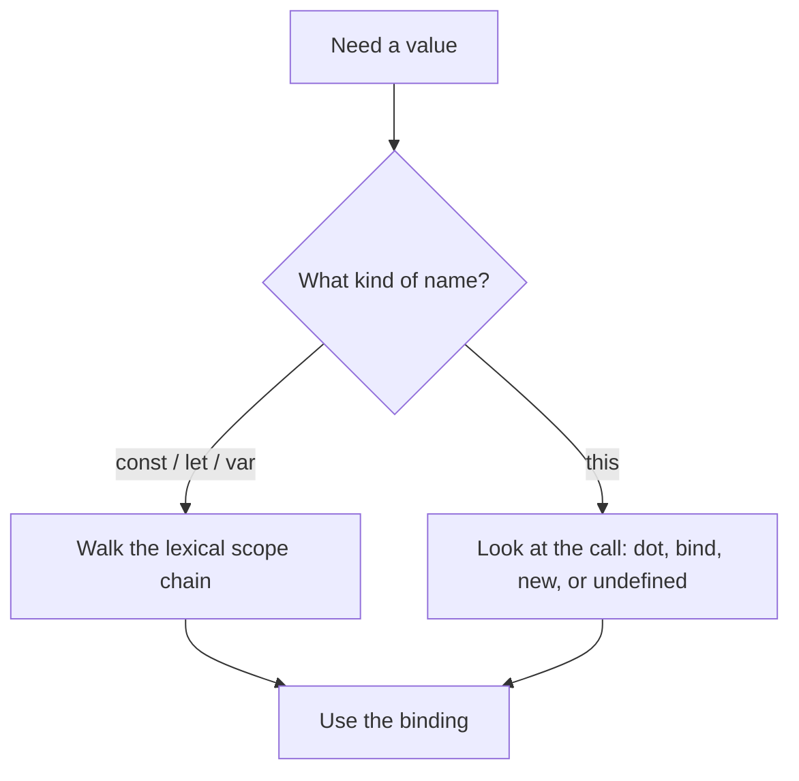
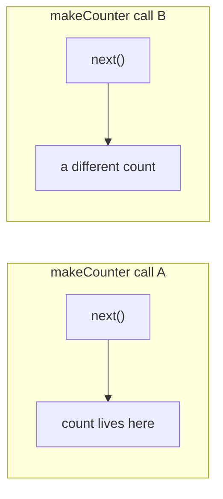
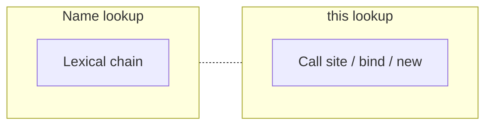

# Month 4 · Week 1 · Day 3
# From Memory: Scope, Closures, `this`

**Program:** Full-Stack Mastery · 18 months  
**Phase:** 1 — Foundations  
**Month index:** [../../README.md](../../README.md)  
**Week 1:** [1](day-01.md) · [2](day-02.md) · Day 3 (today) · [4](day-04.md) · [5](day-05.md) · [6](day-06.md) · [7](day-07.md)  
**Week rhythm today:** Implement from memory  
**Student state:** Days 1–2 taught lexical names and call-site `this`. Today those two systems must come out of *your* fingers, not yesterday’s open file.  
**Study time:** 3–4 focused hours  

**This week covers:** lexical scope, closures, `this`, prototypes, classes, modules, immutability, references vs values.

Today is a **closed-book recap**. You rewrite a factory and a small `class`, predict a `var` loop, and explain a detached method. Modules and copy-vs-share wait for Day 4. Do not skip them.

Days 1–2 stay **closed during drills**. Repair from **this recap** first. If you are stuck 25 minutes, open **those files in this textbook** — not a blog, not a paste of yesterday’s lab.

Labs: `~\fullstack-lab\month-04\week-01\day-03\`.

---

## How to use this textbook

1. Read a section. Close it. Say the idea in a full sentence.
2. Type every lab. Do not paste Day 1’s `makeCounter` and rename it.
3. Predict output **before** you run. Write the prediction. Then run.
4. Optional review links at the end are for later rechecking — not for first learning.

---

## How to read this chapter

Days 1–2 taught two lookup systems that share English words and must not share a mental drawer:

- **Names** (`const`, `let`, `var`) walk **outward from where the function was written**.
- **`this`** is filled in by **how the function was called** (or by `bind` / `new`), unless the function is an **arrow**, which has no own `this`.

If you mix them, you will “fix” a missing `const` by adding `.bind`, or “fix” a detached method by wrapping it in a closure that still calls `this.n`. Both look busy. Both miss the system that actually failed.



The recap below **is** the lesson. The spec at the bottom is the exam. Read until you can teach a factory and a detached-method failure without peeking.

---

## Today's contract

By the end of this day you will be able to:

1. Write a **factory** that closes over private state and prove two instances do not share it.
2. Write a small **`class`** with independent instance data.
3. Predict a **`var` loop** of timeouts without running it first.
4. Explain what happens when you **extract** `obj.method` and name one honest fix.

**Today's gate.** Closed-book:

> I can write a factory and a `class`, and I can explain a detached-method failure, without opening Days 1–2 until I am stuck 25 minutes.

---

## Time box

| Block | Minutes | Work |
|---|---|---|
| A | 40 | Speak this recap; draw the two-system diagram |
| B | 70 | Spec: `makeToggle`, `IdGen`, `predict.js`, `THIS.txt` |
| C | 40 | Tests with `node --test`; repair from this file if needed |
| D | 20 | Git |
| E | 15 | Recall |

---

# Complete explanation — two systems you must still own

## 1. Lexical scope is a walk, not a search of the whole program

A **binding** is a name in a **scope** that refers to a value. Looking up `title` is not “scan every file.” It is: start in the current scope, walk **outward** through enclosing scopes, stop when you find the binding or throw `ReferenceError`.

That walk is the **scope chain**. **Lexical** means the chain is decided by **nesting in the source**, not by who called whom.

```js
const x = "module";

function outer() {
  const x = "outer";
  function inner() {
    return x;
  }
  return inner;
}

const fn = outer();
fn(); // "outer"
```

`inner` was **written** inside `outer`. When `fn()` runs later, `x` is still `outer`’s `x`. The call site does not change that.

> **Wrong belief:** “JavaScript looks up variables at the place you *call* the function.”  
> **Correct:** lookup of `const` / `let` / `var` is lexical. Call site matters for `this`, not for those names.

This course uses **ES modules**. Top-level `const` in a file is **module** scope, not `window.title`. That is a feature.

| Scope | Created by | Typical lifetime |
|---|---|---|
| **Module** | One ES module file | Until the page / process unloads |
| **Function** | Entering a `function` | Until that call returns, unless a closure keeps it alive |
| **Block** | `{ }` with `let` / `const` | Until the block finishes |
| **Global** | Non-module scripts; `window` in the browser | The page |

`var` is **function**-scoped (or global), not block-scoped. That is why this course banned it in Month 3 and why it still bites in loops.

---

## 2. Hoisting and the temporal dead zone

The engine **prepares** a scope before running the lines you typed.

- **`function` declarations** can be called above their line in the same scope. Function **expressions** assigned to `const` cannot.
- **`var`** is hoisted and starts as `undefined` until the assignment runs.
- **`let` and `const`** exist as bindings early, but you **must not read them** before the initializing line. That window is the **temporal dead zone (TDZ)**. A read throws `ReferenceError`.

You do not use hoisting as a style. You declare, then use. You **do** recognize a TDZ error: you touched a `let`/`const` too early — often a callback that ran before initialization, or a circular import you will meet on Day 4.

---

## 3. A closure is a function plus the bindings it still needs

When a function is created, it keeps a reference to the **environment** it needs from outer scopes. That pair — function + remembered environment — is a **closure**.

You do not see a “closure object” in the source. You see it in behavior: an inner function still reads `count` after `makeCounter` has returned.

```js
function makeCounter() {
  let count = 0;
  return function next() {
    count += 1;
    return count;
  };
}

const a = makeCounter();
const b = makeCounter();
a(); // 1
a(); // 2
b(); // 1
```

Each call to `makeCounter` creates a **new** `count`. Closures do not magically share unless they were created in the **same** environment.

**Live bindings, not snapshots:** if the outer variable changes, the inner function sees the **current** value.

```js
function makeReader() {
  let n = 1;
  const read = () => n;
  n = 2;
  return read;
}
makeReader()(); // 2 — not 1
```

That is why a loop variable is dangerous: every function closed over the **same** `i`, which ended at the final value.



**Cost:** a closure keeps those bindings **alive** as long as the function is reachable. Correctness first on labs this size. Do not copy every variable “just in case.”

---

## 4. The loop bug you must still predict cold

```js
for (var i = 0; i < 2; i++) {
  setTimeout(() => console.log(i), 0);
}
```

`var i` is **one** binding for the whole function. After the loop, `i` is `2`. Each timeout logs that live `i`. You will write this in `predict.js` today. The logs appear **after** the loop finishes because `setTimeout` queues a **task** — Week 2 names that queue. Today’s lesson is **which `i` they close over**.

```js
for (let i = 0; i < 2; i++) {
  setTimeout(() => console.log(i), 0);
}
```

`let` in a `for` header creates a **fresh** `i` per iteration. Each timeout closes over its own.

A factory also works: `makeLogger(n)` gives each callback a **parameter** — a new binding per call. The timeout closes over `n`, not the loop’s `i`.

In the DOM, a cousin of this bug is a loop of click handlers that all toggle the last index. The Month 4 gate app may contain something that *looks* like “the wrong row reacted.” You now know one family of causes. You will still debug from **symptoms** in Week 4. This book will not list the fixture’s root causes.

> **Wrong belief:** “The timeout captured the number `i` had when I scheduled it.”  
> **Correct:** it captured the **binding**. For `var`, there is one binding. After the loop, that binding holds the final number.

---

## 5. `this` is a different machine

When a **non-arrow** function runs, `this` is filled in by the **call**:

| How you call it | `this` is |
|---|---|
| `obj.fn()` | `obj` |
| `fn()` (plain call, module/strict) | `undefined` |
| `fn.call(obj)` / `fn.apply(obj, args)` | `obj` |
| `fn.bind(obj)` then later `bound()` | `obj` (locked) |
| `new Fn()` | the new instance |
| `elem.addEventListener("click", obj.fn)` | often the **element**, because the browser calls it as a function |

```js
const stats = {
  n: 0,
  bump() {
    this.n += 1;
  },
};

stats.bump(); // this === stats
const detached = stats.bump;
detached(); // TypeError in modules: cannot read n of undefined
```

**Fix patterns** (name one in `THIS.txt` today):

1. Arrow wrapper: `() => stats.bump()` — the arrow **closes over** `stats`. It does not need `this`.
2. `stats.bump.bind(stats)` — locks `this`.
3. Do not use `this`: `function bump(stats) { stats.n += 1; }` — easiest to test.

This course prefers **(3)** for data helpers and **(1)** for DOM listeners. You still must **read** (2) and the error.

> **Wrong belief:** “`this` means the object the function was defined on.”  
> **Correct:** for ordinary functions, `this` means the object **left of the dot at the call**, or `undefined`, or what `bind` locked.

**Arrows** do not bind their own `this`. They use the enclosing function’s `this`. Do **not** write `bump: () => { this.n += 1 }` as an object method when you meant the object. That `this` is the module’s `this` (`undefined`).

Closures do not assign `this`. `this` does not look up `const`. Keep the two systems separate.

---

## 6. Prototypes and `class` in one picture

Every object can delegate missing properties up a chain until `null`. Arrays get `map` from `Array.prototype`. You almost never assign `__proto__` in app code. You use `class`, `Object.create`, or plain objects. You **do** need the model so “why does this object have `toString`?” is not a mystery.

```js
class Counter {
  constructor(start = 0) {
    this.count = start; // own data on the instance
  }
  next() {
    this.count += 1;
    return this.count;
  }
}
```

What that actually is: `next` lives on `Counter.prototype`. `new Counter()` makes an object whose prototype is that object, then runs `constructor`. `c.next()` is a **method call** — `this` is `c`. `const n = c.next; n()` loses `this` — **same rule as section 5**.

**When to use `class` this month:** a small domain type with a few methods, or to **read** library docs. **When not to:** wrapping `isBlank` in a class so it “looks professional.” Pure functions plus modules remain the default for testable logic.

Today’s `IdGen` may keep `n` as `this._n` **or** close over `n` in the constructor (a factory hiding inside a class). Document which. Both can work. Mixing them without a sentence in a comment is how you confuse your future self.



---

## 7. Worked picture of today’s factory

`makeToggle(false)` should return an object whose methods close over a private `on`:

- `get()` returns the boolean.
- `set(value)` assigns it (coerce only if you document it; simplest: require a boolean).
- `toggle()` flips and returns the new value (or returns nothing — **document** which; tests must match).

Two calls to `makeToggle` create two `on` bindings. Flipping one must not flip the other. That is the same independence as Day 1’s two counters.

If your tests pass two toggles that share state, you put `on` in **module** scope by accident, or you returned methods that close over a single object you reused. Draw the two boxes. Then fix the code, not the test.

---

# Spec

`~\fullstack-lab\month-04\week-01\day-03\`

`"type": "module"` in `package.json`. Tests with `node --test`. No browser required today. No `file://`.

1. `makeToggle(start = false)` → `{ get, set, toggle }` closing over a private `on`. Tests: two toggles independent; `toggle` flips.
2. `class IdGen { constructor(prefix) { ... } next() { return prefix + "-" + n } }` — `n` private via closure **or** `this._n` (document which). Two instances, independent counters.
3. `predict.js` printed from memory: `for (var i = 0; i < 2; i++) { setTimeout(() => console.log(i), 0); }` — write expected output in `PREDICT.txt`, then run.
4. `THIS.txt`: `obj.method` extracted — what happens and one fix (`bind` or arrow wrapper or drop `this`).

Do not copy Day 1’s `makeCounter` file. Write `makeToggle` from the recap. If `PREDICT.txt` does not match Node, fix the **prediction first in your head** using section 4, then the file.

```powershell
cd ~\fullstack-lab
git add month-04/week-01/day-03
git commit -m "Day 3: factory and class from memory."
```

---

## Definition of done

- [ ] Days 1–2 stayed closed until a 25-minute stall (then textbook only)
- [ ] Two `makeToggle` instances do not share `on`
- [ ] Two `IdGen` instances do not share `n`
- [ ] `PREDICT.txt` was written **before** running; it matches Node
- [ ] `THIS.txt` names the detached failure and one fix
- [ ] `node --test` is green
- [ ] Commit exists

---

## Optional review links

Scope, closures, and `this` are explained in this chapter. These pages are for later checking, not for first learning.

- [MDN: Closures](https://developer.mozilla.org/en-US/docs/Web/JavaScript/Guide/Closures)
- [MDN: `this`](https://developer.mozilla.org/en-US/docs/Web/JavaScript/Reference/Operators/this)
- [MDN: `class`](https://developer.mozilla.org/en-US/docs/Web/JavaScript/Reference/Classes)

---

## Tomorrow

Modules, live `import` bindings, primitives vs object references, shallow copy, and why `sort` mutates the array you thought you only “viewed.” Helpers that return new lists are how state stays testable. Day 4 is a feature day, not a skim.
