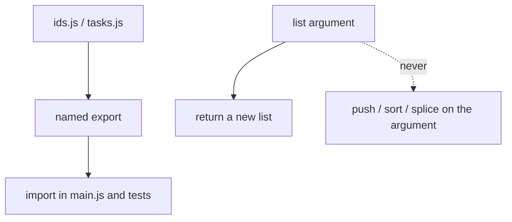
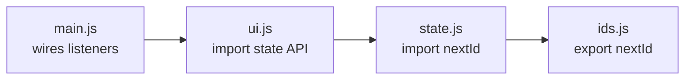
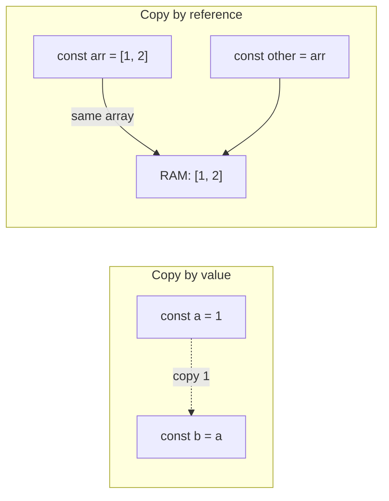

# Month 4 · Week 1 · Day 4
# Modules, Immutability, References vs Values

**Program:** Full-Stack Mastery · 18 months  
**Phase:** 1 — Foundations  
**Month index:** [../../README.md](../../README.md)  
**Week 1:** [1](day-01.md) · [2](day-02.md) · [3](day-03.md) · Day 4 (today) · [5](day-05.md) · [6](day-06.md) · [7](day-07.md)  
**Week rhythm today:** Add a real lab feature  
**Student state:** You can write a factory and explain `this`. Today you split that logic across files and lock the memory model: **primitives copy, objects share**.  
**Study time:** 3–4 focused hours  

**This week covers:** lexical scope, closures, `this`, prototypes, classes, modules, immutability, references vs values.

Month 3 already used `export`/`import`. Today you learn what a **module** *is*, and you lock the memory model: **primitives copy, objects share**, and **immutable updates** return new data. Tests tomorrow will freeze those habits. Do not skip the copy picture.

Labs: `~\fullstack-lab\month-04\week-01\day-04\`.

---

## How to use this textbook

1. Read a section. Close it. Draw the reference diagram from memory.
2. Type every lab. Do not paste a “task helper” gist.
3. Predict whether two variables share RAM **before** you mutate. Then run.
4. Optional review links at the end are for later rechecking — not for first learning.

Serve browser pages over **HTTP**, not `file://`. Today’s Node labs do not need a browser. `"type": "module"` still matters in `package.json`.

---

## How to read this chapter

Three ideas that look like style and are actually physics:

1. A **module** is a file with its own scope and a public list of names.
2. Assigning an object copies a **reference**, not a clone of the contents.
3. **Immutable helpers** return new arrays/objects so tests (and later React) can tell “before” from “after.”

If you only remember “use spread,” you will still share nested arrays. If you only remember “don’t mutate,” you will still `list.sort` because it felt local. Read until you can teach both mistakes.



---

## Today's contract

By the end of this day you will be able to:

1. Explain what an **ES module** is: file scope, named exports, `.js` in the browser path, HTTP, `"type": "module"`.
2. Explain **live bindings** on `import` (and why you still export functions, not a public `let`).
3. Draw **copy by value** vs **copy by reference**.
4. Explain **shallow** vs **deep** copy with one nested-array example.
5. Write task helpers that **do not mutate** their `list` argument, with tests that prove it.

**Today's gate**

> `import` is live (you get the current binding). A shallow copy `{ ...obj }` still shares nested objects. `sort` mutates. Helpers that return new arrays are how Project 2 state stays testable.

---

## Time box

| Block | Minutes | Work |
|---|---|---|
| A | 55 | Theory: modules, references, shallow copy, mutating methods |
| B | 70 | Split `ids.js` / `tasks.js`; tests that snapshot the input |
| C | 45 | Independent edges: delete-after-add ids, sort copy, filter |
| D | 20 | Git |
| E | 15 | Recall |

---

# Block A — Theory

## 1. What an ES module is

A **module** is a file with its own scope. Top-level `const` is not `window`. You **export** names; other files **import** them.

```js
// ids.js
export function nextId(prefix, n) {
  return `${prefix}-${n}`;
}

// main.js
import { nextId } from "./ids.js";
```

The file `ids.js` is not a “header.” Evaluating it runs its top-level code **once** per process (Node) or per page load (browser). After that, importers share that module instance.

Rules that bite:

| Rule | Why it exists |
|---|---|
| Include the **`.js` extension** in the browser import path | Spec + browsers are strict |
| Serve over **HTTP**, not `file://` | CORS / module map |
| `"type": "module"` in `package.json` for Node | Otherwise `.js` is CommonJS |
| Imports are **hoisted** and evaluated **once** | Cycles can see TDZ if you use a binding too early |
| `export default` is one nameless export | This course prefers **named** exports (`export function`) so grepping is honest |

In the browser, a script tag must say `type="module"` or `import` is a syntax error. Month 3 already did this. Today you can explain **why**: classic scripts share one global soup; modules each get a private top-level scope.

**Live bindings:** if module A exports `let count` and increments it, module B’s `import { count }` sees the new value. You will rarely export a `let`. Export functions that close over private `let`. That is Day 1’s factory, at file scale.

```js
// counter.js — private binding, public API
let n = 0;
export function next() {
  n += 1;
  return n;
}
export function peek() {
  return n;
}
```

Importers cannot write `n = 0` unless you exported `n`. Privacy is the default. That is the point.

> **Wrong belief:** “`import { nextId }` copies the function once at load, like a C `#include`.”  
> **Correct:** you get a **live** binding to that export. If the exporting module reassigns a `let` export, readers see the new value. Functions you export are usually `const`-like in practice because you used `export function`.

**Circular imports:** `a.js` imports `b.js` which imports `a.js`. Can work if you only *call* functions after both finished evaluating. If `b` immediately uses a `const` from `a` that is still in TDZ, you get a `ReferenceError`. Fix: flatten the cycle, or delay the use until a function runs later. Do not “fix” it by duplicating helpers in both files.



A healthy small app is a **DAG** of imports: `main` → `ui` → `state` → `ids`. `state` must not import `ui`. If it does, you will get cycles and “the button module needed the array module which needed the button module.”

**CommonJS** (`require`, `module.exports`) is Node’s older system. You will read it in docs and in older packages. This month you write **ESM**. Mixing `require` into an ESM file is a research project you do not need today. Keep `"type": "module"` and `import`.

**Node vs browser paths:** Node resolves `./ids.js` from the importing file. The browser does too, relative to the module URL. A missing `./` looks like a package name. Write `./ids.js`, not `ids.js`, in these labs.

---

## 2. Values vs references (the picture)



**Primitives** in this course: numbers, strings, booleans, `null`, `undefined`, bigint, symbol. Assigning them copies the **value**. Changing `m` does not change `n`.

```js
let n = 1;
let m = n;
m = 2; // n is still 1
```

**Objects** (plain objects, arrays, functions, dates): assigning copies the **reference**. Two names, one object.

```js
const a = { title: "A" };
const b = a;
b.title = "B"; // a.title is also "B"
```

`const a` means you cannot rebind `a` to a different object. It does **not** mean the object is frozen. `a.title = "B"` is legal. `a = {}` is not.

**Equality:** `===` on objects asks “same reference?” `{ a: 1 } === { a: 1 }` is **false**. Tests use `assert.deepEqual` for contents and `assert.notEqual` (or `assert.notStrictEqual`) when you mean “a new array came back.”

```js
const left = { title: "A" };
const right = { title: "A" };
left === right; // false
assert.deepEqual(left, right); // contents match
```

> **Wrong belief:** “`const list = ...` means the array cannot change.”  
> **Correct:** `const` locks the **binding**. `list.push` still mutates the array. Freeze or copy if you need a snapshot.

**`Object.freeze`:** shallow. Nested objects remain mutable unless you freeze them too. Useful in tests as a tripwire (`list` frozen, helper must not `push`). Not a full immutability library.

---

## 3. Shallow vs deep copy

```js
const original = { title: "Dune", tags: ["sf"] };
const shallow = { ...original };
shallow.title = "Other";      // original.title still "Dune"
shallow.tags.push("classic"); // original.tags is ["sf", "classic"] — SHARED
```

Spread copies **one level**. Nested arrays/objects are still shared. `{ ...task, tags: task.tags }` is the same trap written with an extra key: you copied the **reference** to `tags`.

**Array shallow copies:** `[...list]`, `list.slice()`, `list.map((x) => x)` all new-array, **same element references**. If the elements are objects, mutating `copy[0].done` mutates `list[0].done`.

**Deep copy:** `structuredClone(obj)` (modern browsers and Node) or `JSON.parse(JSON.stringify(obj))` (loses `Date`, `undefined`, functions, `Map`, `Set`). For this course’s flat `{ id, title, done, priority }` items, spread + `map` is enough:

```js
export function setDone(list, id, done) {
  return list.map((item) =>
    item.id === id ? { ...item, done } : item,
  );
}
```

Unchanged items keep the same reference (cheap). The **list** is new. The changed **item** is new. That is the intended pattern.

Do not `structuredClone` the whole state on every keystroke “to be safe.” That hides bugs and costs RAM. Copy the **spine** you are changing.

> **Wrong belief:** “I spread, so I am immutable.”  
> **Correct:** you are immutable **one level down**. Nested objects are still aliases until you copy them too.

---

## 4. Mutating methods (do not surprise your tests)

| Mutates the array | Safe copy pattern |
|---|---|
| `push`, `pop`, `shift`, `unshift`, `splice` | `[...list, item]`, `list.filter(...)`, `list.slice(0, -1)` |
| `sort`, `reverse` | `[...list].sort(...)`, `[...list].reverse()` |
| `copyWithin`, `fill` | do not use on shared state |

If `sortByPriority(list)` calls `list.sort`, the caller’s state **and** any other alias of that array change. The Month 4 gate lists a **user-visible** cousin: sort that destroys add-order with no way back except refresh. You will debug that from **symptoms** in Week 4. Today you prevent the family of bug: **helpers must not mutate the argument**.

Your regression habit (Day 5 will insist): freeze a copy of the old order, sort, assert the original order is intact.

```js
export function sortByPriority(list) {
  return [...list].sort((a, b) => a.priority - b.priority);
}
```

Numeric sort: `priority` is a **number**. `localeCompare` is for strings. Mixing `"1"` and `1` in one list is a later debugging story — keep the field a number in **this** lab. Forms still give strings; `Number(...)` or `parseInt(..., 10)` at the **edge**, not inside every helper.

**Immutability** here is a **habit**, not a library (no Immutable.js). You return new data from helpers. You may still mutate a local `const next = [...list]` while building it — then return `next`. Do not mutate the **argument**.

```js
export function addTask(list, task) {
  const next = [...list, task]; // local new array; fine
  return next;
}
```

> **Wrong belief:** “Mutating is faster, so tests should allow `push`.”  
> **Correct:** correctness and testability first. You are not sorting a million rows. A surprising `sort` on shared state is the expensive bug.

---

## 5. Why modules + copies are one lab

A helper in `tasks.js` is easy to test in Node because it does not touch `document`. A helper that mutates `list` is hard to trust because every caller shares RAM. Put those together: **pure functions in modules, new data out**.

`main.js` today only imports and `console.log`s a demo. That is deliberate. Wiring DOM is not the lesson. The lesson is: another file can import `addTask` and the tests can import it too, and both see the **same** function (live binding to that export).

`priority` on each task is a **number** 1–3. If you store the string `"1"` because a future `<select>` would give strings, you are mixing types in the model. Convert at the form edge later. In this lab, write numbers.

**Ids:** `addTask` assigns id via `nextId("t", list.length + 1)` **or** a closed-over counter in a factory. Document the choice. `length + 1` **breaks after deletes**: three items, delete one, add one, you can mint an id you already used. A counter that only ever increases is better. Day 1 already taught that counter as a closure. You may put it in `ids.js` as `makeIdFactory()` or a module-private `let`.

---

## 6. `assert` you will use tomorrow (preview, still type today)

```js
import assert from "node:assert/strict";
import { test } from "node:test";
import { sortByPriority } from "./tasks.js";

test("sortByPriority does not mutate", () => {
  const list = [
    { id: "t-1", title: "b", priority: 2, done: false },
    { id: "t-2", title: "a", priority: 1, done: false },
  ];
  const snapshot = list.map((item) => ({ ...item }));
  const sorted = sortByPriority(list);
  assert.deepEqual(list, snapshot);
  assert.equal(sorted[0].priority, 1);
  assert.notEqual(sorted, list);
});
```

Write tests **today** as you build. Day 5 adds a deliberate break, a README, and a log. Do not wait for Day 5 to discover that `sort` mutated.

Windows:

```powershell
cd ~\fullstack-lab\month-04\week-01\day-04
node --test
```

If `node --test` prints `ERR_MODULE_NOT_FOUND`, you omitted `.js` on an import or forgot `"type": "module"`. If it treats `import` as unexpected, the same `type` field is missing. Read the error; do not switch the file to CommonJS “to make it run.”

---

## 7. Forms will lie to you later (prepare the model now)

An HTML `<select>` yields **strings**. Your task object’s `priority` today is a **number**. Convert **at the edge** when a form appears later: `Number(formValue)` or a small helper, then store a number. Helpers that sort with `-` need numbers. Keep one type in the model.

Do not store both `"1"` and `1` in one list “because JavaScript is fine with it.” JavaScript is fine with a lot of bugs. Your tests pin `typeof priority === "number"` on `addTask`’s result if you want a cheap guard.

---

# Lab feature

`~\fullstack-lab\month-04\week-01\day-04\`

Split:

- `ids.js` — `nextId(prefix, n)`
- `tasks.js` — `emptyList()`, `addTask(list, { title, priority })`, `toggleDone(list, id)`, `sortByPriority(list)` (copy + numeric sort), `filterOpen(list)`
- Tasks: `{ id, title, priority, done }`. `priority` is a **number** 1–3. `addTask` assigns id via `nextId("t", list.length + 1)` **or** a closed-over counter in a factory — document the choice (length+1 breaks after deletes; a counter is better).

**Requirement:** no helper mutates its `list` argument. Tests prove it (`assert.deepEqual(before, snapshot)` after each operation; for sort, snapshot titles).

`main.js` only imports and `console.log`s a demo. No DOM today.

Suggested extra tests (still the same spec): `filterOpen` returns only `done: false`; toggling one id does not change another item’s `done`; adding does not reuse an id if you chose a counter and then deleted.

`CHOICE.txt`: one paragraph — length+1 vs counter, and why deletes matter.

```powershell
cd ~\fullstack-lab
git add month-04/week-01/day-04
git commit -m "Add immutable task helpers as ES modules."
```

---

## Definition of done

- [ ] Named exports; `"type": "module"`
- [ ] Mutation tests exist and pass
- [ ] `priority` is a number in the object (not only a string from a form)
- [ ] `sortByPriority` leaves the input order intact
- [ ] Id strategy is documented
- [ ] Commit exists

---

## Optional review links

Modules and copying are explained above.

- [MDN: JavaScript modules](https://developer.mozilla.org/en-US/docs/Web/JavaScript/Guide/Modules)
- [MDN: `structuredClone`](https://developer.mozilla.org/en-US/docs/Web/API/Window/structuredClone)
- [MDN: Spread syntax](https://developer.mozilla.org/en-US/docs/Web/JavaScript/Reference/Operators/Spread_syntax)

---

## Tomorrow

Tests as a habit: arrange / act / assert, a deliberate mutation that must fail, README with `node --test`, and a log of Day 1 plus Day 4. The helpers you wrote today are the subject. Do not rewrite them unless a test proves a bug.
