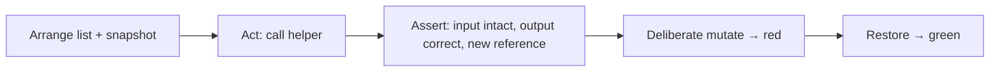
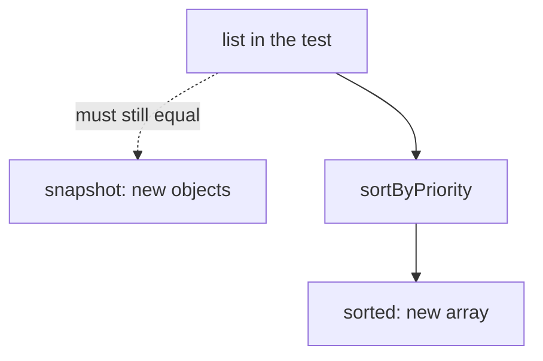

# Month 4 · Week 1 · Day 5
# Tests, Refactor, Documentation — JS Depth

**Program:** Full-Stack Mastery · 18 months  
**Phase:** 1 — Foundations  
**Month index:** [../../README.md](../../README.md)  
**Week 1:** [1](day-01.md) · [2](day-02.md) · [3](day-03.md) · [4](day-04.md) · Day 5 (today) · [6](day-06.md) · [7](day-07.md)  
**Week rhythm today:** Tests + refactor + documentation  
**Student state:** Day 4 shipped immutable helpers. Today those helpers get a regression net, a README a teammate could follow, and a deliberate break so you trust the net.  
**Study time:** 3–4 focused hours  
**Machine today:** Windows PowerShell, Node.js 20+

**This week covers:** lexical scope, closures, `this`, prototypes, classes, modules, immutability, references vs values.

Today is not “add coverage for sport.” Today is **how you prove a helper still returns new data** after someone “simplifies” it next month. Week 3 will deepen test anatomy. This chapter is enough to write honest `node --test` files on Windows.

Labs stay under `~\fullstack-lab\month-04\week-01\`. You will also write `week-01/TESTS.md` in that lab folder (not inside this textbook).

---

## How to use this textbook

1. Read a section. Close it. Say arrange / act / assert out loud.
2. Type tests. Do not paste a green file you cannot explain.
3. When a test fails, **read the assertion message** before editing production code.
4. Optional review links at the end are for later rechecking — not for first learning.

---

## How to read this chapter

A **unit test** here claims something about a **pure function**: given this list, `sortByPriority` returns this order **and** leaves the input equal to a snapshot.

That is a **regression** waiting to happen: if someone “simplifies” to `list.sort`, the test dies. That is the point.

You already wrote some tests on Day 4. Today you make them complete, you **break** a helper on purpose, you restore it, and you document the command that proves green.



Days 1–4 stay available for **repair of facts**. Do not rewrite Day 4’s public API unless a test names a bug. Refactor insides; keep exports.

---

## Today's contract

By the end of this day you will be able to:

1. Write **arrange / act / assert** tests for `sortByPriority`, `addTask`, `toggleDone`, and `filterOpen`.
2. Use `assert.deepEqual` for contents and `assert.notEqual` for **reference** identity.
3. Cause a **red** test by mutating, then restore.
4. Document `node --test` in a README.
5. Record pass/fail in `week-01/TESTS.md` for Day 4 **and** Day 1 `makeAdder`.

**Today's gate.** Closed-book:

> A unit test for a list helper snapshots the input, calls the function, and asserts the snapshot still matches. `assert.notEqual(sorted, list)` means a new array. A test that only checks the happy path after a mutating `sort` is not protecting the caller.

---

## Time box

| Block | Minutes | Work |
|---|---|---|
| A | 35 | Theory: assertions, purity, what is *not* a unit test |
| B | 55 | Complete Day 4 tests; deliberate break; restore |
| C | 50 | README + `TESTS.md` + light refactor |
| D | 20 | Git |
| E | 15 | Recall |

---

# Complete explanation — tests you must still own

## 1. What we are testing (explained)

**Arrange** a list (objects with `id`, `title`, `priority`, `done`).  
**Act** by calling the helper.  
**Assert** with `assert.equal` / `assert.deepEqual` / `assert.notEqual` (different array reference after copy).

```js
test("sortByPriority does not mutate", () => {
  const list = [
    { id: "t-1", title: "b", priority: 2, done: false },
    { id: "t-2", title: "a", priority: 1, done: false },
  ];
  const snapshot = list.map((item) => ({ ...item }));
  const sorted = sortByPriority(list);
  assert.deepEqual(list, snapshot);
  assert.equal(sorted[0].priority, 1);
  assert.notEqual(sorted, list);
});
```

**`assert.notEqual(sorted, list)`** checks **reference** identity — you returned a new array.

**`assert.deepEqual(list, snapshot)`** checks **contents**. If `sort` mutated in place, titles/priorities in `list` would no longer match `snapshot`.

Snapshot with `list.map((item) => ({ ...item }))` so the snapshot is a **shallow clone of each item**. `const snapshot = list` is useless: it is the same array. `const snapshot = [...list]` is a new array of the **same item objects** — a mutating `item.done = true` would poison the snapshot too. For today’s flat items, mapping `{ ...item }` is the right depth.



Worked `addTask`: arrange `[]` (or a one-item list). Act `addTask(list, { title: "Ada", priority: 1 })`. Assert the result has length `old + 1`, the old list still has the old length, and `assert.notEqual(next, list)`. If `addTask` `push`es onto the argument, the length assertion on the **input** fails. That is the test doing its job.

Worked `toggleDone`: arrange two items, only the first `done: false`. Act `toggleDone(list, "t-1")`. Assert the result’s matching id is `done: true`, the other item is still `false`, and the **input** first item is still `false`. If you flipped the object in place, the snapshot of that item is also true.

Worked `filterOpen`: arrange one open and one done. Act. Assert the result has only the open item. Assert the **input** still has two items. Filter is a **view**. Destroying the input is a different function named `deleteDone`.

---

## 2. Assertions without folklore

This book’s typed labs use `node --test` and `node:assert/strict` so you do not need a bundler yet. Vite is Month 5. Vitest is optional in Week 3. **Node.js 20+** ships the test runner; do not install a second runner today unless Week 3 later invites Vitest.

| Assertion | Question it answers |
|---|---|
| `assert.equal(a, b)` | Same value (`===` for primitives; for objects, **identity** in strict mode — prefer `deepEqual` for contents) |
| `assert.deepEqual(a, b)` | Same structure and nested values |
| `assert.notEqual(a, b)` | Different identity or value |
| `assert.throws(() => fn())` | This call throws (Day 2 detached-method style) |
| `assert.ok(value)` | Truthy — weak; prefer a specific equal |

In `node:assert/strict`, `assert.equal` is `===`. `{ a: 1 }` vs `{ a: 1 }` fails `equal` and passes `deepEqual`. If a test “randomly” fails on two similar objects, you used the wrong assertion.

> **Wrong belief:** “If the demo `console.log` looks sorted, the helper is tested.”  
> **Correct:** logs are not assertions. A future edit will not re-read your terminal history.

> **Wrong belief:** “I tested `sort` by checking the output only.”  
> **Correct:** output can be correct **and** the input destroyed. Callers still hold the old variable. Snapshot the input.

> **Wrong belief:** “`assert.equal` on two task objects with the same title is enough.”  
> **Correct:** strict `equal` on objects is **identity**. Two `{ title: "Ada" }` literals are not `equal`. Use `deepEqual` for contents and `notEqual` when you mean a new array.

---

## 3. What is *not* a unit test today

- Opening `index.html` and clicking (no HTML today; even later, that is not a unit test of `sortByPriority`).
- A test that imports `document`.
- A test that only `console.log`s.
- A test that mutates global module state and depends on run order.
- A test named `it works` with no assertion.

You may still **run** `main.js` as a smoke check. Record it in `TESTS.md` as a demo, not as a unit test.

Day 1 `makeAdder` tests belong in the log too: `makeAdder(5)(2) === 7`; two adders do not share `x`. If those files moved, run them from their folder. The log is how Week 7-you knows the command.

Windows PowerShell from the Day 4 folder:

```powershell
cd ~\fullstack-lab\month-04\week-01\day-04
node --test
```

If PowerShell says `node` is not recognized, you are not on PATH in **this** window. That is Month 1’s PATH lesson, not a reason to skip tests. Confirm `node -v` prints `v20` or newer before you blame the test file.

`"type": "module"` must be in `package.json` if you use `import`. A `SyntaxError` about `import` is almost always that field, or you ran a file as CommonJS by accident.

---

## 4. Deliberate break (required)

Temporarily make `sortByPriority` call `list.sort` and return `list`. Run `node --test`. The mutation test **must** fail. Read the assertion. Restore the copy. Run again. Green.

If the test stayed green after the break, the test is lying: the snapshot was an alias, or you never asserted the input.

Write `BREAK.txt` (five to ten lines): what you changed, what failed, what you restored. That file is documentation of trust, not a diary of feelings.

A useful `BREAK.txt` names the assertion (`deepEqual` on `list` vs `snapshot`, or `notEqual` on the arrays) and quotes a fragment of the runner output. “It failed” is not a record.

---

## 5. Refactor that tests allow

Safe today:

- Destructuring in helpers: `const { id, title } = item`.
- Named exports already; delete unused `console.log`.
- Extract `byPriority(a, b) { return a.priority - b.priority; }` if it helps reading.
- Rename a **local** variable.

Unsafe without a new test:

- Changing id format (`t-1` vs `t-01`) if tests pin the string.
- Switching `priority` to strings.
- Mutating in place “but I’ll copy at the caller.”

README (Day 4 folder): how to run `node --test` on **Windows PowerShell**. Include `cd` to the folder. Include `"type": "module"`. Include that helpers must not mutate arguments. Include Node 20+.

---

## 6. `TESTS.md` (the week log)

Create `~\fullstack-lab\month-04\week-01\TESTS.md`:

- Command you ran for Day 4 modules.
- Pass or fail (must be pass at commit time).
- Command you ran for Day 1 `makeAdder`.
- Pass or fail.
- One sentence: what a failing mutation test looks like (you saw it in Block B).

Do not put secrets. Do not paste entire test files. Commands + outcomes + one observation.

---

## Office hours — tests that lie, snapshots that alias, and green that means nothing

**Alias snapshot.** You wrote `const snapshot = list` or `const snapshot = [...list]` and then `toggleDone` flipped `item.done` on a shared object. `deepEqual(list, snapshot)` stayed green because both sides saw the same mutation. The net did not exist. Map `{ ...item }` for today’s flat tasks. If you later nest `tags: []`, copy that array too — Day 6’s teach-back will say why.

**Wrong assertion.** `assert.equal(sorted, expectedArray)` failed even though both arrays looked identical in a log. Strict `equal` is `===`. Two arrays are different objects. `deepEqual` for contents. `notEqual` when the claim is “new reference.”

**No red on the break.** You “broke” `sortByPriority` by adding a `console.log` and the mutation test stayed green. That is not a break. The break is `list.sort` returning `list`. If you cannot make the test red, you cannot trust it when a teammate really mutates.

**README that says `npm test` and no `cd`.** A classmate clones, runs the command from `fullstack-lab`, and Node finds no tests. Write the full PowerShell `cd` path. Week 4-you will thank you when the gate folder is a different cwd.

> **Wrong belief:** “I’ll confirm helpers in the browser instead of Node.”  
> **Correct:** the browser is a smoke check. The suite is `node --test` on pure modules. The Month 4 gate wants tests that failed on the bug, not a memory of a click.

---

# Lab

Work in Day 4’s folder for helper tests. Re-run Day 1 from `week-01/day-01` (or wherever `makeAdder` lives).

`week-01/TESTS.md` — record command + pass/fail for Day 4 module and Day 1 `makeAdder`.

Deliberate break: mutate inside `sortByPriority`. Watch the test fail. Restore.

Refactor: destructuring, named exports, delete unused `console.log`. README: how to run `node --test`.

Minimum tests if Day 4 was thin:

- `emptyList()` is `[]` and a new array each call (`notEqual` two calls).
- `addTask` appends without touching the old array.
- `toggleDone` flips one id; other items unchanged by `deepEqual` on a snapshot.
- `filterOpen` keeps done items **in the input** (filter is a view).
- `sortByPriority` as in the sample above.

```powershell
cd ~\fullstack-lab
git add month-04/week-01
git commit -m "Regression tests for immutable task helpers."
```

---

## Worked walkthrough — one helper, three claims

Take `toggleDone` as the example you type fully if Day 4’s file was thin.

**Arrange.** Two tasks. Only `t-1` will flip. Snapshot with `list.map((item) => ({ ...item }))` so each object is a new object.

**Act.** `const next = toggleDone(list, "t-1")`.

**Assert three claims, not one.** (1) `next` finds `t-1` with `done: true`. (2) `next` finds `t-2` still `false`. (3) `deepEqual(list, snapshot)` — the input did not move. Add `notEqual(next, list)` if you also claim a new array.

If claim (1) is green and (3) is red, you flipped the object in place. If (1) is red because you compared objects with `equal`, switch to `deepEqual` on the item or `equal` on `done` only.

`filterOpen` is the same ritual with a different claim: the **input** still contains the done row. The result does not. If both shrink, you wrote `deleteDone` and named it `filterOpen`.

`emptyList()` if you have it: two calls, `notEqual` the arrays, `deepEqual` both to `[]`. A helper that returns a module-level `[]` shares one array forever. Tomorrow’s store will punish that the same way.

### README paragraph you must not skip

Write the PowerShell `cd` as a fenced block a teammate can paste. Write `"type": "module"`. Write Node 20+. Write that `sort` mutates and your helpers copy first. A README that only says “run tests” is a caption, not documentation.

### Recall (close the editor)

1. Why `const snapshot = list` never catches mutation.  
2. Why `assert.equal` fails on two similar objects.  
3. What `BREAK.txt` must quote besides “it failed.”  
4. Why Day 1 `makeAdder` belongs in `TESTS.md` this week.

If any answer is a shrug, re-read sections 1–2. Do not start Day 6 on a lying suite.

---

## Definition of done

- [ ] Arrange / act / assert tests exist for the Day 4 helpers
- [ ] Mutation test failed on the deliberate break, then passed after restore
- [ ] `BREAK.txt` exists
- [ ] README documents `node --test` on Windows
- [ ] `week-01/TESTS.md` records Day 4 and Day 1 `makeAdder`
- [ ] Commit exists

---

## Stalls and repair — mutation tests, ESM, and Windows cwd

If `node --test` prints `SyntaxError` about `import`, `"type": "module"` is missing from `package.json` in **this** folder (or you ran a file Node treated as CommonJS). Add the field. Do not rename files to `.mjs` as a habit this month unless you already did and documented it.

If PowerShell cannot find `node`, this window’s PATH is wrong. `node -v` must show **v20** or newer. Month 1 PATH doctor — new terminal after install.

If the mutation test stayed green after `list.sort`, your snapshot aliased. `const snapshot = [...list]` still shares item objects. Map `{ ...item }`. Then break again. Red, then restore, then green. `BREAK.txt` quotes the assertion.

If `assert.equal` fails on two arrays that “look the same” in a log, you wanted `deepEqual`. Strict `equal` is `===`. Two literals `{ title: "Ada" }` are different objects.

If you refactored `t-1` to `t-01` and tests went red, you changed the public contract. Revert the format or update tests **because** the contract changed, not because red is annoying.

If `TESTS.md` has no `cd` path, Week 4-you will run `node --test` from `fullstack-lab` and see zero tests. Write the full PowerShell path for Day 4 and Day 1 `makeAdder`.

If you opened a browser instead of Node, record it as a smoke check, not as the suite. The Month 4 gate wants tests that failed on the bug.

Do not start Day 6 until the deliberate break went red. A green suite you never wounded is a costume.

Windows recap:

```powershell
cd ~\fullstack-lab\month-04\week-01\day-04
node --test
cd ~\fullstack-lab\month-04\week-01\day-01
node --test
```

Adjust the Day 1 path if `makeAdder` lives elsewhere. The log in `week-01/TESTS.md` must match reality.

---

## Optional review links

Assertions and `node --test` are explained in this chapter. These pages are for later checking, not for first learning.

- [Node.js: Test runner](https://nodejs.org/api/test.html)
- [Node.js: `assert`](https://nodejs.org/api/assert.html)

---

## Tomorrow

Independent day: a tiny store factory with `subscribe` (closures), a characterization of the `var` loop, and a teach-back that separates closure privacy from `this`. Days 1–5 close for the challenges. Repair from Day 6’s recap.
