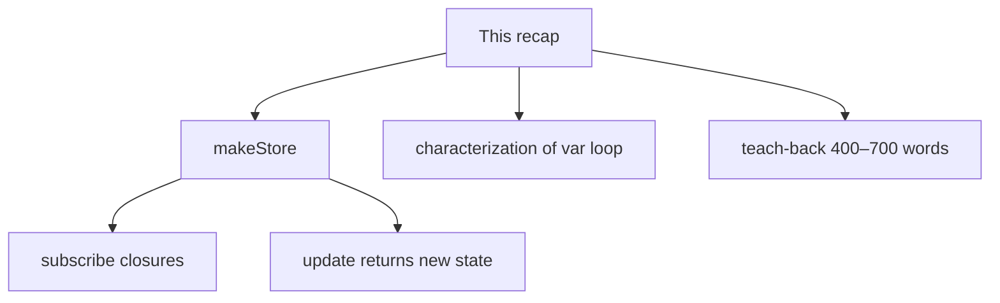
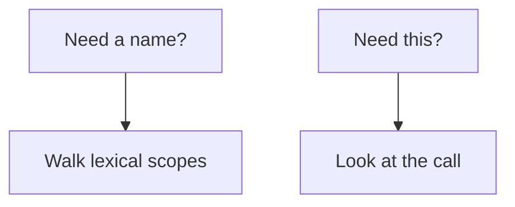

# Month 4 · Week 1 · Day 6
# Independent: Closures and Immutable Data

**Program:** Full-Stack Mastery · 18 months  
**Phase:** 1 — Foundations  
**Month index:** [../../README.md](../../README.md)  
**Week 1:** [1](day-01.md) · [2](day-02.md) · [3](day-03.md) · [4](day-04.md) · [5](day-05.md) · Day 6 (today) · [7](day-07.md)  
**Week rhythm today:** Independent project work  
**Student state:** You have factories, `this`, modules, and mutation tests. Today you combine them in a store nobody typed for you.  
**Study time:** 3–4 focused hours  
**Machine today:** Windows PowerShell, Node.js 20+  
**Days 1–5:** closed for challenges. Repair from **this recap** or Days 1–2 and 4 in this book after a 25-minute stall.

Labs: `~\fullstack-lab\month-04\week-01\independent\`.

---

## How to use this textbook

1. Read this recap. Close Days 1–5.
2. Build `makeStore` from the spec, not from a Redux tutorial.
3. Predict `var` + `setTimeout` before you run the characterization.
4. Optional review links at the end are for later rechecking — not for first learning.

---

## How to read this chapter

Today you prove Week 1 on a **new** object: an in-memory store with listeners. Same physics: lexical scope, live closures, new data from `update`, no `this` required.

The recap below **is** the lesson. Do not paste Day 3’s `makeToggle` and rename `on` to `state`. New file, new API, new tests.



Stuck 25 minutes: Days 1, 2, or 4 of this week in the textbook only.

---

## Complete explanation (this book is the lesson)

**Lexical scope** walks outward from the source. A nested function finds `const` / `let` / `var` where it was **written**, not where it was **called**. Missing name → `ReferenceError`.

**`var`** is function-scoped and hoisted as `undefined`. **`let` / `const`** are block-scoped; read-before-init is the **TDZ**.

**Closures** keep **live** bindings. `makeCounter()` twice → two `count`s. A loop of functions that close over `var i` all see the **final** `i`. Fix with `let` in the `for` head or a factory parameter.

**`this`** is call-site (or `bind` / `new`). Arrows are lexical `this`. Prototypes delegate missing properties to `null`. `class` is prototype sugar: methods on `.prototype`, data on the instance. Extracted methods lose `this`. Closures do not assign `this`. `this` does not look up `const`.

**Modules:** one file, one scope, named `export` / `import`, HTTP for browsers, `"type": "module"` for Node. Imports are live. Prefer exporting functions over exporting a public `let`.

**Memory:** primitives copy; objects share. Spread is shallow. Nested arrays stay aliased. `sort` / `push` / `splice` mutate. Helpers return new lists. `===` on objects is identity; tests use `deepEqual` for contents and `notEqual` for a new array.



**Wrong belief:** “A store is a class with `this.state`.”  
**Correct:** a factory that closes over `state` and `listeners` is enough, easier to test, and does not detach. You *may* use a class if you still pass `this` correctly. The spec does not require one.

**Wrong belief:** “`subscribe` needs `this` so the store can call me.”  
**Correct:** `subscribe` **pushes a function** into an array the store closed over. Later `set` **calls** that function with the new state. The listener is a closure over *your* variables (`seen`, a DOM node, a test array). The store does not care.

**Wrong belief:** “`get()` returns a copy, so callers can `state.n += 1` safely.”  
**Correct:** unless you clone on `get` (you need not today), `get()` may return the **same object** you hold. Callers must not mutate it. `update` replaces. Tests snapshot the old object **before** `update` and `deepEqual` it after.

---

## The store, taught before you type it

`makeStore(initial)` holds one value — a number, or a plain object. That value is **state**.

- `get()` returns the current state. If state is an object, **callers must not mutate it**. Treat it as read-only. The next `update` should replace, not `state.n += 1` on the object `get()` returned.
- `set(next)` replaces state and **notifies** every listener with the new state.
- `update(fn)` means `set(fn(get()))`. `fn` must return **new** state. If `fn` mutates the old object and returns it, listeners may see the same reference and tests that snapshot the old object will catch you — or fail to, if you aliased. Copy inside `fn`: `({ ...old, n: old.n + 1 })`.
- `subscribe(listener)` adds `listener` to a private array. It returns `unsubscribe` that removes **that** listener. After unsubscribe, `set` must not call it again. Unsubscribing twice should be safe (no throw, or a documented no-op).

Two stores from two `makeStore` calls do not share `state` or `listeners`. That is Day 1’s two counters, with a list of callbacks.

```js
const store = makeStore({ n: 1 });
const seen = [];
const off = store.subscribe((s) => seen.push(s.n));
store.update((s) => ({ n: s.n + 1 }));
off();
store.set({ n: 99 });
// seen is [2] — not 99
```

Work through that on paper. `update` reads `{ n: 1 }`, returns `{ n: 2 }` (new object), `set` saves it, the listener runs with `{ n: 2 }`. Then `off` removes the listener. `{ n: 99 }` does not append.

If `update` did `s.n = 2; return s`, the old snapshot in a test would also show `n: 2` because it was the **same object**. That is Day 4’s reference lesson wearing a store costume.

**Notify order:** call listeners with the **new** state after replacing. If a listener calls `get()`, it should see the new value. Do not snapshot listeners incorrectly: if a listener **subscribes another** listener during notify, document whether the new one runs this round (simplest: copy the array before iterating so a subscribe-during-notify does not skip or double). Copying `[...listeners]` before the loop is the honest small design.

**Unsubscribe implementation sketch (you write it):** store an array of functions. `unsubscribe` uses `filter` to return a new array without that function, or `splice` on the **private** array — mutating the listeners array is allowed; it is not the **state** you promised to treat as immutable. Do not confuse “immutable state” with “never mutate any array inside the factory.”

**Identity of the listener:** `unsubscribe` must remove **that function**, not “the first listener.” If two tests subscribe two functions, unsubscribing one must leave the other. Compare with `===` on the function reference. Do not compare `String(fn)` — that is not how functions work.

**set vs update:** `set` is the primitive: replace, then notify. `update` is sugar so callers do not `store.set(fn(store.get()))` and race themselves. In this single-threaded lab there is no parallel `set`, but `update` still documents the intent: derive the next value from the current one in one place.

If `fn` in `update` throws, do **not** notify with a half-written object. Let the throw reach the caller. State should remain the old value. Write a test if you have time; mention the choice in a comment if you do not.

---

## Privacy vs `this` (the teach-back spine)

A factory’s `let state` is private because **no other file has that binding**. A class’s `this.state` is public-by-convention: anyone with the instance can write `store.state = null`. `_state` is a hint, not a lock. Closures are the lock you already know.

You still might use `this` for a DOM widget later. Today’s store does not need it. If you write `this.get = function () { return this.state }` and then pass `store.get` to a test, you are back in Day 2’s detached method. The factory methods close over `state`; they do not read `this.state`. That is why they survive extraction: `const g = store.get; g()` still works.

**Wrong belief:** “If I use arrows on a class, `this` is solved.”  
**Correct:** arrows as class fields can lock `this`, and they also put a **new function on each instance**. You do not need that machinery for a store. A closure already locked the binding.

**Wrong belief:** “`subscribe` must be a method so I can `bind` it.”  
**Correct:** `subscribe` is a function that stores another function. Binding is a `this` tool. You are not using `this`.

---

## Characterization vs product API

Challenge 3 asks for a test that **expects the bug**. That is a **characterization** test: it documents observed wrongness so you remember it. It is not a product API. Comment it. Do not export `loopVar` as `attachToggles` for an app.

```js
// characterization, not a product API
for (var i = 0; i < 3; i++) {
  setTimeout(() => logs.push(i), 0);
}
```

After the tasks run, `logs` is `[3, 3, 3]` (or you collect handlers and call them later — same shared `i`). `node --test` with `setTimeout` needs a wait: `await` a Promise that resolves in `10` ms, or use the test runner’s wait style. If timers feel messy, push handlers into an array **without** `setTimeout` and call them after the loop — the shared `var i` still shows. Either is valid if you comment which.

Prefer the stored-handler version if timers make the test flake on a slow machine:

```js
const handlers = [];
for (var i = 0; i < 3; i++) {
  handlers.push(() => logs.push(i));
}
for (const h of handlers) h();
```

That is still one `i`. `let` in the `for` head would log `0, 1, 2`. The characterization test **asserts the buggy array**. Do not “fix” the loop in this file.

---

## Office hours — stores that leak, unsubscribes that remove the wrong listener, and characterization as a product

**Mutating through `get()`.** A test does `const s = store.get(); s.n = 9` and then `get()` shows 9 without `set`. You handed out the live object. Today’s contract is: callers must not mutate. A test that snapshots **before** `update` and expects the snapshot to stay `{ n: 1 }` will catch `update` that mutates. It will **not** catch a rude caller. Document “do not mutate `get()`” in a one-line comment on `get`.

**Unsubscribe by index.** You `listeners.shift()` or always remove index 0. Two subscribers: unsubscribing the second removes the first. Compare function identity with `===`. Tests: subscribe `a` and `b`, `offA()`, `set`, only `b` ran.

**Characterization exported as `attachAll`.** Week 4-you will paste it into a UI. Keep the comment. Name the file `loopVar.js`. Do not put it next to `makeStore` exports in a barrel that looks like a library.

**`this` store that detaches.** You wrote `get() { return this.state }` on an object literal, then `const { get } = store; get()` throws or returns `undefined`. That is Day 2. Rewrite as a factory closure, or stop extracting.

> **Wrong belief:** “Redux / a class is required before I am allowed to have listeners.”  
> **Correct:** an array of functions plus `let state` is the whole machine today. Libraries come when the problem is bigger than this lab.

---

## Today's contract

**Today's gate**

> A store factory closes over private state and listeners. `update` replaces objects instead of mutating them. `subscribe` returns `unsubscribe`. I can still explain the `var` loop as one live binding.

---

## Time box

| Block | Minutes | Work |
|---|---|---|
| A | 25 | Speak recap; draw store boxes |
| B | 90 | Challenge 1 tests green |
| C | 45 | Teach-back + characterization |
| D | 20 | Git |

---

# Challenge 1 — `makeStore.js` (required)

A tiny in-memory store (not Redux):

- `makeStore(initial)` returns `{ get, set, update, subscribe }`
- `get()` returns current state (the value you hold — if it is an object, document whether callers may mutate it: **they must not**; `update` should replace)
- `set(next)` replaces state, notifies listeners
- `update(fn)` does `set(fn(get()))` — `fn` must return **new** state
- `subscribe(listener)` adds a function called with the new state; returns `unsubscribe`

Tests: two stores independent; subscribe called on set; unsubscribe stops calls; `update` from `{ n: 1 }` to `{ n: 2 }` without mutating the old object (`assert.deepEqual` old snapshot).

`"type": "module"`. `node --test`. Folder: `~\fullstack-lab\month-04\week-01\independent\`. Node.js 20+.

Also assert: `get()` after `set(5)` is `5` for a number store; listeners receive the value you `set`.

Windows:

```powershell
cd ~\fullstack-lab\month-04\week-01\independent
node --test
```

---

# Challenge 2 — Teach-back (required)

400–700 words: closure privacy vs `this`; why `subscribe` is a closure; shallow copy trap.

Prose, not a bullet dump. A teammate who finished Month 3 should understand it. Include one paragraph where a listener closes over a test array (`seen`). Include one paragraph where `{ ...task, tags: task.tags }` still shares `tags`. Do not paste this file.

---

# Challenge 3 — Characterization

Write `loopVar.js` that demonstrates `var` + `setTimeout` (or stored handlers) sharing one index. A test **expects** the buggy behavior (so you remember it). Comment: “characterization, not a product API.”

If you use timeouts, wait until they run before asserting. If you use stored handlers, call them synchronously after the loop — still valid.

```powershell
cd ~\fullstack-lab
git add month-04/week-01/independent
git commit -m "Independent store factory with subscribe closures."
```

---

## Worked walkthrough — two stores, one listener, one trap

Draw three boxes before you type: **Store A** (`state`, `listeners`), **Store B** (its own pair), **Test** (`seen` array). `makeStore({ n: 1 })` twice. Subscribe only on A. `A.update(s => ({ n: s.n + 1 }))`. `seen` is `[2]`. `B.get()` is still `{ n: 1 }` if B started there. If B moved, you shared a module-level `let`.

**Unsubscribe trap.** Subscribe `fnA` and `fnB`. Keep both returned `off` functions. Call `offA()`. `set`. Only `fnB` ran. If both ran, `off` removed nothing. If neither ran, you cleared the whole array.

**Throw in `update`.** `store.update(() => { throw new Error("nope"); })`. After the throw, `get()` is the **old** value. Listeners were not called with a half object. If you notify first and then assign, you inverted the primitive. `set` assigns, then notifies.

**Shallow copy in the teach-back.** `{ ...task, tags: task.tags }` then `copy.tags.push("x")`. Original `tags` grew. Write that paragraph with **your** variable names. The store’s `update` that returns `{ ...old, n: old.n + 1 }` is safe for a flat `{ n }` and **not** a proof that nested arrays are copied.

### Characterization wait (if you use timers)

Node.js 20+ `node --test` supports `async` tests. `await new Promise((r) => setTimeout(r, 20))` then assert `logs`. If 20 ms is flaky on a sleepy machine, use stored handlers and skip the timer. Comment which. Do not mark the test `todo` and ship it.

### Recall

1. Why `const g = store.get; g()` still works on a factory.  
2. Why it fails on `this.state`.  
3. Why characterization must **expect** `[3, 3, 3]` (or your equivalent).  
4. Why copying `[...listeners]` before notify is a design, not a flourish.

---

## Definition of done

- [ ] Days 1–5 closed during the challenges (repair from this recap first)
- [ ] Two stores independent
- [ ] Unsubscribe stops notifications
- [ ] `update` does not mutate the old object
- [ ] Teach-back 400–700 words, prose
- [ ] Characterization test expects the `var` loop bug
- [ ] Commit exists

---

## Stalls and repair — shared state, detached get, flaky timers

If two `makeStore` calls share `n`, `let state` is outside the factory. Move it inside `makeStore`. That is Day 1’s two counters wearing a subscribe costume.

If `const { get } = store; get()` throws, you used `this.state`. Rewrite as a closure. The spec does not require a class.

If unsubscribe removes the wrong listener, you `shift()` or always splice index 0. Compare function identity with `===`. Tests: two listeners, `off` the first, `set`, only the second runs.

If `update` mutates and the snapshot test is green, the snapshot aliased the same object. Clone `{ ...old }` **before** `update`, then `deepEqual` after. Inside `fn`, return `{ ...old, n: old.n + 1 }`, do not `old.n += 1`.

If characterization uses `setTimeout` and flakes, switch to stored handlers called after the loop. Comment “characterization, not a product API.” Do not export it next to `makeStore` as if it were a product helper.

If the teach-back is a bullet dump under 400 words, write the `seen` paragraph and the `tags` paragraph in full sentences. Close this file first.

Windows:

```powershell
cd ~\fullstack-lab\month-04\week-01\independent
node --test
```

Node.js 20+. `"type": "module"`. Days 1–5 stay closed until a 25-minute stall, then only Days 1, 2, or 4 in this textbook.

---

## Last forty minutes

Two stores independent. Unsubscribe stops **that** listener. `update` does not mutate the old object. Characterization expects the bug. Teach-back 400–700 words: privacy vs `this`; `seen`; shared `tags`. `const g = store.get; g()` still works.

If `fn` throws in `update`, state stays old. Copy `[...listeners]` before notify if you document subscribe-during-notify.

Commit `month-04/week-01/independent`. Tomorrow: `makeId` + detach from the Day 7 recap. Days 1–6 closed during that mini-build.

---

## Worked checkpoint — two stores, one throw, one unsubscribe

Sit with `store-a` and `store-b` on paper before you run tests again. `makeStore({ n: 0 })` twice. `a.update(s => ({ ...s, n: 1 }))`. `b.get().n` is still `0`. If it is `1`, `let state` lives outside the factory — that is two counters sharing one drawer, wearing a subscribe costume.

Next: `const off = a.subscribe(seen)`. `off()`. `a.set({ n: 2 })`. `seen` must not grow. Identity is `===` on the function you pushed. `shift()` is not unsubscribe.

If `fn` throws inside `update`, the next `get()` still returns the object from before that `update`. You apply `fn` to a copy (or to the current state only after `fn` returns). You do not write the half-built object and then throw. Tests snapshot `{ ...old }` **before** the throwing `fn`.

> **Wrong belief:** “If a listener throws, the store should roll back every listener.”  
> **Correct:** today you keep state old when `fn` throws. Listener errors are a separate design. Copy `[...listeners]` before notify so subscribe-during-notify does not skip or double-fire.

Windows: `cd ~\fullstack-lab\month-04\week-01\independent` then `node --test`. Node.js 20+. `"type": "module"`. Characterization still expects the `var` loop bug — do not “fix” the product to hide it.

---

## Optional review links

Closures, `this`, and copies are explained in this chapter.

- [MDN: Closures](https://developer.mozilla.org/en-US/docs/Web/JavaScript/Guide/Closures)
- [MDN: `this`](https://developer.mozilla.org/en-US/docs/Web/JavaScript/Reference/Operators/this)

---

## Tomorrow

Week review: speak the table, a tiny `makeId` factory, a detached-`this` note, four debug stories. Then Week 2 — the event loop — why `setTimeout(0)` ran *after* your `Promise.then`.
