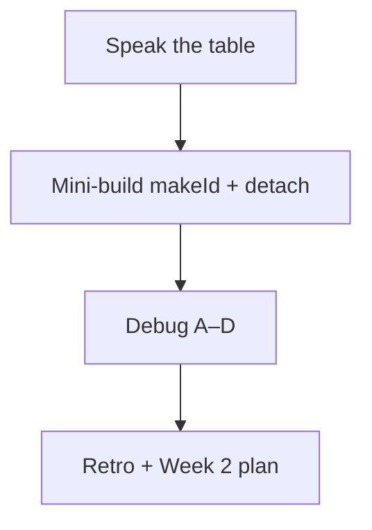

# Month 4 · Week 1 · Day 7
# Week Review — JavaScript Depth

**Program:** Full-Stack Mastery · 18 months  
**Phase:** 1 — Foundations  
**Month index:** [../../README.md](../../README.md)  
**Week 1:** [1](day-01.md) · [2](day-02.md) · [3](day-03.md) · [4](day-04.md) · [5](day-05.md) · [6](day-06.md) · Day 7 (today)  
**Week rhythm today:** Review, explain aloud, fix weak areas, plan next week  
**Student state:** You wrote factories, a class, modules, mutation tests, and a store. Today those ideas must still live in your head — from **this file**.  
**Study time:** 3–4 focused hours  
**Machine today:** Windows PowerShell, Node.js 20+

Do not start Week 2 because the calendar moved. A student who can `fetch` but cannot explain a detached method or a shared `var i` will stall on the Month 4 gate.

Days 1–6 stay **closed** during the mini-build and debug stories. Repair from **this synthesis**.

Labs: `~\fullstack-lab\month-04\week-01\review\`.

---

## How to read this chapter

This is a **closed-book teaching day**. The synthesis **is** the Week 1 lesson.



During the mini-build, do not open Day 1’s `makeCounter`. Write `makeId` from this chapter. If you go blank, re-read the sections below, then type.

---

## Week synthesis (learn from this book)

| Topic | One-line truth |
|---|---|
| Lexical scope | Names resolve where the function was **written** |
| TDZ | `let`/`const` exist but throw if read before init |
| Closure | Function + live outer bindings |
| Loop bug | One `var i` vs a fresh `let i` per turn |
| `this` | Call site / bind / new; arrows inherit |
| Prototype | Delegation chain to `null` |
| `class` | Methods on `.prototype`; `this` still detachable |
| Module | File scope; named exports; HTTP |
| References | Objects share; spread is shallow; `sort` mutates |

```mermaid
flowchart TB
  subgraph keep [Keep forever]
    S[Scope chain]
    C[Closures]
    R[References]
  end
  subgraph call [Separate system]
    T["this"]
    P[Prototypes]
  end
```

Closed-book: speak the table.

The rest of this file unpacks those lines so the mini-build is not a vocabulary quiz against a ghost week.

---

## Today's contract

**Today's gate.** Closed-book:

> I can teach lexical vs `this` lookup, write a factory that does not share counters, explain a detached method, and name why `{ ...task, tags: task.tags }` still shares `tags`.

---

## Time box

| Block | Minutes | Work |
|---|---|---|
| 1 | 40 | Speak the synthesis; draw the two-system diagram |
| 2 | 50 | Mini-build `makeId` + `detach.js` |
| 3 | 30 | Debug A–D in full sentences |
| 4 | 20 | Re-run Week 1 tests you already have |
| 5 | 20 | Design paragraph: why helpers return new lists |
| 6 | 25 | Retro + Week 2 plan |

---

# Complete explanation — JavaScript depth you must still own

## 1. Names walk outward

A binding lives in a scope. Lookup starts at the inner scope and walks to function, then module. The chain is **lexical**: nested in the **source**. Calling `fn()` from another module does not rebind `const x` inside `fn`.

`var` ignores block `{ }` and lives on the function. `let` / `const` honor the block. Reading `let` before its line throws — **TDZ**. You declare, then use. You recognize TDZ when a callback ran too early or a circular import touched a `const` mid-evaluate.

**Shadowing:** an inner `const x` hides an outer `x`. If you meant the outer value, do not reuse the name.

## 2. Closures keep live environments

A function remembers the bindings it needs after the outer call returned. Two factories → two private variables. Changing the outer binding later is visible to the inner function — **not** a snapshot unless you copied a primitive into a new parameter.

The loop bug is that fact plus `var`: one `i`, final value, every timeout or click handler sees it. `let` in `for` mints a binding per iteration. A factory parameter `makeLogger(n)` does the same. The Month 4 gate may show “the wrong row reacted.” That is a **symptom family**. You will still debug from the fixture README in Week 4. This review will not list root causes for `fixtures/broken-priority-list/`.

## 3. `this` is the call, not the definition

`obj.fn()` → `this === obj`. `const f = obj.fn; f()` → `undefined` in modules, usually `TypeError` when you read `this.n`. `bind` locks. `new` sets `this` to the instance. DOM listeners often set `this` to the element. Arrows take enclosing `this` and must not be used as `this`-methods on object literals.

Fixes: wrap in an arrow that closes over `obj`; `bind`; or drop `this` and pass the object as an argument. This course prefers passing data into pure functions.

## 4. Prototypes and `class`

Missing properties delegate up to `null`. `class` puts methods on `Constructor.prototype` and own data in `constructor`. Extracting a class method still loses `this`. Use `class` for a small domain type if it helps; do not wrap `isBlank`. `Object.hasOwn` vs inherited is how you tell “this object wrote `title`” from “it borrowed `kind`.”

## 5. Modules

One file, one scope. Named `export` / `import`. Browser paths include `.js`. Serve over **HTTP**, not `file://`. Node needs `"type": "module"`. Imports are **live**. Cycles + TDZ hurt. Prefer a DAG: `main` → `ui` → `state` → `ids`. CommonJS is something you read, not what you write this month.

## 6. References

Numbers and strings copy. Arrays and objects share. `{ ...obj }` copies one level. `tags.push` through a shallow copy changes the original `tags`. `sort` mutates. Helpers return `[...list].sort(...)` and `{ ...item, done }`. Tests snapshot the input with **cloned items**, then `deepEqual`. `===` on two similar objects is false.

**Wrong belief:** “`const` makes the array immutable.”  
**Correct:** `const` locks the binding. `push` still mutates.

**Wrong belief:** “If I spread, nested arrays are safe.”  
**Correct:** nested references are aliases until you copy them too.

**Wrong belief:** “I passed Day 3, so Day 7 is ceremonial.”  
**Correct:** the month gate will ask you to explain a loop of handlers and a detached method **without** this file open. Today is the rehearsal.

---

## Worked `makeId` (the mini-build in words)

`makeId("t")` closes over `n`. First `next()` returns `t-1` (if you start at 1) or `t-0` (if you start at 0). Pick one. Document it in a comment. Second `next()` increments **that** factory’s `n` only.

```js
export function makeId(prefix) {
  let n = 0;
  return {
    next() {
      n += 1;
      return prefix + "-" + n;
    },
  };
}
```

You may type that shape from **this** review. Two factories: `makeId("t")` and `makeId("u")`. After `t.next()` twice you have `t-1`, `t-2`. `u.next()` is `u-1`, not `u-3`. If you used a module-level `let n`, the two prefixes share a counter — that is a failed test, not a style note.

`detach.js` is a different system. Draw the two-system mermaid again before you type it. Closures do not fix `this`. `this` does not look up `prefix`.

---

## Office hours — shared counters, extracted methods, and shallow tags

**Module-level counter.** `makeId` looks right but `let n` sits outside the function. Every prefix shares `n`. Observation: `u-3` after two `t` ids. Fix: `n` inside `makeId`.

**Arrow as object method.** `{ n: 0, bump: () => { this.n += 1; } }`. `this` is not the object. Observation: `TypeError` or a global leak in sloppy scripts (you are in modules — usually `undefined`). Fix: a method `bump() { this.n += 1; }` called as `obj.bump()`, or drop `this` and close over `let n`.

**Spread then `tags.push`.** You “copied” the task, mutated tags, original changed. Observation: both objects’ `tags.length` grew. Fix: `tags: [...task.tags]` if you will mutate, or return a new tags array from a helper and never `push` on a shared one.

**Import without `.js`.** Browser 404. Node might still work depending on config. This course’s browser habit is the extension. Serve HTTP. `"type": "module"` in Node.

---

## Mini-build

`review/makeId.js` factory + tests; `review/detach.js` documenting `this` throw.

### `makeId.js`

Export `makeId(prefix)` that closes over a private counter starting at 0 (or 1 — document). Each `next()` returns `prefix + "-" + n` with `n` increasing. Two factories, two counters. Tests with `node --test`: `makeId("t")` then two `next()` calls yield `t-1` and `t-2` (or `t-0`, `t-1` — pick one and test it). A second factory `makeId("u")` must not advance the first counter.

This is Day 1 and Day 3 in a thinner costume. Write it cold.

### `detach.js`

An object `{ n: 0, bump() { this.n += 1; } }`. Call `bump` on the object (works). Extract `const f = obj.bump; f()` inside `try/catch`. Print or write the error message to `detach.js` comments **and** to `THIS.txt`. One fix demonstrated (`bind` or arrow wrapper) that increments `n` without throwing.

No DOM. No HTTP required. `"type": "module"`. Node.js 20+.

```powershell
cd ~\fullstack-lab\month-04\week-01\review
node --test
```

### Design paragraph (`DESIGN.txt`)

Why list helpers return new arrays instead of `push` on the argument: callers keep the old variable; tests snapshot; later UI libraries detect change by identity. Five to ten full sentences.

---

## Debug (write the cause)

Write `DEBUG.txt` in full sentences. Include what you would **observe**, then the **system** (lexical vs `this` vs reference), then a **fix**. Do not one-line them.

- **A.** All three buttons log `3`
- **B.** `const f = counter.next; f()`
- **C.** `{ ...task, tags: task.tags }` then `tags.push` changed the original
- **D.** `import` without `.js` in the browser

Hints you may use (still write your own paragraphs):

**A** is the loop-binding family. Observation: every click prints the same final index. The handlers closed over one `var i` (or one `let` outside the loop). Fix: `let` in the `for` head, or a factory parameter, or `data-id` on the button and read it at click time (that last fix does not even close over the index).

**B** is detached `this`. Observation: `TypeError` reading a property of `undefined`, or a silent NaN if you were sloppy. Fix: call as a method, `bind`, wrapper, or stop using `this`.

**C** is shallow copy. Observation: original `tags` grew. Spread copied the **reference** to the array. Fix: copy tags too (`tags: [...task.tags]`) when you intend to mutate the copy, or do not mutate — return a new tags array from a helper.

**D** is module spec in the browser. Observation: failed to resolve the module, or a network 404 on a path without extension. Fix: `from "./makeId.js"`, HTTP server, `type="module"`.

The gate fixture is **not** today’s debug list. Do not open it to “practice.”

### Oral checklist (speak, then tick in `ORAL.txt`)

Say each sentence without looking, then write “ok” or “weak”:

1. Lexical lookup walks from the inner source outward; call site does not change `const`.
2. A closure holds **live** bindings; two factories mean two environments.
3. `var` in a `for` is one binding; `let` in the `for` head is one per iteration.
4. `obj.fn()` sets `this` to `obj`; `const f = obj.fn; f()` does not.
5. `class` methods still detach. Arrows as object methods do not get the object as `this`.
6. `{ ...obj }` copies one level; nested arrays stay shared.
7. `list.sort` mutates; tests snapshot the input.
8. Browser `import` needs `.js` and HTTP.

If any line is weak, re-read that numbered section above and write a five-sentence repair in `ORAL.txt`. That *is* the weak-area block. Do not skip it because the mini-build was green.

---

## Review, tests, retro

Re-run `node --test` in Day 4 and independent folders. Record in `review/TESTS.md`. If anything is red, fix it today — that is the weak-area block.

Retro (`RETRO.md`): hours this week, solid vs weak (scope vs `this` vs copies — be honest), one sentence on Week 2 readiness (stack vs timeout). **Week 2:** the event loop — why `setTimeout(0)` ran *after* your `Promise.then`. Explained in Week 2 day files.

```powershell
cd ~\fullstack-lab
git add month-04/week-01/review
git commit -m "Record Week 1 JS-depth review."
```

---

## Worked walkthrough — `makeId` tests you type cold

```js
import assert from "node:assert/strict";
import { test } from "node:test";
import { makeId } from "./makeId.js";

test("two next calls increment one factory", () => {
  const t = makeId("t");
  assert.equal(t.next(), "t-1");
  assert.equal(t.next(), "t-2");
});

test("second factory does not share n", () => {
  const t = makeId("t");
  const u = makeId("u");
  t.next();
  assert.equal(u.next(), "u-1");
});
```

If the second test gets `u-2`, `n` is module-scoped. Move it inside `makeId`. If the first test gets `t-0` then `t-1`, you started at 0 — **change the asserts**, or start at 0 and document. Do not have tests and comments disagree.

**Detach walk.** `obj.bump()` → `n === 1`. `const f = obj.bump; f()` → catch. `THIS.txt` quotes the message (`Cannot read properties of undefined` is common in modules). Fix: `const g = obj.bump.bind(obj); g()` or `() => obj.bump()`. Prove `n === 2` after the fix. One fix is enough. Do not write all three and skip the throw.

**DEBUG A extra honesty.** “All three buttons log 3” is the **family**. A `let i` **outside** the loop is the same family. `data-id` on the button is a fix that does not close over `i` at all. Write which fix you would choose and why. Do not open the gate fixture to match a row.

### Week 2 preview you must say in RETRO.md

One thread. Timers are tasks. `Promise.then` is a microtask. `setTimeout(0)` is later than `then` after the stack clears. If that sentence is mush, you are not ready to predict `A D C B`. The review still finishes today; Week 2 will teach the queues. Honesty in the retro is the gate for *yourself*.

---

## Week 1 definition of done

- [ ] Table spoken closed-book
- [ ] `makeId` tests green; two factories independent
- [ ] Detached `this` documented with one fix
- [ ] DEBUG A–D are full paragraphs
- [ ] DESIGN.txt exists
- [ ] Retro does not skip Week 2 queues
- [ ] Commit exists

---

## Stalls and repair — shared `n`, missing `.js`, and DEBUG one-liners

If `u.next()` returns `u-3` after two `t` ids, `n` is module-level. Put `let n` inside `makeId`. Retype the tests from this file’s walkthrough. Do not open Day 1’s `makeCounter` during the mini-build.

If `bump` as an arrow never increments `obj.n`, `this` is not the object. Use a method, or drop `this` and close over `let n`. `THIS.txt` must include the **throw** from the extracted call, then one fix.

If DEBUG A is “loop bug, use let,” write observation (every click prints 3), system (one `var i` or `let` outside), fix (`let` in `for` head, factory parameter, or `data-id`). Three sentences minimum. The gate fixture is not today’s list.

If DEBUG C is “shallow copy,” name `tags.push` and `tags: [...task.tags]`. Spread copies one level.

If DEBUG D is a browser 404, add `.js` to the import, serve HTTP, `type="module"`. Node may hide the extension depending on config; the **browser** habit is the extension.

If `ORAL.txt` has eight “ok” ticks in two minutes, you did not speak. Weak lines get a five-sentence repair. That is the weak-area block.

If Day 4 tests are red, fix them today. Review is not a new green folder while last week’s suite dies.

Windows: `cd ~\fullstack-lab\month-04\week-01\review` then `node --test`. Node.js 20+. Week 2 is queues — say that in `RETRO.md`.

---

## Optional review links

Week 1 is explained in this chapter. These pages are for later checking, not for first learning.

- [MDN: Closures](https://developer.mozilla.org/en-US/docs/Web/JavaScript/Guide/Closures)
- [MDN: `this`](https://developer.mozilla.org/en-US/docs/Web/JavaScript/Reference/Operators/this)
- [MDN: JavaScript modules](https://developer.mozilla.org/en-US/docs/Web/JavaScript/Guide/Modules)

---

## If you passed this week

Week 2 is the **browser and Node runtime**: call stack, task queue, microtasks. You will predict `A D C B` until it is boring. Then promise errors and `AbortError` vs HTTP. The gate still waits until Week 4.
