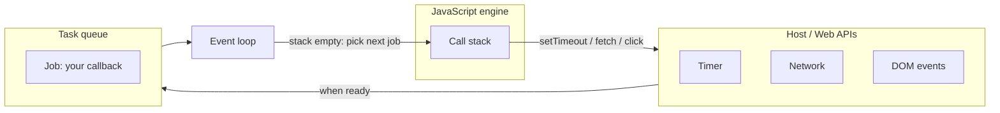
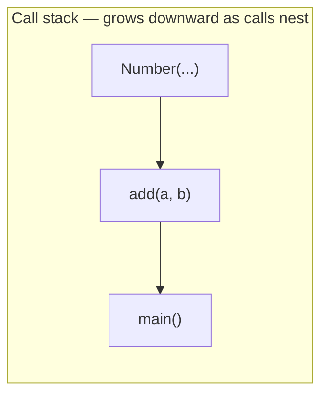

# Month 4 · Week 2 · Day 1
# Call Stack, Event Loop, Macrotasks

**Program:** Full-Stack Mastery · 18 months  
**Phase:** 1 — Foundations  
**Month index:** [../../README.md](../../README.md)  
**Week 2:** Day 1 (today) · [2](day-02.md) · [3](day-03.md) · [4](day-04.md) · [5](day-05.md) · [6](day-06.md) · [7](day-07.md)  
**Week rhythm today:** Learn + type-along  
**Student state:** Week 1 gate ideas are in your fingers: scope, closures, `this`, modules, copies. Today the machine that **runs** that code gets a picture.  
**Study time:** 3–4 focused hours  

**This week covers:** call stack, event loop, tasks vs microtasks, promise behavior, error propagation, browser runtime.

Today: the **stack** and the **task queue** (`setTimeout`, events, `fetch` completion as a task). Microtasks (`Promise.then`, `queueMicrotask`) are Day 2 — you will *see* them sneak in today and name them tomorrow.

Labs: `~\fullstack-lab\month-04\week-02\day-01\`. Browser freeze lab: **HTTP**, not `file://`.

---

## How to use this textbook

1. Read a section. Close it. Draw the stack and the queue from memory.
2. Type every lab. Predict **before** you run. Write the prediction. Then run.
3. When order surprises you, replay the diagram — do not shrug “async.”
4. Optional review links at the end are for later rechecking — not for first learning.

---

## How to read this chapter

JavaScript on a page (and in ordinary Node) is **one main thread** with a **stack**. Work that cannot finish now — a timer, a click, a network response — is handed to the **host** (browser or Node), then **queued** as a function to run later.

If you only remember “`setTimeout` is async,” you will still write a `while` loop that waits for `fetch` and freeze the tab. Read until you can walk `console.log` vs `setTimeout(..., 0)` line by line.



---

## Today's contract

1. Draw a **call stack**: last function in is first out.
2. Explain why a tight `while` loop **freezes** the page (the stack never empties).
3. Explain the **event loop** in one paragraph: when the stack is empty, take the next **task**.
4. Predict the order of `console.log` vs `setTimeout(..., 0)`.

**Today's gate**

> JavaScript on a page has **one** main thread. `setTimeout(fn, 0)` does not mean “run `fn` now.” It means “queue `fn` as a task; run it when the stack is clear (and after any microtasks — tomorrow).”

---

## Time box

| Block | Minutes | Work |
|---|---|---|
| A | 50 | Theory + diagrams |
| B | 55 | Predict / run ordering labs |
| C | 70 | Independent: freeze vs timeout |
| D | 25 | Git |
| E | 15 | Recall |

---

# Block A — Theory

## 1. The call stack

When JS runs `main()`, then `main` calls `add()`, then `add` calls `Number`, the engine keeps a **stack** of frames: who called whom, local bindings, where to return.



When `Number` returns, that frame pops. When `main` returns, the stack is **empty**.

Think of a stack of plates. The plate you just put on is the plate you take off first. That rule is **last in, first out (LIFO)**. Recursion is the same idea: each call adds a plate. Too many plates → **stack overflow** (“Maximum call stack size exceeded”). That is the stack running out of **frames**, not RAM in general. `function f() { f(); }` is the demo you should not leave running.

**Synchronous** code runs to completion on this stack. Nothing else on the main thread (clicks, paint, timeouts) runs *in the middle* of your `for` loop unless you `await` (which **pops** your async function until later — Day 2).

Walk this tiny program with your finger:

```js
function add(a, b) {
  return Number(a) + Number(b);
}
function main() {
  const total = add("1", "2");
  console.log(total);
}
main();
```

1. Script starts. Stack empty, then `main` is pushed.
2. `main` calls `add` — `add` is pushed on top of `main`.
3. `add` calls `Number` — pushed, returns, popped; again for the second `Number`.
4. `add` returns `3`, pops. `main` calls `console.log`, which pushes and pops.
5. `main` returns. Stack empty.

Until step 5, a click handler **cannot** run. The click may already sit in a queue. The queue is not the stack.

> **Wrong belief:** “The browser is multithreaded so my loop will not freeze the tab.”  
> **Correct:** your JS is one thread. A 5-second loop is a 5-second frozen tab.

> **Wrong belief:** “The call stack is the same thing as the task queue.”  
> **Correct:** the stack is “what is running now, nested.” The queue is “what is waiting to become the next stack.”

**DevTools:** Sources → pause in `add` → look at the **Call Stack** pane. You should see `add`, then `main`, then the script. That pane is this section made visible. Week 3 will insist on breakpoints. Today, opening it once makes the diagram real.

If you pause inside a `setTimeout` callback, the stack is **short**: that callback is the root of **this** task, not a continuation of `main`. `main` already returned. That is the whole point of the queue. Write one sentence in `DRAW.md` later: “The timeout stack does not still contain `order.js`’s top-level `main`.”

---

## 2. The rest of the machine (browser runtime)

The JS engine is not the whole browser. **Web APIs** (timers, DOM, `fetch`, `addEventListener`) live **outside** the stack. They do work, then **queue a function** for JS to run later.

Node is the same idea with different names: the OS and libuv hold timers and sockets; when they finish, Node queues a callback onto JS.

**Event loop** (simplified, main thread):

1. Run whatever is on the stack until empty.
2. (Day 2: run **all** microtasks.)
3. If the task queue has a job, push it on the stack and run it.
4. The browser may **render** (paint) between tasks.
5. Repeat.

That is why `setTimeout(fn, 0)` still runs **after** the current script: the timeout callback is a **task**, and the current script has not emptied the stack yet.

Easy walkthrough of the sentence you will memorize:

```js
console.log("A");
setTimeout(() => console.log("B"), 0);
console.log("C");
// A C B
```

| Time | Stack | Timer (host) | Task queue | Output |
|---|---|---|---|---|
| 1 | script: `log A` | — | empty | `A` |
| 2 | script: `setTimeout` | start 0 ms timer | empty | `A` |
| 3 | script: `log C` | timer already due | empty | `A C` |
| 4 | stack **empty** | — | callback `B` waiting | `A C` |
| 5 | callback `B` | — | empty | `A C B` |

At time 2, `setTimeout` does **not** call your function. It asks the host to wait (at least 0 ms) and then **enqueue** the function. At time 3 the stack is still busy with `C`. At time 4 the stack is empty, so the event loop finally pushes `B`.

`0` is not a promise of zero delay. If the stack is busy for 3 seconds, `B` waits 3 seconds. If the page is busy with other tasks, `B` waits more. Never use `setTimeout(0)` as a mutex for correctness.

---

## 3. Macrotasks (tasks)

Common **tasks** (also called macrotasks):

| Source | When the callback becomes a task |
|---|---|
| `setTimeout(fn, t)` | After at least `t` ms (can be longer if the stack is busy) |
| `setInterval` | Each tick |
| Click / keydown / submit | When the event fires |
| `fetch` … then the engine continues | After the network work; your `await` resume is actually a **microtask** (Day 2) — the *network completion* still goes through the runtime |

For today, remember this experiment:

```js
console.log("A");
setTimeout(() => console.log("B"), 0);
console.log("C");
// A C B
```

`B` is queued. `C` still runs on the current stack. Then the stack is empty, then `B`.

**Nested timeouts** are two tasks, not one:

```js
setTimeout(() => {
  console.log("outer");
  setTimeout(() => console.log("inner"), 0);
}, 0);
console.log("sync");
```

`sync` runs now. The outer callback is a task. When it runs, it logs `outer` and **schedules** another task. That inner task cannot run until the outer callback’s stack is empty. Order: `sync`, `outer`, `inner`.

**Minimum delay:** `0` is not zero on a busy page. The spec allows a minimum; the loop also waits for the stack. Never use `setTimeout(0)` as a mutex for correctness — use promises or explicit state (Day 2 / Month 3 abort).

**`setInterval`:** each tick is a task. If the callback takes longer than the interval, ticks pile up or skip depending on the host. Do not use interval as a game loop this month. Prefer a timeout you reschedule, or later `requestAnimationFrame` (Day 4 names it).

---

## 4. Why this matters for bugs

- A long `JSON.parse` of a huge string blocks clicks — same thread.
- `while (!done) {}` waiting for `fetch` **never** sees `done` — fetch’s callback cannot run until you leave the loop.
- The Month 4 gate may have two searches finishing out of order (Week 2 Day 2 + Month 3 AbortController). The loop explains *when* each callback runs, not *which HTTP is newer* — you still abort.

**Deadlock of the thread** (say this in the teach-back):

```js
let done = false;
fetch("https://example.com").then(() => {
  done = true;
});
while (!done) {
  // never exits: the then callback is waiting for an empty stack
}
```

The `while` keeps the stack non-empty. The event loop never takes the fetch continuation. `done` stays `false`. The tab freezes. `await fetch` **yields** (Day 2) so other tasks can run. A busy `while` does not yield.

> **Wrong belief:** “If I set the delay to 0, it runs between the next two lines.”  
> **Correct:** it runs after the **current stack** (and after microtasks tomorrow). The next line is still now.

---

## 5. Node vs browser today

`node order.js` uses the same **task** idea for `setTimeout`. You will not see a frozen **page** in Node, but you will see the same `1`, `3`, `2` ordering. The freeze lab is **HTML over HTTP** so you can try to click during a busy loop.

Windows:

```powershell
cd ~\fullstack-lab\month-04\week-02\day-01
node order.js
```

For HTML:

```powershell
cd ~\fullstack-lab\month-04\week-02\day-01
npx --yes serve -p 5500
```

Then open `http://127.0.0.1:5500/freeze.html`. Not `file://`.

---

# Block B — Type-along

`~\fullstack-lab\month-04\week-02\day-01\`

`"type": "module"` if you use `import`; not required for a single script of `console.log`. Predictions still required.

## B1 — Stack vs timeout

`order.js`:

```js
console.log("1 start");
setTimeout(() => console.log("2 timeout 0"), 0);
console.log("3 end");
```

`PREDICT.txt` first, then `node order.js`. Node has the same **task** idea for `setTimeout`.

Fill a tiny table in `PREDICT.txt`: what runs on the stack now vs what is queued. Then run. If you predicted `1 2 3`, rewrite the table using section 2. Do not edit the script to “make it make sense.”

## B2 — Nested timeouts

```js
setTimeout(() => {
  console.log("outer");
  setTimeout(() => console.log("inner"), 0);
}, 0);
console.log("sync");
```

Predict all three lines’ order.

Write why `inner` cannot appear between `sync` and `outer`. (It has not even been scheduled yet.)

## B3 — Freeze (browser)

`freeze.html` + `freeze.js` served over HTTP:

- Button “Loop 3 seconds” — `const end = Date.now() + 3000; while (Date.now() < end) {}` then `console.log("done")`.
- Button “Timeout 3 seconds” — `setTimeout(() => console.log("done"), 3000)`.

Click Loop, try to click the other button during the three seconds. Write `FREEZE.txt`: which button still paints/clicks, and why.

The Loop button’s handler **is** the stack for three seconds. Paint and clicks wait. The Timeout button’s handler returns immediately; the host holds the timer; you can click and paint; then the task runs.

Use `textContent` if you label anything from JS. No `innerHTML`. Buttons need `type="button"`.

---

# Block C — Independent

1. `order2.js`: mix three `console.log` and two `setTimeout` delays `0` and `10`. Predict, run, explain any surprise (10 ms is not exact).
2. Teach-back 300+ words: stack, Web APIs, task queue, why `while` waiting for fetch is a deadlock of the thread.
3. Draw the Mermaid (or ASCII) for `order.js` in `DRAW.md`.

For `order2.js`, a fair prediction is: all sync logs first, then the `0` timeout, then the `10` timeout — **if** the process is idle. If you see both timeouts together, your machine’s clock granularity lumped them. Write what you **saw**, not what a tweet promised.

Teach-back must include the `while (!done)` fetch story in full sentences. If the essay never says “the stack never emptied,” it is incomplete.

`order2.js` surprise log: if the `10` ms callback ran in the same millisecond bucket as `0`, write that the delay is a **minimum**, not a schedule. If `0` ran first as expected, say that too. Honesty beats a pretty table.

`DRAW.md` should show four moments for `order.js`: (1) `1 start` on the stack, (2) timer armed in the host, (3) `3 end` on the stack, (4) stack empty then the timeout task. Boxes and arrows are enough. If mermaid does not render in your editor, ASCII is fine.

> **Wrong belief:** “Node has no event loop, only the browser does.”  
> **Correct:** Node has a loop. `setTimeout` in `node order.js` is the same **task** idea. The freeze-the-tab demo needs a browser because you need clicks and paint. The order of `1` / `3` / `2` should match in both hosts.

Microtasks can already appear if you add a `Promise.then` by accident today. If a log you did not schedule as a timeout appears between `3 end` and the timeout, you queued a microtask. Name it tomorrow. Do not “fix” order.js by deleting the timeout.

```powershell
cd ~\fullstack-lab
git add month-04/week-02
git commit -m "Week 2 Day 1: call stack and setTimeout task order."
```

---

## Definition of done

- [ ] Predictions written **before** running
- [ ] `order.js` matches `A C B` style (1, 3, 2)
- [ ] Nested timeouts: `sync`, then `outer`, then `inner`
- [ ] `FREEZE.txt` explains the busy `while` vs `setTimeout`
- [ ] Teach-back 300+ words includes the fetch+while deadlock
- [ ] `DRAW.md` exists
- [ ] Freeze page was opened over HTTP
- [ ] Commit exists

---

## Optional review links

The event loop and task queue are explained above. HTML’s event loop is more detailed (rendering, idle). You do not need that spec to pass the gate.

- [HTML Living Standard: event loop](https://html.spec.whatwg.org/multipage/webappapis.html#event-loops) (optional later)
- [MDN: Concurrency model](https://developer.mozilla.org/en-US/docs/Web/JavaScript/Event_loop)

---

## Tomorrow

**Microtasks:** `Promise.then`, `queueMicrotask`, `await` continuation. They run **before** the next `setTimeout`. That is the ordering surprise everyone memorizes — from this book, with a diagram, not from a tweet.
