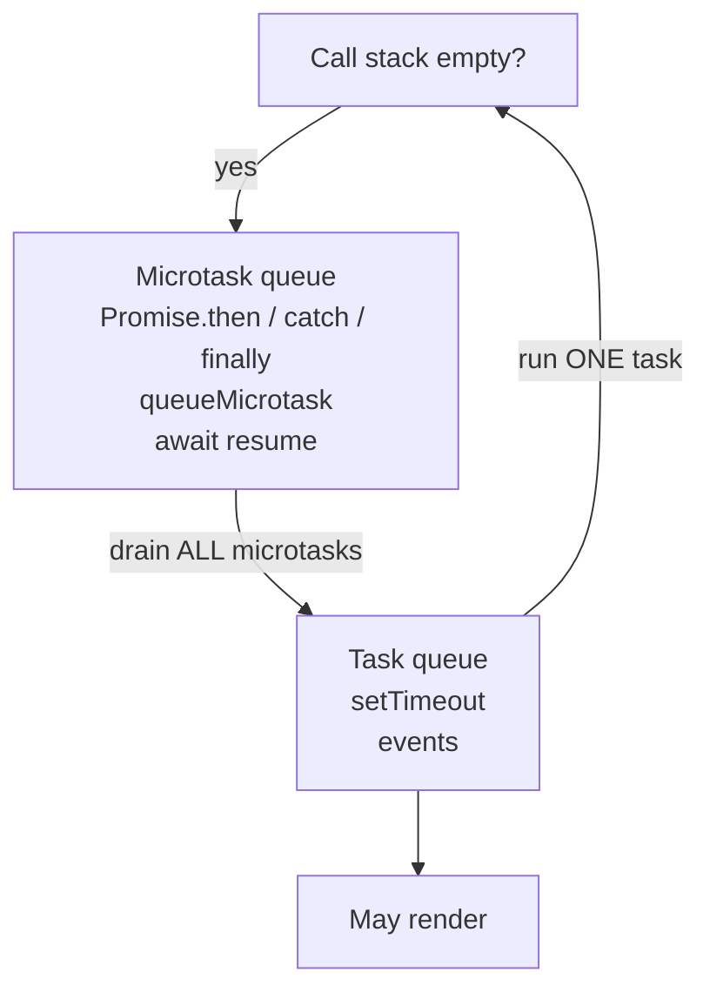

# Month 4 · Week 2 · Day 2
# Microtasks, Promises, and Error Propagation

**Program:** Full-Stack Mastery · 18 months  
**Phase:** 1 — Foundations  
**Month index:** [../../README.md](../../README.md)  
**Week 2:** [1](day-01.md) · Day 2 (today) · [3](day-03.md) · [4](day-04.md) · [5](day-05.md) · [6](day-06.md) · [7](day-07.md)  
**Week rhythm today:** Exercises + debugging  
**Student state:** You can predict `console.log` vs `setTimeout(0)`. Today a **second queue** cuts in line: microtasks.  
**Study time:** 3–4 focused hours  

**This week covers:** call stack, event loop, tasks vs microtasks, promise behavior, error propagation, browser runtime.

Today is a full lecture: **`Promise.then` vs `setTimeout`**, **`queueMicrotask`**, **`await`**, promise errors, and `unhandledrejection`. Day 3 will ask you to predict mixed snippets cold. Do not skim the diagrams.

Labs: `~\fullstack-lab\month-04\week-02\day-02\`. Node for order labs. `"type": "module"` as needed.

---

## How to use this textbook

1. Read a section. Close it. Recite “sync, then all microtasks, then one task.”
2. Type every snippet. Predict **before** you run.
3. When Node prints `unhandledrejection`, that is the lesson — then you add `.catch`.
4. Optional review links at the end are for later rechecking — not for first learning.

---

## How to read this chapter

Yesterday the picture had one waiting line: **tasks** (`setTimeout`, clicks). That was incomplete on purpose.

After the call stack empties, the engine does **not** immediately run the next timeout. It first drains a second line: the **microtask queue**. `Promise.then`, `Promise.catch`, `queueMicrotask`, and the **resume after `await`** all join that line.

If you only memorize “promises are async,” you will still predict `setTimeout(0)` before `then`. The timeout is async **and later**. The `then` is async **and sooner**.



**Drain all microtasks** means: if a microtask enqueues another microtask, that one also runs before `setTimeout`. You can starve rendering if you infinitely `queueMicrotask` — do not.

---

## Today's contract

By the end of this day you will be able to:

1. Predict **A D C B** for mixed `console.log`, `then`, and `setTimeout(0)`.
2. Predict **0 1 3 2** for `await` on an already-resolved promise.
3. Explain `queueMicrotask` as the same queue as `then`.
4. Trace a `then` / `throw` / `catch` / `then` chain (skip vs restore).
5. Show Node’s **unhandled rejection** and then `.catch` it.

**Today's gate**

> After the stack clears, the engine runs **all** queued microtasks **before** the next macrotask (`setTimeout`, click). `Promise.then` and `await` after a resolved promise are microtasks. An unhandled rejected promise is an error — `catch` it or it becomes `unhandledrejection`.

---

## Time box

| Block | Minutes | Work |
|---|---|---|
| A | 60 | Theory: two queues, then vs timeout, await, errors |
| B | 55 | Order battery + catch chain + unhandled |
| C | 45 | Independent notes + `labelStatus` tests |
| D | 20 | Git |
| E | 15 | Recall |

---

# Theory (complete)

## 1. Two queues (memorize this picture)

The event loop, with Day 1’s missing piece filled in:

1. Run the current stack until empty.
2. **While** the microtask queue is not empty, run the next microtask (which may enqueue more microtasks).
3. Optionally render (browser).
4. Run **one** task from the task queue (one timeout callback, one click handler).
5. Go back to step 2 (because that task may have queued microtasks).

A task is allowed to finish, then **all** microtasks it caused run, **before** the next timeout. That is why a resolved `then` beats `setTimeout(0)` even when you wrote the timeout first.

Classic order:

```js
console.log("A");
setTimeout(() => console.log("B"), 0);
Promise.resolve().then(() => console.log("C"));
console.log("D");
// A D C B
```

- `A`, `D` — synchronous stack  
- `C` — microtask  
- `B` — task  

Line-by-line walk (keep this until it is boring):

1. `log A` — stack. Output: `A`.
2. `setTimeout` — host starts a 0 ms timer. `B` is **not** on the stack. It will become a **task** when the timer fires (immediately, but still a task).
3. `Promise.resolve().then(...)` — the promise is already fulfilled. The engine **queues** the `then` callback as a **microtask**. It does not run `C` yet. The stack still holds the script.
4. `log D` — stack. Output: `A D`.
5. Script ends. Stack empty.
6. Drain microtasks: run `C`. Output: `A D C`.
7. Take the next task: `B`. Output: `A D C B`.

> **Wrong belief:** “Whichever I wrote first among `then` and `setTimeout(0)` runs first.”  
> **Correct:** queues have **priority**, not source order. Microtasks win over tasks after the stack clears.

> **Wrong belief:** “`Promise.resolve().then` runs immediately, like a function call.”  
> **Correct:** it runs after the current stack, as a microtask. `D` still happens first.

If a `then` schedules another `then`, that second microtask still runs before `B`:

```js
console.log("A");
setTimeout(() => console.log("B"), 0);
Promise.resolve()
  .then(() => {
    console.log("C1");
    return Promise.resolve();
  })
  .then(() => console.log("C2"));
console.log("D");
// A D C1 C2 B
```

`C2` is another microtask. The timeout still waits. This is “drain **all**,” not “drain one.”

---

## 2. `queueMicrotask`

```js
queueMicrotask(() => console.log("micro"));
```

Same queue as `then`. Use it when you need “after this stack, before paint/timeout,” not as a clever delay.

```js
console.log("A");
setTimeout(() => console.log("B"), 0);
queueMicrotask(() => console.log("M"));
Promise.resolve().then(() => console.log("C"));
console.log("D");
```

`M` and `C` are both microtasks. They run in **queue order** after `D`, before `B`. Typically `A D M C B` if you queued `M` before `C`. Swap the two lines and `C` may precede `M`. The lesson is not the letters. The lesson is: **both beat the timeout**, and **FIFO inside the microtask queue**.

> **Wrong belief:** “`queueMicrotask` is a browser-only cousin of `setTimeout(0)`.”  
> **Correct:** Node has it too. It is **not** a timeout. It is the microtask queue on purpose.

Do not write a function that always `queueMicrotask`s itself. That is a loop that never reaches paint or timers. The page will look frozen even though you “yielded.” You yielded to more of yourself.

---

## 3. `await` is a microtask resume (usually)

```js
async function go() {
  console.log("1");
  await Promise.resolve();
  console.log("2");
}
console.log("0");
go();
console.log("3");
// 0 1 3 2
```

`await` **yields**. The rest of `go` (`console.log("2")`) is scheduled as a microtask (for an already-settled promise). `3` still runs on the current stack.

Walk:

1. `log 0`.
2. Call `go`. That is a normal call. `log 1` still on the stack.
3. `await Promise.resolve()` — the promise is already fulfilled. `go` **returns a Promise** to the caller and **pauses**. The caller is the script, which does **not** wait unless you wrote `await go()` (you did not).
4. `log 3` still on the stack.
5. Stack empty. Microtask: resume `go`, `log 2`.

> **Wrong belief:** “`await` waits like sleep, so `2` prints before `3`.”  
> **Correct:** `await` on an already-resolved promise still schedules a microtask. `3` is already on the stack.

`await null` is `await Promise.resolve(null)` — still a microtask. Day 3 will use that snippet.

`await` of a **pending** promise (real `fetch`) resumes when that promise fulfills — still as a microtask after the host finishes the I/O. Meanwhile other **tasks** (clicks) can run because you yielded. That is why `async` functions do not freeze the tab the way a `while` on the stack does.

```js
async function load() {
  console.log("before");
  await fetch("https://example.com"); // pending a while
  console.log("after");
}
load();
console.log("caller");
// before, caller, ...much later... after
```

You will not hit the network in today’s Node order battery. The rule is the same.

**`async` function return value:** `go()` always returns a Promise. Throwing inside `async` **rejects** that Promise. Forgetting to `await` or `.catch` it is how you get `unhandledrejection` from code that “looked” like `try/catch` lived at the caller — the caller never attached.

---

## 4. Promise behavior you must predict

A Promise is pending → fulfilled or rejected **once**. You cannot fulfill twice. Extra `resolve` calls are ignored.

```js
Promise.resolve(1)
  .then((n) => n + 1)
  .then((n) => {
    throw new Error("boom");
  })
  .then(() => console.log("skip"))
  .catch((err) => {
    console.log("caught", err.message);
    return 0;
  })
  .then((n) => console.log("after", n));
```

- A throw (or returned rejected promise) in `then` jumps to the next `catch`.
- `catch` can **return** a value — the chain is fulfilled again (`after 0`).
- Forgetting `catch` on a chain used with `fetch` is how you get silent failures or `unhandledrejection`.
- The `then` that logs `skip` is **skipped** because the previous step rejected. After `catch` returns `0`, the following `then` runs.

> **Wrong belief:** “Once a promise rejects, the whole program is dead.”  
> **Correct:** a `catch` that returns a value **recovers** the chain. Later `then` callbacks run with that value.

> **Wrong belief:** “`.then(ok, err)` is the same as `.then(ok).catch(err)`.”  
> **Correct:** they differ if `ok` throws. `.then(ok).catch(err)` will see that throw. The two-argument `then` will not send `ok`’s throw to that same `err`. Prefer `try/catch` with `await`, or `.then` + `.catch` on separate links, until you can draw both.

**`async`/`await`:** `try/catch` around `await` is the same idea. Prefer it for new code (Month 3). You still **read** `.then` chains.

**`Promise.all`:** rejects when **the first** input rejects. **`Promise.allSettled`:** waits for all; each result is `{ status, value | reason }`. Use `allSettled` when you want every outcome. Use `all` when one failure should cancel the group (and still abort fetches if you designed that).

```js
const results = await Promise.allSettled([
  Promise.resolve("ok"),
  Promise.reject(new Error("nope")),
]);
// [{ status: "fulfilled", value: "ok" }, { status: "rejected", reason: ... }]
```

---

## 5. Error propagation on the main thread

| Where | What happens |
|---|---|
| `throw` in sync code | Stack unwinds until `try/catch`; else the script dies (and DevTools shows it) |
| `throw` in `setTimeout` callback | That **task** dies; later tasks still run |
| Rejected promise, no `catch` | `unhandledrejection` event; Node may exit non-zero depending on version |
| `throw` in `addEventListener` | That listener fails; others may still run |

**Never** empty-catch (`catch (e) {}`) to “keep the UI alive.” Log, set error state, rethrow if you are not the owner.

```js
window.addEventListener("unhandledrejection", (event) => {
  console.error("unhandled", event.reason);
});
```

In Node you may see:

```js
process.on("unhandledRejection", (reason) => {
  console.error("unhandled", reason);
});
```

You may log this in a lab. Do not use it as your only error strategy — **catch at the `await fetch`**.

A timeout that throws does **not** cancel the next timeout. Each task is its own stack. That is comforting for “the page still works” and dangerous for “I thought the program stopped.”

**AbortError vs HTTP** (preview for Day 5; learn the names now):

- You aborted a `fetch` on purpose (newer search, unmount). The promise rejects with an error whose **`name`** is `"AbortError"`. That is **not** a user-facing failure if you intended the abort. Map it to silence or a no-op.
- `response.ok` is false: **HTTP** failed (404, 500). Throw a normal `Error` with the status, as Month 3 taught. That **is** a user-facing failure.
- Network down: `fetch` rejects with `TypeError` (typical in browsers). Also user-facing.

Do not show “Something went wrong” for an abort you caused. Do not ignore a 404 because “it was a promise.” Day 5 will unit-test a `toUserError` mapper.

> **Wrong belief:** “I’ll listen to `unhandledrejection` instead of writing `catch`.”  
> **Correct:** the event is a safety net and a lab demo. Owners `catch` at the `await`.

---

## 6. Mixing the three delays (study picture)

```js
console.log("sync-1");
setTimeout(() => console.log("task"), 0);
queueMicrotask(() => console.log("micro-1"));
Promise.resolve().then(() => {
  console.log("micro-2");
  queueMicrotask(() => console.log("micro-3"));
});
console.log("sync-2");
```

Expected shape: both `sync-*` first; then `micro-1`, `micro-2`, `micro-3` (all before `task`); then `task`. If your Node prints that, you understand drain-all. If `task` slips between micros, your mental model still thinks “async is one bucket.”

---

# Lab

`~\fullstack-lab\month-04\week-02\day-02\`

## 1. Order battery

`micro-order.js` — the `A D C B` snippet and the `async go` snippet. `PREDICT.md` first.

Also add the `queueMicrotask` mix from section 2 (or section 6). Predict letters, then run. Write mismatches; do not silently edit predictions after the fact — add a “what I missed” paragraph.

## 2. Catch restores the chain

Type the boom/`catch`/`after` example. Confirm `skip` never prints.

## 3. Unhandled

`unhandled.js`: `Promise.reject(new Error("lab"))` with no catch. Run `node unhandled.js`. Record what Node prints. Then add `.catch` and show the process stays clean.

Record Node’s wording in `UNHANDLED.txt` (it can mention `unhandledRejection`). Then the fixed file should not print that.

## 4. Tests

`order.test.js` is awkward for real timers. Instead, test a **pure** function `labelStatus(p)` that takes `{ ok: boolean }` — not the event loop. For the loop, your evidence is PREDICT vs console. Week 3 will fake timers if you choose Vitest; `node --test` does not require it.

`labelStatus({ ok: true })` might return `"ok"`. `labelStatus({ ok: false })` returns `"error"`. That is a tiny mapper so today still has `node --test`. Do not pretend it tests queues.

Optional extra (still not the loop): `toUserError` sketch — if you write it today, Day 5 will demand AbortError vs HTTP. You may wait until Day 5.

```powershell
cd ~\fullstack-lab
git add month-04/week-02
git commit -m "Week 2 Day 2: microtask order and promise catch."
```

---

## Definition of done

- [ ] `PREDICT.md` written before running; A D C B and 0 1 3 2 explained
- [ ] `skip` never prints; `after 0` does
- [ ] Unhandled rejection observed, then `.catch` added
- [ ] `labelStatus` tests green via `node --test`
- [ ] Teach yourself: microtasks drain **all** before the next timeout
- [ ] Commit exists

---

## Optional review links

Microtasks and promise chains are explained above.

- [MDN: `queueMicrotask`](https://developer.mozilla.org/en-US/docs/Web/API/Window/queueMicrotask)
- [MDN: Promise](https://developer.mozilla.org/en-US/docs/Web/JavaScript/Reference/Global_Objects/Promise)
- [MDN: `unhandledrejection`](https://developer.mozilla.org/en-US/docs/Web/API/Window/unhandledrejection)

---

## Tomorrow

From memory: predict three mixed snippets (timeout + promise + sync). Repair from Days 1–2 of this week.
