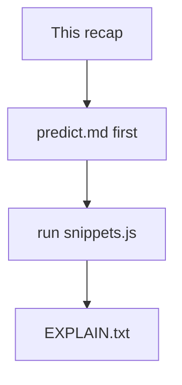
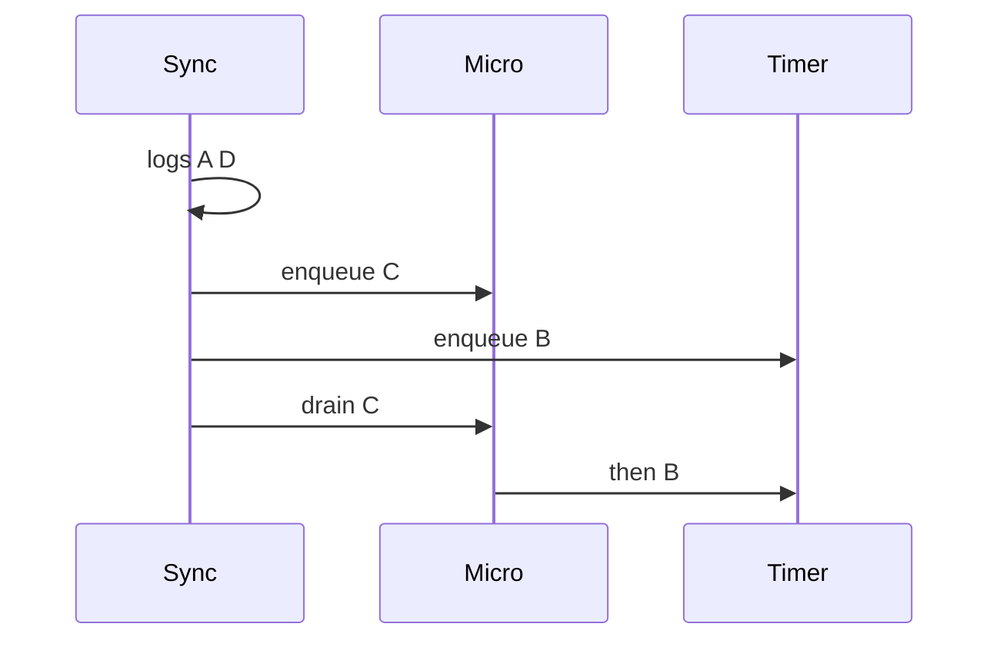

# Month 4 · Week 2 · Day 3
# From Memory: Event Loop Order

**Program:** Full-Stack Mastery · 18 months  
**Phase:** 1 — Foundations  
**Month index:** [../../README.md](../../README.md)  
**Week 2:** [1](day-01.md) · [2](day-02.md) · Day 3 (today) · [4](day-04.md) · [5](day-05.md) · [6](day-06.md) · [7](day-07.md)  
**Week rhythm today:** Implement from memory  
**Student state:** Days 1–2 taught the stack, tasks, and microtasks. Today those orders come out of your pencil before Node.  
**Study time:** 3–4 focused hours  
**Machine today:** Windows PowerShell, Node.js 20+  
**Days 1–2 closed during drills.** Repair from **this recap** or those day files after a 25-minute stall.

Labs: `~\fullstack-lab\month-04\week-02\day-03\`.

---

## How to use this textbook

1. Read this recap. Close Days 1–2.
2. Write every prediction **before** `node snippets.js`.
3. When a snippet mismatches, replay the two queues — do not guess a third.
4. Optional review links at the end are for later rechecking — not for first learning.

---

## How to read this chapter

Today is three snippets and three paragraphs. The recap **is** the teacher. If you open Day 2 to copy `A D C B` letters without being able to walk a new mix, you have not passed the drill.



Stuck 25 minutes: Week 2 Days 1–2 in this textbook only.

---

## Complete explanation (this book is the lesson)

**Call stack:** nested calls; LIFO; one main thread. A tight loop never empties the stack → no clicks, no timeouts, no paint.

**Web APIs** (the host) hold timers, network, DOM. When ready they **enqueue** work. `setTimeout` does not run your function; it asks the host to queue it later.

**Event loop:** stack empty → **drain microtasks** → run **one** task → maybe render → repeat.

| Queue | Examples |
|---|---|
| Microtask | `Promise.then` / `catch`, `queueMicrotask`, `await` continuation |
| Task (macrotask) | `setTimeout`, `setInterval`, most DOM events |

**Order you must know:** sync → microtasks → `setTimeout(0)`.

**Drain all:** a microtask may queue another microtask; those still run before the next timeout. Infinite `queueMicrotask` starves paint. Do not.

**`await`:** yields; the rest of the async function is a microtask (if the promise is already settled, still not “inline before the caller finishes”). `await null` is `await Promise.resolve(null)` — still a microtask. `async function` always returns a Promise. The caller who does not `await` it continues on the current stack.

**Errors:** reject jumps to `catch`. Unhandled rejection is a bug. `catch` can return and continue the chain. Timeout callbacks that throw do not stop later timeouts. Sync `throw` unwinds the current stack.

**AbortError vs HTTP** (names only today): abort you caused is not a toast; `!response.ok` is. Catch at `await fetch`. Do not rely on `unhandledrejection` as the product strategy.



> **Wrong belief:** “`await` is sleep, so the line after `await` runs before the caller’s next line.”  
> **Correct:** the caller keeps going unless it also awaited. The resume is a microtask.

> **Wrong belief:** “`Promise.then` and `setTimeout(0)` are the same kind of later.”  
> **Correct:** both are later than sync. `then` is **sooner** than the timeout after the stack clears.

> **Wrong belief:** “If I put `await` in the file, Node waits for everything before printing.”  
> **Correct:** top-level `await` is a different rule (ESM can pause the module). Today’s snippets are ordinary functions plus `console.log`. Do not hide the lesson behind top-level `await` unless you document it in `EXPLAIN.txt`.

---

## Worked snippet 1 (letters, not a paste of the spec)

```js
console.log("A");
setTimeout(() => console.log("B"), 0);
Promise.resolve().then(() => console.log("C"));
console.log("D");
```

Stack: `A`, schedule task `B`, schedule microtask `C`, `D`. Empty stack. Drain `C`. Then task `B`. Output `A D C B`. The spec’s Snippet 1 is the same shape with `S1`–`S4`. Predict that shape **from this paragraph**, not from memory of a tweet.

Walk it slower: `console.log("A")` is a stack frame that returns immediately. `setTimeout` calls a **host** function; your callback is not on the stack yet. `Promise.resolve().then` queues a microtask. `console.log("D")` still sync. Only then does the loop look at queues.

## Worked snippet 2 (`await` already settled)

```js
async function go() {
  console.log("1");
  await Promise.resolve();
  console.log("2");
}
console.log("0");
go();
console.log("3");
```

`0`, enter `go`, `1`, await queues resume, `go()` has returned a Promise, `3`, then microtask `2`. Output `0 1 3 2`. Snippet 2 uses `await null` and names `a b c d` — same physics.

If you predicted `0 1 2 3`, you treated `await` as a pause of the **whole program**. It pauses `go`. The caller prints `3` on the same stack.

## Worked snippet 3 (async errors and who catches)

If you `await Promise.reject(...)` **inside** `try/catch` **inside** an async function, the **catch inside that function** runs when the resume happens (a microtask). The async function’s returned Promise then **fulfills** (if catch handles it) or **rejects** (if catch rethrows or is missing).

If the **caller** writes `x()` **without** `await` or `.catch`:

- The inner `try/catch` still runs (it is inside `x`).
- The caller does **not** automatically see the error unless `x`’s Promise rejects **and** nobody handled it.

You will **observe** this in Snippet 3. Write what Node prints, not what you wished. If the inner catch runs and returns, the caller may need nothing. If you forget `try/catch` inside and forget `.catch` on `x()`, you should see an unhandled rejection.

**Wrong belief:** “Calling an async function is like `try/catch` at the call site for free.”  
**Correct:** you must `await` in a `try` or attach `.catch` to the returned Promise.

Write Snippet 3 so the inner function is clearly `async`, the `await Promise.reject` is inside `try`, and the top-level call is `x()` with no `await`. Log inside `catch` (`console.log("inner-catch")`) and log after `x()` (`console.log("after-call")`). Predict whether `inner-catch` can appear **after** `after-call` — it can, because the reject resume is a microtask. That observation belongs in the third paragraph of `EXPLAIN.txt`.

If you omit `try/catch` as a second experiment, record the unhandled rejection separately. Do not leave that experiment as the committed `snippets.js` without a comment; the spec’s Snippet 3 includes the `try/catch`.

`queueMicrotask` is legal extra practice in a fourth file, not a replacement for the three required snippets. If you add it, predict FIFO with `then` using section “two queues” from this recap.

---

## Office hours — predictions edited after the run, scrambled consoles, and “Node is random”

**Edited `predict.md`.** You ran first, then wrote the prediction to match. That file is a souvenir, not evidence. The gate later will ask you to predict a **new** mix. Timestamp or a git commit of `predict.md` before the first `node` run is honest. If you already spoiled it, write a **fourth** mix in `spot-check.md`, predict, then run.

**One file, three snippets, interleaved timers.** Snippet 1’s `S2` lands after Snippet 2’s letters. You “failed” Snippet 2 because the console was one stream. Fix: three files, or `await new Promise((r) => setTimeout(r, 20))` between snippets in an async IIFE. Predictions stay **per snippet**.

**“Node printed a different order than Chrome.”** For these three mixes, they should agree on sync / micro / `setTimeout(0)`. If they disagree, you used `fetch` or DOM events — those are host differences. Today is Node `console.log` + timers + promises.

**Unhandled rejection as the committed snippet.** Node 20+ may print a warning and a non-zero exit depending on flags. The spec wants `try/catch` **inside** the async function. Keep the warning experiment in `NOTES.txt`, not as the only `snippets.js`.

---

## Today's contract

**Today's gate**

> I predicted three mixed snippets before running them, and I can explain whether an async `try/catch` runs when the caller did not `await`.

---

## Time box

| Block | Minutes | Work |
|---|---|---|
| A | 30 | Speak recap; draw two queues |
| B | 70 | predict.md + snippets.js + EXPLAIN.txt |
| C | 40 | Repair mismatches from this recap |
| D | 20 | Git |

---

# Spec

Write `~\fullstack-lab\month-04\week-02\day-03\predict.md` **before** running, then `snippets.js`:

**Snippet 1**

```js
console.log("S1");
setTimeout(() => console.log("S2"), 0);
Promise.resolve().then(() => console.log("S3"));
console.log("S4");
```

**Snippet 2**

```js
async function x() {
  console.log("a");
  await null;
  console.log("b");
}
console.log("c");
x();
console.log("d");
```

(`await null` is `await Promise.resolve(null)` — still a microtask.)

**Snippet 3** — `try/catch` around `await Promise.reject(new Error("e"))` inside an async function called without `await` from the top level. Does the catch run? Does the caller need `.catch`? Write what you observe.

`EXPLAIN.txt`: three paragraphs, one per snippet.

Separate the three snippets with labels so the console is readable (`--- snippet 1 ---`). If timeouts from snippet 1 land among later logs, run snippets as **three files** or wait: `await new Promise((r) => setTimeout(r, 20))` between them in an async IIFE. Document which. Predictions must still be per snippet, not one scrambled stream.

Windows:

```powershell
cd ~\fullstack-lab\month-04\week-02\day-03
node snippets.js
```

```powershell
cd ~\fullstack-lab
git add month-04/week-02/day-03
git commit -m "Day 3: event-loop order from memory."
```

---

## Worked walkthrough — write `predict.md` like a lab notebook

Three headings: Snippet 1, 2, 3. Under each: the **letters you expect**, in order, then one sentence of *why* (sync / micro / task). Do not write “same as Day 2.”

Snippet 1 why: `S1` and `S4` are stack. `S3` is `then` (micro). `S2` is timeout (task). Expected: `S1 S4 S3 S2`.

Snippet 2 why: `c` sync, enter `x`, `a` sync, `await null` queues resume, `x()` returns a Promise, `d` sync, then `b`. Expected: `c a d b`. If you wrote `c a b d`, you thought `await` paused the caller.

Snippet 3 why: `after-call` is still on the stack that invoked `x()`. `inner-catch` runs when the rejected await resumes — a microtask. Expected: `after-call` then `inner-catch` (unless you `await x()`, which you must not in the spec). If Node also prints an unhandled rejection, you let `x`’s Promise reject after catch — or you forgot `try` — write what you **saw**.

### Three-file layout if the console scrambled

`snippet-1.js`, `snippet-2.js`, `snippet-3.js`. `node snippet-1.js` then 2 then 3. Predictions still live in one `predict.md`. Windows:

```powershell
cd ~\fullstack-lab\month-04\week-02\day-03
node snippet-1.js
node snippet-2.js
node snippet-3.js
```

`EXPLAIN.txt` stays three paragraphs even if you used three files. Paragraph 3 must answer: does the inner `catch` run without the caller `await`? (Yes, if the `try` is inside the async function.) Does the caller need `.catch`? (Not if the inner catch handles and does not rethrow — the returned Promise fulfills.)

### Recall

1. Drain **all** microtasks before the next timeout.  
2. `await null` still yields.  
3. Calling `async` is not `try/catch` for free.  
4. Do not edit `predict.md` after the first run without a new mix.

---

## Definition of done

- [ ] Days 1–2 closed until a 25-minute stall
- [ ] `predict.md` existed **before** the first run
- [ ] Snippet 1 order matches sync / micro / task
- [ ] Snippet 2 shows `await` yielding past the caller
- [ ] Snippet 3 observations are written (catch? unhandled?)
- [ ] `EXPLAIN.txt` has three paragraphs
- [ ] Commit exists

---

## Stalls and repair — scrambled consoles, edited predictions, unhandled leftovers

If Snippet 1’s `S2` appears in the middle of Snippet 2, you ran one file. Split into three files or wait 20 ms between snippets in an async IIFE. Predictions stay **per snippet**.

If `predict.md` matches Node perfectly and you have no git commit before the first run, be honest: write a fourth mix in `spot-check.md`, predict, then run. Editing after the fact is a souvenir.

If Snippet 2 printed `c a b d`, you treated `await` as pausing the caller. `d` is still on the stack that called `x()`. Resume `b` is a microtask. Re-read worked snippet 2. Do not open Day 2 to copy letters.

If Snippet 3 prints an unhandled rejection **and** `inner-catch`, the async function’s Promise still rejected (rethrow or missing return). If you see only the warning, the inner `try` is missing. Write what Node 20+ actually printed. The committed `snippets.js` includes the inner `try/catch`. Keep the warning experiment in `NOTES.txt`.

If `EXPLAIN.txt` is three slogans (“sync then micro then task”), expand paragraph 3 until it answers: does inner catch run without caller `await`? Does the caller need `.catch` if catch handles?

Windows:

```powershell
cd ~\fullstack-lab\month-04\week-02\day-03
node snippets.js
```

Stuck 25 minutes: Week 2 Days 1–2 in this textbook only. Then close them.

---

## Last forty minutes

Re-read your `predict.md` without looking at the console. Speak Snippet 1 as stack / micro / task. If you cannot, the file is a copy of Node’s output — write a new mix.

Run the three snippets (or three files) once more. `EXPLAIN.txt` paragraph 3 must still answer inner `catch` vs caller `await`. If Node 20+ printed a warning, put it in `NOTES.txt`, not as the committed snippet’s only behavior.

Do not open Day 2. Do not guess a third queue. Drain **all** microtasks before the next timeout. `await null` still yields. Calling `async` is not `try/catch` for free.

Commit from `~\fullstack-lab` with the day-03 path. If `predict.md` was created after the first run, say so in `EXPLAIN.txt` and add `spot-check.md`. Honesty is part of from-memory day.

Windows recap: `cd ~\fullstack-lab\month-04\week-02\day-03` then `node snippets.js` (or `node snippet-1.js` and friends). No browser. No `file://`. No `curl.exe` required today — this is Node order, not HTTP.

If a mismatch remains, walk the mermaid sequence in this chapter on paper: Sync logs, enqueue C, enqueue B, drain C, then B. That picture is the whole machine for Snippet 1. Snippet 2 adds “caller continues.” Snippet 3 adds “resume can be a catch.”

---

## Worked checkpoint — `await null` still yields

Write one extra mix in `spot-check.md` only if `predict.md` was honest. Do not replace predictions after the fact.

`async function f() { console.log("1"); await null; console.log("2"); }` then `f(); console.log("3");`. Predict **before** `node`. `1` then `3` then `2`. `await null` still leaves the caller. `null` is not a Promise you wait on in the English sense — the engine still wraps a microtask resume.

Inner `try/catch` in an async function catches a throw on the resume. The caller who did **not** `await` still has a Promise. If the catch rethrows, that Promise rejects. Node 20+ may print an unhandled-rejection warning. Put the warning text in `NOTES.txt`. The committed snippet keeps the inner catch.

> **Wrong belief:** “`await null` is a no-op because null is not a Promise.”  
> **Correct:** `await` always yields. The value being awaited can be thenable or not. The next line of the async function is a microtask, not the next line of the caller.

There is no third queue today. Drain **all** microtasks before the next `setTimeout(0)`. Windows: `cd ~\fullstack-lab\month-04\week-02\day-03`. `node snippets.js`. No browser. No `curl.exe`.

---

## Optional review links

The event loop and microtasks are explained in this chapter.

- [MDN: Concurrency model](https://developer.mozilla.org/en-US/docs/Web/JavaScript/Event_loop)
- [MDN: `queueMicrotask`](https://developer.mozilla.org/en-US/docs/Web/API/Window/queueMicrotask)

---

## Tomorrow

Browser runtime: HTML parse, layout, paint, `requestAnimationFrame` as a name, DOM writes on the same thread as JS, `fetch` resume as a microtask, AbortController still required because the loop does not know which search is current. Lab over **HTTP**.
