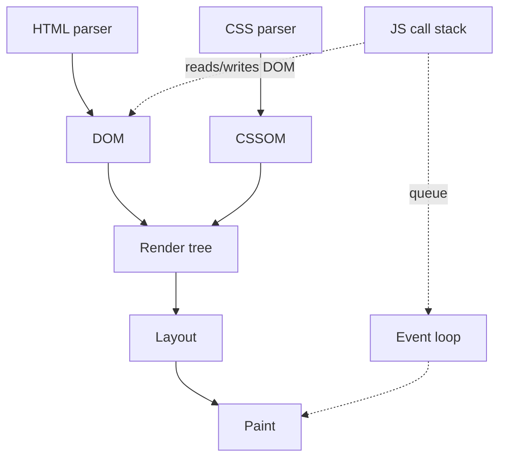

# Month 4 · Week 2 · Day 4
# Browser Runtime: Web APIs, Rendering, and Your Code

**Program:** Full-Stack Mastery · 18 months  
**Phase:** 1 — Foundations  
**Month index:** [../../README.md](../../README.md)  
**Week 2:** [1](day-01.md) · [2](day-02.md) · [3](day-03.md) · Day 4 (today) · [5](day-05.md) · [6](day-06.md) · [7](day-07.md)  
**Week rhythm today:** Lab feature  
**Student state:** You can predict sync / microtask / timeout in Node. Today the **browser** around that loop gets names: parse, layout, paint, Web APIs.  
**Study time:** 3–4 focused hours  

The engine runs JS. The **browser** also parses HTML, computes CSS, paints pixels, talks TCP. Today those pieces get names so “the page janked” is not a feeling.

Labs: `~\fullstack-lab\month-04\week-02\day-04\`. Serve over **HTTP**, not `file://`.

---

## How to use this textbook

1. Read a section. Close it. Say who owns the DOM vs who owns the stack.
2. Type the lab. Time it with `performance.now()`. Write numbers. Do not invent a benchmark contest.
3. During a slow loop, try to click. That click is a **task** waiting on an empty stack.
4. Optional review links at the end are for later rechecking — not for first learning.

---

## How to read this chapter

Days 1–3 treated the host as a box labeled “Web APIs.” Today we open the box far enough to be honest:

- `document.querySelector` is not “JavaScript.” It is a **Web API** that reads a tree the **HTML parser** built.
- `fetch` is a Web API. Your `await` continuation is still a **microtask** on the JS stack.
- **Layout** and **paint** can happen between **tasks**. They do not happen in the middle of a tight `for` loop of `append`.

If you only remember “the DOM is slow,” you will still append 500 times in a loop and blame CSS. Read until you can explain why `replaceChildren` once is kinder than 500 live inserts, and why a click waits during those inserts.



---

## Today's contract

By the end of this day you will be able to:

1. Name **parser → DOM / CSSOM → render tree → layout → paint** in one paragraph.
2. Explain that **DOM writes are JS on the main thread**.
3. Explain **layout thrashing** as a name (read layout after write).
4. Tie `await fetch` to “stack empty / microtask resume.”
5. Remember **AbortController** / generation: the loop does not know which search is current.

**Today's gate**

> `document.querySelector` is a Web API. `fetch` is a Web API. Your callback runs on the JS stack. Layout/paint can happen between **tasks**. Mutating the DOM in a tight loop still happens on the same thread as JS.

---

## Time box

| Block | Minutes | Work |
|---|---|---|
| A | 50 | Theory: pipeline, rAF, fetch, workers (concept) |
| B | 70 | HTTP lab: 500 appends vs fragment; click during slow path |
| C | 40 | `PERF.txt` + `FETCH.txt` |
| D | 20 | Git |
| E | 15 | Recall |

---

# Theory (complete)

## 1. Who owns what

The **HTML parser** turns bytes into a **DOM** tree. The **CSS parser** builds a **CSSOM**. Together they feed a **render tree** (roughly: boxes that will paint). **Layout** assigns geometry (x, y, width, height). **Paint** fills pixels. **Composite** (later, optional word) stitches layers. You do not implement this. You **respect** it.

JavaScript sits on the **call stack** and may **read or write** the DOM through Web APIs. Each write can dirty layout. The browser would like to layout and paint **between tasks**, when the stack is empty and microtasks have drained. If your task is a 500-iteration loop of `ul.append(li)`, the stack is **not** empty. Layout/paint wait. Clicks wait. The tab feels dead.

You do not implement this. You **respect** it:

- Changing `textContent` 10,000 times in a loop forces a lot of work. Build a string or a fragment, then attach once (`replaceChildren`).
- Reading layout (`el.offsetHeight`) after writes can force **layout thrashing** (the browser recalculates immediately). Batch reads, then writes. You will not optimize this month unless you measure a freeze; you **will** know the name.

```js
// thrash-shaped (do not celebrate)
for (const el of els) {
  el.style.width = "100px"; // write
  total += el.offsetWidth;  // read — may force layout now
}
```

Kinder shape: write in one loop, read in another, or do not read layout at all if you already know the number.

> **Wrong belief:** “The browser paints after every `append` so the user sees progress.”  
> **Correct:** your loop is one task. Paint typically waits until that task (and its microtasks) finish. The user sees a freeze, then a finished list.

> **Wrong belief:** “`querySelector` is JavaScript syntax like `const`.”  
> **Correct:** it is a function the **host** provides. In Node without a library, there is no `document`. That is why Day 4 last week tested helpers without a window.

**`textContent` vs `innerHTML`:** Month 3 still applies. Titles, queries, and anything untrusted are **text**. Today’s `li` labels must use `textContent`. Building 500 nodes does not earn you `innerHTML` of a joined string of user text.

---

## 2. `requestAnimationFrame`

```js
requestAnimationFrame((time) => {
  // runs before the next paint, as a rAF callback (its own slot in the loop)
});
```

Use it for visual motion later. Prefer CSS transitions (Month 2). Do not use rAF as a generic delay.

The HTML event loop has a **rendering** opportunity. `requestAnimationFrame` callbacks run before that paint. They are **not** `setTimeout(0)`. They are **not** microtasks. You do not need the spec’s full slot list to pass Month 4. You need: **rAF is for frames; timeouts are for time; promises are for completion.**

> **Wrong belief:** “I’ll animate with `setInterval(16)` because 60 fps is 16 ms.”  
> **Correct:** the clock and the vsync will drift. rAF exists. CSS exists. Not this month’s animation project.

---

## 3. `fetch` and the loop (tying Month 3)

`fetch` returns a Promise. The **network** is a Web API. When bytes are ready, the runtime fulfills the promise → your `await` continuation is a **microtask**. Meanwhile the user can click (those clicks are **tasks**) if you yielded.

That is why `async` functions do not freeze the tab the way a `while` on the stack does.

Walk a search box the student already built in Month 3:

1. User types. `input` or `submit` fires — a **task**.
2. Your handler calls `fetch` and `await`s. The handler’s stack **unwinds** at the await. Stack empty. Microtasks drain. Maybe paint. The user can click again.
3. Network finishes in the host. The Promise fulfills. Your resume is a **microtask** (then you might `await response.json()` — another yield).
4. You write the DOM (`textContent`, `replaceChildren`). That is still the stack, still one thread. A huge render can jank. A huge `JSON.parse` can jank. Same thread.

**AbortController** (Month 3) still matters: two fetch completions are two fulfillments. The loop will run both continuations unless you abort or ignore a stale generation. The loop does not know which search is “current.” **You** do (a `let requestId` or abort).

```js
let gen = 0;
async function search(q) {
  const my = ++gen;
  const data = await fakeNetwork(q);
  if (my !== gen) return; // stale
  render(data);
}
```

Generation is a number you own. AbortController **cancels** the HTTP so the network and the server may stop work. Both patterns are valid. Day 6 will make you implement generation with tests. Today, write the paragraph in `FETCH.txt`.

If you abort, the rejected promise is often an **AbortError**. That is not an HTTP 404. Day 5 maps those to UI. Do not toast “failed” for an abort you intended.

> **Wrong belief:** “The event loop will drop the old fetch because a new one started.”  
> **Correct:** the loop runs every continuation you still attached. You abort or you ignore stale `gen`.

---

## 4. `worker` (concept only)

A **Web Worker** is another JS thread with **no DOM**. You post messages. This month you do not write one. Know it exists for CPU-heavy work later so you do not freeze the UI.

Workers do not magically speed up `querySelector`. They cannot touch the page. They are for **CPU** you can describe as data in / data out (parse a huge file, crunch numbers). JSON.parse of a modest list is not a reason to open a worker today.

---

## 5. Measuring without lying to yourself

`performance.now()` returns a high-resolution timestamp in ms (browser). Subtract two readings around a loop. Write the numbers. They will differ on a slow laptop vs a fast one. The lesson is **relative**: 500 live `append`s vs one `replaceChildren` of 500 prepared nodes, on **your** machine, plus whether a third button’s click felt queued.

This is not a publishable benchmark. Do not average 10,000 runs. Do not claim “N times faster” in a résumé. Claim: “I felt the click wait during the slow path because the stack was busy.”

Windows serve:

```powershell
cd ~\fullstack-lab\month-04\week-02\day-04
npx --yes serve -p 5500
```

Open `http://127.0.0.1:5500/runtime.html`.

---

## 6. What still is JavaScript

All of this is still the Week 1 language: closures in handlers, `this` if you attach `obj.method`, modules with `.js` and `type="module"`. A runtime lab that uses `innerHTML` of a title fails Month 3. A runtime lab that mutates a shared list in place fails Week 1. The pipeline does not excuse those.

If you attach `stats.bump` as a click listener, Day 2’s `this` rule still fires: the browser may call the function with `this === button`. Use an arrow wrapper. The event loop did not change `this`. It only decided **when** the listener ran (a task).

---

## 7. Easy walkthrough of today’s slow button

When you click “append 500”:

1. The click is a **task**. The stack gets your handler.
2. The handler loops 500 times: `createElement`, `textContent`, `append`. Each `append` is a Web API that mutates the live DOM **now**, still on this stack.
3. The browser would like to layout and paint. It generally **cannot** finish a paint in the middle of this task. The third button’s click, if you try it, sits in the **task queue**.
4. The handler returns. Stack empty. Microtasks (none, unless you queued some). Then paint may happen. Then the queued click task runs and logs `"alive"`.

When you click “replaceChildren once”:

1. Still one task.
2. You build 500 elements **off** the live tree (an array or a fragment). The visible `ul` is not rewritten 500 times.
3. One `replaceChildren` (or one `append(fragment)`) attaches the batch.
4. Layout/paint still wait until this task ends — but the work inside the task is usually less chaotic for the renderer. Your `performance.now()` numbers are the evidence, not a blog’s numbers.

`FETCH.txt` should not say “fetch is async” and stop. It should say: `fetch` hands I/O to the host; JS stack empties; clicks can run; when bytes arrive the Promise fulfills; your `await` resume is a **microtask**; then you may write the DOM on that stack. If a second search started, you abort or you check `gen` **before** writing.

---

## 8. Modules in this HTML lab

`runtime.js` should be an ES module. Imports of helpers, if any, need `./file.js`. Opening `file://` will fail the module load the same way Month 3 failed. `npx serve` (or VS Code Live Server) on `127.0.0.1` is the habit.

You do not need `package.json` for a two-file browser lab. You **do** need it if you also run a Node test of a pure helper extracted from the page. Extracting `buildItems(n)` that returns an array of `{ id, label }` is optional; timing still happens in the browser because `document` is a Web API.

**Security:** the 500 labels are lab-generated (`Item 1` …). If you ever take a label from an input, `textContent` remains the rule. Speed is not a reason to `innerHTML`.

**Wrong belief:** “`replaceChildren` runs on a worker.”  
**Correct:** it runs on the main thread. It is still usually cheaper than 500 live inserts. Measure; do not mythologize.

---

## 9. DocumentFragment (optional tool, same thread)

A **DocumentFragment** is a Web API bag for nodes. You `append` children to the fragment (not yet on the page), then `ul.append(fragment)` once. The fragment itself does not stay in the tree; its children move. It is the same idea as `replaceChildren(...nodes)`: **one** live attach.

```js
const fragment = document.createDocumentFragment();
for (let i = 0; i < 500; i++) {
  const li = document.createElement("li");
  li.textContent = "Item " + String(i + 1);
  fragment.append(li);
}
ul.replaceChildren(); // clear
ul.append(fragment);
```

You may use this if spread-into-`replaceChildren` feels awkward. You may ignore it if the array spread works. Either way, write which you chose in `PERF.txt`.

**`performance.now()` units:** milliseconds, floating point. Subtract. Do not `Date.now()` if you have `performance` — it is coarser. In Node there is `performance.now()` too, but today’s DOM lab is the browser.

**Alive button:** use `type="button"` and `addEventListener("click", () => console.log("alive"))`. If the log appears **after** the slow loop’s `console.log("done")`, the click waited. That is the event loop, not a broken mouse.

**Wrong belief:** “If the button highlights on press during the loop, JS must be running my listener.”  
**Correct:** the **browser chrome** may still show a press. Your **listener** is a task. Look at the **console**, not the CSS `:active` flash.

---

# Lab

`runtime.html` + `runtime.js` (HTTP):

1. Button that appends 500 `li`s in a loop (`createElement` + `textContent`) vs button that builds an array of elements and `ul.replaceChildren(...nodes)`.
2. Time each with `performance.now()` and write numbers in `PERF.txt` (not a benchmark contest — notice they are both JS on the main thread).
3. During the slow append, try to click a third button that logs `"alive"`. Record whether the click waits.
4. `FETCH.txt`: one paragraph tying `await fetch` to “stack empty / microtask resume.”

Markup notes: `button type="button"`. A real `ul`. Labels on buttons. No `file://`. Module script:

```html
<script type="module" src="./runtime.js"></script>
```

If `replaceChildren(...nodes)` throws because of a spread limit on huge arrays, 500 is small enough; if you hit a limit, attach from a `DocumentFragment` in a loop then one `append(fragment)`. Document the choice. The point is still: **do not live-append 500 times if you can attach once**.

The third button must exist **before** you click the slow path. If you only create it after the loop, you cannot test clicks during the loop.

```powershell
cd ~\fullstack-lab
git add month-04/week-02/day-04
git commit -m "Browser runtime lab: DOM writes and fetch vs stack."
```

---

## Definition of done

- [ ] Page served over HTTP
- [ ] 500 `li`s via `textContent`, not `innerHTML`
- [ ] `PERF.txt` has two timings
- [ ] Click-during-slow-path observation written
- [ ] `FETCH.txt` ties fetch to yield + microtask resume
- [ ] Abort / generation mentioned in `FETCH.txt` (the loop will not drop stale work)
- [ ] Commit exists

---

## Optional review links

Rendering and Web APIs are explained above.

- [MDN: `requestAnimationFrame`](https://developer.mozilla.org/en-US/docs/Web/API/Window/requestAnimationFrame)
- [MDN: Web Workers](https://developer.mozilla.org/en-US/docs/Web/API/Web_Workers_API) (concept only)
- [MDN: `performance.now()`](https://developer.mozilla.org/en-US/docs/Web/API/Performance/now)

---

## Tomorrow

Tests and notes: you cannot unit-test the event loop honestly with real timers in `node --test` today. You **can** unit-test **AbortError vs HTTP** mapping, keep the prediction battery as evidence, and write `RUNTIME.md` so Week 4-you still has the picture.
