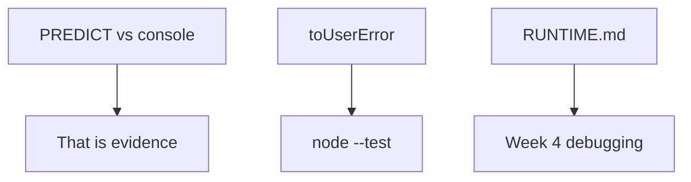

# Month 4 · Week 2 · Day 5
# Tests and Notes — Runtime

**Program:** Full-Stack Mastery · 18 months  
**Phase:** 1 — Foundations  
**Month index:** [../../README.md](../../README.md)  
**Week 2:** [1](day-01.md) · [2](day-02.md) · [3](day-03.md) · [4](day-04.md) · Day 5 (today) · [6](day-06.md) · [7](day-07.md)  
**Week rhythm today:** Tests + refactor + documentation  
**Student state:** You predicted queues and timed DOM writes. Today you keep **evidence** and you unit-test the error mapping the UI will need: **AbortError vs HTTP**.  
**Study time:** 3–4 focused hours  
**Machine today:** Windows PowerShell, Node.js 20+

Labs: `~\fullstack-lab\month-04\week-02\` (Day 5 notes plus tests next to Day 2/3 work, or a `day-05` folder — document the path in `RUNTIME.md`).

---

## How to use this textbook

1. Read a section. Close it. Say why the event loop is observed, not faked, today.
2. Type `toUserError` and its tests. Do not paste.
3. Deliberate break: treat abort as a visible error; watch red; restore.
4. Optional review links at the end are for later rechecking — not for first learning.

Windows: `node --test`. `"type": "module"`.

---

## How to read this chapter

The event loop is **observed**, not usually unit-tested in `node --test` without fake timers. A test that `await`s real `setTimeout` is slow and flaky. Week 3 may introduce fake timers if you choose Vitest. Today you do **not** pretend `node --test` owns `A D C B`.

Today you:

1. Keep a **written battery** of predictions (Day 3) that match Node output — that *is* a test.
2. Unit-test **error mapping**: `function toUserError(err) { if (err.name === "AbortError") return null; return String(err.message); }` — so UI can ignore abort. Tests for AbortError vs `Error("HTTP 404")`.
3. Document in `RUNTIME.md`: stack, task, microtask, why while+fetch deadlocks.



Days 1–4 stay available to **repair facts**. Do not rewrite Day 4’s HTML unless a note names a bug. This is a tests-and-docs day.

---

## Today's contract

By the end of this day you will be able to:

1. Explain what is and is not a unit test for the event loop **this month**.
2. Implement `toUserError` so **AbortError** becomes `null` (no user toast) and HTTP errors stay visible.
3. Prove it with `node --test`, including a deliberate wrong implementation that goes red.
4. Write `RUNTIME.md` a teammate could learn queues from.

**Today's gate.** Closed-book:

> Abort I caused is not a user-facing failure. HTTP `!ok` is. Unhandled rejection is a bug. The event loop is documented with predictions, not with a fake timer I do not have yet.

---

## Time box

| Block | Minutes | Work |
|---|---|---|
| A | 35 | Theory: evidence vs unit tests; AbortError vs HTTP |
| B | 55 | `toUserError` tests; deliberate break; restore |
| C | 50 | `RUNTIME.md` + copy/confirm Day 3 battery |
| D | 20 | Git |
| E | 15 | Recall |

---

# Complete explanation — tests and errors you must still own

## 1. What we are testing

**Arrange** an error object. **Act** by calling `toUserError`. **Assert** `null` vs a string.

That mapper is how a search box stays quiet when you aborted the previous `fetch`, and how a 404 still shows “HTTP 404”. Mixing those is how UIs flash “failed” on every keystroke abort.

The **queue order** is tested by Day 3’s `predict.md` matching Node. Copy or link those files in today’s notes. If predictions were edited after the run to match, they are not evidence — re-predict one new mix in `day-05/spot-check.md` and run it.

> **Wrong belief:** “If I cannot unit-test the event loop, I cannot test anything async-related.”  
> **Correct:** you test **pure decisions** (is this abort?) and you **keep transcripts** of order labs.

> **Wrong belief:** “I’ll `await setTimeout` in `node --test` for A D C B.”  
> **Correct:** possible, slow, and still not how the browser paints. Prefer written predictions this week.

> **Wrong belief:** “Network failures and aborts can share one `alert`.”  
> **Correct:** abort is a **name** you caused. HTTP is a **message you created** after `!ok`. Users should not see “failed” on every cancelled keystroke.

---

## 2. AbortError vs HTTP vs network

Month 3: `fetch`, `response.ok`, `AbortController`. Today those failures must not share one `alert`.

| Situation | Typical error | User sees |
|---|---|---|
| You aborted because a newer search started | `err.name === "AbortError"` | Nothing (or keep showing the last good list) |
| HTTP 404 / 500 | You `throw new Error("HTTP 404")` after `!ok` | Error UI with that message |
| Network failed (browser often `TypeError`) | `fetch` rejected | Error UI |
| Promise rejected, nobody caught | `unhandledrejection` | DevTools / Node warning — **your bug** |

```js
export function toUserError(err) {
  if (err && err.name === "AbortError") return null;
  if (err && typeof err.message === "string") return err.message;
  return "Something went wrong";
}
```

You may write that shape. Tests must pin:

- `AbortError` → `null`
- `new Error("HTTP 404")` → `"HTTP 404"` (or your exact string)
- A generic `Error("nope")` → visible message
- Optional: missing `message` still returns a fallback string, never throws

Constructing AbortError in Node:

```js
const abort = new Error("aborted");
abort.name = "AbortError";
```

Or `new DOMException("aborted", "AbortError")` in browsers. In Node tests, setting `.name` is enough if `toUserError` checks `err.name`. Document which.

**Do not** treat every `TypeError` as abort. Abort is a **name**. HTTP is a **message you created** when `!ok`.

The Month 4 gate may include overlapping work and parse failures. This book still will not list fixture root causes. You now have a mapper for **abort vs visible error** when you reach fetch-shaped bugs.

Deliberate: make `toUserError` treat abort as a visible error; watch test fail; restore.

Worked break: change the first `if` to `return err.message` for every error. The AbortError test goes red. Read the assertion. Restore the `name` check. Green. `BREAK.txt` quotes that.

---

## 3. `unhandledrejection` is not a unit test target today

You already ran `Promise.reject` without `catch` on Day 2. Today, one paragraph in `RUNTIME.md`: what Node printed, why `.catch` or `try/catch` at `await` is the fix, why an empty `catch (e) {}` is forbidden.

You may add `process.on("unhandledRejection", ...)` in a **lab** to log. Do not use it as the only strategy. Do not write a unit test that depends on process-level events unless you are sure you can isolate it — skip that; the mapper tests are the grade.

---

## 4. `RUNTIME.md` (the chapter in your words)

Minimum headings:

1. **Call stack** — LIFO; one thread; freeze.
2. **Task queue** — `setTimeout`, clicks; `0` is not now.
3. **Microtask queue** — `then`, `queueMicrotask`, `await` resume; drain **all** before the next task.
4. **Classic order** — A D C B; 0 1 3 2.
5. **while + fetch** — deadlock of the thread.
6. **DOM writes** — same thread; paint between tasks.
7. **AbortError vs HTTP** — pointer to `toUserError`.

Prose. You may include one mermaid or ASCII. Do not paste this textbook. 400–800 words is honest. If it is 80 words of bullets, rewrite.

Also record:

```text
Day 3 battery: path/to/predict.md — matched node snippets.js (yes/no)
Day 4 PERF: slow append X ms, replaceChildren Y ms (your numbers)
```

**while + fetch, in sentences:** `fetch` asks the host to do network. The fulfillment becomes a microtask **after** the stack is empty. `while (!done) {}` never empties the stack. The `then` that would set `done = true` never runs. The tab freezes. `await fetch` yields; other tasks can run; later the resume continues. That paragraph must exist in `RUNTIME.md` in **your** words.

---

## 5. Arrange / act / assert sample

```js
import assert from "node:assert/strict";
import { test } from "node:test";
import { toUserError } from "./toUserError.js";

test("AbortError is silent", () => {
  const err = new Error("aborted");
  err.name = "AbortError";
  assert.equal(toUserError(err), null);
});

test("HTTP error is visible", () => {
  assert.equal(toUserError(new Error("HTTP 404")), "HTTP 404");
});
```

If the first test fails after you “simplify” to `return String(err.message)`, you just toasted every aborted search. That is the point of the red bar.

Add a third test: `toUserError(new Error("nope"))` is `"nope"`, not `null`. If you treat every `Error` as abort, HTTP vanishes. If you treat only `message === "aborted"` as abort, a real AbortError with a different message might leak — check **`name`**.

---

## Office hours — abort as TypeError, flaky timers, and docs that are a bullet dump

**`TypeError` as abort.** `fetch` failed (CORS, offline). You mapped every `TypeError` to `null`. The user sees a spinner forever. Abort is `err.name === "AbortError"`. Network TypeError is visible.

**`await setTimeout` in the suite.** The test passed on your machine and failed on a slow one, or took 200 ms for a claim that is really “pure mapping.” Keep queue order in `predict.md`. Keep `toUserError` synchronous.

**`RUNTIME.md` is 80 words.** “Stack, queue, micro, abort.” That is a table of contents, not a chapter. Write why `while` deadlocks. Write A D C B once in full sentences.

**Missing Day 3 path.** You wrote “predictions matched” with no file path. Week 4-you will not find them. Put the relative path from `week-02/`.

---

# Lab

The event loop is **observed**, not usually unit-tested in `node --test` without fake timers. Today you:

1. Keep a **written battery** of predictions (Day 3) that match Node output — that *is* a test.
2. Unit-test **error mapping**: `function toUserError(err) { if (err.name === "AbortError") return null; return String(err.message); }` — so UI can ignore abort. Tests for AbortError vs `Error("HTTP 404")`.
3. Document in `RUNTIME.md`: stack, task, microtask, why while+fetch deadlocks.

Deliberate: make `toUserError` treat abort as a visible error; watch test fail; restore.

`BREAK.txt`: what you changed, what assertion failed, restore.

Folder suggestion: `~\fullstack-lab\month-04\week-02\day-05\` with `toUserError.js`, `toUserError.test.js`, and `RUNTIME.md` at `week-02/RUNTIME.md` (or inside day-05 — one sentence in TESTS log saying where).

```powershell
cd ~\fullstack-lab\month-04\week-02\day-05
node --test
```

```powershell
cd ~\fullstack-lab
git add month-04/week-02
git commit -m "Document event-loop evidence and abort error mapping tests."
```

---

## Worked walkthrough — `toUserError` table you test, not memorize

| Input | `toUserError` |
|---|---|
| `{ name: "AbortError", message: "aborted" }` | `null` |
| `new Error("HTTP 404")` | `"HTTP 404"` |
| `new Error("nope")` | `"nope"` |
| `{ name: "TypeError", message: "Failed to fetch" }` | visible message, **not** `null` |
| `null` / missing message | fallback string, **no throw** |

The TypeError row is how you refuse “all network problems are aborts.” Abort is a **name**. HTTP is a message **you** threw after `!ok`.

**Spot-check if Day 3 was spoiled.** `day-05/spot-check.md`: one new mix (`queueMicrotask` + `setTimeout(0)` + two sync logs). Predict. `node spot-check.js`. Match or explain. That file is evidence. Editing Day 3’s `predict.md` after the fact is not.

**`RUNTIME.md` while+fetch paragraph (shape, your words):** Fetch asks the host. The `then` waits for an empty stack. `while (!done)` never empties it. `await fetch` yields; clicks can run; later the resume sets state. If this paragraph is two slogans, rewrite it until a Month 3 teammate could avoid the deadlock.

### Windows

```powershell
cd ~\fullstack-lab\month-04\week-02\day-05
node --test
```

If tests are next to Day 3 instead, `cd` there and say so in `TESTS.md`. Node.js 20+. `"type": "module"`.

### Recall

1. Why queue order is a transcript this week, not a fake timer.  
2. Why AbortError is silent when **you** aborted.  
3. Why empty `catch` is forbidden even if it “stops the warning.”

---

## Definition of done

- [ ] Day 3 predictions confirmed as evidence (or a new spot-check run)
- [ ] `toUserError` tests: AbortError → `null`; HTTP message visible
- [ ] Deliberate break went red; `BREAK.txt` exists
- [ ] `RUNTIME.md` covers stack, task, microtask, while+fetch
- [ ] `node --test` green at commit
- [ ] Commit exists

---

## Stalls and repair — TypeError as abort, missing RUNTIME headings, flaky timers

If AbortError tests pass but a failed `fetch` is also `null`, you mapped `TypeError` or “every Error” to silence. Check `err.name === "AbortError"`. HTTP `Error("HTTP 404")` stays visible. Network TypeError stays visible.

If `toUserError(null)` throws, add a guard and a fallback string. The mapper must not crash the UI.

If `RUNTIME.md` is 80 words, rewrite. Required: stack freeze; `setTimeout(0)` is a task; drain all microtasks; A D C B and 0 1 3 2; while+fetch deadlock in **sentences**; DOM writes on the same thread; pointer to `toUserError`. 400–800 words. Do not paste this textbook.

If Day 3 predictions were edited after the run, they are not evidence. `day-05/spot-check.md` plus a new mix. Predict first.

If you `await setTimeout` inside `node --test` to prove A D C B, stop. Slow, flaky, and not paint. Transcripts this week. Fake timers are a later optional tool.

If `BREAK.txt` says you changed a log line, that is not a break. Return `err.message` for AbortError. Watch the silent test go red. Restore.

Windows: `cd ~\fullstack-lab\month-04\week-02\day-05` then `node --test`. Document the path if `RUNTIME.md` lives in `week-02/`. Node.js 20+. `"type": "module"`.

---

## Last forty minutes

`toUserError` table: AbortError → `null`; HTTP 404 visible; generic Error visible; TypeError from failed fetch **visible**; no throw on missing message. Deliberate break went red. `BREAK.txt` quotes the assertion.

Day 3 path in `RUNTIME.md` — matched yes/no. If predictions were spoiled, `spot-check.md` exists. `RUNTIME.md` 400–800 words with while+fetch in sentences, not slogans. Day 4 PERF numbers if you have them.

Unhandled rejection: one paragraph — what Node printed, why `try/catch` at `await` is the fix, why empty `catch` is forbidden. Not a unit test of `process.on`.

Commit `month-04/week-02`. Tomorrow: original snippets, generation tests, 500-word teach-back. Days 1–5 close.

---

## Optional review links

Abort, promises, and the loop are explained in this chapter.

- [MDN: `AbortController`](https://developer.mozilla.org/en-US/docs/Web/API/AbortController)
- [MDN: `unhandledrejection`](https://developer.mozilla.org/en-US/docs/Web/API/Window/unhandledrejection)
- [Node.js: Test runner](https://nodejs.org/api/test.html)

---

## Tomorrow

Independent day: two **new** order snippets, a 500+ word teach-back for a Month 3 teammate, and a `search.js` **generation** pattern with tests. Days 1–5 close. Repair from Day 6’s recap.
