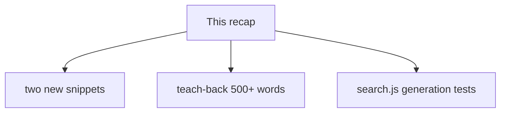
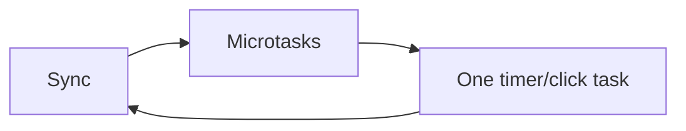

# Month 4 · Week 2 · Day 6
# Independent: Predict and Explain Async

**Program:** Full-Stack Mastery · 18 months  
**Phase:** 1 — Foundations  
**Month index:** [../../README.md](../../README.md)  
**Week 2:** [1](day-01.md) · [2](day-02.md) · [3](day-03.md) · [4](day-04.md) · [5](day-05.md) · Day 6 (today) · [7](day-07.md)  
**Week rhythm today:** Independent project work  
**Student state:** You can draw two queues and map AbortError. Today you invent new snippets and implement **stale-search generation**.  
**Study time:** 3–4 focused hours  
**Machine today:** Windows PowerShell, Node.js 20+  
**Textbook days 1–5 closed for challenges.** Repair from this recap after a 25-minute stall.

Labs: `~\fullstack-lab\month-04\week-02\independent\`.

---

## How to use this textbook

1. Read this recap. Close Days 1–5.
2. Invent snippets — not copies of Day 3’s `S1`/`a`/`await null`.
3. Type `search.js` from the generation spec. Tests with `node --test`.
4. Optional review links at the end are for later rechecking — not for first learning.

---

## How to read this chapter

Today you prove Week 2 on **new** source: two order programs you designed, a teach-back, and a tiny search helper that ignores stale generations.

The recap below **is** the lesson. Do not paste Day 2’s `A D C B` file and change letters.



Stuck 25 minutes: this recap, then Week 2 Days 1–2 in the textbook.

---

## Complete explanation

One JS thread. **Stack** runs sync code. **Web APIs** do I/O. **Microtasks** (`then`, `queueMicrotask`, `await` resume) drain before **tasks** (`setTimeout`, clicks). Render can happen between tasks. Tight loops freeze the page. `await fetch` yields; `while` waiting for fetch never sees the result. Promise reject → `catch` or unhandledrejection. AbortError is a name you filter, not a user-facing failure if you aborted on purpose.



**Order:** `console.log` now; `Promise.then` / `await` resume after the stack, before `setTimeout(0)`. Drain **all** microtasks, including ones a microtask queued.

**`await`:** the async function pauses; the **caller** continues unless it also awaited. Already-settled `await` still schedules a microtask. `async` functions return Promises. Forgotten `.catch` is `unhandledrejection`.

**Errors:** sync throw unwinds this stack. Timeout throw dies with that task. `catch` on a promise chain can **return** and recover. Empty `catch` is forbidden.

**DOM:** writes are JS. 500 `append`s in one task block clicks and paint. `replaceChildren` once is kinder. `querySelector` and `fetch` are Web APIs. Workers exist; no DOM; not this month’s tool.

**Races:** two `fetch` completions are two microtask resumes. The loop will run both. **Generation** (`let gen = 0`; ignore if `my !== gen`) or **AbortController** (reject with AbortError). Day 5’s `toUserError` maps abort to silence. HTTP `!ok` stays visible.

> **Wrong belief:** “Starting a new search cancels the old HTTP automatically.”  
> **Correct:** you abort, or you ignore a stale `gen`. Otherwise the old response can overwrite the new UI.

> **Wrong belief:** “Generation and abort are the same.”  
> **Correct:** generation ignores a result you already received. Abort tries to **stop** the request. Use both in real apps; today you implement generation and **document** abort.

> **Wrong belief:** “If the new search finishes first, the old one cannot hurt me.”  
> **Correct:** the old one can still finish **later**. The loop will run that resume too. `my !== gen` is how you refuse it.

---

## Generation, taught before you type it

```js
let gen = 0;
async function search(q) {
  const my = ++gen;
  const result = await fakeLookup(q);
  if (my !== gen) return;
  apply(result);
}
```

Call `search("a")` then immediately `search("b")`. Both `fakeLookup` calls start. Whichever finishes first must **not** apply if it is not the latest `my`. If `"b"` is latest, only `"b"` applies.

In tests you do not need real `fetch`. Inject a `lookup` that returns Promises you **control**:

```js
export function makeSearch(lookup, apply) {
  let gen = 0;
  return async function search(q) {
    const my = ++gen;
    const result = await lookup(q);
    if (my !== gen) return;
    apply(result);
  };
}
```

Test: `lookup` for `"old"` waits; `"new"` resolves first; `apply` must see only `"new"` (or only the latest, depending on resolve order you script). Use deferred promises:

```js
let resolveOld;
const oldP = new Promise((r) => {
  resolveOld = r;
});
```

Call `search("old")` (uses `oldP`), then `search("new")` (resolves immediately), then `resolveOld("stale")`. `apply` should not have been called with `"stale"` after `"new"` won.

That is Challenge 3. Document abort in `RACE.txt` as the other tool: `controller.abort()` so `fetch` rejects AbortError; `toUserError` returns `null`.

Worked apply log: after the scripted order, `apply.mock` or your `calls` array is `["new"]` only — not `["new", "stale"]` and not `["stale", "new"]`. If you see `"stale"` last, `my !== gen` is missing or you compared the query string instead of the integer.

---

## Inventing snippets that are not copies

Legal ingredients: `console.log`, `setTimeout`, `Promise.resolve().then`, `queueMicrotask`, `async`/`await`, maybe a nested `then` that queues another microtask. Illegal: pasting Day 3 Snippet 1 with renamed strings only.

Example of a **new** mix (you may use this idea, not as the only snippet):

```js
console.log("t0");
queueMicrotask(() => console.log("m0"));
setTimeout(() => {
  console.log("t1");
  Promise.resolve().then(() => console.log("m1"));
}, 0);
Promise.resolve().then(() => console.log("m2"));
console.log("t2");
```

Predict: both `t0` and `t2` first; `m0` and `m2` before `t1`; `m1` after `t1` starts (that `then` is queued **during** the timeout **task**, so it drains before the **next** task, still after `t1`’s sync body). Write your own second snippet with `await`.

That last sentence is the advanced order people miss: **microtasks queued inside a task run before the next task, not before the rest of the current task’s synchronous lines.** `console.log("t1")` is still now. The `then` that logs `m1` is after `t1`’s sync body, before some later timeout.

**Wrong belief:** “Once I am inside `setTimeout`, everything in that callback is a task, including `then`.”  
**Correct:** the callback **is** a task. `then` **inside** it still queues a microtask. After the callback’s stack clears, that microtask drains before the next timeout.

Second snippet ideas (pick one you did **not** already type this week): `await` inside the timeout callback; two `queueMicrotask` calls around one `then`; `Promise.resolve().then` that `setTimeout`s — predict that the timeout is a **task** even if scheduled from a microtask. Write the prediction in the same `PREDICT.md`.

---

## Office hours — copied letters, apply that accepts both, and abort as “the loop cancelled it”

**Renamed Day 3.** `S1` became `hello`. Same four lines. That is not a new snippet. Mix `queueMicrotask` with a timeout that itself queues a `then`, or `await` inside a timer. The prediction must surprise you a little.

**Test accepts stale.** You asserted `calls.includes("new")` and ignored extra `"stale"`. The product bug is the extra apply. Assert `deepEqual(calls, ["new"])` (or whatever order your script guarantees). Do not weaken the test.

**`RACE.txt` says the event loop aborts old fetch.** It does not. You abort, or you ignore `gen`. The loop is a scheduler. Write that sentence.

**Timers in generation tests.** Real `setTimeout` to fake slowness is flaky. Deferred promises you `resolve` by hand are the lab. Save timers for order snippets.

---

## Today's contract

**Today's gate**

> I predicted two original mixes, taught the loop to a Month 3 teammate in 500+ words, and proved a stale search does not apply.

---

## Time box

| Block | Minutes | Work |
|---|---|---|
| A | 20 | Speak recap |
| B | 50 | Two snippets + predictions |
| C | 60 | `search.js` tests |
| D | 40 | Teach-back + `RACE.txt` |
| E | 15 | Git |

---

# Challenge 1

Invent **two** snippets (not copies of Day 3) mixing `setTimeout`, `Promise.then`, and `async/await`. Predict, run in Node, explain mismatches.

`independent/snippet-a.js`, `snippet-b.js`, `PREDICT.md`. If timeouts interleave, run files separately. Windows: `node snippet-a.js`.

---

# Challenge 2 — Teach-back

500+ words: event loop for a teammate who knows Month 3 `fetch` but not queues. Include the A/D/C/B order.

Must include: one thread; why `while (!done)` after `fetch` never finishes; why `await fetch` lets clicks run; AbortError vs HTTP in one paragraph. Prose, not an API list. Do not paste this file.

---

# Challenge 3

A tiny `search.js`: `let gen = 0`; `async function search(q) { const my = ++gen; ...; if (my !== gen) return; }`. Tests: two overlapping calls, only the latest `my === gen` applies a fake result. This is the **generation** pattern; AbortController is the other. Document both in `RACE.txt`.

Prefer `makeSearch(lookup, apply)` so tests inject Promises. `node --test`. `"type": "module"`. Node.js 20+.

A fair test file names the deferred old lookup, the fast new lookup, and asserts `apply`’s calls. If `apply` ran with the stale payload, the generation check is missing or you compared strings instead of the `my` integer. Do not “fix” the test to accept both results.

`RACE.txt` two headings: **Generation** (what you implemented) and **AbortController** (what you would add around real `fetch`: one controller per search, abort the previous, `toUserError` on AbortError). If the essay treats abort as “the event loop cancels old work,” rewrite that sentence.

Windows: `node --test` from the independent folder. HTTP is not required for these Node snippets. Do not open `file://` anything today.

```powershell
cd ~\fullstack-lab\month-04\week-02\independent
node --test
```

```powershell
cd ~\fullstack-lab
git add month-04/week-02/independent
git commit -m "Independent event-loop snippets and stale-search generation."
```

---

## Worked walkthrough — deferred old vs fast new

You need two lookups the test **owns**:

```js
let resolveOld;
const lookup = (q) => {
  if (q === "old") return new Promise((r) => { resolveOld = r; });
  return Promise.resolve("new-payload");
};
const calls = [];
const search = makeSearch(lookup, (result) => calls.push(result));
```

Call `search("old")` then `search("new")`. Await a microtask tick (`await Promise.resolve()`) so `"new"` can apply. Then `resolveOld("stale")`. Await again. Assert `deepEqual(calls, ["new-payload"])`.

If `calls` is `["new-payload", "stale"]`, `my !== gen` is missing. If `calls` is empty, you never called `apply` on the winner — maybe you compared `q` to `gen` (a string vs a number) or incremented `gen` twice per search.

**Snippet originality check.** If `snippet-a.js` is four lines with two sync logs, one `then`, one `setTimeout(0)`, that is Day 3’s shape. Legal extra: `queueMicrotask` plus a timeout that queues a `then`. Predict `t1` before `m1`. Write that prediction **before** `node snippet-a.js`.

**Teach-back must include A D C B.** If you skip the letters, a Month 3 teammate cannot check themselves. Include `while (!done)` after `fetch`. Include AbortError vs HTTP in one paragraph, not as a table dump.

### Recall

1. Generation ignores a result you already received.  
2. Abort tries to stop HTTP.  
3. The event loop runs **both** resumes unless you ignore or abort.  
4. `toUserError` maps abort to silence — mention it in `RACE.txt`.

---

## Definition of done

- [ ] Days 1–5 closed during challenges
- [ ] Two original snippets predicted then run
- [ ] Teach-back 500+ words includes A D C B and while+fetch
- [ ] Overlapping search tests: stale result ignored
- [ ] `RACE.txt` names generation **and** abort
- [ ] Commit exists

---

## Stalls and repair — copied letters, weak apply asserts, abort folklore

If both snippets are Day 3 with renamed strings, invent a timeout that queues a `then`, or `await` inside a timer. Predict `t1` before `m1`. `PREDICT.md` before `node`.

If `calls.includes("new")` is your only assert, stale can still apply. `deepEqual(calls, ["new-payload"])` (or your exact winner). Do not weaken the test.

If `lookup` uses real `setTimeout` to be “slow,” the test flakes. Deferred `resolveOld` you call by hand is the lab.

If `RACE.txt` says the event loop cancelled the old `fetch`, rewrite. You abort, or you ignore `gen`. The loop is a scheduler. Mention `toUserError` → `null` for AbortError. HTTP `!ok` stays visible.

If the teach-back skips `while (!done)` after `fetch`, a Month 3 teammate will still deadlock. Include A D C B. 500+ words. Prose. Close Days 1–5.

If `makeSearch` increments `gen` twice per call, `my !== gen` is always true and `apply` never runs. One `++gen` at the start. Tests then see the winner.

Windows: `cd ~\fullstack-lab\month-04\week-02\independent` then `node snippet-a.js` and `node --test`. Node.js 20+. No `file://`. No HTTP required for these Node files.

---

## Last forty minutes

Read `PREDICT.md` aloud. If both snippets are Day 3 with new strings only, you still owe a timeout-that-queues-a-`then` or an `await` inside a timer. Predict `t1` before `m1`.

Re-run `node --test`. `deepEqual(calls, [winner])` — not `includes`. If stale applied, `my !== gen` is missing or `gen` incremented twice.

`RACE.txt` two headings. Generation is what you implemented. AbortController is what you would wrap around real `fetch`. The event loop does not cancel HTTP. `toUserError` maps AbortError to `null`. HTTP `!ok` stays visible.

Teach-back: 500+ words, A D C B, `while (!done)` after `fetch`, AbortError vs HTTP. Close Days 1–5. Prose, not an API list.

Windows: independent folder. `"type": "module"`. Node.js 20+. Commit the independent path only. Tomorrow’s review will ask you to draw engine vs host closed-book — if that sentence is mush, draw it now on paper from this recap’s mermaid.

---

## Worked checkpoint — generation vs abort, one table

Draw a two-column table in `RACE.txt` if it is still a slogan.

| Tool | What it does | What the event loop does |
|---|---|---|
| Generation (`gen` / `my`) | Your `apply` ignores a stale id | Nothing. It still delivers the old Promise. |
| `AbortController` | Your `fetch` is told to stop; you map AbortError → `null` | Still a scheduler. It does not know “current search.” |

Overlapping search tests must not use real timers. Hold `resolveOld` and `resolveNew` in the test. Resolve old **after** new. `deepEqual(calls, [newPayload])`. `includes("new")` still passes if stale also applied.

If `++gen` runs twice per `makeSearch` call, `my !== gen` is always true and the winner never paints. One increment at the start of the call.

> **Wrong belief:** “If I abort, I do not need generation.”  
> **Correct:** abort maps to `null` so the UI does not flash a cancel as an HTTP error. Generation (or abort-plus-ignore) still stops a **completed** stale body from applying. You may implement generation today and write abort as the production wrap — both names belong in `RACE.txt`.

Teach-back still needs A D C B and `while (!done)` after `fetch`. A Month 3 teammate who polls the stack will deadlock. 500+ words. Close Days 1–5.

---

## Optional review links

Queues, `await`, and abort are explained in this chapter.

- [MDN: Concurrency model](https://developer.mozilla.org/en-US/docs/Web/JavaScript/Event_loop)
- [MDN: `AbortController`](https://developer.mozilla.org/en-US/docs/Web/API/AbortController)

---

## Tomorrow

Week review: draw the engine vs host diagram closed-book, one new snippet, three debug stories (while+fetch, forgotten catch, two fetches no abort). Then Week 3 — tests as design, ESLint, Prettier, **breakpoints**.
