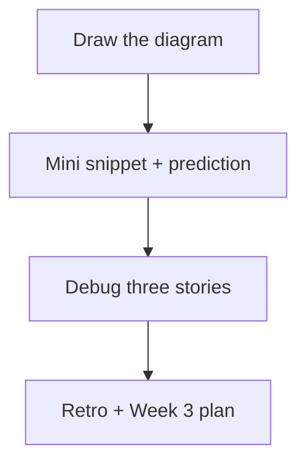
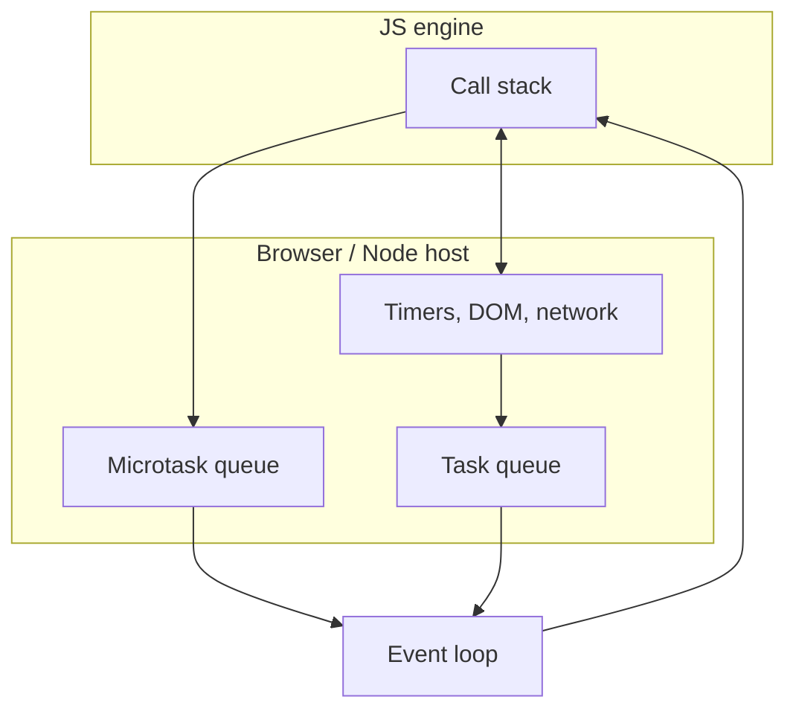

# Month 4 · Week 2 · Day 7
# Week Review — Runtime

**Program:** Full-Stack Mastery · 18 months  
**Phase:** 1 — Foundations  
**Month index:** [../../README.md](../../README.md)  
**Week 2:** [1](day-01.md) · [2](day-02.md) · [3](day-03.md) · [4](day-04.md) · [5](day-05.md) · [6](day-06.md) · Day 7 (today)  
**Week rhythm today:** Review, explain aloud, fix weak areas, plan next week  
**Student state:** You predicted queues, timed DOM writes, mapped AbortError, and ignored a stale generation. Today that picture must stand without Days 1–6 open.  
**Study time:** 3–4 focused hours  
**Machine today:** Windows PowerShell, Node.js 20+

Do not start Week 3 because the calendar moved. A student who still says “async means later” without two queues will fail the Month 4 gate item on the event loop.

Days 1–6 stay **closed** during the mini-snippet and debug stories. Repair from **this synthesis**.

Labs: `~\fullstack-lab\month-04\week-02\review\`.

---

## How to read this chapter

This is a **closed-book teaching day**. The synthesis **is** the Week 2 lesson.



If you go blank, re-read the sections below, then type. Do not open Day 2 to copy `A D C B` until 25 minutes of honest stall — and even then, **this** file should have been enough.

---

## Week synthesis



- **Stack** empty → drain **microtasks** → one **task** → maybe paint.
- `setTimeout(0)` after `then`.
- `await` yields; caller continues.
- Errors: sync unwind; promise `catch`; unhandledrejection; timeout throw is isolated to that task.
- DOM writes are JS too. Workers exist; not this month’s tool.

Closed-book: draw the diagram.

The rest of this file unpacks those bullets so the mini-snippet is not a lottery.

---

## Today's contract

**Today's gate.** Closed-book:

> I can draw stack, host APIs, microtask queue, and task queue, predict `then` before `setTimeout(0)`, explain `await` vs the caller, and name AbortError as silent when I aborted.

---

## Time box

| Block | Minutes | Work |
|---|---|---|
| 1 | 40 | Speak synthesis; draw mermaid from memory |
| 2 | 45 | Mini: one snippet + prediction |
| 3 | 30 | Debug: while+fetch; forgotten catch; two fetches no abort |
| 4 | 20 | Re-run `toUserError` and generation tests |
| 5 | 20 | Design: why abort and generation both exist |
| 6 | 20 | Retro + Week 3 plan |

---

# Complete explanation — runtime you must still own

## 1. One thread and a stack

JavaScript on the page is one main thread. Nested calls push frames; returns pop. LIFO. A tight `while` or a giant `JSON.parse` keeps the stack non-empty. Clicks, timeouts, and paint wait. Stack overflow is too much recursion, not “out of RAM.”

`setTimeout(fn, 0)` means: host, please **queue** `fn` as a **task**. It does not mean run `fn` between the next two lines.

## 2. Two waiting lines

After the stack empties, **drain all microtasks** (`Promise.then` / `catch`, `queueMicrotask`, `await` resume). Then run **one** macrotask (`setTimeout`, click). Then microtasks again. Browser may paint between tasks.

Classic: `A` and `D` sync, `C` from `then`, `B` from `setTimeout(0)` → `A D C B`. Nested `then` still before `B`. `queueMicrotask` is the same line as `then`, FIFO with whatever else is already queued.

## 3. `await` is not sleep

`await` pauses the **async function** and schedules the rest as a microtask when the promise settles. An already-resolved promise still yields. The **caller** runs the next line unless it `await`ed too. `0 1 3 2` is the settled-await fingerprint. `await null` is still a yield.

`async function` returns a Promise. Throw inside → reject that Promise. Caller must `await` in `try/catch` or `.catch`. Otherwise `unhandledrejection`.

## 4. Errors by neighborhood

| Place | Effect |
|---|---|
| Sync `throw` | Unwind this stack; maybe kill the script |
| Throw in timeout | That task dies; later tasks live |
| Rejected promise, no catch | unhandledrejection; Node may complain loudly |
| AbortError you caused | Map to silence (`toUserError` → `null`) |
| `Error("HTTP 404")` after `!ok` | Show the user |

Never empty-catch. Catch at `await fetch`.

## 5. Browser pipeline

HTML parser → DOM. CSS → CSSOM. Render tree, layout, paint. JS reads/writes DOM through Web APIs. Layout/paint want an empty stack. 500 live `append`s are one long task. `replaceChildren` once is kinder. Reading `offsetHeight` after writes can **thrash** layout. `requestAnimationFrame` is for frames, not generic delay. Workers: other thread, no DOM, concept only.

Serve pages over **HTTP**, not `file://`. Modules still need `.js` and `type="module"`.

## 6. Races the loop will not save you from

Two searches: two network completions; two resumes. The loop runs both. **Generation** ignores stale `my !== gen`. **AbortController** cancels HTTP; rejection is AbortError. Use both in production thinking; you implemented generation on Day 6.

The Month 4 gate can show overlapping or out-of-order work. Debug from **symptoms** in Week 4. This review does not list fixture root causes.

**Wrong belief:** “Microtasks run in a second thread.”  
**Correct:** same thread, different **when**.

**Wrong belief:** “If I used `async`, the UI cannot freeze.”  
**Correct:** `await` yields. A huge loop **after** the await still freezes. Parse and render still cost stack time.

**Wrong belief:** “I will remember this because I saw a tweet graphic.”  
**Correct:** you remember it because you predicted, missed, and walked the queues on paper today.

---

## Worked mini (a new mix, not Day 3 letters)

```js
console.log("p");
Promise.resolve().then(() => console.log("q"));
setTimeout(() => console.log("r"), 0);
console.log("s");
```

Predict `p s q r` before `node mini.js`. If you write `p q s r`, you ran `then` before the rest of the sync body. `s` is still now.

If that is too close to Day 3, swap in `queueMicrotask` for `then` — same queue — or put a `then` **inside** the timeout and predict `r` before that inner microtask, then the inner log before a later timeout.

`WALK.txt` names stack, then micro, then task. Three sentences minimum.

---

## Office hours — copied A D C B, busy-loop “fixes,” and silent abort of HTTP

**Mini is Day 3 paste.** Strings `A` `B` `C` `D`. Write `p` `q` `r` `s` or a timeout that queues a `then`. The walk paragraph is the grade.

**`while` “fixed” with `setTimeout(check, 0)` inside the loop.** You still flood the task queue and freeze. The fix is `await fetch` or work in `then`, not a busy poll.

**HTTP 404 mapped to silence.** `toUserError` returned `null` because you checked `message.includes("abort")` and `"HTTP 404"` somehow matched, or you treated all errors as abort. Abort is **`name`**. HTTP is visible.

**Forgot to re-run generation tests.** Review is not only a new snippet. Red tests from Day 6 are today’s weak-area block.

---

## Mini

One snippet + prediction.

`review/mini.js`: mix **one** `setTimeout(0)`, **one** `Promise.then` or `queueMicrotask`, and **two** sync logs. Not a copy of Day 3 Snippet 1 strings. `PREDICT.txt` first, then `node mini.js`. One paragraph in `WALK.txt` walking the stack / micro / task.

Optional extra: one `async` function with `await Promise.resolve()` and a caller log after the call — if you still fumble `0 1 3 2`, do this extra until it is boring.

`"type": "module"` if needed. No browser required for the mini. HTTP not involved. Node.js 20+.

```powershell
cd ~\fullstack-lab\month-04\week-02\review
node mini.js
```

---

## Debug (write the cause)

Full sentences in `DEBUG.txt`. Observation, then mechanism, then fix.

**while+fetch deadlock.** You wrote `let done = false; fetch(...).then(() => { done = true; }); while (!done) {}`. Observation: tab frozen, Network may even show the response, JS never sets `done`. Mechanism: the `while` never empties the stack; the `then` is waiting to become a microtask after an empty stack. Fix: `await fetch` (yield) or do work in the `then` without a busy loop.

**Forgotten catch.** You `fetch` or `Promise.reject` with no `catch` / `try`. Observation: `unhandledrejection` in DevTools or Node; UI unchanged. Mechanism: a rejected Promise with no handler. Fix: `try/catch` around `await`, or `.catch`; set error state; never empty-catch.

**Two fetches no abort.** User types fast; old response arrives after new. Observation: the list flashes the old query’s items. Mechanism: the loop ran both continuations; you did not abort or check `gen`. Fix: AbortController and/or generation; map AbortError to silence.

Do not open `fixtures/broken-priority-list/` today.

### Oral checklist (`ORAL.txt`)

Speak, then mark ok/weak:

1. One JS thread; a busy stack freezes clicks and paint.
2. `setTimeout(0)` is a task, not “the next line.”
3. After the stack: drain **all** microtasks, then **one** task.
4. `A D C B` and why `C` beats `B`.
5. `await` yields; the caller continues; resume is a microtask.
6. Unhandled rejection vs `try/catch` on `await`.
7. AbortError silent; HTTP error visible.
8. Two fetches: loop runs both; you abort or check `gen`.

Weak items get a five-sentence repair in the same file. Week 3 will not reteach queues from zero.

---

## Design paragraph (`DESIGN.txt`)

Why abort **and** generation both exist: abort saves network and produces AbortError; generation is a local integer that ignores stale applies even if a result already arrived. Five to ten sentences. Mention `toUserError`.

---

## Review, tests, retro

Re-run Day 5 `toUserError` tests and Day 6 search tests. Record in `review/TESTS.md`. Fix red tests today.

Retro (`RETRO.md`): hours, solid vs weak (stack vs microtasks vs abort), one sentence on Week 3 readiness (breakpoints, not only `console.log`). **Week 3:** tests as design, ESLint, Prettier, **breakpoints**.

```powershell
cd ~\fullstack-lab
git add month-04/week-02/review
git commit -m "Record Week 2 runtime review."
```

---

## Worked walkthrough — `WALK.txt` for the mini

Example mix (change letters if you want; keep the physics):

```js
console.log("p");
Promise.resolve().then(() => console.log("q"));
setTimeout(() => console.log("r"), 0);
console.log("s");
```

`WALK.txt` (your words): `p` and `s` run on the stack. `then` queues `q` as a microtask. `setTimeout` asks the host to queue `r` as a task. Stack empty. Drain `q`. Then the timer task `r`. Output `p s q r`. If you predicted `p q s r`, you ran the microtask before `s`. `s` is still now.

**DEBUG while+fetch extra sentence.** Network tab can show 200 while the tab is frozen. That does not contradict the deadlock. The host finished HTTP. JS never ran the `then` because the stack never emptied. Write that. It is the sentence people miss.

**DESIGN.txt.** Abort: `controller.abort()`; `fetch` rejects; `name === "AbortError"`; `toUserError` → `null`; maybe less wasted bandwidth. Generation: integer `my` vs `gen`; a result that already arrived is ignored; no AbortError. Real search UI wants **both**. Five to ten sentences. Not “use both.”

### Oral repair

If item 4 (`A D C B`) is weak, write the four letters and the queue names in `ORAL.txt`. If item 8 (two fetches) is weak, write generation **and** abort, not only one. Week 3 will not reteach this.

Windows: `cd ~\fullstack-lab\month-04\week-02\review` then `node mini.js`. Node.js 20+.

---

## Week 2 definition of done

- [ ] Diagram drawn closed-book
- [ ] Mini prediction written before run; walk paragraph exists
- [ ] DEBUG three stories are full paragraphs
- [ ] DESIGN.txt exists
- [ ] Mapper + generation tests re-run
- [ ] Retro does not skip breakpoints next week
- [ ] Commit exists

---

## Stalls and repair — copied A D C B, busy polls, mapper regressions

If `mini.js` uses letters A–D in Day 3’s four-line shape, change strings and keep the physics, or put a `then` **inside** the timeout. `PREDICT.txt` first. `WALK.txt` names stack, micro, task.

If you “fixed” `while (!done)` with `setTimeout(check, 0)` inside the loop, you still flood the queue. The fix is `await fetch` or work in `then`. DEBUG must say the stack never emptied so the `then` never became a microtask. Network 200 does not contradict a freeze.

If HTTP 404 became silent, `toUserError` is wrong. Abort is `name`. Re-run Day 5 tests. Red mapper tests are today’s weak-area block, not optional.

If generation tests are red, fix them today. Review is not a new snippet while Day 6 dies.

If `DESIGN.txt` is “use both,” write: abort saves network and yields AbortError; generation ignores a result that already arrived; `toUserError` maps abort to `null`. Five to ten sentences.

If oral item 5 (`await` vs caller) is weak, write `0 1 3 2` in `ORAL.txt` with queue names. Week 3 will not reteach queues.

Windows: `cd ~\fullstack-lab\month-04\week-02\review` then `node mini.js`. Node.js 20+. Do not open the gate fixture. Retro names breakpoints for Week 3.

---

## Last forty minutes

Diagram drawn closed-book: stack, host APIs, microtask queue, task queue. Mini `PREDICT.txt` before `node mini.js`. `WALK.txt` three sentences. Not Day 3 letters.

DEBUG three stories are paragraphs: while+fetch (stack never emptied); forgotten catch (`unhandledrejection`); two fetches (loop runs both; abort and/or `gen`). `DESIGN.txt`: abort vs generation vs `toUserError`.

Re-run Day 5 mapper and Day 6 generation. Record `review/TESTS.md`. Fix red today.

`ORAL.txt` eight lines ok/weak. Weak items get five sentences. `RETRO.md`: hours, stack vs microtasks vs abort, breakpoints next week.

Commit `month-04/week-02/review`. Week 3 will not reteach queues from zero.

---

## Optional review links

Week 2 is explained in this chapter. These pages are for later checking, not for first learning.

- [MDN: Concurrency model](https://developer.mozilla.org/en-US/docs/Web/JavaScript/Event_loop)
- [MDN: Promise](https://developer.mozilla.org/en-US/docs/Web/JavaScript/Reference/Global_Objects/Promise)
- [HTML Living Standard: event loop](https://html.spec.whatwg.org/multipage/webappapis.html#event-loops) (optional later)

---

## If you passed this week

Week 3 makes quality habitual: unit test anatomy, testable design, ESLint, Prettier, and debugging with a **breakpoint**. The broken priority list still waits until Week 4. Do not open it to “get ahead.”
