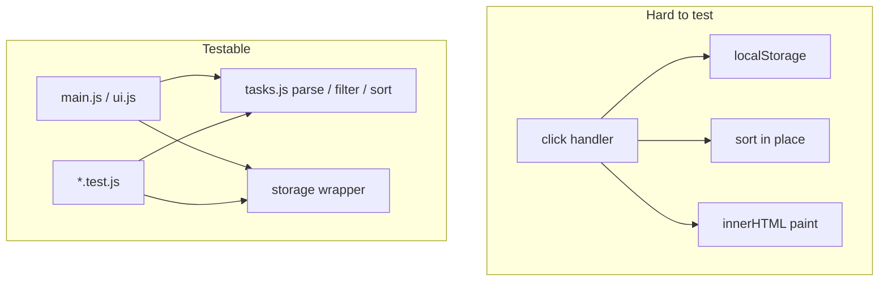
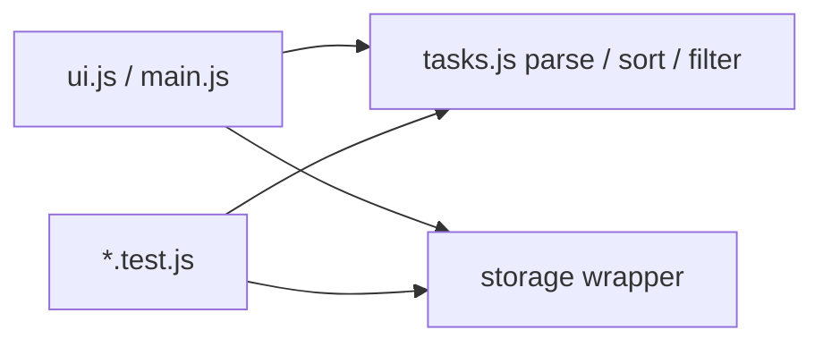

# Month 4 · Week 3 · Day 1
# Unit Tests and Testable Design

**Program:** Full-Stack Mastery · 18 months  
**Phase:** 1 — Foundations  
**Month index:** [../../README.md](../../README.md)  
**Week 3:** Day 1 (today) · [2](day-02.md) · [3](day-03.md) · [4](day-04.md) · [5](day-05.md) · [6](day-06.md) · [7](day-07.md)  
**Week rhythm today:** Learn + type-along  
**Study time:** 3–4 focused hours  
**Student state:** Month 3 gate passed. You already ran `node --test`. Today you learn *what a good unit test is* and *how to shape code so it can be tested without a browser*.  
**Machine today:** Windows, Node.js LTS, PowerShell, Cursor / VS Code

**This week covers:** test anatomy, assertions, unit tests, testable design, linting, formatting, breakpoints.

Today: tests as **design**. Lint, format, and breakpoints are Day 2. Do not skip them. Week 4’s gate app will punish code that can only be “tested” by clicking.

You already ran `node --test` in Month 3. That was the runner. Today is the **discipline**: one behavior per name, fake I/O, and functions that do not need `document` to exist.

---

## How to read this chapter

A **unit test** is a small program that calls **one** function with known input and checks the output. If the check fails, the test **throws**. The runner prints red. That is the whole machine.

The hard part is not `assert.equal`. The hard part is **writing functions the test can call**. If filter, sort, and save live inside a click handler that also paints the DOM, Node cannot import them. You will then “test” by clicking. Clicking is not a regression suite. The Month 4 gate requires tests that **failed while the bug existed**.



Read until you can say arrange / act / assert without looking. Then type the labs. Predict what a test will do **before** you run it. Optional links at the end are for later checking — not for first learning.

---

## Today's contract

By the end of this day you will be able to:

1. Write arrange / act / assert on purpose, one behavior per test name.
2. Name **unit** vs **integration** vs “I clicked around.”
3. Design a function so the DOM is not required.
4. Use `assert.throws` / `assert.rejects` for errors.
5. Inject a fake `{ getItem, setItem }` so persistence logic runs in Node.
6. Know the limits: you do not unit-test `fetch` against the live network as your only suite.

**Today's gate**

> If the only way to know `filterOpen` works is to click the page, the design is wrong. Extract the function. Test it. The page calls the same function.

If you cannot say that closed-book, stay here. Day 2’s linter will not save an untestable blob.

---

## Time box

| Block | Minutes | Work |
|---|---|---|
| A | 50 | Theory: anatomy, kinds of test, testable design, asserts, coverage |
| B | 55 | Type-along: `tasks.js` tests + `priorityLabel` throws |
| C | 70 | Independent: injected `storage.js` + memory fake |
| D | 20 | Git commit in `fullstack-lab` |
| E | 15 | Closed-book recall |

---

# Block A — Theory

## 1. Anatomy

A test has three beats. Name them every time you write one.

```text
Arrange  — build input
Act      — call the one function under test
Assert   — expected vs actual; throw if different
```

```js
import assert from "node:assert/strict";
import { test } from "node:test";
import { filterOpen } from "./tasks.js";

test("filterOpen keeps items that are not done", () => {
  const list = [
    { id: "1", done: false },
    { id: "2", done: true },
  ];
  const result = filterOpen(list);
  assert.equal(result.length, 1);
  assert.equal(result[0].id, "1");
});
```

```powershell
node --test tasks.test.js
```

`node --test` **discovers** `*.test.js` if you pass a folder: `node --test week-03`.

**One behavior per test name.** `test("filter and sort and save")` is three tests pretending to be one — when it fails you do not know which. The name is a sentence: *what is true after the act*.

**Wrong belief:** “A test file is a place to run my app.”  
**Correct:** a test file is a list of claims. Each claim should fail for one reason.

Worked example of a **bad** name: `"it works"`. When it fails at 11pm, you learn nothing. Worked example of a **good** name: `"parseTasks returns [] for NOT JSON"`. The failure *is* the bug report.

---

## 2. What “unit” means here

| Kind | What you prove | Example |
|---|---|---|
| **Unit** | One function, no network, no DOM | `sortByPriority(list)` |
| **Integration** | Several modules together, still no live API | `load()` + `parseNotes` with a fake string |
| **Manual / E2E** | Browser, clicks, real HTTP | Month 3 Project 2 checklist; later Playwright |

The Month 4 **gate** requires **regression unit tests**: a test that **failed while the bug existed** and **passes after the fix**. That is how you prove you did not only “nudge the UI until it looked OK.”

A unit test that imports `document` will throw in Node. That is a design smell, not a Node limitation. Move the logic out of the page.

**Wrong belief:** “Unit tests replace clicking the app.”  
**Correct:** they prove the **functions** the app calls. You still open the page. You do not use the page as the only proof.

You may use **Vitest** instead of `node --test` if you want watch mode. This book’s typed labs use `node --test` so you do not need a bundler yet. Vite is Month 5. Same anatomy either way: arrange, act, assert.

---

## 3. Testable design (the actual skill)

**Hard to test**

```js
button.addEventListener("click", () => {
  const items = JSON.parse(localStorage.getItem("tasks"));
  items.sort((a, b) => a.priority - b.priority);
  ul.innerHTML = items.map((i) => `<li>${i.title}</li>`).join("");
});
```

Network, storage, mutation, XSS, and sort-in-place in one blob. To “test” this you need a browser, a button, and a storage key. When it fails, you do not know which line lied.

**Testable**

```js
export function sortByPriority(list) {
  return [...list].sort((a, b) => a.priority - b.priority);
}
export function parseTasks(raw) {
  // try/catch, return []
}
```

`main.js` calls these. Tests import these. `innerHTML` still forbidden for titles (`textContent`). The handler becomes: load → pure function → save → render. Each arrow is a function you can name.

**Seam:** a place you can substitute a fake. `parseTasks(raw)` is a seam: tests pass strings. `localStorage.getItem` inside `parseTasks` is **not** a seam — Node has no `localStorage`.

**Dependency injection (light):** `loadNotes(storage)` where `storage` is `{ getItem, setItem }` — in tests, a fake object. In production, `localStorage`. You do not need a framework.

```js
export function loadNotes(storage, key) {
  const raw = storage.getItem(key);
  return parseTasks(raw);
}
```



**Pure** here means: same inputs, same outputs, no hidden `document`, no hidden network. A function that returns a **new** array instead of mutating the input is easier to assert: you can keep the original and `deepEqual` it after the call.

**Wrong belief:** “I’ll test by reading `ul.innerHTML`.”  
**Correct:** Node has no `ul`. Assert the array. The page is a view of that array. Month 3 already taught `textContent` for titles — tests do not excuse `innerHTML`.

### What belongs in the module vs the page

| Lives in `tasks.js` / `storage.js` | Lives in `main.js` / `ui.js` |
|---|---|
| parse, filter, sort, count, add (return new list) | `addEventListener`, `querySelector` |
| decide next state from current state + input | `textContent`, `createElement` |
| throw / return `[]` on bad data | show a status `p` to the human |

If you cannot import a function from Node, it is not a unit this week.

### Mutation is a test topic

```js
export function sortByPriority(list) {
  return [...list].sort((a, b) => a.priority - b.priority);
}
```

The spread copies the **array**, not nested objects (Week 1). That is enough so `list` still has the old **order**. A test should freeze the old order:

```js
test("sortByPriority does not change the input order", () => {
  const list = [
    { id: "a", priority: 2 },
    { id: "b", priority: 1 },
  ];
  const snapshot = list.map((item) => item.id);
  sortByPriority(list);
  assert.deepEqual(
    list.map((item) => item.id),
    snapshot,
  );
});
```

If the helper sorts **in place**, this test goes red. That red is the point. Week 4 will ask you for this kind of claim on the gate app — write the habit now on **your** helpers, not by guessing the fixture.

---

## 4. Assertions

From `node:assert/strict` (strict `===`, no coerce):

| Call | Use |
|---|---|
| `assert.equal(a, b)` | primitives |
| `assert.deepEqual(a, b)` | objects/arrays by contents |
| `assert.notEqual(a, b)` | different primitives (not “different object identity”) |
| `assert.notDeepEqual(a, b)` | structures differ |
| `assert.ok(x)` | truthy — prefer exact equals |
| `assert.throws(() => fn())` | sync throw |
| `await assert.rejects(async () => ...)` | rejected promise |

**`assert.equal` vs `deepEqual`:** `equal` is `===`. Two arrays with the same contents are **not** `===`. Use `deepEqual` for objects and arrays. Use `equal` for numbers, strings, booleans.

**Do not** assert `true === true`. Assert the **business** fact: which id survived, which length, which thrown message.

**`assert.throws`:**

```js
assert.throws(() => priorityLabel(0), { message: /invalid/ });
```

The second argument can be a class (`TypeError`) or an object with `message` (string or regex). If the function **returns** instead of throwing, the test fails. That is what you want.

**Flakes:** tests that hit the real network, real clock, or real random. Fake the data. For time, pass `now` as an argument if you need it: `function stamp(now = Date.now())`. A test that is red on Tuesday and green on Wednesday is not a test. It is weather.

**Wrong belief:** “I’ll `fetch` jsonplaceholder in the unit test to be realistic.”  
**Correct:** the network is not your function. Pass a stub that returns a known object. Live HTTP is a later, slower suite.

---

## 5. Coverage (concept)

Coverage tools count which **lines ran**. 100% coverage can still miss the loop-`var` bug if you never called the handlers. Prefer **meaningful cases** (empty list, one item, mutation snapshot, wrong type) over a percentage trophy. You may skip coverage reporters this month.

Cases worth writing even when they feel boring:

| Case | Why |
|---|---|
| Empty list | Off-by-one and `filter` on `[]` |
| One item | No “swap two” accident |
| All done / none done | Filter boundaries |
| Garbage string | Parse must not throw to the test runner as an *uncaught* — it should return `[]` or throw **on purpose** if that is your contract |
| Input not mutated | Week 1 `sort` lesson |

**Wrong belief:** “If coverage is 100%, the module is correct.”  
**Correct:** coverage says the line ran, not that the claim is the one a user cares about.

---

## 6. What is *not* a unit test

- A file that opens a browser.  
- A checklist you click once.  
- `console.log` in `main.js` that “looked right.”  
- A test that only runs if Wi‑Fi works.  
- A test named `"final"` that asserts `result` is truthy.

Those can be useful as **manual** QA. They do not satisfy the Month 4 gate’s regression requirement.

---

# Block B — Type-along

Create `~\fullstack-lab\month-04\week-03\day-01\` if it does not exist.

Reuse Day 4 Week 1 `tasks.js` **or** copy the ideas into `week-03/day-01/tasks.js` (retype helpers — do not paste a mystery file).

`package.json` in this folder: `{ "type": "module" }`.

Add tests that Month 3 might have missed:

1. `filterOpen` empty list → `[]`
2. `addTask` does not mutate input
3. `parseTasks("NOT JSON")` → `[]`
4. `parseTasks(null)` → `[]` (your `getItem` missing key)

`assert.throws` lab: `function priorityLabel(n)` throws `Error("invalid")` if not 1, 2, or 3. Test the throw and a valid `"high"`/`"medium"`/`"low"` mapping you choose — document the strings.

Predict each test: write `PREDICT.txt` with four lines (pass/fail guess) **before** `node --test`. Then run. If a guess was wrong, add a sentence: what the function actually did.

If `addTask` currently pushes onto the input array, the mutation test will fail. That is the lesson. Return a new array (`[...list, newItem]`). Do not “fix the test” by deleting the assertion.

```powershell
cd ~\fullstack-lab\month-04\week-03\day-01
node --test
```

---

# Block C

`storage.js` with `load(storage, key)` / `save(storage, key, list)` using injection. Fake:

```js
function memoryStorage(map = new Map()) {
  return {
    getItem: (k) => (map.has(k) ? map.get(k) : null),
    setItem: (k, v) => map.set(k, v),
  };
}
```

Tests without `localStorage`.

`load` should call `parseTasks` (or equivalent) on the string. Missing key: `getItem` returns `null` — same contract as the browser. `save` should `JSON.stringify` a schema you document (`{ version: 1, items }` or a bare array — pick one and test the round-trip).

Tests to write:

1. Save then load returns the same titles (deepEqual on a field you care about).  
2. Load of `"NOT JSON"` returns `[]`.  
3. Two different `memoryStorage()` maps do not share data.

Do not import `document`. Do not import `localStorage` at module top level. The **caller** in a future page will pass `localStorage`. Tests pass `memoryStorage()`.

```powershell
git add month-04/week-03
git commit -m "Week 3 Day 1: unit tests and injected storage."
```

---

# Block E — Recall

Close the file. Speak:

1. Arrange, act, assert — one sentence each.  
2. Unit vs integration vs clicking.  
3. Why `sort` in a click handler is untestable.  
4. Why `deepEqual` for arrays.  
5. What injection means in one sentence.  
6. One case coverage cannot see.

If any answer is a shrug, re-read that section. Do not start Day 2.

---

## Definition of done

- [ ] At least four `tasks` tests green, including empty list and garbage parse
- [ ] `priorityLabel` throw tested with `assert.throws`
- [ ] `storage.js` load/save tested with `memoryStorage`
- [ ] `addTask` mutation claim exists (and the production code matches it)
- [ ] No `document` in the modules under test
- [ ] Commit exists in `fullstack-lab`

---

## Optional review links

Test anatomy is explained above. These pages are for later checking (runner flags, extra assert methods).

- [Node: test runner](https://nodejs.org/api/test.html)
- [Node: assert](https://nodejs.org/api/assert.html)

---

## Tomorrow

ESLint (catch real mistakes), Prettier (stop arguing about semicolons), and **breakpoints** (see `this` and closures instead of guessing). The gate app is still closed. Quality tools first.
