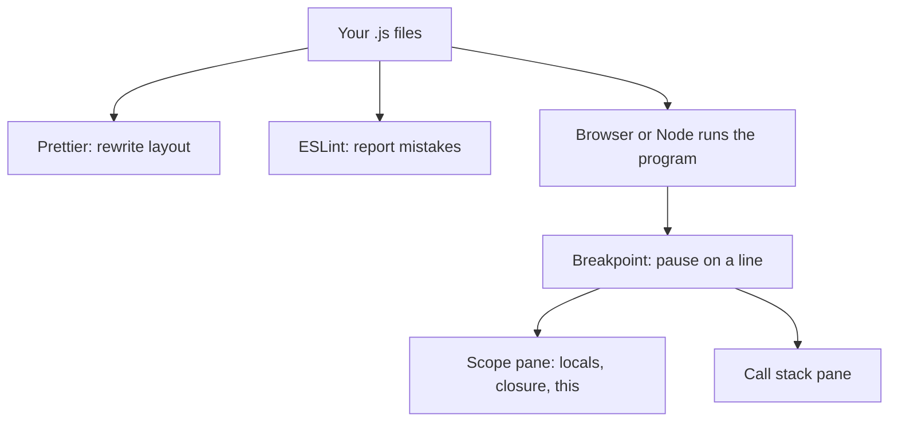
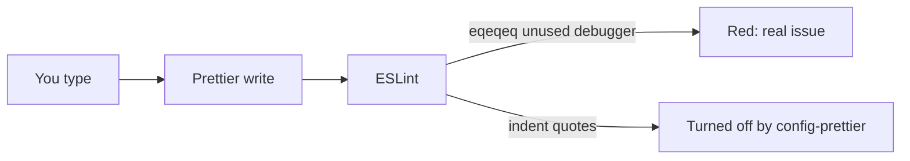
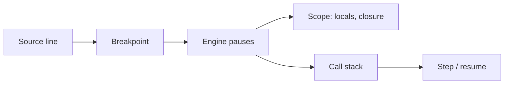

# Month 4 · Week 3 · Day 2
# Lint, Format, and Breakpoints

**Program:** Full-Stack Mastery · 18 months  
**Phase:** 1 — Foundations  
**Month index:** [../../README.md](../../README.md)  
**Week 3:** [1](day-01.md) · Day 2 (today) · [3](day-03.md) · [4](day-04.md) · [5](day-05.md) · [6](day-06.md) · [7](day-07.md)  
**Week rhythm today:** Exercises + debugging  
**Study time:** 3–4 focused hours  
**Prereq:** Day 1 gate. You can write arrange / act / assert for a pure function.

Yesterday you made functions Node can import. Today you add two machines that read your source **without running the app**, and one tool that **pauses** the engine while the app runs. Lint, format, and the debugger are how a pull request stays about logic instead of spaces, and how the gate app gets diagnosed instead of peppered with `console.log`.

---

## How to read this chapter

Three tools, three jobs. Mixing them up is how students disable ESLint because Prettier “already ran,” or leave `debugger` in a commit because “the linter is optional.”



**Prettier** does not know that `==` is a bug. **ESLint** should not fight Prettier about tabs. A **breakpoint** is not a log: it stops time so you can read names **now**.

Read the ESLint vs Prettier sections until you can teach the difference in two sentences. Then install. Then open DevTools and stay in the Scope pane until you can name Local vs Closure. Optional links at the end are for later checking when a major version changes a config filename.

---

## Today's contract

By the end of this day you will be able to:

1. Explain formatter vs linter without mixing the words.
2. Run Prettier `--write` and `--check` and know which one belongs in CI-style scripts.
3. Run ESLint with `eqeqeq`, `no-unused-vars`, and `no-debugger`.
4. Turn off ESLint formatting rules with `eslint-config-prettier` so the two tools do not argue.
5. Set a line breakpoint, read the **Scope** pane, step, and read the call stack.
6. Remove `debugger` before commit.

**Today's gate**

> Lint is a **machine** reading for mistakes (unused vars, `==`, `debugger` left in). Format is a **machine** rewriting spaces so humans review logic. A **breakpoint** pauses the engine on a line so you can read the scope pane — that is how you debug the gate app, not with fifty `console.log`s as the only tool.

---

## Time box

| Block | Minutes | Work |
|---|---|---|
| A | 55 | Theory: Prettier, ESLint, why they fight, breakpoints and Scope |
| B | 50 | Guided: `quality/` playground — messy.js, format, lint |
| C | 60 | Breakpoint lab + `BREAKPOINTS.txt` |
| D | 20 | Git |
| E | 15 | Recall |

---

# Theory (complete)

## 1. Formatter vs linter

| Tool | Job | Opinion? |
|---|---|---|
| **Prettier** | Rewrites your file to one layout | Almost no: you pick a few options, then stop |
| **ESLint** | Reports (and sometimes fixes) **bugs and pitfalls** | Yes: you enable rules that catch mistakes |

They complement. Prettier does not know that `==` is a bug. ESLint should not fight Prettier about tabs — use `eslint-config-prettier` to **turn off** formatting rules in ESLint.

**This course’s policy:** format on save in the editor if you want; always run both before a PR. Do not bikeshed `printWidth`.

**Wrong belief:** “ESLint and Prettier are the same thing: they make code pretty.”  
**Correct:** Prettier is layout. ESLint is “this will surprise you at runtime” (and a few style rules this course immediately turns off when they duplicate Prettier).

Worked conflict: ESLint rule `indent` wants 2 spaces; Prettier wants 2 spaces too, but they count JSX and ternary wrapping differently. You “fix” ESLint, Prettier rewrites, ESLint fails again. That loop is not discipline. It is two tools owning the same job. **Prettier owns layout. ESLint owns mistakes.** `eslint-config-prettier` is the treaty.



---

## 2. Prettier — what it is and what to type

Prettier parses your file into a tree, then prints the tree with **its** wrapping rules. It is not “a bit like your style.” It is a single print algorithm. That is the feature: diffs in a PR stop being about whether the comma trailed.

In `~\fullstack-lab\month-04\week-03\quality\` (a small playground):

```powershell
cd ~\fullstack-lab\month-04\week-03\quality
npm init -y
npm install --save-dev prettier
```

`.prettierrc.json` (you may copy this object — it is config, not a product app):

```json
{
  "semi": true,
  "singleQuote": false,
  "trailingComma": "all",
  "printWidth": 80
}
```

`.prettierignore`:

```
node_modules
package-lock.json
```

`package.json` scripts (merge into the file `npm init` created):

```json
{
  "scripts": {
    "format": "prettier --write .",
    "format:check": "prettier --check ."
  }
}
```

```powershell
npm run format
```

`--check` **fails** if files would change — that is the CI-style test. `--write` changes files.

**What Prettier will not do:** rename a variable, ban `==`, find an unused `const`, delete `debugger`. If you want those, that is ESLint.

**Wrong belief:** “I’ll only format on save, so I don’t need `format:check`.”  
**Correct:** the editor might be off on another machine. A script is the contract. Week 4 PRs mention how you ran it.

Ignore `node_modules` or Prettier will try to rewrite a library and you will wait forever. Ignore lockfiles: they are generated.

---

## 3. ESLint — what it is and what to type

ESLint walks the AST (the same kind of tree the parser built) and runs **rules**. A rule can be `"off"`, `"warn"`, or `"error"`. This course treats `error` as “the script fails.” Warnings you ignore are decoration.

ESLint 9 often uses a flat config `eslint.config.js`. Type this **minimal** setup (ESM):

```powershell
npm install --save-dev eslint @eslint/js
```

`eslint.config.js`:

```js
import js from "@eslint/js";

export default [
  js.configs.recommended,
  {
    files: ["**/*.js"],
    languageOptions: {
      ecmaVersion: 2023,
      sourceType: "module",
    },
    rules: {
      eqeqeq: ["error", "always"],
      "no-unused-vars": ["error", { argsIgnorePattern: "^_" }],
      "no-debugger": "error",
    },
  },
];
```

`js.configs.recommended` already flags many real bugs (undefined vars, unreachable code). **`eqeqeq`** forbids `==`. **`no-debugger`** fails the gate if you leave a breakpoint keyword in committed code. **`no-unused-vars`** with `argsIgnorePattern: "^_"` lets you name an unused argument `_event` if you must match a callback signature.

```json
"scripts": {
  "lint": "eslint ."
}
```

```powershell
npx eslint .
```

Fix what it reports. Do not disable `eqeqeq` to hide a `==`. If you need a rare coerce, write `Number(x)` in the open.

**Windows:** if `eslint` is not found, use `npx eslint .` from the folder that contains `node_modules`.

### Why `==` is a lint error in this course

`==` coerces. `"1" == 1` is `true`. `"" == 0` is `true`. `null == undefined` is `true`. Month 3 banned it for a reason. A filter that compares a `<select>` value (always a **string**) to a number field with `===` will surprise you — that surprise is data, not a reason to switch to `==`. Convert on purpose: `Number(select.value)` or `String(item.priority)`. ESLint cannot know which conversion you meant. It can stop the silent coerce.

**Wrong belief:** “I’ll allow `== null` as a shortcut.”  
**Correct:** write `x === null || x === undefined`, or `x == null` only if a team rule says so — **this course does not**. `eqeqeq: always`.

### `eslint-config-prettier` (required idea, install today)

```powershell
npm install --save-dev eslint-config-prettier
```

In flat config, **put Prettier last** so it disables conflicting ESLint rules:

```js
import js from "@eslint/js";
import prettier from "eslint-config-prettier";

export default [
  js.configs.recommended,
  {
    files: ["**/*.js"],
    languageOptions: {
      ecmaVersion: 2023,
      sourceType: "module",
    },
    rules: {
      eqeqeq: ["error", "always"],
      "no-unused-vars": ["error", { argsIgnorePattern: "^_" }],
      "no-debugger": "error",
    },
  },
  prettier,
];
```

`eslint-config-prettier` is **not** Prettier running inside ESLint. It is a list of ESLint rules to turn **off**. You still run `npm run format` / `format:check` as a separate script.

**Wrong belief:** “I installed `eslint-plugin-prettier` so I only run one command.”  
**Correct:** this course keeps two commands. Plugin-prettier is optional extra; it is slower and confuses the jobs. Two scripts, two jobs.

If `npx eslint .` lints `eslint.config.js` itself in a way that explodes, add `ignores: ["eslint.config.js"]` or a `globalIgnores` per current ESLint docs — read the error, do not copy a random blog’s old `.eslintrc`.

---

## 4. Breakpoints (browser) — the Scope pane is the lesson

`console.log` prints a value **after** it changed, or prints an object that DevTools updates live (so you think you saw the old contents). A **breakpoint** pauses **on the line** so you see locals **now**.

In Edge or Chrome DevTools:

1. Open **Sources** (or Debugger).
2. Open your `tasks.js` (served over HTTP).
3. Click the **line number** — a blue marker. That is a breakpoint.
4. Perform the action (click Sort).
5. The page **pauses**. The **Scope** pane shows `list`, `this`, closed-over bindings.
6. **Step over** (skip a call), **step into** (enter a call), **step out**.
7. **Call stack** pane: who called this function (Week 2’s stack, visible).
8. Resume (play).

**`debugger;`** in source is the same pause, portable. Remove it before commit (`no-debugger`).

**Pause on exceptions:** DevTools gear / breakpoints sidebar → pause on caught/uncaught exceptions. Useful when the gate app goes white.

**Conditional breakpoint:** right-click line → condition `item.id === "t-2"` so you do not stop 500 times.

**Node:** `node --inspect-brk file.js` then open `chrome://inspect`. Same idea. For `node --test`, inspect when a test is confusing; you do not need it every test.



> **Wrong belief:** “Breakpoints are slower than logs, so logs are more professional.”  
> **Correct:** professionals use both. Closures and `this` are faster to *see* than to print.

### Scope pane — what each section means

When the engine is paused, the **Scope** pane is a live map of name lookup (Week 1), not a pretty extra.

| Section | What it lists |
|---|---|
| **Local** | Bindings created in **this** function call: parameters, `let`/`const` in this body |
| **Closure** | Bindings this function still needs from **outer** functions that have already returned (or are still on the stack) |
| **Script** / **Module** | Top-level bindings of this file |
| **Global** | `window` / `globalThis` — you should rarely be debugging here in a module app |

**`this`** often appears as its own row. For an ordinary method call `obj.fn()`, `this` is `obj`. For a detached listener, `this` may be the DOM element. For an arrow, `this` is the enclosing `this` — you will see it in an outer section, not as a new binding the arrow created.

Worked example you should actually pause:

```js
function makeToggle(start) {
  let on = start;
  return function toggle() {
    on = !on;
    return on;
  };
}
const t = makeToggle(false);
t();
```

Breakpoint **inside** `toggle`. Scope:

- **Local:** nothing much (no params).  
- **Closure:** `on` — that is the private binding from `makeToggle`.  
- You will **not** see `start` unless `toggle` reads it.

If you only `console.log(on)`, you see a boolean. You do not see *which* `makeToggle` call owns it. Two toggles, two closures: pause in each; the Closure section is a different `on`.

**Call stack pane:** the top row is the paused function. The row below is who called it. Click a row to see **that** frame’s locals. This is Week 2’s stack, drawn by the browser.

**Step over:** run the current line; if it calls a function, do not enter it. **Step into:** enter the call. **Step out:** finish this function and pause in the caller. If you step into `assert.deepEqual` you will drown — step out.

**Watch:** you can add an expression (`list.length`, `typeof priority`). It re-evaluates each pause. Prefer reading Scope first so you learn the names that exist.

**Logpoint** (right-click line): logs without pausing and without editing source. Useful. Still not a substitute for one real pause when `this` is wrong.

**Wrong belief:** “The Scope pane shows every variable in the file.”  
**Correct:** it shows what this **frame** can see. A `const` in another function that did not close over it will not appear. That is lexical scope, visible.

**Blackbox / ignore list:** you can skip `node_modules`. This week your files are tiny; you will not need it. Know the name.

Serve over **HTTP**. If Sources shows no `tasks.js`, you opened `file://` or the script path is wrong. Same Month 2 habit.

---

## 5. `debugger` vs a line breakpoint

A **line breakpoint** lives in DevTools. It does not change the file. A teammate does not get it.

`debugger;` lives in the file. Anyone who runs it with DevTools open will pause. ESLint `no-debugger` exists because people **commit** it. Use it to guarantee a pause when you cannot find the file in Sources. Delete it the same hour.

If you pause and the Scope pane is empty, you may have paused on a blank line or a comment. Move the marker to a line that **uses** the names you care about.

---

# Lab

1. Create the `quality/` playground. Add `messy.js` with extra blank lines, `==`, and an unused `const tmp = 1`. Run format; run lint; fix.
2. Serve Week 1 `tasks` demo or a tiny page that calls `sortByPriority`. Set a breakpoint inside the sort. Screenshot optional; required: `BREAKPOINTS.txt` listing what the Scope pane showed for `list`.
3. Add `npm run lint` and `npm run format:check` to **fullstack-lab** `month-04` if you keep a `package.json` at that level — or keep them in `quality/` and document the path in README.

For `messy.js`, do this order on purpose:

1. `npm run format:check` — should fail if the file is messy.  
2. `npm run format` — files change.  
3. `npm run format:check` — should pass.  
4. `npx eslint .` — should still fail on `==` and unused `tmp`.  
5. Fix the **logic** issues (use `===`, delete `tmp` or use it).  
6. Lint clean.

If format:check is green and lint is red, you have understood the split. If you “fix” lint by turning off `eqeqeq`, you have failed the day.

Breakpoint lab detail: the page must be HTTP. Pause inside `sortByPriority`. In `BREAKPOINTS.txt` write:

- Whether `list` appeared under Local or Closure  
- `list.length`  
- What `this` was (module functions are often `undefined` in strict mode — write that if you see it)  
- Two rows from the call stack (function names)

Optional Node: `node --inspect-brk sort-demo.js` with a file that calls your helper. `chrome://inspect` → inspect. Same Scope pane.

```powershell
git add month-04/week-03
git commit -m "Add ESLint, Prettier, and breakpoint notes."
```

Do **not** commit `node_modules`. `.gitignore` must list it (Month 1). `package-lock.json` **should** be committed so installs repeat.

---

# Block E — Recall

1. One sentence: Prettier vs ESLint.  
2. Why `eslint-config-prettier` is last.  
3. `--write` vs `--check`.  
4. What the Closure section of Scope means.  
5. Why `no-debugger` exists.

---

## Definition of done

- [ ] `quality/` has Prettier + ESLint; `messy.js` was cleaned by **both** tools
- [ ] `eqeqeq` and `no-debugger` are errors
- [ ] `eslint-config-prettier` is in the config (last)
- [ ] `BREAKPOINTS.txt` names Scope + call stack facts from a real pause
- [ ] `node_modules` not committed
- [ ] Commit exists

---

## Optional review links

Install steps and the rule meanings are in this chapter. These pages are for later checking (new ESLint major versions).

- [ESLint: configuration](https://eslint.org/docs/latest/use/configure/)
- [Prettier: options](https://prettier.io/docs/options.html)
- [eslint-config-prettier](https://github.com/prettier/eslint-config-prettier)
- [Chrome: breakpoints](https://developer.chrome.com/docs/devtools/javascript/breakpoints)

---

## Tomorrow

From memory: write three unit tests and set one breakpoint. Repair from Days 1–2 in **this** recap file — Days 1–2 stay closed during the drills.
