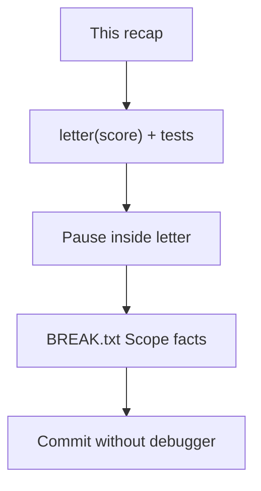
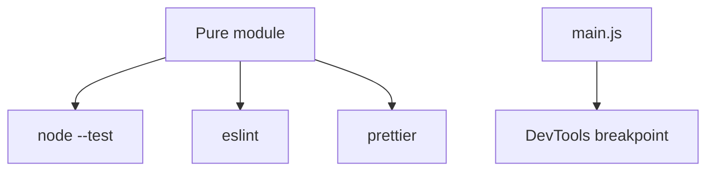

# Month 4 · Week 3 · Day 3
# From Memory: Tests and a Breakpoint

**Program:** Full-Stack Mastery · 18 months  
**Phase:** 1 — Foundations  
**Month index:** [../../README.md](../../README.md)  
**Week 3:** [1](day-01.md) · [2](day-02.md) · Day 3 (today) · [4](day-04.md) · [5](day-05.md) · [6](day-06.md) · [7](day-07.md)  
**Week rhythm today:** Implement from memory  
**Study time:** 3–4 focused hours  
**Machine today:** Windows PowerShell, Node.js 20+  
**Days 1–2 closed.** Repair from this recap.

You are not inventing a new quality system today. You are proving that yesterday’s words still run your hands: a pure function, a throw test, a pause, no leftover `debugger`.

---

## How to read this chapter

This file **is** the lesson while Days 1–2 stay closed. If a name is foggy, read the sections below — not a random testing blog.



Stuck 25 minutes: open Day 1 or Day 2 of **this week in this textbook** only. Then close them and finish the spec.

---

## Complete explanation

**Unit test:** arrange / act / assert on a **pure** function. One behavior per name. `assert.equal` / `deepEqual` / `throws` / `rejects`. No live network. No `document`.

**Arrange** builds input. **Act** calls one function. **Assert** throws if expected ≠ actual. `node:assert/strict` uses `===` for `equal`. Arrays and objects need `deepEqual`.

**Testable design:** DOM and `localStorage` at the edge; parse/sort/filter in modules tests can import. Inject `{ getItem, setItem }` if you must test persistence without a browser. A click handler that JSON-parses, sorts in place, and paints `innerHTML` is not a unit.

**Kinds:** unit = one function, fake I/O. Integration = a few modules, still no live API. Manual / E2E = browser clicks. The Month 4 gate wants **regression unit tests** (red while the bug lived). Clicking is extra, not the suite.

**Formatter (Prettier):** rewrites layout. `npm run format` (`--write`) changes files. `format:check` (`--check`) **fails** if files would change. It does not ban `==`.

**Linter (ESLint):** `eqeqeq`, unused vars, `no-debugger`, recommended set. `npx eslint .` **ESLint ≠ Prettier.** `eslint-config-prettier` last turns off ESLint *layout* rules so the two do not fight. Do not disable `eqeqeq` to hide a coerce.

**Breakpoint:** pause on a line; **Scope** + **Call stack**; step over / into / out; `debugger;` then delete. Pause on exceptions for white screens. Conditional breakpoint when a loop is noisy.

**Scope pane:**

| Section | Meaning |
|---|---|
| Local | This call’s parameters and locals |
| Closure | Outer bindings the function still needs |
| Module / script | File top-level |
| `this` | Call site (or inherited, for arrows) |

`console.log` prints a value that may already have changed. A pause shows **now**.

**Wrong belief:** “If I remember `npm test`, I remember testing.”  
**Correct:** testing is design (extract the function) plus claims (named asserts) plus a pause when `this` or a closure is the question.

**Wrong belief:** “Format on save means I passed lint.”  
**Correct:** Prettier never saw `==`. Run both scripts.

**Wrong belief:** “`assert.throws` means the test runner crashed.”  
**Correct:** the **function** threw; the test **caught** that and passed. An uncaught throw *outside* `assert.throws` is a failed test of a different kind.



**`priorityLabel`-style throws:** invalid input should throw **on purpose**. `assert.throws(() => letter("90"))` is a claim that a string is not a number band. Returning `"F"` for `"90"` because `==` coerced would be a bug the linter also hates.

**`letter(score)` contract for today:** integer `score` in `0`–`100`. Bands you already used in Month 3 (document the table in a comment). Anything else — not an integer, out of range, string `"90"` — throws `Error` with a message you test (regex `/invalid/` is enough).

Worked example: `letter(90)` → `"A"` (if that is your band). `letter("90")` → throw. `letter(101)` → throw. `letter(-1)` → throw. Empty test file that only imports the module is not a suite.

**Node inspect (if you have no HTML):** `node --inspect-brk letter.js` where `letter.js` calls `letter(90)`, then `chrome://inspect`. Same Scope pane. Write what `score` was. Resume. Remove `debugger` if you used it.

**HTTP still matters** if you use a tiny page: `file://` often hides modules in Sources. Serve the folder.

Worked boundary: if `A` starts at 90, `letter(89)` is `"B"` (or whatever your table says — not `"A"`). Off-by-one in a grader is the same class of bug as off-by-one in a filter. Write the 89 test **before** you run if you can; it is `PREDICT.txt` for a function.

---

## Office hours — coerced strings, Scope on the wrong file, and leftover `debugger`

**`"90"` became `"A"`.** You wrote `score >= 90` after `Number(score)` or `==`. The throw test is the product. `Number.isInteger(score)` and `typeof score === "number"`. Do not “fix” `assert.throws` by deleting it.

**Paused in `node:test` internals.** Sources shows a runner file. `score` is missing. Open **your** `grade.js`, set the breakpoint on the `return` or the first line of `letter`, trigger the call again (`run.js` or the HTML button).

**`debugger` committed.** `git diff` still shows it. Delete. `no-debugger` is the net later; today your eyes are the net. Line breakpoints in DevTools do not live in the file.

**`--eval` + ESM fought you.** Write `run.js`. `node --inspect-brk run.js`. Windows: Chrome → `chrome://inspect`. Do not spend the hour on eval flags.

**Wrong belief:** “I’ll put `letter` in `index.html` as an `onclick` attribute.”  
**Correct:** a tiny module page or Node inspect. Attributes mix documents with programs (Month 3).

---

## Today's contract

**Today's gate**

> I wrote `letter(score)` from memory, tested valid bands and a throw, paused inside it, and committed without `debugger`.

If `BREAK.txt` says “I logged it,” you did not finish. Pause.

---

## Time box

| Block | Minutes | Work |
|---|---|---|
| A | 20 | Speak this recap |
| B | 70 | `letter.js` + tests |
| C | 40 | Breakpoint + `BREAK.txt` |
| D | 20 | Git |
| E | 15 | Recall |

---

# Spec

1. New folder `~\fullstack-lab\month-04\week-03\day-03\`: `grade.js` exporting `letter(score)` (`A`–`F` as Month 3, invalid → throw). Tests: valid bands, `assert.throws` on `"90"`.
2. `BREAK.txt`: you paused in `letter` with a breakpoint or `debugger` (Node inspect **or** a tiny HTML that calls `letter`). What was `score` in Scope?
3. Do not leave `debugger` in the committed file.

Also required today (still from memory):

4. `package.json` with `"type": "module"` and a `"test": "node --test"` script.  
5. At least three passing tests with **sentence** names (`letter maps 90 to A`, not `test1`).  
6. If you already have Prettier/ESLint in `week-03/quality/`, you may lint this folder **or** skip install today — but `eqeqeq` still applies by **your** eyes: no `==` in `letter`.  
7. `PREDICT.txt`: before running tests, write expected letters for `100`, `89`, `0`. Then run.

Bands: copy the Month 3 table you used (example: 90–100 `A`, 80–89 `B`, … `F` below 60). If you never wrote that table, pick one, comment it, and test the **boundaries** (89 vs 90), not only happy 95.

`assert.throws(() => letter("90"))` — if this does not throw, you accepted a string. Fix the function (`typeof score !== "number"` or `Number.isInteger(score)`), not the test.

Tiny HTML option: `index.html` + `demo.js` that calls `letter(90)` on a button. Serve HTTP. Breakpoint on the `return` line. Scope: `score`. Call stack: the button listener under `letter` if you wrapped it.

```powershell
cd ~\fullstack-lab\month-04\week-03\day-03
node --test
```

```powershell
git add month-04/week-03/day-03
git commit -m "Day 3: letter() tests and breakpoint note."
```

---

# Worked tests you must type (not paste a trophy)

```js
import assert from "node:assert/strict";
import { test } from "node:test";
import { letter } from "./grade.js";

test("letter maps 90 to A", () => {
  assert.equal(letter(90), "A");
});

test("letter throws on string 90", () => {
  assert.throws(() => letter("90"), { message: /invalid/ });
});
```

Arrange: nothing but the argument. Act: `letter(...)`. Assert: exact letter or a throw. If `letter("90")` returns `"A"` because you wrote `score >= 90` after coercing, you failed the throw test. Do not “fix” the test. Fix `Number.isInteger` / `typeof`.

**Boundary:** if `A` starts at 90, `letter(89)` is not `"A"`. Write that test.

**Scope pause (Node):**

```powershell
node --inspect-brk --eval "import('./grade.js').then(m => m.letter(90))"
```

If `--eval` + ESM fights you, write `run.js` that imports and calls `letter(90)`, then `node --inspect-brk run.js`. Chrome → `chrome://inspect` → inspect. Pause in `letter`. Write `score` and whether it sat under **Local**. Delete `run.js`’s `debugger` if you added one.

If lint is not installed in `day-03`, you still write `===`. A later `eslint` on this folder should stay green. Unused `const tmp` is a Day 2 fail — do not leave one.

Folder must not contain `node_modules` in git if you did install. `.gitignore` with `node_modules` if `package.json` exists.

---

# Recall

1. Why `"90"` throws if your contract is integers.  
2. Local vs Closure in one sentence.  
3. Why `--check` is not `--write`.  
4. Why one test per band edge beats one test named `"grades"`.  
5. What you delete before commit if you used `debugger`.

---

## Worked walkthrough — bands, throws, and a pause that counts

Comment a table in `grade.js`. Example: 90–100 `A`, 80–89 `B`, 70–79 `C`, 60–69 `D`, 0–59 `F`. Then tests:

- `letter(90)` → `"A"`; `letter(89)` → `"B"` (boundary).  
- `letter(100)` and `letter(0)` from `PREDICT.txt`.  
- `letter("90")` throws `/invalid/`.  
- `letter(101)` and `letter(-1)` throw.  
- `letter(90.5)` throws if you require integers (`Number.isInteger`).

If `"90"` returns `"A"`, you coerced. If `89` returns `"A"`, the band is wrong. If all tests live in one `test("grades", ...)`, split them — a red bar should name the behavior.

**Pause that counts.** `BREAK.txt` uses the template at the bottom of this file. `score` under **Local** when paused inside `letter(90)` should be `90`. `this` in a plain function in a module is often `undefined` — write that. Call stack: `letter` then `run.js` or the button listener. If you only have `console.log(score)`, rewrite `BREAK.txt` after a real pause.

**Windows inspect.** `node --inspect-brk run.js`. Chrome `chrome://inspect`. If the inspect page is empty, you started Node without `--inspect-brk`, or the process already finished. `run.js` should **call** `letter(90)` so the process stays paused at the start.

Serve a tiny HTML over HTTP if you choose the page path — `npx --yes serve -p 5500`. Not `file://`. Node.js 20+. `"type": "module"`.

```powershell
cd ~\fullstack-lab\month-04\week-03\day-03
node --test
```

---

## Definition of done

- [ ] `letter` tests green including `assert.throws` on `"90"`
- [ ] Boundary tests exist (at least one band edge)
- [ ] `BREAK.txt` reports Scope for `score` from a real pause
- [ ] No `debugger` in committed source
- [ ] Commit exists

---

## Stalls and repair — coerced grades, pause in the runner, leftover debugger

If `letter("90")` returns `"A"`, you used `==` or `Number(score)`. The throw test is the product. `Number.isInteger` and `typeof === "number"`. Do not delete `assert.throws`.

If `letter(89)` is `"A"` and A starts at 90, the band is wrong. Boundary tests exist to catch that. Split `"grades"` into sentence names so the red bar speaks.

If Scope has no `score`, you paused in `node:test` internals or after `letter` returned. Open `grade.js`. Breakpoint on the first line of `letter`. `run.js` must **call** `letter(90)`. `node --inspect-brk run.js`. Chrome `chrome://inspect`.

If `debugger` is still in `git diff`, delete it. Line breakpoints in DevTools do not live in the file. `BREAK.txt` uses the template: paused in, score, this, stack, how, debugger removed.

If `--eval` + ESM fights you, stop fighting. `run.js` is the path. Tiny HTML must be HTTP, not `file://` — `npx --yes serve -p 5500`.

If lint is not installed, you still write `===`. Unused `const tmp` is a fail. `node_modules` gitignored if you installed.

Windows: `cd ~\fullstack-lab\month-04\week-03\day-03` then `node --test`. Node.js 20+. `"type": "module"`. Days 1–2 closed until a 25-minute stall.

---

## Last forty minutes

`PREDICT.txt` vs actual letters for `100`, `89`, `0`. Boundary `89` vs `90` must exist as its own test name. `"90"` still throws.

Open `BREAK.txt`. If it lacks Scope for `score`, pause again. `node --inspect-brk run.js`. Chrome `chrome://inspect`. Local: `90`. `this` often `undefined` in modules. Delete `debugger`. `git diff` clean of it.

`package.json`: `"type": "module"`, `"test": "node --test"`. At least three sentence-named tests. No `==`. If you have a tiny HTML, it is HTTP — `npx --yes serve -p 5500` — not `file://`.

Recall the five questions in this file without looking. If `--check` vs `--write` is mush, say: check **fails** if files would change; write **changes** files. Prettier never saw `==`.

Commit `month-04/week-03/day-03`. Tomorrow you apply the same ritual to Week 1 `tasks.js`. Do not skip the pause there either.

---

## Worked checkpoint — pause in `letter`, not in the runner

`letter` is a pure function. `"90"` throws. `90` is `"A"` if your A band starts at 90. `89` is not `"A"`. Those are three tests with sentence names, not one `grades` blob.

The pause is the other product. `run.js` **calls** `letter(90)`. `node --inspect-brk run.js`. Chrome `chrome://inspect`. Breakpoint on the **first line of `letter`**, not inside `node:test`. Scope Local: `score` is `90`. `this` in an ES module is often `undefined` — write that. Delete `debugger` before commit. `git diff` must not show it.

`PREDICT.txt` vs actual for `100`, `89`, `0` before you trust the bands. If `letter("90")` returns `"A"`, you used `==` or `Number(score)`. `Number.isInteger` plus `typeof === "number"`. Keep `assert.throws`.

> **Wrong belief:** “`--inspect-brk` on `node --test` is the same pause.”  
> **Correct:** the runner’s frames are not your `score`. A tiny `run.js` is the lab. Optional tiny HTML is HTTP — `npx --yes serve -p 5500` — never `file://`.

`format:check` **fails** if files would change. `format` **writes**. Prettier never saw `==`. ESLint with `eqeqeq` did. Windows: `cd ~\fullstack-lab\month-04\week-03\day-03` then `node --test`. Node.js 20+. `"type": "module"`.

If you finish early, add one more boundary: the lowest score that is still `"B"` under **your** table, and a test whose name says that number. Do not coerce `letter(90.0)` into a band unless you documented floats — today integers only. Unused `const tmp` should fail lint. `node_modules` gitignored if you installed.

Stuck 25 minutes: Week 3 Days 1–2 in this textbook only, then close them. The pause is not optional paperwork. `BREAK.txt` uses the template later in this file.

---

## Optional review links

Days 1–2 of this week already taught the tools. These pages are for later checking.

- [Node: test runner](https://nodejs.org/api/test.html)
- [Node: assert](https://nodejs.org/api/assert.html)
- [Chrome: breakpoints](https://developer.chrome.com/docs/devtools/javascript/breakpoints)

---

**`BREAK.txt` minimum template:**

```text
Paused in: letter (or grade.js line …)
score in Scope: (value) under Local / Closure / other
this: (value or undefined)
Call stack top two names:
How I paused: line breakpoint / debugger / inspect-brk
debugger removed: yes
```

If `score` is missing from Scope, you paused on a line after `score` went out of scope or on the wrong file. Move the marker.

---

## Tomorrow

Apply the same ritual to **your** Week 1 `tasks.js`: scripts for test, lint, format; pause inside `toggleDone`.
